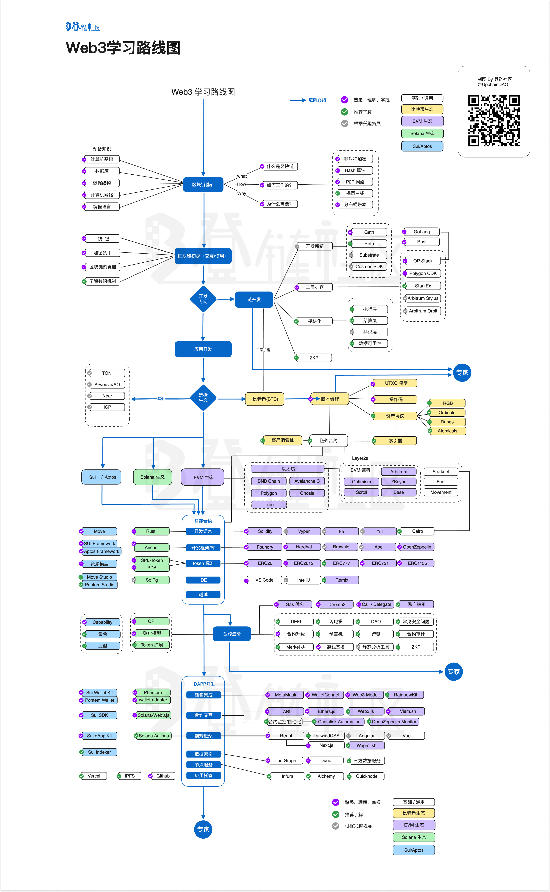

# web3-learning

用于记录和总结 Web3 开发相关知识和工具的笔记

## 内容

- [solidity](./solidity/README.md)
- [blockchain](./blockchain/README.md)

## web3 learning roadmap

**来源**：[登链社区](https://learnblockchain.cn/maps/Roadmap)

