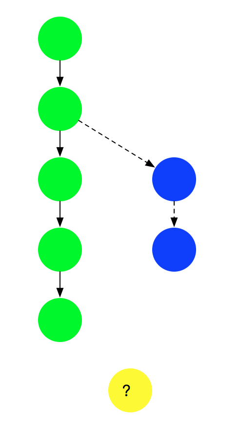

# 区块链

- [区块链](#区块链)
  - [1. 基本原理](#1-基本原理)
  - [2. 区块链的演化](#2-区块链的演化)
  - [3. 区块链分类](#3-区块链分类)
  - [4. 密码学与安全技术](#4-密码学与安全技术)
    - [4.1 Hash 算法与数字摘要](#41-hash-算法与数字摘要)
      - [常见算法](#常见算法)
      - [性能](#性能)
      - [数字摘要](#数字摘要)
      - [Hash 攻击与防护](#hash-攻击与防护)
    - [4.2 加密算法](#42-加密算法)
      - [加解密系统基本组成](#加解密系统基本组成)
      - [对称加密算法](#对称加密算法)
      - [非对称加密算法](#非对称加密算法)
      - [混合加密机制](#混合加密机制)
    - [4.3 数字签名](#43-数字签名)
      - [盲签名](#盲签名)
      - [多重签名](#多重签名)
      - [群签名](#群签名)
      - [环签名](#环签名)
    - [4.4 数字证书](#44-数字证书)
      - [证书信任链](#证书信任链)
    - [4.5 Merkle 树](#45-merkle-树)
      - [证明某个集合中存在或不存在某个元素](#证明某个集合中存在或不存在某个元素)
      - [快速比较大量数据](#快速比较大量数据)
      - [快速定位修改](#快速定位修改)
      - [零知识证明](#零知识证明)
    - [4.6 Bloom Filter](#46-bloom-filter)
      - [基于 Hash 的快速查找](#基于-hash-的快速查找)
      - [更高效的布隆过滤器](#更高效的布隆过滤器)
    - [4.7 同态加密](#47-同态加密)
    - [4.8 零知识证明](#48-零知识证明)
  - [5. 比特币](#5-比特币)
    - [5.1 比特币工作原理](#51-比特币工作原理)
      - [基本交易过程](#基本交易过程)
      - [重要概念](#重要概念)
        - [账户/地址](#账户地址)
        - [交易](#交易)
        - [交易脚本](#交易脚本)
        - [区块](#区块)
      - [创新设计](#创新设计)
        - [如何避免作恶](#如何避免作恶)
        - [负反馈调节](#负反馈调节)
        - [共识机制](#共识机制)
    - [5.2 比特币挖矿过程](#52-比特币挖矿过程)
      - [挖矿过程](#挖矿过程)
    - [5.3 比特币共识机制](#53-比特币共识机制)
      - [工作量证明](#工作量证明)
      - [权益证明](#权益证明)
    - [5.4 比特币闪电网络](#54-比特币闪电网络)
    - [5.5 比特币侧链](#55-比特币侧链)
    - [5.6 比特币热门问题](#56-比特币热门问题)
      - [设计中的权衡](#设计中的权衡)
      - [分叉](#分叉)
  - [6. 以太坊](#6-以太坊)
    - [6.1 以太坊主要特点](#61-以太坊主要特点)
    - [6.2 以太坊核心概念](#62-以太坊核心概念)
      - [智能合约](#智能合约)
      - [账户](#账户)
      - [交易](#交易-1)
      - [以太币](#以太币)
      - [燃料](#燃料)
    - [6.3 以太坊主要设计](#63-以太坊主要设计)
      - [智能合约相关设计](#智能合约相关设计)
        - [运行环境](#运行环境)
        - [开发语言](#开发语言)
      - [交易模型](#交易模型)
      - [共识](#共识)
      - [降低攻击](#降低攻击)
      - [提高扩展性](#提高扩展性)
  - [参考资料](#参考资料)

## 1. 基本原理

三个基本概念：

- 交易（Transaction）：一次对账本的操作，导致账本状态的一次改变，如添加一条转账记录；
- 区块（Block）：记录一段时间内发生的所有交易和状态结果等，是对当前账本状态的一次共识；
- 链（Chain）：由区块安装发生顺序串联而成，是整个账本状态变化的日志记录。

可以把区块链系统看作为一个状态机，每次交易意味着一次状态改变；生成的区块，就是参与者的交易导致状态改变结果的共识。

区块链的目标是实现一个分布的数据记录账本，这个账本只允许添加、不允许删除。账本底层的基本结构是一个线性的链表。链表由一个个区块串联组成，后继区块中记录着前一个区块的哈希值。某个区块（以及块里的交易）是否合法，可通过计算哈希值的方式进行快速验证。网络中节点可以提议添加一个新的区块，但必须经过共识机制来对区块达成确认。

## 2. 区块链的演化

比特币区块链面向转账场景，支持简单的脚本计算。很自然想到如果引入更多复杂的计算逻辑，将能支持更多应用场景，这就是智能合约（Smart Contract）。智能合约可以提供除了货币交易功能外更灵活的功能，执行更为复杂的操作。

## 3. 区块链分类

根据参与者的不同，可以分为公有（Public 或 Permissionless）链、联盟（Consortium 或 Permissioned）链和私有（Private）链。

公有链，顾名思义，任何人都可以参与使用和维护，参与者多为匿名。典型的如比特币和以太坊区块链，信息是完全公开的。

如果进一步引入许可机制，可以实现私有链和联盟链两种类型。

私有链，由集中管理者进行管理限制，只有内部少数人可以使用，信息不公开。一般认为跟传统中心化记账系统的差异不明显。

联盟链则介于两者之间，由若干组织一起合作（如供应链机构或银行联盟等）维护一条区块链，该区块链的使用必须是带有权限的限制访问，相关信息会得到保护，典型如超级账本项目。在架构上，现有大部分区块链在实现都至少包括了网络层、共识层、智能合约和应用层等分层结构，联盟链实现往还会引入额外的权限管理机制。

## 4. 密码学与安全技术

### 4.1 Hash 算法与数字摘要

Hash（哈希或散列）算法，又常被称为指纹（fingerprint）或摘要（digest）算法，是非常基础也非常重要的一类算法。可以将任意长度的二进制明文串映射为较短的（通常是固定长度的）二进制串（Hash 值），并且不同的明文很难映射为相同的 Hash 值。

除了快速对比内容外，Hash 思想也经常被应用到基于内容的编址或命名算法中。

一个优秀的 Hash 算法，将能满足：

- 正向快速：给定原文和 Hash 算法，在有限时间和有限资源内能计算得到 Hash 值；
- 逆向困难：给定（若干）Hash 值，在有限时间内无法（基本不可能）逆推出原文；
- 输入敏感：原始输入信息发生任何改变，新产生的 Hash 值都应该发生很大变化；
- 碰撞避免：很难找到两段内容不同的明文，使得它们的 Hash 值一致（即发生碰撞）。

碰撞避免有时候又被称为“抗碰撞性”，可分为“弱抗碰撞性”和“强抗碰撞性”。给定原文前提下，无法找到与之碰撞的其它原文，则算法具有“弱抗碰撞性”；更一般地，如果无法找到任意两个可碰撞的原文，则称算法具有“强抗碰撞性”。

很多场景下，也往往要求算法对于任意长的输入内容，输出为定长的 Hash 结果。

#### 常见算法

目前常见的 Hash 算法包括国际上的 Message Digest（MD）系列和 Secure Hash Algorithm（SHA）系列算法，以及国内的 SM3 算法。

MD 算法主要包括 MD4 和 MD5 两个算法。MD4（RFC 1320）是 MIT 的 Ronald L. Rivest 在 1990 年设计的，其输出为 128 位。MD4 已证明不够安全。MD5（RFC 1321）是 Rivest 于 1991 年对 MD4 的改进版本。它对输入仍以 512 位进行分组，其输出是 128 位。MD5 比 MD4 更加安全，但过程更加复杂，计算速度要慢一点。MD5 已于 2004 年被成功碰撞，其安全性已不足应用于商业场景。

SHA 算法由美国国家标准与技术院（National Institute of Standards and Technology，NIST）征集制定。首个实现 SHA-0 算法于 1993 年问世，1998 年即遭破解。随后的修订版本 SHA-1 算法在 1995 年面世，它的输出为长度 160 位的 Hash 值，安全性更好。SHA-1 设计采用了 MD4 算法类似原理。SHA-1 已于 2005 年被成功碰撞，意味着无法满足商用需求。

为了提高安全性，NIST 后来制定出更安全的 SHA-224、SHA-256、SHA-384 和 SHA-512 算法（统称为 SHA-2 算法）。新一代的 SHA-3 相关算法也正在研究中。

#### 性能

大多数 Hash 算法都是计算敏感型算法，在强大的计算芯片上完成得更快。因此要提升 Hash 计算的性能可以考虑硬件加速。例如采用普通 FPGA 来计算 SHA-256 值，可以轻易达到数 Gbps 的吞吐量，使用专用芯片吞吐量甚至会更高。

#### 数字摘要

数字摘要是 Hash 算法重要用途之一。顾名思义，数字摘要是对原始的数字内容进行 Hash 运算，获取唯一的摘要值。

利用 Hash 函数抗碰撞性特点，数字摘要可以检测内容是否被篡改过。

#### Hash 攻击与防护

Hash 算法并不是一种加密算法，不能用于对信息的保护。

但 Hash 算法可被应用到对登录口令的保存上。例如网站登录时需要验证用户名和密码，如果网站后台直接保存用户的口令原文，一旦发生数据库泄露后果不堪设想（事实上，网站数据库泄露事件在国内外都不少见）。

利用 Hash 的防碰撞特性，后台数据库可以仅保存用户口令的 Hash 值，这样每次通过 Hash 值比对，即可判断输入口令是否正确。即便数据库泄露了，攻击者也无法轻易从 Hash 值还原出口令。

然而，有时用户设置口令的安全强度不够，采用了一些常见的字符串，如 password、123456 等。有人专门搜集了这些常见口令，计算对应的 Hash 值，制作成字典。这样通过 Hash 值可以快速反查到原始口令。这一类型以空间换时间的攻击方法包括字典攻击和彩虹表攻击（只保存一条 Hash 链的首尾值，相对字典攻击可以节省存储空间）等。

为了防范这一类攻击，可以采用加盐（Salt）的方法。保存的不是原文的直接 Hash 值，而是原文再加上一段随机字符串（即“盐”）之后的 Hash 值。Hash 结果和“盐”分别存放在不同的地方，这样只要不是两者同时泄露，攻击者就很难进行破解。

### 4.2 加密算法

加解密算法是现代密码学核心技术，从设计理念和应用场景上可以分为两大基本类型：对称加密、非对称加密。

#### 加解密系统基本组成

现代加解密系统的典型组件包括算法和密钥，密钥包括加密密钥、解密密钥。

其中，加解密算法自身是固定不变的，并且一般是公开可见的；密钥则是最关键的信息，需要安全地保存起来，甚至通过特殊硬件进行保护。一般来说，密钥需要在加密前按照特定算法随机生成，长度越长，则加密强度越大。

加解密的典型过程如下图所示。加密过程中，通过加密算法和加密密钥，对明文进行加密，获得密文；解密过程中，通过解密算法和解密密钥，对密文进行解密，获得明文。

根据加解密过程中所使用的密钥是否相同，算法可以分为对称加密（Symmetric Cryptography，又称共有密钥加密，Common-key cryptography）和非对称加密（Asymmetric Cryptography，又称公钥加密，Public-key Cryptography）。两种模式适用于不同的需求，形成互补。某些场景下可以组合使用，形成混合加密机制。

#### 对称加密算法

对称加密算法，顾名思义，加密和解密过程的密钥是相同的。

该类算法优点是加解密效率（速度快，空间占用小）和加密强度都很高。

缺点是参与方需要提前持有密钥，一旦有人泄露则系统安全性被破坏；另外如何在不安全通道中提前分发密钥也是个问题，需要借助额外的 Diffie–Hellman 协商协议或非对称加密算法来实现。

对称密码从实现原理上可以分为两种：分组加密和序列加密。前者将明文切分为定长数据块作为基本加密单位，应用最为广泛。后者则每次只对一个字节或字符进行加密处理，且密码不断变化，只用在一些特定领域（如数字媒介的加密）。

对称加密算法适用于大量数据的加解密过程，不能用于签名场景，并且需要提前安全地分发密钥。

#### 非对称加密算法

非对称加密是现代密码学的伟大发明，它有效解决了对称加密需要安全分发密钥的问题。

顾名思义，非对称加密中，加密密钥和解密密钥是不同的，分别称为公钥（Public Key）和私钥（Private Key）。私钥一般通过随机数算法生成，公钥可以根据私钥生成。

其中，公钥一般是公开的，他人可获取的；私钥则是个人持有并且要严密保护，不能被他人获取。

非对称加密算法优点是公私钥分开，无需安全通道来分发密钥。缺点是处理速度（特别是生成密钥和解密过程）往往比较慢，一般比对称加解密算法慢 2~3 个数量级；同时加密强度也往往不如对称加密。

非对称加密算法的安全性往往基于数学问题，包括大数质因子分解、离散对数、椭圆曲线等经典数学难题。

非对称加密算法适用于签名场景或密钥协商过程，但不适于大量数据的加解密。

#### 混合加密机制

混合加密机制同时结合了对称加密和非对称加密的优点。

该机制的主要过程为：先用非对称加密（计算复杂度较高）协商出一个临时的对称加密密钥（或称会话密钥），然后双方再通过对称加密算法（计算复杂度较低）对所传递的大量数据进行快速的加密处理。

典型的应用案例是网站中使用越来越普遍的通信协议 -- 安全超文本传输协议（Hyper Text Transfer Protocol Secure，HTTPS）。

### 4.3 数字签名

类似在纸质合同上进行签名以确认合同内容和证明身份，数字签名既可以证实某数字内容的完整性，又可以确认其来源（即不可抵赖，Non-Repudiation）。

一个典型的场景是，Alice 通过信道发给 Bob 一个文件（一份信息），Bob 如何获知所收到的文件即为 Alice 发出的原始版本？Alice 可以先对文件内容进行摘要，然后用自己的私钥对摘要进行加密（签名），之后同时将文件和签名都发给 Bob。Bob 收到文件和签名后，用 Alice 的公钥来解密签名，得到数字摘要，与对文件进行摘要后的结果进行比对。如果一致，说明该文件确实是 Alice 发过来的（因为别人无法拥有 Alice 的私钥），并且文件内容没有被修改过（摘要结果一致）。

理论上所有的非对称加密算法都可以用来实现数字签名，实践中常用算法包括 1991 年 8 月 NIST 提出的 DSA（Digital Signature Algorithm，基于 ElGamal 算法）和安全强度更高的 ECDSA（Elliptic Curve Digital Signature Algorithm，基于椭圆曲线算法）等。

除普通的数字签名应用场景外，针对一些特定的安全需求，产生了一些特殊数字签名技术，包括盲签名、多重签名、群签名、环签名等。

#### 盲签名

盲签名（Blind Signature），1982 年由 David Chaum 在论文《Blind Signatures for Untraceable Payment》中[提出](https://www.hit.bme.hu/~buttyan/courses/BMEVIHIM219/2009/Chaum.BlindSigForPayment.1982.PDF)。签名者需要在无法看到原始内容的前提下对信息进行签名。

盲签名可以实现对所签名内容的保护，防止签名者看到原始内容；另一方面，盲签名还可以实现防止追踪（Unlinkability），签名者无法将签名内容和签名结果进行对应。典型的实现包括 RSA 盲签名算法等。

#### 多重签名

多重签名（Multiple Signature），即 n 个签名者中，收集到至少 m 个（n >= m >= 1）的签名，即认为合法。

其中，n 是提供的公钥个数，m 是需要匹配公钥的最少的签名个数。

多重签名可以有效地应用在多人投票共同决策的场景中。例如双方进行协商，第三方作为审核方。三方中任何两方达成一致即可完成协商。

比特币交易中就支持多重签名，可以实现多个人共同管理某个账户的比特币交易。

#### 群签名

群签名（Group Signature），即某个群组内一个成员可以代表群组进行匿名签名。签名可以验证来自于该群组，却无法准确追踪到签名的是哪个成员。

群签名需要一个群管理员来添加新的群成员，因此存在群管理员可能追踪到签名成员身份的风险。

群签名最早在 1991 年由 David Chaum 和 Eugene van Heyst 提出。

#### 环签名

环签名（Ring Signature），由 Rivest，Shamir 和 Tauman 三位密码学家在 2001 年首次提出。环签名属于一种简化的群签名。

签名者首先选定一个临时的签名者集合，集合中包括签名者自身。然后签名者利用自己的私钥和签名集合中其他人的公钥就可以独立地产生签名，而无需他人的帮助。签名者集合中的其他成员可能并不知道自己被包含在最终的签名中。

环签名在保护匿名性方面也具有很多用途。

### 4.4 数字证书

对于非对称加密算法和数字签名来说，很重要的步骤就是公钥的分发。理论上任何人都可以获取到公开的公钥。然而这个公钥文件有没有可能是伪造的呢？传输过程中有没有可能被篡改呢？一旦公钥自身出了问题，则整个建立在其上的的安全性将不复成立。

数字证书机制正是为了解决这个问题，它就像日常生活中的证书一样，可以确保所记录信息的合法性。比如证明某个公钥是某个实体（个人或组织）拥有，并且确保任何篡改都能被检测出来，从而实现对用户公钥的安全分发。

根据所保护公钥的用途，数字证书可以分为加密数字证书（Encryption Certificate）和签名验证数字证书（Signature Certificate）。前者往往用于保护用于加密用途的公钥；后者则保护用于签名用途的公钥。两种类型的公钥也可以同时放在同一证书中。

一般情况下，证书需要由证书认证机构（Certification Authority，CA）来进行签发和背书。权威的商业证书认证机构包括 DigiCert、GlobalSign、VeriSign 等。用户也可以自行搭建本地 CA 系统，在私有网络中进行使用。

#### 证书信任链

证书中记录了大量信息，其中最重要的包括 签发的公开密钥 和 CA 数字签名 两个信息。因此，只要使用 CA 的公钥再次对这个证书进行签名比对，就能证明所记录的公钥是否合法。

读者可能会想到，怎么证明用来验证对实体证书进行签名的 CA 公钥自身是否合法呢？毕竟在获取 CA 公钥的过程中，它也可能被篡改掉。

实际上，CA 的公钥是否合法，一方面可以通过更上层的 CA 颁发的证书来进行认证；另一方面某些根 CA（Root CA）可以通过预先分发证书来实现信任基础。例如，主流操作系统和浏览器里面，往往会提前预置一些权威 CA 的证书（通过自身的私钥签名，系统承认这些是合法的证书）。之后所有基于这些 CA 认证过的中间层 CA（Intermediate CA）和后继 CA 都会被验证合法。这样就从预先信任的根证书，经过中间层证书，到最底下的实体证书，构成一条完整的证书信任链。

某些时候用户在使用浏览器访问某些网站时，可能会被提示是否信任对方的证书。这说明该网站证书无法被当前系统中的证书信任链进行验证，需要进行额外检查。另外，当信任链上任一证书不可靠时，则依赖它的所有后继证书都将失去保障。

### 4.5 Merkle 树

[默克尔树](https://en.wikipedia.org/wiki/Merkle_tree)（又叫哈希树）是一种典型的二叉树结构，由一个根节点、一组中间节点和一组叶节点组成。默克尔树最早由 Merkle Ralf 在 1980 年提出，曾广泛用于文件系统和 P2P 系统中。

其主要特点为：

- 最下面的叶节点包含存储数据或其哈希值；
- 非叶子节点（包括中间节点和根节点）都是它的两个孩子节点内容的哈希值。

进一步地，默克尔树可以推广到多叉树的情形，此时非叶子节点的内容为它所有的孩子节点的内容的哈希值。

默克尔树逐层记录哈希值的特点，让它具有了一些独特的性质。例如，底层数据的任何变动，都会传递到其父节点，一层层沿着路径一直到树根。这意味树根的值实际上代表了对底层所有数据的“数字摘要”。

目前，默克尔树的典型应用场景包括如下几种。

#### 证明某个集合中存在或不存在某个元素

通过构建集合的默克尔树，并提供该元素各级兄弟节点中的 Hash 值，可以不暴露集合完整内容而证明某元素存在。

另外，对于可以进行排序的集合，可以将不存在元素的位置用空值代替，以此构建稀疏默克尔树（Sparse Merkle Tree）。该结构可以证明某个集合中不包括指定元素。

#### 快速比较大量数据

对每组数据排序后构建默克尔树结构。当两个默克尔树根相同时，则意味着所代表的两组数据必然相同。否则，必然不同。

由于 Hash 计算的过程可以十分快速，预处理可以在短时间内完成。利用默克尔树结构能带来巨大的比较性能优势。

#### 快速定位修改

以下图为例，基于数据 D0……D3 构造默克尔树，如果 D1 中数据被修改，会影响到 N1，N4 和 Root。

因此，一旦发现某个节点如 Root 的数值发生变化，沿着 Root --> N4 --> N1，最多通过 O(lgN) 时间即可快速定位到实际发生改变的数据块 D1。

#### 零知识证明

仍以上图为例，如何向他人证明拥有某个数据 D0 而不暴露其它信息。挑战者提供随机数据 D1，D2 和 D3，或由证明人生成（需要加入特定信息避免被人复用证明过程）。

证明人构造如图所示的默克尔树，公布 N1，N5，Root。验证者自行计算 Root 值，验证是否跟提供值一致，即可很容易检测 D0 存在。整个过程中验证者无法获知与 D0 相关的额外信息。

### 4.6 Bloom Filter

布隆过滤器（Bloom Filter）是在 1970 年由 Burton Howard Bloom 在论文《Space/Time Trade-offs in Hash Coding with Allowable Errors》提出的。布隆过滤器是一种基于 Hash 的高效查找结构，能够快速（常数时间内）回答“某个元素是否在一个集合内”的问题。

该结构因为具有高效性而广泛应用到网络和安全领域，例如信息检索（BigTable 和 HBase）、垃圾邮件规则、注册管理等。

#### 基于 Hash 的快速查找

在介绍布隆过滤器之前，先来看看基于 Hash 的快速查找算法。在前面的讲解中，我们提到，Hash 可以将任意内容映射到一个固定长度的字符串，而且不同内容映射到相同串的概率很低。因此，这就构成了一个很好的“内容 -> 索引”的生成关系。

试想，如果给定一个内容和存储数组，通过构造 Hash 函数，让映射后的 Hash 值总不超过数组的大小，则可以实现快速的基于内容的查找。例如，内容 “hello world” 的 Hash 值如果是 “100”，则存放到数组的第 100 个单元上去。如果需要快速查找任意内容，如 “hello world” 字符串是否在存储系统中，只需要将其在常数时间内计算 Hash 值，并用 Hash 值查看系统中对应元素即可。该系统“完美地”实现了常数时间内的查找。

然而，令人遗憾的是，当映射后的值限制在一定范围（如总数组的大小）内时，会发现 Hash 冲突的概率会变高，而且范围越小，冲突概率越大。很多时候，存储系统的大小又不能无限扩展，这就造成算法效率的下降。为了提高空间利用率，后来人们基于 Hash 算法的思想设计出了布隆过滤器结构。

#### 更高效的布隆过滤器

布隆过滤器采用了多个 Hash 函数来提高空间利用率。

对同一个给定输入来说，多个 Hash 函数计算出多个地址，分别在位串的这些地址上标记为 1。在查找时，进行同样的计算过程，并查看对应元素，如果都为 1，则说明较大概率是存在该输入。

布隆过滤器与单个 Hash 算法查找相比，大大提高了空间利用率，可以使用较少的空间来表示较大集合的存在关系。

实际上，无论是 Hash 还是布隆过滤器，基本思想是一致的，都是基于内容的编址。Hash 函数存在冲突，布隆过滤器也存在冲突，即这两种方法都存在着误报（False Positive）的情况，但绝对不会漏报（False Negative）。

布隆过滤器在应用中误报率往往很低，例如，在使用 7 个不同 Hash 函数的情况下，记录 100 万个数据，采用 2 MB 大小的位串，整体的误判率将低于 1%。而传统的 Hash 查找算法的误报率将接近 10%。

### 4.7 同态加密

同态加密（Homomorphic Encryption）是一种特殊的加密方法，允许对密文进行处理得到仍然是加密的结果。即对密文直接进行处理，跟对明文进行处理后再对处理结果加密，得到的结果相同。从抽象代数的角度讲，保持了同态性。

同态加密可以保证实现处理者无法访问到数据自身的信息。

如果定义一个运算符 $\Delta$，对加密算法 $E$ 和 解密算法 $D$，满足：

$E(X \Delta Y) = E(X) \Delta E(Y)$

则意味着对于该运算满足同态性。

同态性来自代数领域，一般包括四种类型：加法同态、乘法同态、减法同态和除法同态。同时满足加法同态和乘法同态，则意味着是代数同态，即全同态（Full Homomorphic）。同时满足四种同态性，则被称为算数同态。

对于计算机操作来讲，实现了全同态意味着对于所有处理都可以实现同态性。只能实现部分特定操作的同态性，被称为特定同态（Somewhat Homomorphic）。

同态加密在云计算和大数据的时代意义十分重大。目前，虽然云计算带来了包括低成本、高性能和便捷性等优势，但从安全角度讲，用户还不敢将敏感信息直接放到第三方云上进行处理。如果有了比较实用的同态加密技术，则大家就可以放心地使用各种云服务了，同时各种数据分析过程也不会泄露用户隐私。加密后的数据在第三方服务处理后得到加密后的结果，这个结果只有用户自身可以进行解密，整个过程第三方平台无法获知任何有效的数据信息。

另一方面，对于区块链技术，同态加密也是很好的互补。使用同态加密技术，运行在区块链上的智能合约可以处理密文，而无法获知真实数据，极大的提高了隐私安全性。

目前全同态的加密方案主要包括如下三种类型：

- 基于理想格（ideal lattice）的方案：Gentry 和 Halevi 在 2011 年提出的基于理想格的方案可以实现 72 bit 的安全强度，对应的公钥大小约为 2.3 GB，同时刷新密文的处理时间需要几十分钟。
- 基于整数上近似 GCD 问题的方案：Dijk 等人在 2010 年提出的方案（及后续方案）采用了更简化的概念模型，可以降低公钥大小至几十 MB 量级。
- 基于带扰动学习（Learning With Errors，LWE）问题的方案：Brakerski 和 Vaikuntanathan 等在 2011 年左右提出了相关方案；Lopez-Alt A 等在 2012 年设计出多密钥全同态加密方案，接近实时多方安全计算的需求。

目前，已知的同态加密技术往往需要较高的计算时间或存储成本，相比传统加密算法的性能和强度还有差距。

### 4.8 零知识证明

零知识证明（Zero Knowledge Proof），是这样的一个过程，证明者在不向验证者提供任何额外信息的前提下，使验证者相信某个论断（Statement）是正确的。

证明过程包括交互式（Interactive）和非交互式（Non-interactive）两种。

零知识证明的研究始于 Shafi Goldwasser，Silvio Micali 和 Charles Rackoff 在 1985 年提交的开创性论文《The Knowledge Complexity of Interactive Proof-Systems》，三位作者也因此在 1993 年获得首届哥德尔奖。

论文中提出了零知识证明要满足三个条件：

- 完整性（Completeness）：真实的证明可以让验证者成功验证；
- 可靠性（Soundness）：虚假的证明无法保证通过验证。但理论上可以存在小概率例外；
- 零知识（Zero-Knowledge）：如果得到证明，无法（或很难）从证明过程中获知除了所证明命题之外的任何信息，分为完美零知识、概率零知识两种。

交互式零知识证明相对容易构造，需要通过证明人和验证人之间一系列交互完成。一般为验证人提出一系列问题，证明人如果能都回答正确，则有较大概率确实知道论断。

例如，证明人 Alice 向验证人 Bob 证明两个看起来一样的图片有差异，并且自己能识别这个差异。Bob 将两个图片在 Alice 无法看到的情况下更换或保持顺序，再次让 Alice 识别是否顺序调整。如果 Alice 每次都能正确识别顺序是否变化，则 Bob 会以较大概率认可 Alice 的证明。此过程中，Bob 除了知道 Alice 确实能识别差异这个论断外，自己无法获知或推理出任何额外信息（包括该差异本身），也无法用 Alice 的证明（例如证明过程的录像）去向别人证明。注意这个过程中 Alice 如果提前猜测出 Bob 的更换顺序，则存在作假的可能性。

非交互式零知识证明（NIZK）则复杂的多。实际上，通用的非交互式完美或概率零知识证明（Proof）系统并不存在，但可以设计出计算安全的非交互式零知识论证（Argument）系统，具有广泛的应用价值。

Manuel Blum、Alfredo De Santis、Silvio Micali 和 Giuseppe Persiano 在 1991 年发表的论文《Noninteractive Zero-Knowledge》中提出了首个面向“二次非连续问题”的非交互的完美零知识证明（NIPZK）系统。

2012 年，Nir Bitansky、Ran Caneetti 等在论文《From extractable collision resistance to succinct non-interactive arguments of knowledge, and back again》中提出了实用的非交互零知识论证方案 zk-SNARKs，后来在 Z-cash 等项目中得到广泛应用。目前，进行非交互式零知识论证的主要思路为利用所证明论断创造一个难题（一般为 NP 完全问题如 SAT，某些情况下需要提前或第三方提供随机数作为参数）。如果证明人确实知道论断，即可在一定时间内解决该难题，否则很难解答难题。验证人可以通过验证答案来验证证明人是否知晓论断。

零知识证明如果要能普及，还需要接受实践检验，另外需要考虑减少甚至无需预备阶段计算、提高可扩展性，同时考虑抵御量子计算攻击。

## 5. 比特币

比特币（BitCoin，BTC）是基于区块链技术的一种加密货币；比特币网络是首个经过大规模、长时间检验的公有区块链系统。

比特币网络在功能上具有如下特点：

- 非中心化：意味着没有任何独立个体可以对网络造成有效破坏，交易请求需要大多数参与者进行共识才能被接受；
- 隐私性：网络中账户地址是化名的，很难从交易信息直接关联到具体的个体，但交易记录是公开可查的；
- 通胀预防：比特币的发行通过挖矿实现，发行量每四年减半，总量上限为 2100 万枚，不会出现通胀。

### 5.1 比特币工作原理

从分布式系统角度看，比特币网络是一个典型的分布式点对点网络，网络中的矿工通过“挖矿”来完成对交易记录的记账过程，维护网络的正常运行。

区块链网络提供一个公共可见的记账本，该记账本记录网络中所有的交易历史，而并非记录各个账户的余额。该设计可以避免重放攻击，即某个交易被多次重复提交。

#### 基本交易过程

比特币中没有账户的概念。因此，每次发生交易，用户需要将交易记录写到比特币网络账本中，等网络确认后即可认为交易完成。

除了挖矿获得奖励的 coinbase 交易只有输出，正常情况下每个交易需要包括若干输入和输出，未经使用（引用）的交易的输出（Unspent Transaction Outputs，UTXO）可以被新的交易引用作为其合法的输入。被使用过的交易的输出（Spent Transaction Outputs，STXO），则无法被引用作为合法输入。

因此，比特币网络中一笔合法的交易，必须是引用某些已存在交易的 UTXO（必须是属于付款方才能合法引用）作为新交易的输入，并生成新的 UTXO（将属于收款方）。

那么，在交易过程中，付款方如何证明自己所引用的 UTXO 合法？比特币中通过“签名脚本”来实现，并且指定“输出脚本”来限制将来能使用新 UTXO 者只能为指定收款方。对每笔交易，付款方需要进行签名确认。并且，对每一笔交易来说，总输入不能小于总输出。总输入相比总输出多余的部分称为交易费用（Transaction Fee），为生成包含该交易区块的矿工所获得。目前规定每笔交易的交易费用不能小于 0.0001 BTC，交易费用越高，越多矿工愿意包含该交易，也就越早被放到网络中。交易费用在奖励矿工的同时，也避免了网络受到大量攻击。

交易中金额的最小单位是“聪”，即一亿分之一（10^-8）比特币。

需要注意，刚放进网络中的交易（深度为 0）并非是实时得到确认的。进入网络中的交易存在被推翻的可能性，一般要再生成几个新的区块后（深度大于 0）才认为该交易被确认。

比特币采用了 UTXO 模型，相对账户模型，UTXO 模型可以更容易实现并行处理和隐私保护，并追踪完整交易路径；但由于需要存储和检索所有交易记录，对节点存储压力较大。

下面分别介绍比特币网络中的重要概念和主要设计思路。

#### 重要概念

##### 账户/地址

比特币采用了非对称的加密算法，用户自己保留私钥，对自己发出的交易进行签名确认，并公开公钥。

比特币的账户地址其实就是用户公钥经过一系列 Hash（HASH160，或先进行 SHA256，然后进行 RIPEMD160）及编码运算后生成的 160 位（20 字节）的字符串。

一般地，也常常对账户地址串进行 Base58Check 编码，并添加前导字节（表明支持哪种脚本）和 4 字节校验字节，以提高可读性和准确性。

**注**：账户并非直接是公钥内容，而是 Hash 后的值，避免公钥过早公开后导致被破解出私钥。

##### 交易

交易是完成比特币功能的核心概念，一条交易可能包括如下信息：

- 付款人地址：合法的地址，公钥经过 SHA256 和 RIPEMD160 两次 Hash，得到 160 位 Hash 串；
- 付款人对交易的签字确认：确保交易内容不被篡改；
- 付款人资金的来源交易 ID：从哪个交易的输出作为本次交易的输入；
- 交易的金额：多少钱，跟输入的差额为交易的服务费；
- 收款人地址：合法的地址；
- 时间戳：交易何时能生效。

网络中节点收到交易信息后，将进行如下检查：

- 交易是否已经处理过；
- 交易是否合法。包括地址是否合法、发起交易者是否是输入地址的合法拥有者、是否是 UTXO；
- 交易的输入之和是否大于输出之和。

检查都通过，则将交易标记为合法的未确认交易，并在网络内进行广播。

##### 交易脚本

脚本（Script） 是保障交易完成（主要用于检验交易是否合法）的核心机制，当所依附的交易发生时被触发。通过脚本机制而非写死交易过程，比特币网络实现了一定的可扩展性。比特币脚本语言是一种非图灵完备的语言，类似 [Forth](<https://en.wikipedia.org/wiki/Forth_(programming_language)>) 语言。

一般每个交易都会包括两个脚本：负责输入的解锁脚本（scriptSig）和负责输出的锁定脚本（scriptPubKey）。

输出脚本一般由付款方对交易设置锁定，用来对能动用这笔交易的输出（例如，要花费该交易的输出）的对象（收款方）进行权限控制，例如限制必须是某个公钥的拥有者才能花费这笔交易。

认领脚本则用来证明自己可以满足交易输出脚本的锁定条件，即对某个交易的输出（比特币）的拥有权。

##### 区块

比特币区块链的一个区块不能超过 1 MB，将主要包括如下内容：

- 区块大小：4 字节；
- 区块头：80 字节：
- 交易个数计数器：1~9 字节；
- 所有交易的具体内容，可变长，匹配 Merkle 树叶子节点顺序。

其中，区块头信息十分重要，包括：

- 版本号：4 字节；
- 上一个区块头的 Hash 值：链接到上一个合法的块上，对其区块头进行两次 SHA256 操作，32 字节；
- 本区块所包含的所有交易的 Merkle 树根的哈希值：两次 SHA256 操作，32 字节；
- 时间戳：4 字节；
- 难度指标：4 字节；
- Nonce：4 字节，PoW 问题的答案。

可见，要对区块链的完整性进行检查，只需要检验各个区块头部信息即可，无需获取到具体的交易内容，这也是简单交易验证（Simple Payment Verification，SPV）的基本原理。另外，通过头部的链接，提供时序关系的同时加大了对区块中数据进行篡改的难度。

#### 创新设计

比特币在设计上提出了很多创新点，主要考虑了避免作恶、采用负反馈调节和基于概率的共识机制等三个方面。

##### 如何避免作恶

基于经济博弈原理。在一个开放的网络中，无法通过技术手段保证每个人都是合作的。但可以通过经济博弈来让合作者得到利益，让非合作者遭受损失和风险。

实际上，博弈论早已被广泛应用到众多领域。

一个经典的例子是两个人来分一个蛋糕，如果都想拿到较大的一块，在没有第三方的前提下，该怎么制定规则才公平？

最简单的一个方案是任意一个人负责分配蛋糕，并且这个人后挑选。

注：如果推广到 N 个人呢？

比特币网络中所有试图参与者（矿工）都首先要付出挖矿的代价，进行算力消耗，越想拿到新区块的决定权，意味着抵押的算力越多。一旦失败，这些算力都会被没收掉，成为沉没成本。当网络中存在众多参与者时，个体试图拿到新区块决定权要付出的算力成本是巨大的，意味着进行一次作恶付出的代价已经超过可能带来的好处。

##### 负反馈调节

比特币网络在设计上，很好的体现了负反馈的控制论基本原理。

比特币网络中矿工越多，系统就越稳定，比特币价值就越高，但挖到矿的概率会降低。

反之，网络中矿工减少，会让系统更容易导致被攻击，比特币价值越低，但挖到矿的概率会提高。

因此，比特币的价格理论上应该稳定在一个合适的值（网络稳定性也会稳定在相应的值），这个价格乘以挖到矿的概率，恰好达到矿工的收益预期。

从长远角度看，硬件成本是下降的，但每个区块的比特币奖励每隔 4 年减半，最终将在 2140 年达到 2100 万枚，之后将完全依靠交易的服务费来鼓励矿工对网络的维护。

**注**：比特币最小单位是“聪”，即 _10^(-8)_ 比特币，总“聪”数为 _2.1E15_。对于 64 位处理器来说，高精度浮点计数的限制导致单个数值不能超过 _2^53_ 约等于 _9E15_。

##### 共识机制

传统共识问题往往是考虑在一个相对封闭的分布式系统中，允许同时存在正常节点、故障节点，如何快速达成一致。

对于比特币网络来说，它是完全开放的，可能面向各种攻击情况，同时基于 Internet 的网络质量只能保证“尽力而为”，导致问题更加复杂，传统的一致性算法在这种场景下难以实用。

因此，比特币网络不得不对共识的目标和过程都进行了一系列限制，提出了基于 Proof of Work（PoW）的共识机制。

首先是不实现面向最终确认的共识，而是基于概率、随时间逐步增强确认的共识。现有达成的结果在理论上都可能被推翻，只是攻击者要付出的代价随时间而指数级上升，被推翻的可能性随之指数级的下降。

此外，考虑到 Internet 的尺度，达成共识的时间相对比较长。按照区块（一组交易）来进行阶段性的确认（快照），提高网络整体的可用性。

最后，限制网络中共识的噪音。通过进行大量的 Hash 计算和少数的合法结果来限制合法提案的个数，进一步提高网络中共识的稳定性。

### 5.2 比特币挖矿过程

比特币中最独特的一个概念就是“挖矿”。挖矿是指网络中的维护节点，通过协助生成和确认新区块来获取一定量新增比特币的过程。

当用户向比特币网络中发布交易后，需要有人将交易进行记录和确认，形成新的区块，并串联到区块链中。在一个互相不信任的分布式系统中，该由谁来完成这件事情呢？比特币网络采用了“挖矿”的方式来解决这个问题。

目前，每 10 分钟左右生成一个不超过 1 MB 大小的区块（记录了这 10 分钟内发生的验证过的交易内容），串联到最长的链尾部，每个区块的成功提交者可以得到系统 12.5 个比特币的奖励（该奖励作为区块内的第一个交易，一定区块数后才能使用），以及用户附加到交易上的支付服务费用。即便没有任何用户交易，矿工也可以自行产生合法的区块并获得奖励。

每个区块的奖励最初是 50 个比特币，每隔 21 万个区块自动减半，即 4 年时间，最终比特币总量稳定在 2100 万个。因此，比特币是一种通缩的货币。

#### 挖矿过程

挖矿的具体过程为：参与者综合上一个区块的 Hash 值，上一个区块生成之后的新的验证过的交易内容，再加上自己猜测的一个随机数 X，一起打包到一个候选新区块，让新区块的 Hash 值小于比特币网络中给定的一个数。这是一道面向全体矿工的“计算题”，这个数越小，计算出来就越难。

系统每隔两周（即经过 2016 个区块）会根据上一周期的挖矿时间来调整挖矿难度（通过调整限制数的大小），来调节生成区块的时间稳定在 10 分钟左右。为了避免震荡，每次调整的最大幅度为 4 倍。历史上最快的出块时间小于 10s，最慢的出块时间超过 1 个小时。

为了挖到矿，参与处理区块的用户端往往需要付出大量的时间和计算力。算力一般以每秒进行多少次 Hash 计算为单位，记为 h/s。目前，比特币网络算力峰值已经达到了每秒数百亿亿次。

汇丰银行分析师 Anton Tonev 和 Davy Jose 在 2016 年一份客户报告中曾表示，比特币区块链（通过挖矿）提供了一个局部的、迄今为止最优的解决方案：如何在分散的系统中验证信任。这就意味着，区块链本质上解决了传统依赖于第三方的问题，因为这个协议不只满足了中心化机构追踪交易的需求，还使得陌生人之间产生信任。区块链的技术和安全的过程使得陌生人之间在没有被信任的第三方时产生信任。

### 5.3 比特币共识机制

比特币网络是完全公开的，任何人都可以匿名接入，因此共识协议的稳定性和防攻击性十分关键。

比特币区块链采用了 Proof of Work（PoW）机制来实现共识，该机制最早于 1998 年在 B-money 设计中提出。

目前，Proof of X 系列中比较出名的一致性协议包括 PoW、PoS 和 DPoS 等，都是通过经济惩罚来限制恶意参与。

#### 工作量证明

工作量证明是通过计算来猜测一个数值（nonce），使得拼凑上交易数据后内容的 Hash 值满足规定的上限（来源于 hashcash）。由于 Hash 难题在目前计算模型下需要大量的计算，这就保证在一段时间内，系统中只能出现少数合法提案。反过来，如果谁能够提出合法提案，也证明提案者确实已经付出了一定的工作量。

同时，这些少量的合法提案会在网络中进行广播，收到的用户进行验证后，会基于用户认为的最长链基础上继续难题的计算。因此，系统中可能出现链的分叉（Fork），但最终会有一条链成为最长的链。

Hash 问题具有不可逆的特点，因此，目前除了暴力计算外，还没有有效的算法进行解决。反之，如果获得符合要求的 nonce，则说明在概率上是付出了对应的算力。谁的算力多，谁最先解决问题的概率就越大。当掌握超过全网一半算力时，从概率上就能控制网络中链的走向。这也是所谓 51% 攻击的由来。

参与 PoW 计算比赛的人，将付出不小的经济成本（硬件、电力、维护等）。当没有最终成为首个算出合法 nonce 值的“幸运儿”时，这些成本都将被沉没掉。这也保障了，如果有人尝试恶意破坏，需要付出大量的经济成本。也有人考虑将后算出结果者的算力按照一定比例折合进下一轮比赛。

有一个很直观的超市付款的例子，可以说明为何这种经济博弈模式会确保系统中最长链的唯一性。

假定超市只有一个出口，付款时需要排成一队，可能有人不守规矩要插队。超市管理员会检查队伍，认为最长的一条队伍是合法的，并让不合法的分叉队伍重新排队。新到来的人只要足够理智，就会自觉选择最长的队伍进行排队。这是因为，多条链的参与者看到越长的链越有可能胜出，从而更倾向于选择长的链。

可以看到，最长链机制可以提高很好地抗攻击性，同时其代价是浪费掉了非最长链上的计算资源。部分改进工作是考虑以最长链为基础，引入树形结构以提高整体的交易性能，如 GHOST 协议（《Secure high-rate transaction processing in bitcoin》）和 Conflux 算法（《Scaling Nakamoto Consensus to Thousands of Transactions per Second》）。

#### 权益证明

权益证明（Proof of Stake，PoS）最早在 2013 年被提出，最早在 Peercoin 系统中被实现，类似于现实生活中的股东机制，拥有股份越多的人越容易获取记账权（同时越倾向于维护网络的正常工作）。

典型的过程是通过保证金（代币、资产、名声等具备价值属性的物品即可）来对赌一个合法的块成为新的区块，收益为抵押资本的利息和交易服务费。提供证明的保证金（例如通过转账货币记录）越多，则获得记账权的概率就越大。合法记账者可以获得收益。

PoS 试图解决在 PoW 中大量资源被浪费的问题，因而受到了广泛关注。恶意参与者将存在保证金被罚没的风险，即损失经济利益。

一般情况下，对于 PoS 来说，需要掌握超过全网 1/3 的资源，才有可能左右最终的结果。这也很容易理解，三个人投票，前两人分别支持一方，这时候，第三方的投票将决定最终结果。

PoS 也有一些改进的算法，包括授权股权证明机制（DPoS），即股东们投票选出一个董事会，董事会中成员才有权进行代理记账。这些算法在实践中得到了不错的验证，但是并没有理论上的证明。

2017 年 8 月，来自爱丁堡大学和康涅狄格大学的 Aggelos Kiayias 等学者在论文《Ouroboros: A Provably Secure Proof-of-Stake Blockchain Protocol》中提出了 Ouroboros 区块链共识协议，该协议可以达到诚实行为的近似纳什均衡，被认为是首个可证实安全的 PoS 协议。

### 5.4 比特币闪电网络

比特币的交易网络最为人诟病的一点便是交易性能：全网每秒 7 笔左右的交易速度，远低于传统的金融交易系统；同时，等待 6 个块的可信确认将导致约 1 个小时的最终确认时间。

为了提升性能，社区提出了闪电网络等创新的设计。

闪电网络的主要思路十分简单——将大量交易放到比特币区块链之外进行，只把关键环节放到链上进行确认。该设计最早于 2015 年 2 月在论文《The Bitcoin Lightning Network: Scalable Off-Chain Instant Payments》中提出。

比特币的区块链机制自身已经提供了很好的可信保障，但是相对较慢；另一方面考虑，对于大量的小额交易来说，是否真需要这么高的可信性？

闪电网络主要通过引入智能合约的思想来完善链下的交易渠道。核心的概念主要有两个：RSMC（Recoverable Sequence Maturity Contract）和 HTLC（Hashed Timelock Contract）。前者解决了链下交易的确认问题，后者解决了支付通道的问题。

### 5.5 比特币侧链

侧链（Sidechain）协议允许资产在比特币区块链和其他区块链之间互转。这一项目也来自比特币社区，最早是在 2013 年 12 月提出，2014 年 4 月立项，由 Blockstream 公司（由比特币核心开发者 Adam Back、Matt Corallo 等共同发起成立）主导研发。侧链协议于 2014 年 10 月在白皮书《Enabling Blockchain Innovations with Pegged Sidechains》中公开。

侧链诞生前，众多“山寨币”的出现正在碎片化整个数字货币市场，再加上以太坊等项目的竞争，一些比特币开发者希望能借助侧链的形式扩展比特币的底层协议。

简单来讲，以比特币区块链作为主链（Parent chain），其他区块链作为侧链，二者通过双向挂钩（Two-way peg），可实现比特币从主链转移到侧链进行流通。

侧链可以是一个独立的区块链，有自己按需定制的账本、共识机制、交易类型、脚本和合约的支持等。侧链不能发行比特币，但可以通过支持与比特币区块链挂钩来引入和流通一定数量的比特币。当比特币在侧链流通时，主链上对应的比特币会被锁定，直到比特币从侧链回到主链。可以看到，侧链机制可将一些定制化或高频的交易放到比特币主链之外进行，实现了比特币区块链的扩展。侧链的核心原理在于能够冻结一条链上的资产，然后在另一条链上产生，可以通过多种方式来实现。

### 5.6 比特币热门问题

#### 设计中的权衡

比特币的设计目标在于支持一套安全、开放、分布式的数字货币系统。围绕这一目标，比特币协议的设计中很多地方都体现了权衡（trade-off）的思想。

- 区块容量：更大的区块容量可以带来更高的交易吞吐率，但会增加挖矿成本，带来中心化的风险，同时增大存储的代价。兼顾多方面的考虑，当前的区块容量上限设定为 1MB。
- 出块间隔时间：更短的出块间隔可以缩短交易确认的时间，但也可能导致分叉增多，降低网络可用性。
- 脚本支持程度：更强大的脚本指令集可以带来更多灵活性，但也会引入更多安全风险。

#### 分叉

比特币协议不会一成不变。当需要修复漏洞、扩展功能或调整结构时，比特币需要在全网的配合下进行升级。升级通常涉及更改交易的数据结构或区块的数据结构。

由于分布在全球的节点不可能同时完成升级来遵循新的协议，因此比特币区块链在升级时可能发生分叉（Fork）。对于一次升级，如果把网络中升级了的节点称为新节点，未升级的节点称为旧节点，根据新旧节点相互兼容性上的区别，可分为软分叉（Soft Fork）和硬分叉（Hard Fork）。

- 如果旧节点仍然能够验证接受新节点产生的交易和区块，则称为软分叉。旧节点可能不理解新节点产生的一部分数据，但不会拒绝。网络既向后和向前兼容，因此这类升级可以平稳进行。
- 如果旧节点不接受新节点产生的交易和区块，则称为硬分叉。网络只向后兼容，不向前兼容。这类升级往往引起一段时间内新旧节点所认可的区块不同，分出两条链，直到旧节点升级完成。

尽管通过硬分叉升级区块链协议的难度大于软分叉，但软分叉能做的事情毕竟有限，一些大胆的改动只能通过硬分叉完成。

## 6. 以太坊

以太坊（Ethereum）项目的最初目标，是打造一个运行智能合约的平台（Platform for Smart Contract）。该平台支持图灵完备的应用，按照智能合约的约定逻辑自动执行，理想情况下将不存在故障停机、审查、欺诈，以及第三方干预等问题。

以太坊平台目前支持 Golang、C++、Python 等多种语言实现的客户端。由于核心实现上基于比特币网络的核心思想进行了拓展，因此在很多设计特性上都与比特币网络十分类似。

基于以太坊项目，以太坊团队目前运营了一条公开的区块链平台——以太坊网络。智能合约开发者使用官方提供的工具和以太坊专用应用开发语言 Solidity，可以很容易开发出运行在以太坊网络上的“去中心化”应用（Decentralized Application，DApp）。这些应用将运行在以太坊的虚拟机（Ethereum Virtual Machine，EVM）里。用户通过以太币（Ether）来购买燃料（Gas），维持所部署应用的运行。

### 6.1 以太坊主要特点

以太坊区块链底层也是一个类似比特币网络的 P2P 网络平台，智能合约运行在网络中的以太坊虚拟机里。网络自身是公开可接入的，任何人都可以接入并参与网络中数据的维护，提供运行以太坊虚拟机的资源。

跟比特币项目相比，以太坊区块链的技术特点主要包括：

- 支持图灵完备的智能合约，设计了编程语言 Solidity 和虚拟机 EVM；
- 选用了内存需求较高的哈希函数，避免出现强算力矿机、矿池攻击；
- 叔块（Uncle Block）激励机制，降低矿池的优势，并减少区块产生间隔（10 分钟降低到 15 秒左右）；
- 采用账户系统和世界状态，而不是 UTXO，容易支持更复杂的逻辑；
- 通过 Gas 限制代码执行指令数，避免循环执行攻击；
- 支持 PoW 共识算法，并计划支持效率更高的 PoS 算法（以于 2022-9-15 转为 PoS）。

### 6.2 以太坊核心概念

基于比特币网络的核心思想，以太坊项目提出了许多创新的技术概念，包括智能合约、基于账户的交易、以太币和燃料等。

#### 智能合约

智能合约（Smart Contract）是以太坊中最为重要的一个概念，即以计算机程序的方式来缔结和运行各种合约。最早在上世纪 90 年代，Nick Szabo 等人就提出过类似的概念，但一直依赖因为缺乏可靠执行智能合约的环境，而被作为一种理论设计。区块链技术的出现，恰好补充了这一缺陷。

以太坊支持通过图灵完备的高级语言（包括 Solidity、Serpent、Viper）等来开发智能合约。智能合约作为运行在以太坊虚拟机（Ethereum Virual Machine，EVM）中的应用，可以接受来自外部的交易请求和事件，通过触发运行提前编写好的代码逻辑，进一步生成新的交易和事件，可以进一步调用其它智能合约。

智能合约的执行结果可能对以太坊网络上的账本状态进行更新。这些修改由于经过了以太坊网络中的共识，一旦确认后无法被伪造和篡改。

#### 账户

比特币在设计中并没有账户（Account）的概念，而是采用了 UTXO 模型记录整个系统的状态。任何人都可以通过交易历史来推算出用户的余额信息。而以太坊则采用了不同的做法，直接用账户来记录系统状态。每个账户存储余额信息、智能合约代码和内部数据存储等。以太坊支持在不同的账户之间转移数据，以实现更为复杂的逻辑。

具体来看，以太坊账户分为两种类型：合约账户（Contracts Accounts）和外部账户（Externally Owned Accounts，或 EOA）。

- 合约账户：存储执行的智能合约代码，只能被外部账户来调用激活；
- 外部账户：以太币拥有者账户，对应到某公钥。账户包括 nonce、balance、storageRoot、codeHash 等字段，由个人来控制。

当合约账户被调用时，存储其中的智能合约会在矿工处的虚拟机中自动执行，并消耗一定的燃料。燃料通过外部账户中的以太币进行购买。

#### 交易

交易（Transaction），在以太坊中是指从一个账户到另一个账户的消息数据。消息数据可以是以太币或者合约执行参数。

以太坊采用交易作为执行操作的最小单位。每个交易包括如下字段：

- to：目标账户地址。
- value：可以指定转移的以太币数量。
- nonce：交易相关的字串，用于防止交易被重放。
- gasPrice：执行交易需要消耗的 Gas 价格。
- gasLimit：交易消耗的最大 Gas 值。
- data: 交易附带字节码信息，可用于创建/调用智能合约。
- signature：基于椭圆曲线加密的签名信息，包括 R，S，V 三个字段。。

类似比特币网络，在发送交易时，用户需要缴纳一定的交易费用，通过以太币方式进行支付和消耗。目前，以太坊网络可以支持超过比特币网络的交易速率（可以达到每秒几十笔）。

#### 以太币

以太币（Ether）是以太坊网络中的货币。

以太币主要用于购买燃料，支付给矿工，以维护以太坊网络运行智能合约的费用。以太币最小单位是 wei，一个以太币等于 10^18 个 wei。

#### 燃料

燃料（Gas），控制某次交易执行指令的上限。每执行一条合约指令会消耗固定的燃料。当某个交易还未执行结束，而燃料消耗完时，合约执行终止并回滚状态。

Gas 可以跟以太币进行兑换。需要注意的是，以太币的价格是波动的，但运行某段智能合约的燃料费用可以是固定的，通过设定 Gas 价格等进行调节。

### 6.3 以太坊主要设计

以太坊项目的基本设计与比特币网络类似。为了支持更复杂的智能合约，以太坊在不少地方进行了改进，包括交易模型、共识、对攻击的防护和可扩展性等。

#### 智能合约相关设计

##### 运行环境

以太坊采用以太坊虚拟机作为智能合约的运行环境。以太坊虚拟机是一个隔离的轻量级虚拟机环境，运行在其中的智能合约代码无法访问本地网络、文件系统或其它进程。

对同一个智能合约来说，往往需要在多个以太坊虚拟机中同时运行多份，以确保整个区块链数据的一致性和高度的容错性。另一方面，这也限制了整个网络的容量。

##### 开发语言

以太坊为编写智能合约设计了图灵完备的高级编程语言，降低了智能合约开发的难度。

目前 Solidity 是最常用的以太坊合约编写语言之一。

智能合约编写完毕后，用编译器编译为以太坊虚拟机专用的二进制格式（EVM bytecode），由客户端上传到区块链当中，之后在矿工的以太坊虚拟机中执行。

#### 交易模型

出于智能合约的便利考虑，以太坊采用了账户的模型，状态可以实时的保存到账户里，而无需像比特币的 UTXO 模型那样去回溯整个历史。

UTXO 模型和账户模型的对比如下。

| 特性           | UTXO 模型    | 账户模型                 |
| -------------- | ------------ | ------------------------ |
| 状态查询和变更 | 需要回溯历史 | 直接访问                 |
| 存储空间       | 较大         | 较小                     |
| 易用性         | 较难处理     | 易于理解和编程           |
| 安全性         | 较好         | 需要处理好重放攻击等情况 |
| 可追溯性       | 支持历史     | 不支持追溯历史           |

#### 共识

- **ETH 1.0**: 基于成熟的 PoW 共识的变种算法 Ethash 协议作为共识机制。

为了防止 ASIC 矿机矿池的算力攻击，跟原始 PoW 的计算密集型 Hash 运算不同，Ethash 在执行时候需要消耗大量内存，反而跟计算效率关系不大。这意味着很难制造出专门针对 Ethash 的芯片，反而是通用机器可能更加有效。

虽然，Ethash 相对原始的 PoW 进行了改进，但仍然需要进行大量无效的运算，这也为人们所诟病。

- **ETH 2.0**: 更高效的 Proof-of-Stake（PoS）作为共识机制。相对 PoW 机制来讲，PoS 机制无需消耗大量无用的 Hash 计算，但其共识过程的复杂度要更高一些。

#### 降低攻击

以太坊网络中的交易更加多样化，也就更容易受到攻击。

以太坊网络在降低攻击方面的核心设计思想，仍然是通过经济激励机制防止少数人作恶：

- 所有交易都要提供交易费用，避免 DDoS 攻击；
- 程序运行指令数通过 Gas 来限制，所消耗的费用超过设定上限时就会被取消，避免出现恶意合约。

这就确保了攻击者试图消耗网络中虚拟机的计算资源时，需要付出经济代价（支付大量的以太币）；同时难以通过构造恶意的循环或不稳定合约代码来对网络造成破坏。

#### 提高扩展性

可扩展性是以太坊网络承接更多业务量的最大制约。

以太坊项目未来希望通过分片（sharding）机制来提高整个网络的扩展性。

分片是一组维护和执行同一批智能合约的节点组成的子网络，是整个网络的子集。

支持分片功能之前，以太坊整个网络中的每个节点都需要处理所有的智能合约，这就造成了网络的最大处理能力会受限于单个节点的处理能力。

分片后，同一片内的合约处理是同步的，彼此达成共识，不同分片之间则可以是异步的，可以提高网络整体的可扩展性。

## 参考资料

- [区块链技术指南](https://yeasy.gitbook.io/blockchain_guide)
- [Bitcoin whitepaper](https://bitcoin.org/bitcoin.pdf)
