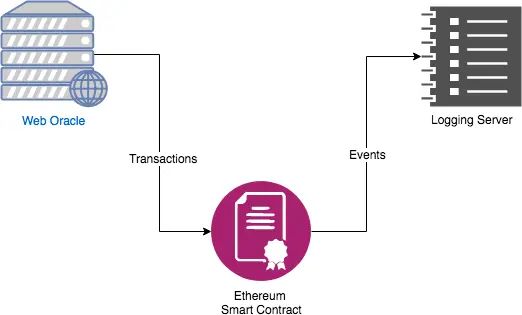
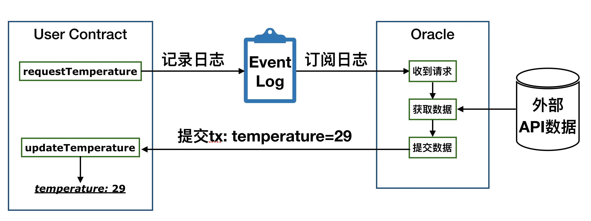
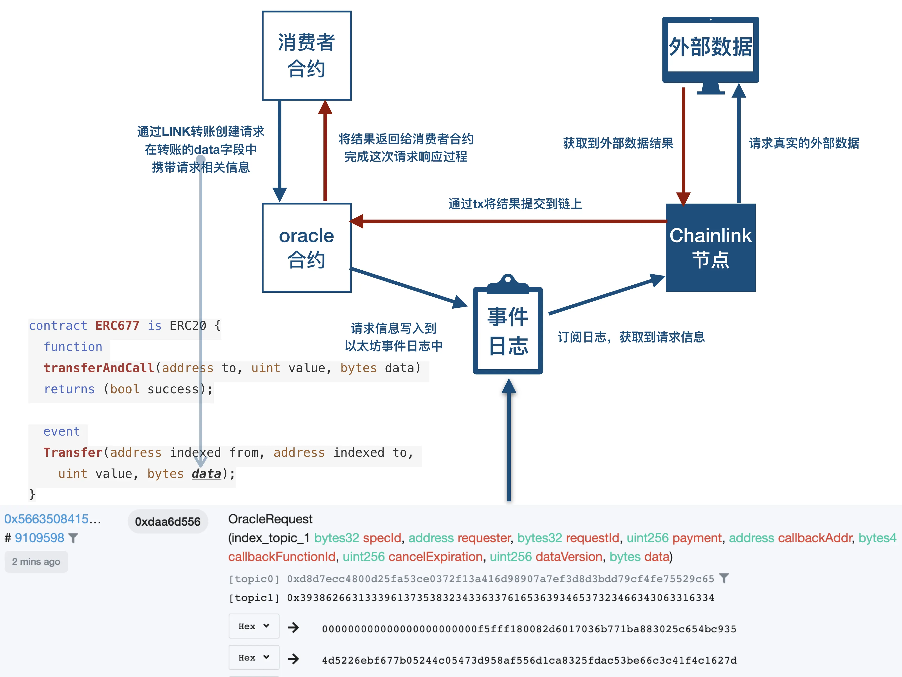

# Chainlink

## 预言机 Oracle

Oracle 的含义：在古代，Oracle 是一个提出建议或预言的人，他的建议或预言被认为是直接来自于神。在现代用法中，任何好的信息来源都可以称为 Oracle。

在区块链领域，预言机被认为是可以为智能合约提供外部数据源的系统。从传统技术架构方面来看，预言机是连接智能合约与区块链外部世界的**中间件（middleware）**，是区块链重要的基础设施，它的作用是为区块链上的智能合约（Smart Contract）提供数据信息的。

正如以太坊的定义，区块链是一个交易驱动的状态机（a transaction-based state machine），它能做的事情非常简单，就是通过向区块链提交事务/交易（transaction），来将区块链从一个状态转变成另一个状态。为了保持共识，EVM 的执行过程必须完全确定，并且仅基于以太坊状态和签名交易的共享上下文。这产生了两个特别重要的后果：一个是 EVM 和智能合约没有内在的随机性来源；另一个是外部数据只能作为交易的数据载荷引入。用通俗的话讲，区块链没有主动获取数据的能力，它能用的只有区块链自己本身的数据。数据的缺失导致智能合约的应用范围非常少，目前大部分的应用都是围绕着 token 来展开的。

区块链的确定性的意思是，在任何节点上，只要连入到区块链的分布式网络中，它就可以同步所有的历史区块，回放出一套完全相同的账本。换句话说：在没有互联网连接的情况下，给定完整的块，节点必须能够从头开始重新创建区块链的最终状态。如果账本在形成过程中，依赖于某个外部的 API 调用结果，那在不同时间不同环境下回放的结果就会不一样。这种情况是区块链所不允许的，所以区块链在设计之初就没有网络调用。

那么要实现向区块链提供数据，应该怎么做呢？区块链能留下的只有账本，而区块链所能输入的只有交易。我们就从这两个方面入手。



几乎每一个合约系统，都会有事件记录的功能，比如以太坊中的 EventLog 功能。

例子：



链上建立一个合约，它需要获取到某个城市的气温数据。当然，智能合约自己是无法获取到这个发生于链下真实世界中的数据信息的，需要借助预言机来实现。智能合约将需要获取天气温度的的城市写入到 EventLog 中，链下我们会启动一个进程，监听并订阅这个事件日志，获取到智能合约的请求之后，将指定城市的温度，通过提交 transaction 的方式，调用合约中的回填方法，提交到智能合约中。

```solidity
contract WeatherOracle {
    // 用户存储预言机提交的天气数值
    uint256 public temperature;

    event RequestTemperature(bytes city);

    // 发出获取请求，即发出一个事件日志
    function requestTemperature(string memory _city) public {
        emit RequestTemperature(bytes(_city));
    }

    // 预言机回调方法，预言机获取到数据后通过这个方法将数据提交到链上
    function updateWeather(uint256 _temperature) public {
        temperature = _temperature;
    }
}
```

链下，我们启动一个进程，以订阅 topic 的方式获取日志信息，之后通过构建一个 transaction，提交一个结果到合约中。

```go
func SubscribeEventLog() {
  topic := crypto.Keccak256([]byte("RequestTemperature(bytes)"))
  query := ethereum.FilterQuery{
    Topics: [][]common.Hash{
      {
        common.BytesToHash(topic),
      },
    },
  }

  // 订阅相关主题的日志事件
  events := make(chan types.Log)
  sub, err := EthClient.SubscribeFilterLogs(ctx, query, events)

  // 加载合约的ABI文件
  ta, err := abi.JSON(strings.NewReader(AbiJsonStr))

  // 监听事件订阅
  for {
    select {
    case err := <-sub.Err():
      log.Error(err)
      break
    case ev := <-events:
      // 获取到订阅的消息
      ej, _ := ev.MarshalJSON()
      log.Info(string(ej))

      // 解析数据
      var sampleEvent struct {
        City []byte
      }
      err = ta.Unpack(&sampleEvent, "RequestTemperature", ev.Data)
      log.Info(string(sampleEvent.City))

      // 构建交易提交结果，需要提供私钥用于签署交易
      CallContract("b7b502b...164b42c")
    }
  }
}
```

```go
func CallContract(keyStr string) {
  addr := PrivateKeyToAddress(keyStr)
  nonce, err := EthClient.PendingNonceAt(ctx, addr)

  gasPrice, err := EthClient.SuggestGasPrice(ctx)

  privateKey, err := crypto.HexToECDSA(keyStr)

  auth := bind.NewKeyedTransactor(privateKey)
  auth.Nonce = big.NewInt(int64(nonce))
  auth.Value = big.NewInt(0)
  auth.GasLimit = uint64(300000)
  auth.GasPrice = gasPrice

  instance, err := event.NewEvent(common.HexToAddress("0x8A421906e9562AA1c71e5a32De1cf75161C5A463"), EthClient)

  // 调用合约中的updateWeather方法，回填数据"29"
  tx, err := instance.UpdateWeather(auth, big.NewInt(29))

  log.Info(tx.Hash().Hex())
}
```

## Chainlink

Chainlink 是一个去中心化的预言机项目，它的作用就是以最安全的方式向区块链提供现实世界中产生的数据。Chainlink 在基本的预言机原理的实现方式之上，围绕 LINK token 通过经济激励建立了一个良性循环的生态系统。Chainlink 预言机需要通过 LINK token 的转账来实现触发。

LINK 是以太坊网络上的 ERC677 合约，关于各类 ERC token 的区别，可参考这篇[文章](http://blockchainers.org/index.php/2018/02/08/token-erc-comparison-for-fungible-tokens/)。

预言机有三种设计模式，分别是：

- 立即读取（immediate-read）
- 发布/订阅（publish–subscribe）
- 请求/响应（request–response）

而基于 LINK ERC677 token 完成的预言机功能，就属于其中的**请求/响应**模式。这是一种较为复杂的模式，上图中展示的是一个不含有聚合过程的简单请求/相应流程。



我们以 Chainlink 提供的 `TestnetConsumer` 合约中的一个 `requestEthereumPrice` 方法为例来简单讲一下请求响应的流程。这个函数定义如下：

```solidity
function requestEthereumPrice(address _oracle, string _jobId)
  public
  onlyOwner
{
  Chainlink.Request memory req = buildChainlinkRequest(stringToBytes32(_jobId), this, this.fulfillEthereumPrice.selector);
  req.add("get", "https://min-api.cryptocompare.com/data/price?fsym=ETH&tsyms=USD");
  req.add("path", "USD");
  req.addInt("times", 100);
  sendChainlinkRequestTo(_oracle, req, ORACLE_PAYMENT);
}
```

它所实现的功能就是从指定的 API(cryptocompare)获取 ETH/USD 的交易价格。函数传入的参数是指定的 Oracle 地址和 jobId。将一些列的请求参数组好后，调用 `sendChainlinkRequestTo` 方法将请求发出。`sendChainlinkRequestTo` 是定义在 Chainlink 提供的库中的一个接口方法，定义如下：

```solidity
/**
  * @notice 向指定的oracle地址创建一个请求
  * @dev 创建并存储一个请求ID, 增加本地的nonce值, 并使用`transferAndCall` 方法发送LINK，
  * 创建到目标oracle合约地址的请求
  * 发出 ChainlinkRequested 事件.
  * @param _oracle 发送请求至的oracle地址
  * @param _req 完成初始化的Chainlink请求
  * @param _payment 请求发送的LINK数量
  * @return 请求 ID
  */
function sendChainlinkRequestTo(address _oracle, Chainlink.Request memory _req, uint256 _payment)
  internal
  returns (bytes32 requestId)
{
  requestId = keccak256(abi.encodePacked(this, requests));
  _req.nonce = requests;
  pendingRequests[requestId] = _oracle;
  emit ChainlinkRequested(requestId);
  require(link.transferAndCall(_oracle, _payment, encodeRequest(_req)), "unable to transferAndCall to oracle");
  requests += 1;

  return requestId;
}
```

其中`link.transferAndCall`方法即是 ERC677 定义的 token 转账方法，与 ERC20 的 `transfer` 方法相比，它多了一个 data 字段，可以在转账的同时携带数据。这里就将之前打包好的请求数据放在了 data 字段，跟随转账一起发送到了 Oracle 合约。`transferAndCall` 方法定义如下：

```solidity
/**
  * @dev 将token和额外数据一起转移给一个合约地址
  * @param _to 转移到的目的地址
  * @param _value 转移数量
  * @param _data 传递给接收合约的额外数据
  */
  function transferAndCall(address _to, uint _value, bytes _data)
    public
    returns (bool success)
  {
    super.transfer(_to, _value);
    Transfer(msg.sender, _to, _value, _data);
    if (isContract(_to)) {
      contractFallback(_to, _value, _data);
    }
    return true;
  }
```

其中的`Transfer(msg.sender, _to, _value, _data);`是发出一个事件日志：

```solidity
event Transfer(address indexed from, address indexed to, uint value, bytes data);
```

将这次转账的详细信息（发送方、接收方、金额、数据）记录到日志中。

Oracle 合约在收到转账之后，会触发 `onTokenTransfer` 方法，该方法会检查转账的有效性，并通过发出 `OracleRequest` 事件记录更为详细的数据信息：

```solidity
event OracleRequest(
  bytes32 indexed specId,
  address requester,
  bytes32 requestId,
  uint256 payment,
  address callbackAddr,
  bytes4 callbackFunctionId,
  uint256 cancelExpiration,
  uint256 dataVersion,
  bytes data
);
```

这个日志会在 Oracle 合约的日志中找到，如图中下方所示。链下的节点会订阅该主题的日志，在获取到记录的日志信息之后，节点会解析出请求的具体信息，通过网络的 API 调用，获取到请求的结果。之后通过提交事务的方式，调用 Oracle 合约中的 `fulfillOracleRequest` 方法，将数据提交到链上。`fulfillOracleRequest 定义如下：

```solidity
/**
  * @notice 由Chainlink节点调用来完成请求
  * @dev 提交的参数必须是`oracleRequest`方法所记录的哈希参数
  * 将会调用回调地址的回调函数，`require`检查时不会报错，以便节点可以获得报酬
  * @param _requestId 请求ID必须与请求者所匹配
  * @param _payment 为Oracle发放付款金额 (以wei为单位)
  * @param _callbackAddress 完成方法的回调地址
  * @param _callbackFunctionId 完成方法的回调函数
  * @param _expiration 请求者可以取消之前节点应响应的到期时间
  * @param _data 返回给消费者合约的数据
  * @return 外部调用成功的状态值
  */
function fulfillOracleRequest(
  bytes32 _requestId,
  uint256 _payment,
  address _callbackAddress,
  bytes4 _callbackFunctionId,
  uint256 _expiration,
  bytes32 _data
)
  external
  onlyAuthorizedNode
  isValidRequest(_requestId)
  returns (bool)
{
  bytes32 paramsHash = keccak256(
    abi.encodePacked(
      _payment,
      _callbackAddress,
      _callbackFunctionId,
      _expiration
    )
  );
  require(commitments[_requestId] == paramsHash, "Params do not match request ID");
  withdrawableTokens = withdrawableTokens.add(_payment);
  delete commitments[_requestId];
  require(gasleft() >= MINIMUM_CONSUMER_GAS_LIMIT, "Must provide consumer enough gas");
  // All updates to the oracle's fulfillment should come before calling the
  // callback(addr+functionId) as it is untrusted.
  // See: https://solidity.readthedocs.io/en/develop/security-considerations.html#use-the-checks-effects-interactions-pattern
  return _callbackAddress.call(_callbackFunctionId, _requestId, _data); // solhint-disable-line avoid-low-level-calls
}
```

这个方法会在进行一系列的检验之后，会将结果通过之前记录的回调地址与回调函数，返回给消费者合约：

```solidity
_callbackAddress.call(_callbackFunctionId, _requestId, _data);
```

这样一次请求就全部完成了。

## 资源

[chainlink resources](https://docs.chain.link/resources/link-token-contracts#ethereum)
[chainlink code](https://github.com/smartcontractkit/chainlink)
