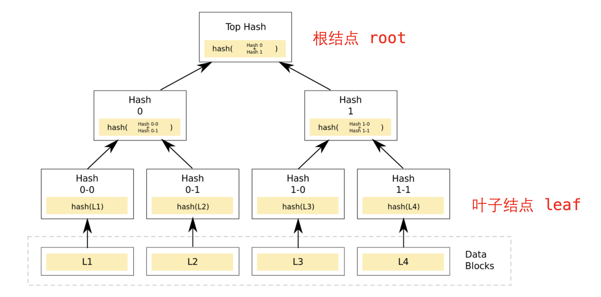
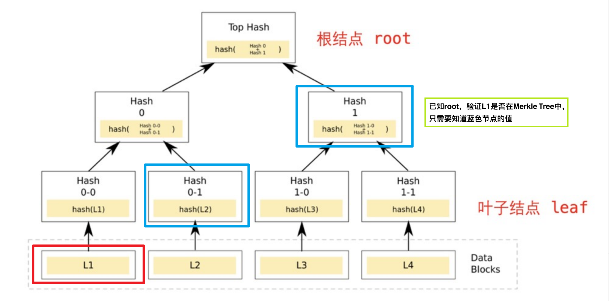
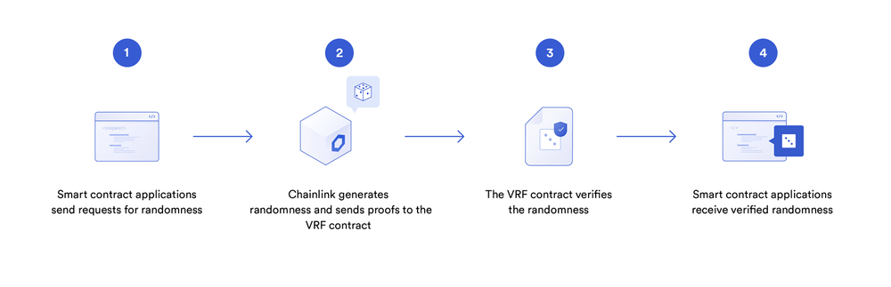

# solidity 应用

## 1. ERC20

`ERC20`是以太坊上的代币标准，来自2015年11月V神参与的[EIP20](https://eips.ethereum.org/EIPS/eip-20)。它实现了代币转账的基本逻辑：

- 账户余额（`balanceOf()`）
- 转账（`transfer()`）
- 授权转账（`transferFrom()`）
- 授权（`approve()`）
- 代币总供给（`totalSupply()`）
- 授权转账额度（`allowance()`）
- 代币信息（可选）：名称（`name()`），代号（`symbol()`），小数位数（`decimals()`）

### 1.1 IERC20

`IERC20`是`ERC20`代币标准的接口合约，规定了`ERC20`代币需要实现的函数和事件。之所以需要定义接口，是因为有了规范后，就存在所有的`ERC20`代币都通用的函数名称，输入参数，输出参数。在接口函数中，只需要定义函数名称，输入参数，输出参数，并不关心函数内部如何实现。因此，函数就分位内部和外部两个内容，一个重点是实现，另一个是对外接口，约定共同数据。这就是为什么需要`ERC20.sol`和`IERC20.sol`两个文件实现一个合约。

### 1.2 事件

`IERC20`定义了2个事件：`Transfer`事件和`Approval`事件，分别在转账和授权时被释放

```js
/**
 * @dev 释放条件：当 `value` 单位的货币从账户 (`from`) 转账到另一账户 (`to`)时.
 */
event Transfer(address indexed from, address indexed to, uint256 value);

/**
 * @dev 释放条件：当 `value` 单位的货币从账户 (`owner`) 授权给另一账户 (`spender`)时.
 */
event Approval(address indexed owner, address indexed spender, uint256 value);
```

### 1.3 函数

`IERC20`定义了6个函数，提供了转移代币的基本功能，并允许代币获得批准，以便其他链上第三方使用。

- `totalSupply()`返回代币总供给

```js
/**
 * @dev 返回代币总供给.
 */
function totalSupply() external view returns (uint256);
```

- `balanceOf()`返回账户余额

```js
/**
 * @dev 返回账户`account`所持有的代币数.
 */
function balanceOf(address account) external view returns (uint256);
```

- `transfer()`转账

```js
/**
 * @dev 转账 `amount` 单位代币，从调用者账户到另一账户 `to`.
 *
 * 如果成功，返回 `true`.
 *
 * 释放 {Transfer} 事件.
 */
function transfer(address to, uint256 amount) external returns (bool);
```

- `allowance()`返回授权额度

```js
/**
 * @dev 返回`owner`账户授权给`spender`账户的额度，默认为0。
 *
 * 当{approve} 或 {transferFrom} 被调用时，`allowance`会改变.
 */
function allowance(address owner, address spender) external view returns (uint256);
```

- `approve()`授权

```js
/**
 * @dev 调用者账户给`spender`账户授权 `amount`数量代币。
 *
 * 如果成功，返回 `true`.
 *
 * 释放 {Approval} 事件.
 */
function approve(address spender, uint256 amount) external returns (bool);
```

- `transferFrom()`授权转账

```js
/**
 * @dev 通过授权机制，从`from`账户向`to`账户转账`amount`数量代币。转账的部分会从调用者的`allowance`中扣除。
 *
 * 如果成功，返回 `true`.
 *
 * 释放 {Transfer} 事件.
 */
function transferFrom(
    address from,
    address to,
    uint256 amount
) external returns (bool);
```

### 1.4 实现ERC20

#### 1.4.1 状态变量

我们需要状态变量来记录账户余额，授权额度和代币信息。其中`balanceOf`, `allowance`和`totalSupply`为`public`类型，会自动生成一个同名`getter`函数，实现`IERC20`规定的`balanceOf()`, `allowance()`和`totalSupply()`。而`name`, `symbol`, `decimals`则对应代币的名称，代号和小数位数。

**注意**：用`override`修饰`public`变量，会重写继承自父合约的与变量同名的`getter`函数，比如`IERC20`中的`balanceOf()`函数。

```js
mapping(address => uint256) public override balanceOf;

mapping(address => mapping(address => uint256)) public override allowance;

uint256 public override totalSupply;   // 代币总供给

string public name;   // 名称
string public symbol;  // 代号

uint8 public decimals = 18; // 小数位数
```

#### 1.4.2 函数

- 构造函数：初始化代币名称、代号

```js
constructor(string memory name_, string memory symbol_){
    name = name_;
    symbol = symbol_;
}
```

- `transfer()`函数：实现`IERC20`中的`transfer`函数，代币转账逻辑。调用方扣除`amount`数量代币，接收方增加相应代币。土狗币会魔改这个函数，加入税收、分红、抽奖等逻辑。

```js
function transfer(address recipient, uint amount) public override returns (bool) {
    balanceOf[msg.sender] -= amount;
    balanceOf[recipient] += amount;
    emit Transfer(msg.sender, recipient, amount);
    return true;
}
```

- `approve()`函数：实现`IERC20`中的`approve`函数，代币授权逻辑。被授权方`spender`可以支配授权方的`amount`数量的代币。`spender`可以是`EOA`账户，也可以是合约账户：当你用uniswap交易代币时，你需要将代币授权给uniswap合约。

```js
function approve(address spender, uint amount) public override returns (bool) {
    allowance[msg.sender][spender] = amount;
    emit Approval(msg.sender, spender, amount);
    return true;
}
```

- `transferFrom()`函数：实现`IERC20`中的`transferFrom`函数，授权转账逻辑。被授权方将授权方`sender`的`amount`数量的代币转账给接收方`recipient`。

```js
function transferFrom(
    address sender,
    address recipient,
    uint amount
) public override returns (bool) {
    allowance[sender][msg.sender] -= amount;
    balanceOf[sender] -= amount;
    balanceOf[recipient] += amount;
    emit Transfer(sender, recipient, amount);
    return true;
}
```

- `mint()`函数：铸造代币函数，不在`IERC20`标准中。这里为了教程方便，任何人可以铸造任意数量的代币，实际应用中会加入权限管理，只有`owner`可以铸造代币：

```js
function mint(uint amount) external {
    balanceOf[msg.sender] += amount;
    totalSupply += amount;
    emit Transfer(address(0), msg.sender, amount);
}
```

- `burn()`函数：销毁代币函数，不在`IERC20`标准中。

```js
function burn(uint amount) external {
    balanceOf[msg.sender] -= amount;
    totalSupply -= amount;
    emit Transfer(msg.sender, address(0), amount);
}
```

## 2. 代币水龙头

代币水龙头是让用户免费领取代币的应用。

最早的代币水龙头是比特币（BTC）水龙头：在2010年，BTC的价格只有不到$0.1，并且持有人很少。为了扩大影响力，比特币社区的Gavin Andresen开发了BTC水龙头，让别人可以免费领BTC。撸羊毛大家都喜欢，当时就有很多人去撸，一部分变为了BTC的信徒。BTC水龙头一共送出了超过19,700枚BTC，现在价值约6亿美元！

### 2.1 ERC20水龙头合约

这里，我们实现一个简版的ERC20水龙头，逻辑非常简单：我们将一些ERC20代币转到水龙头合约里，用户可以通过合约的`requestToken()`函数来领取100单位的代币，每个地址只能领一次。

#### 2.1.1 状态变量

在水龙头合约中定义了3个状态变量

- `amountAllowed`设定每次能领取代币数量（默认为100，不是一百枚，因为代币有小数位数）
- `tokenContract`记录发放的ERC20代币合约地址
- `requestedAddress`记录领取过代币的地址

```js
uint256 public amountAllowed = 100; // 每次领 100 单位代币
address public tokenContract;   // token合约地址
mapping(address => bool) public requestedAddress;   // 记录领取过代币的地址
```

#### 2.1.2 事件

水龙头合约中定义了1个`SendToken`事件，记录了每次领取代币的地址和数量，在`requestTokens()`函数被调用时释放。

```js
// SendToken事件    
event SendToken(address indexed Receiver, uint256 indexed Amount); 
```

#### 2.1.3 函数

合约中只有两个函数：

- 构造函数：初始化`tokenContract`状态变量，确定发放的ERC20代币地址

```js
// 部署时设定ERC20代币合约
constructor(address _tokenContract) {
  tokenContract = _tokenContract; // set token contract
}
```

- `requestTokens()`函数，用户调用它可以领取代币

```js
// 用户领取代币函数
function requestTokens() external {
    require(!requestedAddress[msg.sender], "Can't Request Multiple Times!"); // 每个地址只能领一次
    IERC20 token = IERC20(tokenContract); // 创建IERC20合约对象
    require(token.balanceOf(address(this)) >= amountAllowed, "Faucet Empty!"); // 水龙头空了

    token.transfer(msg.sender, amountAllowed); // 发送token
    requestedAddress[msg.sender] = true; // 记录领取地址 
    
    emit SendToken(msg.sender, amountAllowed); // 释放SendToken事件
}
```

## 3. 空投合约

空投（Airdrop）是币圈中一种营销策略，项目方将代币免费发放给特定用户群体。为了拿到空投资格，用户通常需要完成一些简单的任务，如测试产品、分享新闻、介绍朋友等。项目方通过空投可以获得种子用户，而用户可以获得一笔财富，两全其美。

因为每次接收空投的用户很多，项目方不可能一笔一笔的转账。利用智能合约批量发放ERC20代币，可以显著提高空投效率。

### 3.1 空投代币合约

`Airdrop`空投合约逻辑非常简单：利用循环，一笔交易将ERC20代币发送给多个地址。合约中包含两个函数：

- `getSum()`函数：返回uint数组的和

```js
// 数组求和函数
function getSum(uint256[] calldata _arr) public pure returns(uint sum){
    for(uint i = 0; i < _arr.length; i++)
        sum = sum + _arr[i];
}
```

- `multiTransferToken()`函数：用于发送ERC20代币空投，包含3个参数：
  - `_token`：代币合约地址（`address`类型）
  - `_addresses`：接收空投的用户地址数组（`address[]`类型）
  - `_amounts`：空投数量数组，对应`_addresses`里每个地址的数量（`uint[]`类型）

该函数有两个检查：第一个`require`检查了`_addresses`和`_amounts`两个数组长度是否相等；第二个`require`检查了空投合约的授权额度大于要空投的代币数量总和。

```js
/// @notice 向多个地址转账ERC20代币，使用前需要先授权
///
/// @param _token 转账的ERC20代币地址
/// @param _addresses 空投地址数组
/// @param _amounts 代币数量数组（每个地址的空投数量）
function multiTransferToken(
    address _token,
    address[] calldata _addresses,
    uint256[] calldata _amounts
    ) external {
    // 检查：_addresses和_amounts数组的长度相等
    require(_addresses.length == _amounts.length, "Lengths of Addresses and Amounts NOT EQUAL");
    IERC20 token = IERC20(_token); // 声明IERC合约变量
    uint _amountSum = getSum(_amounts); // 计算空投代币总量
    // 检查：授权代币数量 >= 空投代币总量
    require(token.allowance(msg.sender, address(this)) >= _amountSum, "Need Approve ERC20 token");

    // for循环，利用transferFrom函数发送空投
    for (uint8 i; i < _addresses.length; i++) {
        token.transferFrom(msg.sender, _addresses[i], _amounts[i]);
    }
}
```

- `multiTransferETH()`函数：发送ETH空投，包含2个参数
  - `_addresses`：接收空投的用户地址数组（`address[]`类型）
  - `_amounts`：空投数量数组，对应`_addresses`里每个地址的数量（`uint[]`类型）

```js
/// 向多个地址转账ETH
function multiTransferETH(
    address payable[] calldata _addresses,
    uint256[] calldata _amounts
) public payable {
    // 检查：_addresses和_amounts数组的长度相等
    require(_addresses.length == _amounts.length, "Lengths of Addresses and Amounts NOT EQUAL");
    uint _amountSum = getSum(_amounts); // 计算空投ETH总量
    // 检查转入ETH等于空投总量
    require(msg.value == _amountSum, "Transfer amount error");
    // for循环，利用transfer函数发送ETH
    for (uint256 i = 0; i < _addresses.length; i++) {
        // 注释代码有Dos攻击风险, 并且transfer 也是不推荐写法
        // Dos攻击 具体参考 https://github.com/AmazingAng/WTF-Solidity/blob/main/S09_DoS/readme.md
        // _addresses[i].transfer(_amounts[i]);
        (bool success, ) = _addresses[i].call{value: _amounts[i]}("");
        if (!success) {
            failTransferList[_addresses[i]] = _amounts[i];
        }
    }
}
```

## 4. ERC721

BTC和ETH这类代币都属于同质化代币，矿工挖出的第1枚BTC与第10000枚BTC并没有不同，是等价的。但世界中很多物品是不同质的，其中包括房产、古董、虚拟艺术品等等，这类物品无法用同质化代币抽象。因此，以太坊[EIP721](https://eips.ethereum.org/EIPS/eip-721)提出了ERC721标准，来抽象非同质化的物品。

### 4.0 EIP与ERC

这里有一个点需要理解，本节标题是`ERC721`，这里又提到了`EIP721`,这两个是什么关系呢？

`EIP`全称`Ethereum Improvement Proposals`(以太坊改进建议), 是以太坊开发者社区提出的改进建议, 是一系列以编号排定的文件, 类似互联网上`IETF`的`RFC`。

`EIP`可以是Ethereum生态中任意领域的改进, 比如新特性、ERC、协议改进、编程工具等等。

`ERC`全称`Ethereum Request For Comment`(以太坊意见征求稿), 用以记录以太坊上应用级的各种开发标准和协议。如典型的Token标准(`ERC20`, `ERC721`)、名字注册(`ERC26`, `ERC13`), URI范式(`ERC67`), Library/Package格式(`EIP82`), 钱包格式(`EIP75`,`EIP85`)。

`ERC`协议标准是影响以太坊发展的重要因素, 像`ERC20`, `ERC223`, `ERC721`, `ERC777`等, 都是对以太坊生态产生了很大影响。

所以最终结论：`EIP`包含`ERC`。

### 4.1 ERC165

通过[ERC165标准](https://eips.ethereum.org/EIPS/eip-165)，智能合约可以声明它支持的接口，供其他合约检查。简单的说，`ERC165`就是检查一个智能合约是不是支持了`ERC721`，`ERC1155`的接口。

`IERC165`接口合约只声明了一个`supportsInterface`函数，输入要查询的interfaceId接口id，若合约实现了该接口id，则返回`true`：

```js
interface IERC165 {
    /**
     * @dev 如果合约实现了查询的`interfaceId`，则返回true
     * 规则详见：https://eips.ethereum.org/EIPS/eip-165#how-interfaces-are-identified[EIP section]
     *
     */
    function supportsInterface(bytes4 interfaceId) external view returns (bool);
}
```

我们可以看下`ERC721`是如何实现`supportsInterface()`函数的：

```js
    function supportsInterface(bytes4 interfaceId) external pure override returns (bool)
    {
        return
            interfaceId == type(IERC721).interfaceId ||
            interfaceId == type(IERC165).interfaceId;
    }
```

当查询的是`IERC721`或`IERC165`的接口id时，返回`true`；反之返回`false`。

### 4.2 IERC721

`IERC721`是`ERC721`标准的接口合约，规定了`ERC721`要实现的基本函数。它利用`tokenId`来表示特定的非同质化代币，授权或转账都要明确`tokenId`；而`ERC20`只需要明确转账的数额即可。

#### 4.2.1 IERC接口

```js
/**
 * @dev ERC721标准接口.
 */
interface IERC721 is IERC165 {
    event Transfer(address indexed from, address indexed to, uint256 indexed tokenId);
    event Approval(address indexed owner, address indexed approved, uint256 indexed tokenId);
    event ApprovalForAll(address indexed owner, address indexed operator, bool approved);

    function balanceOf(address owner) external view returns (uint256 balance);

    function ownerOf(uint256 tokenId) external view returns (address owner);

    function safeTransferFrom(
        address from,
        address to,
        uint256 tokenId,
        bytes calldata data
    ) external;

    function safeTransferFrom(
        address from,
        address to,
        uint256 tokenId
    ) external;

    function transferFrom(
        address from,
        address to,
        uint256 tokenId
    ) external;

    function approve(address to, uint256 tokenId) external;

    function setApprovalForAll(address operator, bool _approved) external;

    function getApproved(uint256 tokenId) external view returns (address operator);

    function isApprovedForAll(address owner, address operator) external view returns (bool);
}
```

#### 4.2.2 IERC721事件

`IERC721`包含3个事件，其中`Transfer`和`Approval`事件在`ERC20`中也有。

- `Transfer`事件：在转账时被释放，记录代币的发出地址`from`，接收地址`to`和`tokenid`。
- `Approval`事件：在授权时释放，记录授权地址`owner`，被授权地址`approved`和`tokenid`。
- `ApprovalForAll`事件：在批量授权时释放，记录批量授权的发出地址`owner`，被授权地址`operator`和授权与否的`approved`。

#### 4.2.3 IERC721函数

- `balanceOf`：返回某地址的NFT持有量balance。
- `ownerOf`：返回某tokenId的主人owner。
- `transferFrom`：普通转账，参数为转出地址from，接收地址to和tokenId。
- `safeTransferFrom`：安全转账（如果接收方是合约地址，会要求实现ERC721Receiver接口）。参数为转出地址from，接收地址to和tokenId。
- `approve`：授权另一个地址使用你的NFT。参数为被授权地址approve和tokenId。
- `getApproved`：查询tokenId被批准给了哪个地址。
- `setApprovalForAll`：将自己持有的该系列NFT批量授权给某个地址operator。
- `isApprovedForAll`：查询某地址的NFT是否批量授权给了另一个operator地址。
- `safeTransferFrom`：安全转账的重载函数，参数里面包含了data。

#### 4.2.4 IERC721Receiver

如果一个合约没有实现`ERC721`的相关函数，转入的NFT就进了黑洞，永远转不出来了。为了防止误转账，`ERC721`实现了`safeTransferFrom()`安全转账函数，目标合约必须实现了`IERC721Receiver`接口才能接收`ERC721`代币，不然会`revert`。`IERC721Receiver`接口只包含一个`onERC721Received()`函数。

```js
// ERC721接收者接口：合约必须实现这个接口来通过安全转账接收ERC721
interface IERC721Receiver {
    function onERC721Received(
        address operator,
        address from,
        uint tokenId,
        bytes calldata data
    ) external returns (bytes4);
}
```

我们看下`ERC721`利用`_checkOnERC721Received`来确保目标合约实现了`onERC721Received()`函数（返回`onERC721Received`的`selector`）：

```js
function _checkOnERC721Received(
    address operator,
    address from,
    address to,
    uint256 tokenId,
    bytes memory data
) internal {
    if (to.code.length > 0) {
        try IERC721Receiver(to).onERC721Received(operator, from, tokenId, data) returns (bytes4 retval) {
            if (retval != IERC721Receiver.onERC721Received.selector) {
                // Token rejected
                revert IERC721Errors.ERC721InvalidReceiver(to);
            }
        } catch (bytes memory reason) {
            if (reason.length == 0) {
                // non-IERC721Receiver implementer
                revert IERC721Errors.ERC721InvalidReceiver(to);
            } else {
                /// @solidity memory-safe-assembly
                assembly {
                    revert(add(32, reason), mload(reason))
                }
            }
        }
    }
}
```

#### 4.2.5 IERC721Metadata

`IERC721Metadata`是`ERC721`的拓展接口，实现了3个查询metadata元数据的常用函数：

- `name()`：返回代币名称。
- `symbol()`：返回代币代号。
- `tokenURI()`：通过tokenId查询metadata的链接url，ERC721特有的函数。

```js
interface IERC721Metadata is IERC721 {
    function name() external view returns (string memory);

    function symbol() external view returns (string memory);

    function tokenURI(uint256 tokenId) external view returns (string memory);
}
```

### 4.3 ERC721主合约

`ERC721`主合约实现了`IERC721`，`IERC165`和`IERC721Metadata`定义的所有功能，包含4个状态变量和17个函数。实现都比较简单，每个函数的功能见代码注释：

```js
// SPDX-License-Identifier: MIT
// by 0xAA
pragma solidity ^0.8.21;

import "./IERC165.sol";
import "./IERC721.sol";
import "./IERC721Receiver.sol";
import "./IERC721Metadata.sol";
import "./String.sol";

contract ERC721 is IERC721, IERC721Metadata{
    using Strings for uint256; // 使用String库，

    // Token名称
    string public override name;
    // Token代号
    string public override symbol;
    // tokenId 到 owner address 的持有人映射
    mapping(uint => address) private _owners;
    // address 到 持仓数量 的持仓量映射
    mapping(address => uint) private _balances;
    // tokenID 到 授权地址 的授权映射
    mapping(uint => address) private _tokenApprovals;
    //  owner地址。到operator地址 的批量授权映射
    mapping(address => mapping(address => bool)) private _operatorApprovals;

    // 错误 无效的接收者
    error ERC721InvalidReceiver(address receiver);

    /**
     * 构造函数，初始化`name` 和`symbol` .
     */
    constructor(string memory name_, string memory symbol_) {
        name = name_;
        symbol = symbol_;
    }

    // 实现IERC165接口supportsInterface
    function supportsInterface(bytes4 interfaceId)
        external
        pure
        override
        returns (bool)
    {
        return
            interfaceId == type(IERC721).interfaceId ||
            interfaceId == type(IERC165).interfaceId ||
            interfaceId == type(IERC721Metadata).interfaceId;
    }

    // 实现IERC721的balanceOf，利用_balances变量查询owner地址的balance。
    function balanceOf(address owner) external view override returns (uint) {
        require(owner != address(0), "owner = zero address");
        return _balances[owner];
    }

    // 实现IERC721的ownerOf，利用_owners变量查询tokenId的owner。
    function ownerOf(uint tokenId) public view override returns (address owner) {
        owner = _owners[tokenId];
        require(owner != address(0), "token doesn't exist");
    }

    // 实现IERC721的isApprovedForAll，利用_operatorApprovals变量查询owner地址是否将所持NFT批量授权给了operator地址。
    function isApprovedForAll(address owner, address operator)
        external
        view
        override
        returns (bool)
    {
        return _operatorApprovals[owner][operator];
    }

    // 实现IERC721的setApprovalForAll，将持有代币全部授权给operator地址。调用_setApprovalForAll函数。
    function setApprovalForAll(address operator, bool approved) external override {
        _operatorApprovals[msg.sender][operator] = approved;
        emit ApprovalForAll(msg.sender, operator, approved);
    }

    // 实现IERC721的getApproved，利用_tokenApprovals变量查询tokenId的授权地址。
    function getApproved(uint tokenId) external view override returns (address) {
        require(_owners[tokenId] != address(0), "token doesn't exist");
        return _tokenApprovals[tokenId];
    }
     
    // 授权函数。通过调整_tokenApprovals来，授权 to 地址操作 tokenId，同时释放Approval事件。
    function _approve(
        address owner,
        address to,
        uint tokenId
    ) private {
        _tokenApprovals[tokenId] = to;
        emit Approval(owner, to, tokenId);
    }

    // 实现IERC721的approve，将tokenId授权给 to 地址。条件：to不是owner，且msg.sender是owner或授权地址。调用_approve函数。
    function approve(address to, uint tokenId) external override {
        address owner = _owners[tokenId];
        require(
            msg.sender == owner || _operatorApprovals[owner][msg.sender],
            "not owner nor approved for all"
        );
        _approve(owner, to, tokenId);
    }

    // 查询 spender地址是否可以使用tokenId（需要是owner或被授权地址）
    function _isApprovedOrOwner(
        address owner,
        address spender,
        uint tokenId
    ) private view returns (bool) {
        return (spender == owner ||
            _tokenApprovals[tokenId] == spender ||
            _operatorApprovals[owner][spender]);
    }

    /*
     * 转账函数。通过调整_balances和_owner变量将 tokenId 从 from 转账给 to，同时释放Transfer事件。
     * 条件:
     * 1. tokenId 被 from 拥有
     * 2. to 不是0地址
     */
    function _transfer(
        address owner,
        address from,
        address to,
        uint tokenId
    ) private {
        require(from == owner, "not owner");
        require(to != address(0), "transfer to the zero address");

        _approve(owner, address(0), tokenId);

        _balances[from] -= 1;
        _balances[to] += 1;
        _owners[tokenId] = to;

        emit Transfer(from, to, tokenId);
    }
    
    // 实现IERC721的transferFrom，非安全转账，不建议使用。调用_transfer函数
    function transferFrom(
        address from,
        address to,
        uint tokenId
    ) external override {
        address owner = ownerOf(tokenId);
        require(
            _isApprovedOrOwner(owner, msg.sender, tokenId),
            "not owner nor approved"
        );
        _transfer(owner, from, to, tokenId);
    }

    /**
     * 安全转账，安全地将 tokenId 代币从 from 转移到 to，会检查合约接收者是否了解 ERC721 协议，以防止代币被永久锁定。调用了_transfer函数和_checkOnERC721Received函数。条件：
     * from 不能是0地址.
     * to 不能是0地址.
     * tokenId 代币必须存在，并且被 from拥有.
     * 如果 to 是智能合约, 他必须支持 IERC721Receiver-onERC721Received.
     */
    function _safeTransfer(
        address owner,
        address from,
        address to,
        uint tokenId,
        bytes memory _data
    ) private {
        _transfer(owner, from, to, tokenId);
        _checkOnERC721Received(from, to, tokenId, _data);
    }

    /**
     * 实现IERC721的safeTransferFrom，安全转账，调用了_safeTransfer函数。
     */
    function safeTransferFrom(
        address from,
        address to,
        uint tokenId,
        bytes memory _data
    ) public override {
        address owner = ownerOf(tokenId);
        require(
            _isApprovedOrOwner(owner, msg.sender, tokenId),
            "not owner nor approved"
        );
        _safeTransfer(owner, from, to, tokenId, _data);
    }

    // safeTransferFrom重载函数
    function safeTransferFrom(
        address from,
        address to,
        uint tokenId
    ) external override {
        safeTransferFrom(from, to, tokenId, "");
    }

    /** 
     * 铸造函数。通过调整_balances和_owners变量来铸造tokenId并转账给 to，同时释放Transfer事件。铸造函数。通过调整_balances和_owners变量来铸造tokenId并转账给 to，同时释放Transfer事件。
     * 这个mint函数所有人都能调用，实际使用需要开发人员重写，加上一些条件。
     * 条件:
     * 1. tokenId尚不存在。
     * 2. to不是0地址.
     */
    function _mint(address to, uint tokenId) internal virtual {
        require(to != address(0), "mint to zero address");
        require(_owners[tokenId] == address(0), "token already minted");

        _balances[to] += 1;
        _owners[tokenId] = to;

        emit Transfer(address(0), to, tokenId);
    }

    // 销毁函数，通过调整_balances和_owners变量来销毁tokenId，同时释放Transfer事件。条件：tokenId存在。
    function _burn(uint tokenId) internal virtual {
        address owner = ownerOf(tokenId);
        require(msg.sender == owner, "not owner of token");

        _approve(owner, address(0), tokenId);

        _balances[owner] -= 1;
        delete _owners[tokenId];

        emit Transfer(owner, address(0), tokenId);
    }

    // _checkOnERC721Received：函数，用于在 to 为合约的时候调用IERC721Receiver-onERC721Received, 以防 tokenId 被不小心转入黑洞。
    function _checkOnERC721Received(address from, address to, uint256 tokenId, bytes memory data) private {
        if (to.code.length > 0) {
            try IERC721Receiver(to).onERC721Received(msg.sender, from, tokenId, data) returns (bytes4 retval) {
                if (retval != IERC721Receiver.onERC721Received.selector) {
                    revert ERC721InvalidReceiver(to);
                }
            } catch (bytes memory reason) {
                if (reason.length == 0) {
                    revert ERC721InvalidReceiver(to);
                } else {
                    /// @solidity memory-safe-assembly
                    assembly {
                        revert(add(32, reason), mload(reason))
                    }
                }
            }
        }
    }

    /**
     * 实现IERC721Metadata的tokenURI函数，查询metadata。
     */
    function tokenURI(uint256 tokenId) public view virtual override returns (string memory) {
        require(_owners[tokenId] != address(0), "Token Not Exist");

        string memory baseURI = _baseURI();
        return bytes(baseURI).length > 0 ? string(abi.encodePacked(baseURI, tokenId.toString())) : "";
    }

    /**
     * 计算{tokenURI}的BaseURI，tokenURI就是把baseURI和tokenId拼接在一起，需要开发重写。
     * BAYC的baseURI为ipfs://QmeSjSinHpPnmXmspMjwiXyN6zS4E9zccariGR3jxcaWtq/ 
     */
    function _baseURI() internal view virtual returns (string memory) {
        return "";
    }
}

```

### 4.4 ERC165与ERC721详解

上面说到,为了防止NFT被转到一个没有能力操作NFT的合约中去,目标必须正确实现`ERC721TokenReceiver`接口：

```js
interface ERC721TokenReceiver {
    function onERC721Received(address _operator, address _from, uint256 _tokenId, bytes _data) external returns(bytes4);
}
```

拓展到编程语言的世界中去，无论是Java的interface，还是Rust的Trait(当然solidity中和trait更像的是library)，只要是和接口沾边的，都在透露着一种这样的意味：接口是某些行为的集合(在solidity中更甚，接口完全等价于函数选择器的集合)，某个类型只要实现了某个接口，就表明该类型拥有这样的一种功能。因此，只要某个contract类型实现了上述的`ERC721TokenReceiver`接口(更具体而言就是实现了`onERC721Received`这个函数),该contract类型就对外表明了自己拥有管理NFT的能力。当然操作NFT的逻辑被实现在该合约其他的函数中。 ERC721标准在执行`safeTransferFrom`的时候会检查目标合约是否实现了`onERC721Received`函数,这是一种利用ERC165思想进行的操作。

**那究竟什么是ERC165呢?**

ERC165是一种对外表明自己实现了哪些接口的技术标准。就像上面所说的，实现了一个接口就表明合约拥有种特殊能力。有一些合约与其他合约交互时，期望目标合约拥有某些功能，那么合约之间就能够通过ERC165标准对对方进行查询以检查对方是否拥有相应的能力。

以ERC721合约为例，当外部对某个合约进行检查其是否是ERC721时，[怎么做？](https://eips.ethereum.org/EIPS/eip-165#how-to-detect-if-a-contract-implements-erc-165) 。按照这个说法，检查步骤应该是首先检查该合约是否实现了ERC165, 再检查该合约实现的其他特定接口。此时该特定接口是IERC721. IERC721的是ERC721的基本接口(为什么说基本，是因为还有其他的诸如`ERC721Metadata`, `ERC721Enumerable`这样的拓展)：

```js
/// 注意这个**0x80ac58cd**
///  **⚠⚠⚠ Note: the ERC-165 identifier for this interface is 0x80ac58cd. ⚠⚠⚠**
interface ERC721 /* is ERC165 */ {
    event Transfer(address indexed _from, address indexed _to, uint256 indexed _tokenId);

    event Approval(address indexed _owner, address indexed _approved, uint256 indexed _tokenId);

    event ApprovalForAll(address indexed _owner, address indexed _operator, bool _approved);

    function balanceOf(address _owner) external view returns (uint256);

    function ownerOf(uint256 _tokenId) external view returns (address);

    function safeTransferFrom(address _from, address _to, uint256 _tokenId, bytes data) external payable;

    function safeTransferFrom(address _from, address _to, uint256 _tokenId) external payable;

    function transferFrom(address _from, address _to, uint256 _tokenId) external payable;

    function approve(address _approved, uint256 _tokenId) external payable;

    function setApprovalForAll(address _operator, bool _approved) external;

    function getApproved(uint256 _tokenId) external view returns (address);

    function isApprovedForAll(address _owner, address _operator) external view returns (bool);
}
```

**0x80ac58cd**= `bytes4(keccak256(ERC721.Transfer.selector) ^ keccak256(ERC721.Approval.selector) ^ ··· ^keccak256(ERC721.isApprovedForAll.selector))`，这是ERC165规定的计算方式。

那么，类似的，能够计算出ERC165本身的接口(它的接口里只有一个`function supportsInterface(bytes4 interfaceID) external view returns (bool);`函数，对其进行`bytes4(keccak256(supportsInterface.selector))`得到**0x01ffc9a7**。此外，ERC721还定义了一些拓展接口，比如`ERC721Metadata`，长这样：

```js
///  Note: the ERC-165 identifier for this interface is 0x5b5e139f.
interface ERC721Metadata /* is ERC721 */ {
    function name() external view returns (string _name);
    function symbol() external view returns (string _symbol);
    function tokenURI(uint256 _tokenId) external view returns (string); // 这个很重要，前端展示的小图片的链接都是这个函数返回的
}
```

这个**0x5b5e139f**的计算就是:

```js
IERC721Metadata.name.selector ^ IERC721Metadata.symbol.selector ^ IERC721Metadata.tokenURI.selector
```

solamte实现的ERC721.sol是怎么完成这些ERC165要求的特性的呢？

```js
function supportsInterface(bytes4 interfaceId) public view virtual returns (bool) {
        return
            interfaceId == 0x01ffc9a7 || // ERC165 Interface ID for ERC165
            interfaceId == 0x80ac58cd || // ERC165 Interface ID for ERC721
            interfaceId == 0x5b5e139f; // ERC165 Interface ID for ERC721Metadata
}
```

没错就这么简单。当外界按照[link1](https://eips.ethereum.org/EIPS/eip-165#how-to-detect-if-a-contract-implements-erc-165)的步骤去做检查的时候，如果外界想检查这个合约是否实现了165,好说，就是`supportsInterface`函数在入参是**0x01ffc9a7**时必须返回true，在入参是0xffffffff时，返回值必须是false。上述实现完美达成要求。

当外界想检查这个合约是否是ERC721的时候，好说，入参是0x80ac58cd的时候表明外界想做这个检查。返回true。

当外界想检查这个合约是否实现ERC721的拓展ERC721Metadata接口时，入参是0x5b5e139f。好说，返回了true。

并且由于该函数是`virtual`的。因此该合约的使用者可以继承该合约，然后继续实现ERC721Enumerable接口。实现完里面的什么`totalSupply`之类的函数之后，把继承的`supportsInterface`重实现为

```js
function supportsInterface(bytes4 interfaceId) public view virtual returns (bool) {
        return
            interfaceId == 0x01ffc9a7 || // ERC165 Interface ID for ERC165
            interfaceId == 0x80ac58cd || // ERC165 Interface ID for ERC721
            interfaceId == 0x5b5e139f || // ERC165 Interface ID for ERC721Metadata
            interfaceId == 0x780e9d63;   // ERC165 Interface ID for ERC721Enumerable
}
```

**优雅，简洁，可拓展性拉满。**

ERC721标准仍在不断发展中，目前比较流行的版本为ERC721Enumerable（提高NFT可访问性）和ERC721A（节约铸造gas）。

## 5. 荷兰拍卖

荷兰拍卖（Dutch Auction）是一种特殊的拍卖形式。 亦称“减价拍卖”，它是指拍卖标的的竞价由高到低依次递减直到第一个竞买人应价（达到或超过底价）时击槌成交的一种拍卖。

在币圈，很多NFT通过荷兰拍卖发售，其中包括Azuki和World of Women，其中Azuki通过荷兰拍卖筹集了超过8000枚ETH。

项目方非常喜欢这种拍卖形式，主要有两个原因

1. 荷兰拍卖的价格由最高慢慢下降，能让项目方获得最大的收入。
2. 拍卖持续较长时间（通常6小时以上），可以避免gas war。

### 5.1 `DutchAuction`合约

代码基于`Azuki`的[代码](https://etherscan.io/address/0xed5af388653567af2f388e6224dc7c4b3241c544#code)简化而成。`DucthAuction`合约继承了之前介绍的`ERC721`和`Ownable`合约：

```js
// SPDX-License-Identifier: MIT
pragma solidity ^0.8.21;

import "@openzeppelin/contracts/access/Ownable.sol";
import "https://github.com/AmazingAng/WTF-Solidity/blob/main/34_ERC721/ERC721.sol";

contract DutchAuction is Ownable, ERC721 {
```

#### 5.1.1 `DutchAuction`状态变量

合约中一共有9个状态变量，其中有6个和拍卖相关，他们是：

- `COLLECTION_SIZE`：NFT总量。
- `AUCTION_START_PRICE`：荷兰拍卖起拍价，也是最高价。
- `AUCTION_END_PRICE`：荷兰拍卖结束价，也是最低价/地板价。
- `AUCTION_TIME`：拍卖持续时长。
- `AUCTION_DROP_INTERVAL`：每过多久时间，价格衰减一次。
- `auctionStartTime`：拍卖起始时间（区块链时间戳，`block.timestamp`）。

```js
uint256 public constant COLLECTOIN_SIZE = 10000; // NFT总数
uint256 public constant AUCTION_START_PRICE = 1 ether; // 起拍价(最高价)
uint256 public constant AUCTION_END_PRICE = 0.1 ether; // 结束价(最低价/地板价)
uint256 public constant AUCTION_TIME = 10 minutes; // 拍卖时间，为了测试方便设为10分钟
uint256 public constant AUCTION_DROP_INTERVAL = 1 minutes; // 每过多久时间，价格衰减一次
uint256 public constant AUCTION_DROP_PER_STEP =
    (AUCTION_START_PRICE - AUCTION_END_PRICE) /
    (AUCTION_TIME / AUCTION_DROP_INTERVAL); // 每次价格衰减步长
    
uint256 public auctionStartTime; // 拍卖开始时间戳
string private _baseTokenURI;   // metadata URI
uint256[] private _allTokens; // 记录所有存在的tokenId 
```

#### 5.1.2 `DutchAuction`函数

荷兰拍卖合约中共有9个函数，与ERC721相关的函数我们这里不再重复介绍，只介绍和拍卖相关的函数。

- 设定拍卖起始时间：我们在构造函数中会声明当前区块时间为起始时间，项目方也可以通过`setAuctionStartTime()`函数来调整：

```js
constructor() ERC721("WTF Dutch Auctoin", "WTF Dutch Auctoin") {
    auctionStartTime = block.timestamp;
}

// auctionStartTime setter函数，onlyOwner
function setAuctionStartTime(uint32 timestamp) external onlyOwner {
    auctionStartTime = timestamp;
}
```

- 获取拍卖实时价格：`getAuctionPrice()`函数通过当前区块时间以及拍卖相关的状态变量来计算实时拍卖价格。

当`block.timestamp`小于起始时间，价格为最高价`AUCTION_START_PRICE`；

当`block.timestamp`大于结束时间，价格为最低价`AUCTION_END_PRICE`；

当`block.timestamp`处于两者之间时，则计算出当前的衰减价格。

```js
// 获取拍卖实时价格
function getAuctionPrice()
    public
    view
    returns (uint256)
{
    if (block.timestamp < auctionStartTime) {
    return AUCTION_START_PRICE;
    }else if (block.timestamp - auctionStartTime >= AUCTION_TIME) {
    return AUCTION_END_PRICE;
    } else {
    uint256 steps = (block.timestamp - auctionStartTime) /
        AUCTION_DROP_INTERVAL;
    return AUCTION_START_PRICE - (steps * AUCTION_DROP_PER_STEP);
    }
}
```

- 用户拍卖并铸造NFT：用户通过调用`auctionMint()`函数，支付ETH参加荷兰拍卖并铸造NFT。

该函数首先检查拍卖是否开始/铸造是否超出NFT总量。接着，合约通过`getAuctionPrice()`和铸造数量计算拍卖成本，并检查用户支付的ETH是否足够：如果足够，则将NFT铸造给用户，并退回超额的ETH；反之，则回退交易。

```js
// 拍卖mint函数
function auctionMint(uint256 quantity) external payable{
    uint256 _saleStartTime = uint256(auctionStartTime); // 建立local变量，减少gas花费
    require(
    _saleStartTime != 0 && block.timestamp >= _saleStartTime,
    "sale has not started yet"
    ); // 检查是否设置起拍时间，拍卖是否开始
    require(
    totalSupply() + quantity <= COLLECTOIN_SIZE,
    "not enough remaining reserved for auction to support desired mint amount"
    ); // 检查是否超过NFT上限

    uint256 totalCost = getAuctionPrice() * quantity; // 计算mint成本
    require(msg.value >= totalCost, "Need to send more ETH."); // 检查用户是否支付足够ETH
    
    // Mint NFT
    for(uint256 i = 0; i < quantity; i++) {
        uint256 mintIndex = totalSupply();
        _mint(msg.sender, mintIndex);
        _addTokenToAllTokensEnumeration(mintIndex);
    }
    // 多余ETH退款
    if (msg.value > totalCost) {
        payable(msg.sender).transfer(msg.value - totalCost); //注意一下这里是否有重入的风险
    }
}
```

- 项目方取出筹集的ETH：项目方可以通过`withdrawMoney()`函数提走拍卖筹集的ETH。

```js
// 提款函数，onlyOwner
function withdrawMoney() external onlyOwner {
    (bool success, ) = msg.sender.call{value: address(this).balance}(""); // call函数的调用方式详见第22讲
    require(success, "Transfer failed.");
}
```

## 6. 默克尔树 Merkle Tree

`Merkle Tree`，也叫默克尔树或哈希树，是区块链的底层加密技术，被比特币和以太坊区块链广泛采用。`Merkle Tree`是一种自下而上构建的加密树，每个叶子是对应数据的哈希，而每个非叶子为它的2个子节点的哈希。



`Merkle Tree`允许对大型数据结构的内容进行有效和安全的验证（`Merkle Proof`）。对于有N个叶子结点的`Merkle Tree`，在已知`root`根值的情况下，验证某个数据是否有效（属于`Merkle Tree`叶子结点）只需要`ceil(log₂N)`个数据（也叫`proof`），非常高效。如果数据有误，或者给的`proof`错误，则无法还原出`root`根植。 下面的例子中，叶子L1的`Merkle proof`为`Hash 0-1`和`Hash 1`：知道这两个值，就能验证L1的值是不是在`Merkle Tree`的叶子中。为什么呢？ 因为通过叶子L1我们就可以算出`Hash 0-0`，我们又知道了`Hash 0-1`，那么`Hash 0-0`和`Hash 0-1`就可以联合算出`Hash 0`，然后我们又知道`Hash 1`，`Hash 0`和`Hash 1`就可以联合算出`Top Hash`，也就是`root`节点的`hash`。



### 生成`Merkle Tree`

我们可以利用[网页](https://lab.miguelmota.com/merkletreejs/example/)或者Javascript库[merkletreejs](https://github.com/miguelmota/merkletreejs)来生成Merkle Tree。

这里我们用网页来生成4个地址作为叶子结点的`Merkle Tree`。叶子结点输入：

```js
[
"0x5B38Da6a701c568545dCfcB03FcB875f56beddC4", 
"0xAb8483F64d9C6d1EcF9b849Ae677dD3315835cb2",
"0x4B20993Bc481177ec7E8f571ceCaE8A9e22C02db",
"0x78731D3Ca6b7E34aC0F824c42a7cC18A495cabaB"
]
```

在菜单里选上`Keccak-256`, `hashLeaves`和`sortPairs`选项，然后点击`Compute`，`Merkle Tree`就生成好了。`Merkle Tree`展开为：

```js
└─ 根: eeefd63003e0e702cb41cd0043015a6e26ddb38073cc6ffeb0ba3e808ba8c097
   ├─ 9d997719c0a5b5f6db9b8ac69a988be57cf324cb9fffd51dc2c37544bb520d65
   │  ├─ 叶子0：5931b4ed56ace4c46b68524cb5bcbf4195f1bbaacbe5228fbd090546c88dd229
   │  └─ 叶子1：999bf57501565dbd2fdcea36efa2b9aef8340a8901e3459f4a4c926275d36cdb
   └─ 4726e4102af77216b09ccd94f40daa10531c87c4d60bba7f3b3faf5ff9f19b3c
      ├─ 叶子2：04a10bfd00977f54cc3450c9b25c9b3a502a089eba0097ba35fc33c4ea5fcb54
      └─ 叶子3：dfbe3e504ac4e35541bebad4d0e7574668e16fefa26cd4172f93e18b59ce9486
```

### `Merkle Proof`验证

通过网站，我们可以得到地址0的`proof`如下，即图2中蓝色结点的哈希值：

```js
[
  "0x999bf57501565dbd2fdcea36efa2b9aef8340a8901e3459f4a4c926275d36cdb",
  "0x4726e4102af77216b09ccd94f40daa10531c87c4d60bba7f3b3faf5ff9f19b3c"
]
```

我们利用`MerkleProof`库来验证：

```js
library MerkleProof {
    /**
     * @dev 当通过`proof`和`leaf`重建出的`root`与给定的`root`相等时，返回`true`，数据有效。
     * 在重建时，叶子节点对和元素对都是排序过的。
     */
    function verify(
        bytes32[] memory proof,
        bytes32 root,
        bytes32 leaf
    ) internal pure returns (bool) {
        return processProof(proof, leaf) == root;
    }

    /**
     * @dev Returns 通过Merkle树用`leaf`和`proof`计算出`root`. 当重建出的`root`和给定的`root`相同时，`proof`才是有效的。
     * 在重建时，叶子节点对和元素对都是排序过的。
     */
    function processProof(bytes32[] memory proof, bytes32 leaf) internal pure returns (bytes32) {
        bytes32 computedHash = leaf;
        for (uint256 i = 0; i < proof.length; i++) {
            computedHash = _hashPair(computedHash, proof[i]);
        }
        return computedHash;
    }

    // Sorted Pair Hash
    function _hashPair(bytes32 a, bytes32 b) private pure returns (bytes32) {
        return a < b ? keccak256(abi.encodePacked(a, b)) : keccak256(abi.encodePacked(b, a));
    }
}
```

`MerkleProof`库有三个函数：

1. `verify()`函数：利用`proof`数来验证`leaf`是否属于根为`root`的`Merkle Tree`中，如果是，则返回`true`。它调用了`processProof()`函数。
2. `processProof()`函数：利用`proof`和`leaf`依次计算出`Merkle Tree`的`root`。它调用了`_hashPair()`函数。
3. `_hashPair()`函数：用`keccak256()`函数计算非根节点对应的两个子节点的哈希（排序后）。

我们将地址0的`Hash`，`root`和对应的`proof`输入到`verify()`函数，将返回`true`。因为地址0的`Hash`在根为`root`的`Merkle Tree`中，且`proof`正确。如果改变了其中任意一个值，都将返回`false`。

### 利用`Merkle Tree`发放NFT白名单

一份拥有800个地址的白名单，更新一次所需的gas fee很容易超过1个ETH。而由于`Merkle Tree`验证时，`leaf`和`proof`可以存在后端，链上仅需存储一个`root`的值，非常节省`gas`，项目方经常用它来发放白名单。很多`ERC721`标准的NFT和`ERC20`标准代币的白名单/空投都是利用`Merkle Tree`发出的，比如`optimism`的空投。

这里，我们介绍如何利用`MerkleTree`合约来发放NFT白名单：

```js
contract MerkleTree is ERC721 {
    bytes32 immutable public root; // Merkle树的根
    mapping(address => bool) public mintedAddress;   // 记录已经mint的地址

    // 构造函数，初始化NFT合集的名称、代号、Merkle树的根
    constructor(string memory name, string memory symbol, bytes32 merkleroot)
    ERC721(name, symbol)
    {
        root = merkleroot;
    }

    // 利用Merkle树验证地址并完成mint
    function mint(address account, uint256 tokenId, bytes32[] calldata proof)
    external
    {
        require(_verify(_leaf(account), proof), "Invalid merkle proof"); // Merkle检验通过
        require(!mintedAddress[account], "Already minted!"); // 地址没有mint过
        _mint(account, tokenId); // mint
        mintedAddress[account] = true; // 记录mint过的地址
    }

    // 计算Merkle树叶子的哈希值
    function _leaf(address account)
    internal pure returns (bytes32)
    {
        return keccak256(abi.encodePacked(account));
    }

    // Merkle树验证，调用MerkleProof库的verify()函数
    function _verify(bytes32 leaf, bytes32[] memory proof)
    internal view returns (bool)
    {
        return MerkleProof.verify(proof, root, leaf);
    }
}
```

`MerkleTree`合约继承了`ERC721`标准，并利用了`MerkleProof`库。

#### 状态变量

合约中共有两个状态变量：

- `root`存储了`Merkle Tree`的根，部署合约的时候赋值。
- `mintedAddress`是一个`mapping`，记录了已经`mint`过的地址，某地址`mint`成功后进行赋值。

#### 函数

合约中共有4个函数：

- 构造函数：初始化NFT的名称和代号，还有`Merkle Tree`的`root`。
- `mint()`函数：利用白名单铸造NFT。参数为白名单地址`account`，铸造的`tokenId`和`proof`。首先验证`address`是否在白名单中，验证通过则把序号为`tokenId`的NFT铸造给该地址，并将它记录到`mintedAddress`。此过程中调用了`_leaf()`和`_verify()`函数。
- `_leaf()`函数：计算了`Merkle Tree`的叶子地址的哈希。
- `_verify()`函数：调用了`MerkleProof`库的`verify()`函数，进行`Merkle Tree`验证。

## 7. 数字签名 Signature

简单介绍以太坊中的数字签名ECDSA，以及如何利用它发放NFT白名单。代码中的ECDSA库由OpenZeppelin的同名库简化而成。

### 数字签名

如果你用过`opensea`交易NFT，对签名就不会陌生。下图是小狐狸（`metamask`）钱包进行签名时弹出的窗口，它可以证明你拥有私钥的同时不需要对外公布私钥。


以太坊使用的数字签名算法叫双椭圆曲线数字签名算法（`ECDSA`），基于双椭圆曲线“私钥-公钥”对的数字签名算法。它主要起到了[三个作用](https://en.wikipedia.org/wiki/Digital_signature)：

1. **身份认证**：证明签名方是私钥的持有人。
2. **不可否认**：发送方不能否认发送过这个消息。
3. **完整性**：通过验证针对传输消息生成的数字签名，可以验证消息是否在传输过程中被篡改。

### `ECDSA`合约

ECDSA标准中包含两个部分：

1. 签名者利用`私钥`（隐私的）对消息（公开的）创建`签名`（公开的）。
2. 其他人使用`消息`（公开的）和`签名`（公开的）恢复签名者的`公钥`（公开的）并验证`签名`。

我们将配合ECDSA库讲解这两个部分。本教程所用的`私钥`，`公钥`，`消息`，`以太坊签名`消息，签名如下所示：

```js
私钥: 0x227dbb8586117d55284e26620bc76534dfbd2394be34cf4a09cb775d593b6f2b
公钥: 0xe16C1623c1AA7D919cd2241d8b36d9E79C1Be2A2
消息: 0x1bf2c0ce4546651a1a2feb457b39d891a6b83931cc2454434f39961345ac378c
以太坊签名消息: 0xb42ca4636f721c7a331923e764587e98ec577cea1a185f60dfcc14dbb9bd900b
签名: 0x390d704d7ab732ce034203599ee93dd5d3cb0d4d1d7c600ac11726659489773d559b12d220f99f41d17651b0c1c6a669d346a397f8541760d6b32a5725378b241c
```

#### 创建签名

1. **打包消息**：在以太坊的`ECDSA`标准中，被签名的消息是一组数据的`keccak256`哈希，为`bytes32`类型。我们可以把任何想要签名的内容利用`abi.encodePacked()`函数打包，然后用`keccak256()`计算哈希，作为消息。我们例子中的消息是由一个`address`类型变量和一个`uint256`类型变量得到的：

```js
/*
    * 将mint地址（address类型）和tokenId（uint256类型）拼成消息msgHash
    * _account: 0x5B38Da6a701c568545dCfcB03FcB875f56beddC4
    * _tokenId: 0
    * 对应的消息msgHash: 0x1bf2c0ce4546651a1a2feb457b39d891a6b83931cc2454434f39961345ac378c
    */
function getMessageHash(address _account, uint256 _tokenId) public pure returns(bytes32){
    return keccak256(abi.encodePacked(_account, _tokenId));
}
```

2. **计算以太坊签名消息**： 消息可以是能被执行的交易，也可以是其他任何形式。为了避免用户误签了恶意交易，`EIP191`提倡在消息前加上`"\x19Ethereum Signed Message:\n32"`字符，并再做一次`keccak256`哈希，作为以太坊签名消息。经过`toEthSignedMessageHash()`函数处理后的消息，不能被用于执行交易:

```js
/**
 * @dev 返回 以太坊签名消息
 * `hash`：消息
 * 遵从以太坊签名标准：https://eth.wiki/json-rpc/API#eth_sign[`eth_sign`]
 * 以及`EIP191`:https://eips.ethereum.org/EIPS/eip-191`
 * 添加"\x19Ethereum Signed Message:\n32"字段，防止签名的是可执行交易。
 */
function toEthSignedMessageHash(bytes32 hash) public pure returns (bytes32) {
    // 哈希的长度为32
    return keccak256(abi.encodePacked("\x19Ethereum Signed Message:\n32", hash));
}
```

处理后的消息为：

```js
以太坊签名消息: 0xb42ca4636f721c7a331923e764587e98ec577cea1a185f60dfcc14dbb9bd900b
```

3-1. **利用钱包签名**：日常操作中，大部分用户都是通过这种方式进行签名。在获取到需要签名的消息之后，我们需要使用`metamask`钱包进行签名。`metamask`的`personal_sign`方法会自动把`消息`转换为`以太坊签名消息`，然后发起签名。所以我们只需要输入`消息`和`签名者钱包account`即可。需要注意的是输入的`签名者钱包account`需要和`metamask`当前连接的account一致才能使用。

因此首先把例子中的`私钥`导入到小狐狸钱包，然后打开浏览器的`console`页面：`Chrome菜单-更多工具-开发者工具-Console`。在连接钱包的状态下（如连接opensea，否则会出现错误），依次输入以下指令进行签名：

```js
ethereum.enable()
account = "0xe16C1623c1AA7D919cd2241d8b36d9E79C1Be2A2"
hash = "0x1bf2c0ce4546651a1a2feb457b39d891a6b83931cc2454434f39961345ac378c"
ethereum.request({method: "personal_sign", params: [account, hash]})
```

在返回的结果中（`Promise`的`PromiseResult`）可以看到创建好的签名。不同账户有不同的私钥，创建的签名值也不同。利用教程的私钥创建的签名如下所示：

```js
0x390d704d7ab732ce034203599ee93dd5d3cb0d4d1d7c600ac11726659489773d559b12d220f99f41d17651b0c1c6a669d346a397f8541760d6b32a5725378b241c
```

3-2. **利用web3.py签名**： 批量调用中更倾向于使用代码进行签名，以下是基于web3.py的实现。

```py
from web3 import Web3, HTTPProvider
from eth_account.messages import encode_defunct

private_key = "0x227dbb8586117d55284e26620bc76534dfbd2394be34cf4a09cb775d593b6f2b"
address = "0x5B38Da6a701c568545dCfcB03FcB875f56beddC4"
rpc = 'https://rpc.ankr.com/eth'
w3 = Web3(HTTPProvider(rpc))

#打包信息
msg = Web3.solidity_keccak(['address','uint256'], [address,0])
print(f"消息：{msg.hex()}")
#构造可签名信息
message = encode_defunct(hexstr=msg.hex())
#签名
signed_message = w3.eth.account.sign_message(message, private_key=private_key)
print(f"签名：{signed_message['signature'].hex()}")
```

运行的结果如下所示。计算得到的消息，签名和前面的案例一致。

```js
消息：0x1bf2c0ce4546651a1a2feb457b39d891a6b83931cc2454434f39961345ac378c
签名：0x390d704d7ab732ce034203599ee93dd5d3cb0d4d1d7c600ac11726659489773d559b12d220f99f41d17651b0c1c6a669d346a397f8541760d6b32a5725378b241c
```

#### 验证签名

为了验证签名，验证者需要拥有`消息`，`签名`，和签名使用的`公钥`。我们能验证签名的原因是只有`私钥`的持有者才能够针对交易生成这样的签名，而别人不能。

4. **通过签名和消息恢复公钥**：`签名`是由数学算法生成的。这里我们使用的是`rsv签名`，`签名`中包含`r, s, v`三个值的信息。而后，我们可以通过`r, s, v`及`以太坊签名消息`来求得`公钥`。下面的`recoverSigner()`函数实现了上述步骤，它利用`以太坊签名消息 _msgHash`和`签名 _signature`恢复`公钥`（使用了简单的内联汇编）：

```js
// @dev 从_msgHash和签名_signature中恢复signer地址
function recoverSigner(bytes32 _msgHash, bytes memory _signature) internal pure returns (address){
    // 检查签名长度，65是标准r,s,v签名的长度
    require(_signature.length == 65, "invalid signature length");
    bytes32 r;
    bytes32 s;
    uint8 v;
    // 目前只能用assembly (内联汇编)来从签名中获得r,s,v的值
    assembly {
        /*
        前32 bytes存储签名的长度 (动态数组存储规则)
        add(sig, 32) = sig的指针 + 32
        等效为略过signature的前32 bytes
        mload(p) 载入从内存地址p起始的接下来32 bytes数据
        */
        // 读取长度数据后的32 bytes
        r := mload(add(_signature, 0x20))
        // 读取之后的32 bytes
        s := mload(add(_signature, 0x40))
        // 读取最后一个byte
        v := byte(0, mload(add(_signature, 0x60)))
    }
    // 使用ecrecover(全局函数)：利用 msgHash 和 r,s,v 恢复 signer 地址
    return ecrecover(_msgHash, v, r, s);
}
```

参数分别为：

```js
_msgHash：0xb42ca4636f721c7a331923e764587e98ec577cea1a185f60dfcc14dbb9bd900b
_signature：0x390d704d7ab732ce034203599ee93dd5d3cb0d4d1d7c600ac11726659489773d559b12d220f99f41d17651b0c1c6a669d346a397f8541760d6b32a5725378b241c
```

5. **对比公钥并验证签名**： 接下来，我们只需要比对恢复的`公钥`与签名者公钥`_signer`是否相等：若相等，则签名有效；否则，签名无效：

```js
/**
 * @dev 通过ECDSA，验证签名地址是否正确，如果正确则返回true
 * _msgHash为消息的hash
 * _signature为签名
 * _signer为签名地址
 */
function verify(bytes32 _msgHash, bytes memory _signature, address _signer) internal pure returns (bool) {
    return recoverSigner(_msgHash, _signature) == _signer;
}
```

参数分别为：

```js
_msgHash：0xb42ca4636f721c7a331923e764587e98ec577cea1a185f60dfcc14dbb9bd900b
_signature：0x390d704d7ab732ce034203599ee93dd5d3cb0d4d1d7c600ac11726659489773d559b12d220f99f41d17651b0c1c6a669d346a397f8541760d6b32a5725378b241c
_signer：0xe16C1623c1AA7D919cd2241d8b36d9E79C1Be2A2
```

### 利用签名发放白名单

NFT项目方可以利用`ECDSA`的这个特性发放白名单。由于签名是链下的，不需要`gas`，因此这种白名单发放模式比`Merkle Tree`模式还要经济。方法非常简单，项目方利用项目方账户把白名单发放地址签名（可以加上地址可以铸造的`tokenId`）。然后`mint`的时候利用`ECDSA`检验签名是否有效，如果有效，则给他`mint`。

`SignatureNFT`合约实现了利用签名发放NFT白名单。

#### 状态变量

合约中共有两个状态变量：

- `signer`：`公钥`，项目方签名地址。
- `mintedAddress`是一个`mapping`，记录了已经`mint`过的地址。

#### 函数

合约中共有4个函数：

- 构造函数初始化NFT的名称和代号，还有`ECDSA`的签名地址`signer`。
- `mint()`函数接受地址`address`，`tokenId`和`_signature`三个参数，验证签名是否有效：如果有效，则把`tokenId`的NFT铸造给`address`地址，并将它记录到`mintedAddress`。它调用了`getMessageHash()`，`ECDSA.toEthSignedMessageHash()`和`verify()`函数。
- `getMessageHash()`函数将mint地址（`address`类型）和`tokenId`（`uint256`类型）拼成消息。
- `verify()`函数调用了`ECDSA`库的`verify()`函数，来进行`ECDSA`签名验证。

```js
contract SignatureNFT is ERC721 {
    address immutable public signer; // 签名地址
    mapping(address => bool) public mintedAddress;   // 记录已经mint的地址

    // 构造函数，初始化NFT合集的名称、代号、签名地址
    constructor(string memory _name, string memory _symbol, address _signer)
    ERC721(_name, _symbol)
    {
        signer = _signer;
    }

    // 利用ECDSA验证签名并mint
    function mint(address _account, uint256 _tokenId, bytes memory _signature)
    external
    {
        bytes32 _msgHash = getMessageHash(_account, _tokenId); // 将_account和_tokenId打包消息
        bytes32 _ethSignedMessageHash = ECDSA.toEthSignedMessageHash(_msgHash); // 计算以太坊签名消息
        require(verify(_ethSignedMessageHash, _signature), "Invalid signature"); // ECDSA检验通过
        require(!mintedAddress[_account], "Already minted!"); // 地址没有mint过
        _mint(_account, _tokenId); // mint
        mintedAddress[_account] = true; // 记录mint过的地址
    }

    /*
     * 将mint地址（address类型）和tokenId（uint256类型）拼成消息msgHash
     * _account: 0x5B38Da6a701c568545dCfcB03FcB875f56beddC4
     * _tokenId: 0
     * 对应的消息: 0x1bf2c0ce4546651a1a2feb457b39d891a6b83931cc2454434f39961345ac378c
     */
    function getMessageHash(address _account, uint256 _tokenId) public pure returns(bytes32){
        return keccak256(abi.encodePacked(_account, _tokenId));
    }

    // ECDSA验证，调用ECDSA库的verify()函数
    function verify(bytes32 _msgHash, bytes memory _signature)
    public view returns (bool)
    {
        return ECDSA.verify(_msgHash, _signature, signer);
    }
}
```

## 8. NFT交易所

Opensea是以太坊上最大的NFT交易平台，总交易总量达到了$300亿。Opensea在交易中抽成2.5%，因此它通过用户交易至少获利了$7.5亿。另外，它的运作并不去中心化，且不准备发币补偿用户。NFT玩家苦Opensea久已，今天我们就利用智能合约搭建一个零手续费的去中心化NFT交易所：`NFTSwap`。

### 设计逻辑

- 卖家：出售NFT的一方，可以挂单`list`、撤单`revoke`、修改价格`update`。
- 买家：购买NFT的一方，可以购买`purchase`。
- 订单：卖家发布的NFT链上订单，一个系列的同一`tokenId`最多存在一个订单，其中包含挂单价格`price`和持有人`owner`信息。当一个订单交易完成或被撤单后，其中信息清零。

### `NFTSwap`合约

#### 事件

合约包含4个事件，对应挂单`list`、撤单`revoke`、修改价格`update`、购买`purchase`这四个行为：

```js
event List(address indexed seller, address indexed nftAddr, uint256 indexed tokenId, uint256 price);
event Purchase(address indexed buyer, address indexed nftAddr, uint256 indexed tokenId, uint256 price);
event Revoke(address indexed seller, address indexed nftAddr, uint256 indexed tokenId);    
event Update(address indexed seller, address indexed nftAddr, uint256 indexed tokenId, uint256 newPrice);
```

#### 订单

NFT订单抽象为`Order`结构体，包含挂单价格`price`和持有人`owner`信息。`nftList`映射记录了订单是对应的NFT系列（合约地址）和`tokenId`信息。

```js
// 定义order结构体
struct Order{
    address owner;
    uint256 price; 
}
// NFT Order映射
mapping(address => mapping(uint256 => Order)) public nftList;
```

#### 回退函数

在NFTSwap中，用户使用ETH购买NFT。因此，合约需要实现`fallback()`函数来接收ETH。

```js
fallback() external payable{}
```

#### onERC721Received

`ERC721`的安全转账函数会检查接收合约是否实现了`onERC721Received()`函数，并返回正确的选择器`selector`。用户下单之后，需要将NFT发送给`NFTSwap`合约。因此`NFTSwap`继承`IERC721Receiver`接口，并实现`onERC721Received()`函数：

```js
contract NFTSwap is IERC721Receiver{

    // 实现{IERC721Receiver}的onERC721Received，能够接收ERC721代币
    function onERC721Received(
        address operator,
        address from,
        uint tokenId,
        bytes calldata data
    ) external override returns (bytes4){
        return IERC721Receiver.onERC721Received.selector;
    }
```

#### 交易

合约实现了4个交易相关的函数：

- 挂单`list()`：卖家创建NFT并创建订单，并释放`List`事件。参数为NFT合约地址`_nftAddr`，NFT对应的`_tokenId`，挂单价格`_price`（注意：单位是`wei`）。成功后，NFT会从卖家转到`NFTSwap`合约中。

```js
// 挂单: 卖家上架NFT，合约地址为_nftAddr，tokenId为_tokenId，价格_price为以太坊（单位是wei）
function list(address _nftAddr, uint256 _tokenId, uint256 _price) public{
    IERC721 _nft = IERC721(_nftAddr); // 声明IERC721接口合约变量
    require(_nft.getApproved(_tokenId) == address(this), "Need Approval"); // 合约得到授权
    require(_price > 0); // 价格大于0

    Order storage _order = nftList[_nftAddr][_tokenId]; //设置NF持有人和价格
    _order.owner = msg.sender;
    _order.price = _price;
    // 将NFT转账到合约
    _nft.safeTransferFrom(msg.sender, address(this), _tokenId);

    // 释放List事件
    emit List(msg.sender, _nftAddr, _tokenId, _price);
}
```

- 撤单`revoke()`：卖家撤回挂单，并释放`Revoke`事件。参数为NFT合约地址`_nftAddr`，NFT对应的`_tokenId`。成功后，NFT会从`NFTSwap`合约转回卖家。

```js
// 撤单： 卖家取消挂单
function revoke(address _nftAddr, uint256 _tokenId) public {
    Order storage _order = nftList[_nftAddr][_tokenId]; // 取得Order        
    require(_order.owner == msg.sender, "Not Owner"); // 必须由持有人发起
    // 声明IERC721接口合约变量
    IERC721 _nft = IERC721(_nftAddr);
    require(_nft.ownerOf(_tokenId) == address(this), "Invalid Order"); // NFT在合约中
    
    // 将NFT转给卖家
    _nft.safeTransferFrom(address(this), msg.sender, _tokenId);
    delete nftList[_nftAddr][_tokenId]; // 删除order
    
    // 释放Revoke事件
    emit Revoke(msg.sender, _nftAddr, _tokenId);
}
```

- 修改价格`update()`：卖家修改NFT订单价格，并释放`Update`事件。参数为NFT合约地址`_nftAddr`，NFT对应的`_tokenId`，更新后的挂单价格`_newPrice`（注意：单位是`wei`）。

```js
// 调整价格: 卖家调整挂单价格
function update(address _nftAddr, uint256 _tokenId, uint256 _newPrice) public {
    require(_newPrice > 0, "Invalid Price"); // NFT价格大于0
    Order storage _order = nftList[_nftAddr][_tokenId]; // 取得Order        
    require(_order.owner == msg.sender, "Not Owner"); // 必须由持有人发起
    // 声明IERC721接口合约变量
    IERC721 _nft = IERC721(_nftAddr);
    require(_nft.ownerOf(_tokenId) == address(this), "Invalid Order"); // NFT在合约中
    
    // 调整NFT价格
    _order.price = _newPrice;
    
    // 释放Update事件
    emit Update(msg.sender, _nftAddr, _tokenId, _newPrice);
}
```

- 购买`purchase`：买家支付ETH购买挂单的NFT，并释放`Purchase`事件。参数为NFT合约地址`_nftAddr`，NFT对应的`_tokenId`。成功后，ETH将转给卖家，NFT将从`NFTSwap`合约转给买家。

```js
// 购买: 买家购买NFT，合约为_nftAddr，tokenId为_tokenId，调用函数时要附带ETH
function purchase(address _nftAddr, uint256 _tokenId) payable public {
    Order storage _order = nftList[_nftAddr][_tokenId]; // 取得Order        
    require(_order.price > 0, "Invalid Price"); // NFT价格大于0
    require(msg.value >= _order.price, "Increase price"); // 购买价格大于标价
    // 声明IERC721接口合约变量
    IERC721 _nft = IERC721(_nftAddr);
    require(_nft.ownerOf(_tokenId) == address(this), "Invalid Order"); // NFT在合约中

    // 将NFT转给买家
    _nft.safeTransferFrom(address(this), msg.sender, _tokenId);
    // 将ETH转给卖家，多余ETH给买家退款
    payable(_order.owner).transfer(_order.price);
    payable(msg.sender).transfer(msg.value-_order.price);

    delete nftList[_nftAddr][_tokenId]; // 删除order

    // 释放Purchase事件
    emit Purchase(msg.sender, _nftAddr, _tokenId, _order.price);
}
```

## 9. 链上随机数

很多以太坊上的应用都需要用到随机数，例如NFT随机抽取`tokenId`、抽盲盒、`gamefi`战斗中随机分胜负等等。但是由于以太坊上所有数据都是公开透明（`public`）且确定性（`deterministic`）的，它没法像其他编程语言一样给开发者提供生成随机数的方法。这一讲我们将介绍链上（哈希函数）和链下（`chainlink`预言机）随机数生成的两种方法，并利用它们做一款`tokenId`随机铸造的NFT。

### 链上随机数生成

我们可以将一些链上的全局变量作为种子，利用`keccak256()`哈希函数来获取伪随机数。这是因为哈希函数具有灵敏性和均一性，可以得到“看似”随机的结果。下面的`getRandomOnchain()`函数利用全局变量`block.timestamp`，`msg.sender`和`blockhash(block.number-1)`作为种子来获取随机数：

```js
/** 
* 链上伪随机数生成
* 利用keccak256()打包一些链上的全局变量/自定义变量
* 返回时转换成uint256类型
*/
function getRandomOnchain() public view returns(uint256){
    // remix运行blockhash会报错
    bytes32 randomBytes = keccak256(abi.encodePacked(block.timestamp, msg.sender, blockhash(block.number-1)));
    
    return uint256(randomBytes);
}
```

**注意**:，这个方法并不安全：

- 首先，`block.timestamp`，`msg.sender`和`blockhash(block.number-1)`这些变量都是公开的，使用者可以预测出用这些种子生成出的随机数，并挑出他们想要的随机数执行合约。
- 其次，矿工可以操纵`blockhash`和`block.timestamp`，使得生成的随机数符合他的利益。

尽管如此，由于这种方法是最便捷的链上随机数生成方法，大量项目方依靠它来生成不安全的随机数，包括知名的项目`meebits`，`loots`等。当然，这些项目也无一例外的被[攻击](https://forum.openzeppelin.com/t/understanding-the-meebits-exploit/8281)了：攻击者可以铸造任何他们想要的稀有NFT，而非随机抽取。

### 链下随机数生成

我们可以在链下生成随机数，然后通过预言机把随机数上传到链上。`Chainlink`提供`VRF`（可验证随机函数）服务，链上开发者可以支付`LINK`代币来获取随机数。 `Chainlink VRF`有两个版本，第二个版本需要官网注册并预付费，比第一个版本多许多操作，需要花费更多的gas，但取消订阅后可以拿回剩余的Link，这里介绍第二个版本`Chainlink VRF V2`。

#### `Chainlink VRF`使用步骤



我们将用一个简单的合约介绍使用`Chainlink VRF`的步骤。`RandomNumberConsumer`合约可以向`VRF`请求随机数，并存储在状态变量`randomWords`中。

1. 申请Subscription并转入`Link`代币

在Chainlink VRF网站[这里](https://vrf.chain.link/)上创建一个`Subscription`，其中邮箱和项目名都是选填

创建完成后往`Subscription`中转入一些`Link`代币。测试网的`LINK`代币可以从[LINK水龙头](https://faucets.chain.link/)领取。

2. 用户合约继承`VRFConsumerBaseV2`

为了使用`VRF`获取随机数，合约需要继承`VRFConsumerBaseV2`合约，并在构造函数中初始化`VRFCoordinatorV2Interface`和`Subscription Id`。

**注意**: 不同链对应不同的参数，在[这里](https://docs.chain.link/vrf/v2/subscription/supported-networks)查询。

教程中我们使用`Sepolia`测试网。

```js
// SPDX-License-Identifier: MIT
pragma solidity ^0.8.21;

import "@chainlink/contracts/src/v0.8/interfaces/VRFCoordinatorV2Interface.sol";
import "@chainlink/contracts/src/v0.8/VRFConsumerBaseV2.sol";

contract RandomNumberConsumer is VRFConsumerBaseV2{

    //请求随机数需要调用VRFCoordinatorV2Interface接口
    VRFCoordinatorV2Interface COORDINATOR;
    
    // 申请后的subId
    uint64 subId;

    //存放得到的 requestId 和 随机数
    uint256 public requestId;
    uint256[] public randomWords;
    
    /**
     * 使用chainlink VRF，构造函数需要继承 VRFConsumerBaseV2
     * 不同链参数填的不一样
     * 具体可以看：https://docs.chain.link/vrf/v2/subscription/supported-networks
     * 网络: Sepolia测试网
     * Chainlink VRF Coordinator 地址: 0x8103B0A8A00be2DDC778e6e7eaa21791Cd364625
     * LINK 代币地址: 0x01BE23585060835E02B77ef475b0Cc51aA1e0709
     * 30 gwei Key Hash: 0x474e34a077df58807dbe9c96d3c009b23b3c6d0cce433e59bbf5b34f823bc56c
     * Minimum Confirmations 最小确认块数 : 3 （数字大安全性高，一般填12）
     * callbackGasLimit gas限制 : 最大 2,500,000
     * Maximum Random Values 一次可以得到的随机数个数 : 最大 500          
     */
    address vrfCoordinator = 0x8103B0A8A00be2DDC778e6e7eaa21791Cd364625;
    bytes32 keyHash = 0x474e34a077df58807dbe9c96d3c009b23b3c6d0cce433e59bbf5b34f823bc56c;
    uint16 requestConfirmations = 3;
    uint32 callbackGasLimit = 200_000;
    uint32 numWords = 3;
    
    constructor(uint64 s_subId) VRFConsumerBaseV2(vrfCoordinator){
        COORDINATOR = VRFCoordinatorV2Interface(vrfCoordinator);
        subId = s_subId;
    }
```

3. 用户合约申请随机数

用户可以调用从`VRFCoordinatorV2Interface`接口合约中的`requestRandomWords`函数申请随机数，并返回申请标识符`requestId`。这个申请会传递给`VRF`合约。

**注意**: 合约部署后，需要把合约加入到`Subscription`的`Consumers`中，才能发送申请。

```js
/** 
 * 向VRF合约申请随机数 
 */
function requestRandomWords() external {
    requestId = COORDINATOR.requestRandomWords(
        keyHash,
        subId,
        requestConfirmations,
        callbackGasLimit,
        numWords
    );
}
```

4. `Chainlink`节点链下生成随机数和数字签名，并发送给`VRF`合约
5. `VRF`合约验证签名有效性
6. 用户合约接收并使用随机数

在VRF合约验证签名有效之后，会自动调用用户合约的回退函数`fulfillRandomness()`，将链下生成的随机数发送过来。用户要把消耗随机数的逻辑写在这里。

注意: 用户申请随机数时调用的`requestRandomness()`和`VRF`合约返回随机数时调用的回退函数`fulfillRandomness()`是两笔交易，调用者分别是用户合约和`VRF`合约，后者比前者晚几分钟（不同链延迟不一样）。

```js
/**
 * VRF合约的回调函数，验证随机数有效之后会自动被调用
 * 消耗随机数的逻辑写在这里
 */
function fulfillRandomWords(uint256 requestId, uint256[] memory s_randomWords) internal override {
    randomWords = s_randomWords;
}
```

### `tokenId`随机铸造的`NFT`

这一节，我们将利用链上和链下随机数来做一款`tokenId`随机铸造的NFT。`Random`合约继承`ERC721`和`VRFConsumerBaseV2`合约。

```js
// SPDX-License-Identifier: MIT
pragma solidity ^0.8.21;

import "https://github.com/AmazingAng/WTF-Solidity/blob/main/34_ERC721/ERC721.sol";
import "@chainlink/contracts/src/v0.8/interfaces/VRFCoordinatorV2Interface.sol";
import "@chainlink/contracts/src/v0.8/VRFConsumerBaseV2.sol";

contract Random is ERC721, VRFConsumerBaseV2{
```

#### 状态变量

- NFT相关
  - `totalSupply`：NFT总供给。
  - `ids`：数组，用于计算可供`mint`的`tokenId`，见`pickRandomUniqueId()`函数。
  - `mintCount`：已经`mint`的数量。
- `Chainlink VRF`相关
  - `COORDINATOR`：调用`VRFCoordinatorV2Interface`接口
  - `vrfCoordinator`:`VRF`合约地址
  - `keyHash`:`VRF`唯一标识符。
  - `requestConfirmations`:确认块数
  - `callbackGasLimit`：`VRF`手续费。
  - `numWords`:请求的随机数个数
  - `subId`：申请的`Subscription Id`
  - `requestId`:申请标识符
  - `requestToSender`：记录申请`VRF`用于铸造的用户地址。

```js
    // NFT相关
    uint256 public totalSupply = 100; // 总供给
    uint256[100] public ids; // 用于计算可供mint的tokenId
    uint256 public mintCount; // 已mint数量

    // chainlink VRF参数
    
    //VRFCoordinatorV2Interface
    VRFCoordinatorV2Interface COORDINATOR;
    
    /**
     * 使用chainlink VRF，构造函数需要继承 VRFConsumerBaseV2
     * 不同链参数填的不一样
     * 网络: Sepolia测试网
     * Chainlink VRF Coordinator 地址: 0x8103B0A8A00be2DDC778e6e7eaa21791Cd364625
     * LINK 代币地址: 0x01BE23585060835E02B77ef475b0Cc51aA1e0709
     * 30 gwei Key Hash: 0x474e34a077df58807dbe9c96d3c009b23b3c6d0cce433e59bbf5b34f823bc56c
     * Minimum Confirmations 最小确认块数 : 3 （数字大安全性高，一般填12）
     * callbackGasLimit gas限制 : 最大 2,500,000
     * Maximum Random Values 一次可以得到的随机数个数 : 最大 500          
     */
    address vrfCoordinator = 0x8103B0A8A00be2DDC778e6e7eaa21791Cd364625;
    bytes32 keyHash = 0x474e34a077df58807dbe9c96d3c009b23b3c6d0cce433e59bbf5b34f823bc56c;
    uint16 requestConfirmations = 3;
    uint32 callbackGasLimit = 1_000_000;
    uint32 numWords = 1;
    uint64 subId;
    uint256 public requestId;
    
    // 记录VRF申请标识对应的mint地址
    mapping(uint256 => address) public requestToSender;
```

#### 构造函数

初始化继承的VRFConsumerBaseV2和ERC721合约的相关变量。

```js
constructor(uint64 s_subId) 
    VRFConsumerBaseV2(vrfCoordinator)
    ERC721("WTF Random", "WTF"){
        COORDINATOR = VRFCoordinatorV2Interface(vrfCoordinator);
        subId = s_subId;
}
```

#### 其他函数

除了构造函数以外，合约里还定义了5个函数。

- `pickRandomUniqueId()`：输入随机数，获取可供`mint`的`tokenId`。
- `getRandomOnchain()`：获取链上随机数（不安全）。
- `mintRandomOnchain()`：利用链上随机数铸造NFT，调用了`getRandomOnchain()`和`pickRandomUniqueId()`。
- `mintRandomVRF()`：申请`Chainlink VRF`用于铸造随机数。由于使用随机数铸造的逻辑在回调函数`fulfillRandomness()`，而回调函数的调用者是`VRF`合约，而非铸造NFT的用户，这里必须利用`requestToSender`状态变量记录`VRF`申请标识符对应的用户地址。
- `fulfillRandomWords()`：`VRF`的回调函数，由`VRF`合约在验证随机数真实性后自动调用，用返回的链下随机数铸造NFT。

```js
/** 
* 输入uint256数字，返回一个可以mint的tokenId
* 算法过程可理解为：totalSupply个空杯子（0初始化的ids）排成一排，每个杯子旁边放一个球，编号为[0, totalSupply - 1]。
每次从场上随机拿走一个球（球可能在杯子旁边，这是初始状态；也可能是在杯子里，说明杯子旁边的球已经被拿走过，则此时新的球从末尾被放到了杯子里）
再把末尾的一个球（依然是可能在杯子里也可能在杯子旁边）放进被拿走的球的杯子里，循环totalSupply次。相比传统的随机排列，省去了初始化ids[]的gas。
*/
function pickRandomUniqueId(uint256 random) private returns (uint256 tokenId) {
    //先计算减法，再计算++, 关注(a++，++a)区别
    uint256 len = totalSupply - mintCount++; // 可mint数量
    require(len > 0, "mint close"); // 所有tokenId被mint完了
    uint256 randomIndex = random % len; // 获取链上随机数

    //随机数取模，得到tokenId，作为数组下标，同时记录value为len-1，如果取模得到的值已存在，则tokenId取该数组下标的value
    tokenId = ids[randomIndex] != 0 ? ids[randomIndex] : randomIndex; // 获取tokenId
    ids[randomIndex] = ids[len - 1] == 0 ? len - 1 : ids[len - 1]; // 更新ids 列表
    ids[len - 1] = 0; // 删除最后一个元素，能返还gas
}

/** 
* 链上伪随机数生成
* keccak256(abi.encodePacked()中填上一些链上的全局变量/自定义变量
* 返回时转换成uint256类型
*/
function getRandomOnchain() public view returns(uint256){
    /*
        * 本例链上随机只依赖区块哈希，调用者地址，和区块时间，
        * 想提高随机性可以再增加一些属性比如nonce等，但是不能根本上解决安全问题
        */
    bytes32 randomBytes = keccak256(abi.encodePacked(blockhash(block.number-1), msg.sender, block.timestamp));
    return uint256(randomBytes);
}

// 利用链上伪随机数铸造NFT
function mintRandomOnchain() public {
    uint256 _tokenId = pickRandomUniqueId(getRandomOnchain()); // 利用链上随机数生成tokenId
    _mint(msg.sender, _tokenId);
}

/** 
 * 调用VRF获取随机数，并mintNFT
 * 要调用requestRandomness()函数获取，消耗随机数的逻辑写在VRF的回调函数fulfillRandomness()中
 * 调用前，需要在Subscriptions中转入足够的Link
 */
function mintRandomVRF() public {
    // 调用requestRandomness获取随机数
    requestId = COORDINATOR.requestRandomWords(
        keyHash,
        subId,
        requestConfirmations,
        callbackGasLimit,
        numWords
    );
    requestToSender[requestId] = msg.sender;
}

/**
 * VRF的回调函数，由VRF Coordinator调用
 * 消耗随机数的逻辑写在本函数中
 */
function fulfillRandomWords(uint256 requestId, uint256[] memory s_randomWords) internal override{
    address sender = requestToSender[requestId]; // 从requestToSender中获取minter用户地址
    uint256 tokenId = pickRandomUniqueId(s_randomWords[0]); // 利用VRF返回的随机数生成tokenId
    _mint(sender, tokenId);
}
```

## 10. ERC1155

`ERC1155`标准，它支持一个合约包含多种代币。我们会发行一个魔改的无聊猿 - `BAYC1155`：它包含10,000种代币，且元数据与`BAYC`一致。

### `EIP1155`

不论是`ERC20`还是`ERC721`标准，每个合约都对应一个独立的代币。假设我们要在以太坊上打造一个类似《魔兽世界》的大型游戏，这需要我们对每个装备都部署一个合约。上千种装备就要部署和管理上千个合约，这非常麻烦。因此，以太坊[EIP1155](https://eips.ethereum.org/EIPS/eip-1155)提出了一个多代币标准`ERC1155`，允许一个合约包含多个同质化和非同质化代币。`ERC1155`在GameFi应用最多，Decentraland、Sandbox等知名链游都使用它。

简单来说，`ERC1155`与之前介绍的非同质化代币标准`ERC721`类似：在`ERC721`中，每个代币都有一个`tokenId`作为唯一标识，每个`tokenId`只对应一个代币；而在`ERC1155`中，每一种代币都有一个`id`作为唯一标识，每个`id`对应一种代币。这样，代币种类就可以非同质的在同一个合约里管理了，并且每种代币都有一个网址`uri`来存储它的元数据，类似`ERC721`的`tokenURI`。下面是`ERC1155`的元数据接口合约`IERC1155MetadataURI`：

```js
/**
 * @dev ERC1155的可选接口，加入了uri()函数查询元数据
 */
interface IERC1155MetadataURI is IERC1155 {
    /**
     * @dev 返回第`id`种类代币的URI
     */
    function uri(uint256 id) external view returns (string memory);
```

那么怎么区分`ERC1155`中的某类代币是同质化还是非同质化代币呢？其实很简单：如果某个`id`对应的代币总量为1，那么它就是非同质化代币，类似`ERC721`；如果某个`id`对应的代币总量大于1，那么他就是同质化代币，因为这些代币都分享同一个`id`，类似`ERC20`。

### `IERC1155`接口合约

`IERC1155`接口合约抽象了`EIP1155`需要实现的功能，其中包含4个事件和6个函数。与`ERC721`不同，因为`ERC1155`包含多类代币，它实现了批量转账和批量余额查询，一次操作多种代币。

```js
// SPDX-License-Identifier: MIT
pragma solidity ^0.8.0;

import "https://github.com/AmazingAng/WTF-Solidity/blob/main/34_ERC721/IERC165.sol";

/**
 * @dev ERC1155标准的接口合约，实现了EIP1155的功能
 * 详见：https://eips.ethereum.org/EIPS/eip-1155[EIP].
 */
interface IERC1155 is IERC165 {
    /**
     * @dev 单类代币转账事件
     * 当`value`个`id`种类的代币被`operator`从`from`转账到`to`时释放.
     */
    event TransferSingle(address indexed operator, address indexed from, address indexed to, uint256 id, uint256 value);

    /**
     * @dev 批量代币转账事件
     * ids和values为转账的代币种类和数量数组
     */
    event TransferBatch(
        address indexed operator,
        address indexed from,
        address indexed to,
        uint256[] ids,
        uint256[] values
    );

    /**
     * @dev 批量授权事件
     * 当`account`将所有代币授权给`operator`时释放
     */
    event ApprovalForAll(address indexed account, address indexed operator, bool approved);

    /**
     * @dev 当`id`种类的代币的URI发生变化时释放，`value`为新的URI
     */
    event URI(string value, uint256 indexed id);

    /**
     * @dev 持仓查询，返回`account`拥有的`id`种类的代币的持仓量
     */
    function balanceOf(address account, uint256 id) external view returns (uint256);

    /**
     * @dev 批量持仓查询，`accounts`和`ids`数组的长度要想等。
     */
    function balanceOfBatch(address[] calldata accounts, uint256[] calldata ids)
        external
        view
        returns (uint256[] memory);

    /**
     * @dev 批量授权，将调用者的代币授权给`operator`地址。
     * 释放{ApprovalForAll}事件.
     */
    function setApprovalForAll(address operator, bool approved) external;

    /**
     * @dev 批量授权查询，如果授权地址`operator`被`account`授权，则返回`true`
     * 见 {setApprovalForAll}函数.
     */
    function isApprovedForAll(address account, address operator) external view returns (bool);

    /**
     * @dev 安全转账，将`amount`单位`id`种类的代币从`from`转账给`to`.
     * 释放{TransferSingle}事件.
     * 要求:
     * - 如果调用者不是`from`地址而是授权地址，则需要得到`from`的授权
     * - `from`地址必须有足够的持仓
     * - 如果接收方是合约，需要实现`IERC1155Receiver`的`onERC1155Received`方法，并返回相应的值
     */
    function safeTransferFrom(
        address from,
        address to,
        uint256 id,
        uint256 amount,
        bytes calldata data
    ) external;

    /**
     * @dev 批量安全转账
     * 释放{TransferBatch}事件
     * 要求：
     * - `ids`和`amounts`长度相等
     * - 如果接收方是合约，需要实现`IERC1155Receiver`的`onERC1155BatchReceived`方法，并返回相应的值
     */
    function safeBatchTransferFrom(
        address from,
        address to,
        uint256[] calldata ids,
        uint256[] calldata amounts,
        bytes calldata data
    ) external;
}
```

#### `IERC1155`事件

- `TransferSingle`事件：单类代币转账事件，在单币种转账时释放。
- `TransferBatch`事件：批量代币转账事件，在多币种转账时释放。
- `ApprovalForAll`事件：批量授权事件，在批量授权时释放。
- `URI`事件：元数据地址变更事件，在`uri`变化时释放。

#### `IERC1155`函数

- `balanceOf()`：单币种余额查询，返回`account`拥有的`id`种类的代币的持仓量。
- `balanceOfBatch()`：多币种余额查询，查询的地址`accounts`数组和代币种类`ids`数组的长度要相等。
- `setApprovalForAll()`：批量授权，将调用者的代币授权给`operator`地址。。
- `isApprovedForAll()`：查询批量授权信息，如果授权地址`operator`被`account`授权，则返回`true`。
- `safeTransferFrom()`：安全单币转账，将`amount`单位`id`种类的代币从`from`地址转账给`to`地址。如果`to`地址是合约，则会验证是否实现了`onERC1155Received()`接收函数。
- `safeBatchTransferFrom()`：安全多币转账，与单币转账类似，只不过转账数量`amounts`和代币种类`ids`变为数组，且长度相等。如果`to`地址是合约，则会验证是否实现了`onERC1155BatchReceived()`接收函数。

#### `ERC1155`接收合约

与`ERC721`标准类似，为了避免代币被转入黑洞合约，`ERC1155`要求代币接收合约继承`IERC1155Receiver`并实现两个接收函数：

- `onERC1155Received()`：单币转账接收函数，接受`ERC1155`安全转账`safeTransferFrom`需要实现并返回自己的选择器`0xf23a6e61`。
- `onERC1155BatchReceived()`：多币转账接收函数，接受`ERC1155`安全多币转账`safeBatchTransferFrom`需要实现并返回自己的选择器`0xbc197c81`。

```js
// SPDX-License-Identifier: MIT
pragma solidity ^0.8.0;

import "https://github.com/AmazingAng/WTF-Solidity/blob/main/34_ERC721/IERC165.sol";

/**
 * @dev ERC1155接收合约，要接受ERC1155的安全转账，需要实现这个合约
 */
interface IERC1155Receiver is IERC165 {
    /**
     * @dev 接受ERC1155安全转账`safeTransferFrom` 
     * 需要返回 0xf23a6e61 或 `bytes4(keccak256("onERC1155Received(address,address,uint256,uint256,bytes)"))`
     */
    function onERC1155Received(
        address operator,
        address from,
        uint256 id,
        uint256 value,
        bytes calldata data
    ) external returns (bytes4);

    /**
     * @dev 接受ERC1155批量安全转账`safeBatchTransferFrom` 
     * 需要返回 0xbc197c81 或 `bytes4(keccak256("onERC1155BatchReceived(address,address,uint256[],uint256[],bytes)"))`
     */
    function onERC1155BatchReceived(
        address operator,
        address from,
        uint256[] calldata ids,
        uint256[] calldata values,
        bytes calldata data
    ) external returns (bytes4);
}
```

### `ERC1155`主合约

`ERC1155`主合约实现了`IERC1155`接口合约规定的函数，还有单币/多币的铸造和销毁函数。

#### `ERC1155`变量

`ERC1155`主合约包含4个状态变量：

- `name`：代币名称
- `symbol`：代币代号
- `_balances`：代币持仓映射，记录代币种类`id`下某地址`account`的持仓量`balances`。
- `_operatorApprovals`：批量授权映射，记录持有地址给另一个地址的授权情况。

#### `ERC1155`函数

`ERC1155`主合约包含`16`个函数：

- 构造函数：初始化状态变量`name`和`symbol`。
- `supportsInterface()`：实现`ERC165`标准，声明它支持的接口，供其他合约检查。
- `balanceOf()`：实现`IERC1155`的`balanceOf()`，查询持仓量。与`ERC721`标准不同，这里需要输入查询的持仓地址`account`以及币种`id`。
- `balanceOfBatch()`：实现`IERC1155`的`balanceOfBatch()`，批量查询持仓量。
- `setApprovalForAll()`：实现`IERC1155`的`setApprovalForAll()`，批量授权，释放`ApprovalForAll`事件。
- `isApprovedForAll()`：实现`IERC1155`的`isApprovedForAll()`，查询批量授权信息。
- `safeTransferFrom()`：实现`IERC1155`的`safeTransferFrom()`，单币种安全转账，释放`TransferSingle`事件。与`ERC721`不同，这里不仅需要填发出方`from`，接收方`to`，代币种类`id`，还需要填转账数额`amount`。
- `safeBatchTransferFrom()`：实现`IERC1155`的`safeBatchTransferFrom()`，多币种安全转账，释放`TransferBatch`事件。
- `_mint()`：单币种铸造函数。
- `_mintBatch()`：多币种铸造函数。
- `_burn()`：单币种销毁函数。
- `_burnBatch()`：多币种销毁函数。
- `_doSafeTransferAcceptanceCheck`：单币种转账的安全检查，被`safeTransferFrom()`调用，确保接收方为合约的情况下，实现了`onERC1155Received()`函数。
- `_doSafeBatchTransferAcceptanceCheck`：多币种转账的安全检查，，被`safeBatchTransferFrom`调用，确保接收方为合约的情况下，实现了`onERC1155BatchReceived()`函数。
- `uri()`：返回`ERC1155`的第`id`种代币存储元数据的网址，类似`ERC721的tokenURI`。
- `baseURI()`：返回`baseURI`，`uri`就是把`baseURI`和`id`拼接在一起，需要开发重写。

```js
// SPDX-License-Identifier: MIT
pragma solidity ^0.8.0;

import "./IERC1155.sol";
import "./IERC1155Receiver.sol";
import "./IERC1155MetadataURI.sol";
import "https://github.com/AmazingAng/WTF-Solidity/blob/main/34_ERC721/Address.sol";
import "https://github.com/AmazingAng/WTF-Solidity/blob/main/34_ERC721/String.sol";
import "https://github.com/AmazingAng/WTF-Solidity/blob/main/34_ERC721/IERC165.sol";

/**
 * @dev ERC1155多代币标准
 * 见 https://eips.ethereum.org/EIPS/eip-1155
 */
contract ERC1155 is IERC165, IERC1155, IERC1155MetadataURI {
    using Address for address; // 使用Address库，用isContract来判断地址是否为合约
    using Strings for uint256; // 使用String库
    // Token名称
    string public name;
    // Token代号
    string public symbol;
    // 代币种类id 到 账户account 到 余额balances 的映射
    mapping(uint256 => mapping(address => uint256)) private _balances;
    // address 到 授权地址 的批量授权映射
    mapping(address => mapping(address => bool)) private _operatorApprovals;

    /**
     * 构造函数，初始化`name` 和`symbol`, uri_
     */
    constructor(string memory name_, string memory symbol_) {
        name = name_;
        symbol = symbol_;
    }

    /**
     * @dev See {IERC165-supportsInterface}.
     */
    function supportsInterface(bytes4 interfaceId) public view virtual override returns (bool) {
        return
            interfaceId == type(IERC1155).interfaceId ||
            interfaceId == type(IERC1155MetadataURI).interfaceId ||
            interfaceId == type(IERC165).interfaceId;
    }

    /**
     * @dev 持仓查询 实现IERC1155的balanceOf，返回account地址的id种类代币持仓量。
     */
    function balanceOf(address account, uint256 id) public view virtual override returns (uint256) {
        require(account != address(0), "ERC1155: address zero is not a valid owner");
        return _balances[id][account];
    }

    /**
     * @dev 批量持仓查询
     * 要求:
     * - `accounts` 和 `ids` 数组长度相等.
     */
    function balanceOfBatch(address[] memory accounts, uint256[] memory ids)
        public view virtual override
        returns (uint256[] memory)
    {
        require(accounts.length == ids.length, "ERC1155: accounts and ids length mismatch");
        uint256[] memory batchBalances = new uint256[](accounts.length);
        for (uint256 i = 0; i < accounts.length; ++i) {
            batchBalances[i] = balanceOf(accounts[i], ids[i]);
        }
        return batchBalances;
    }

    /**
     * @dev 批量授权，调用者授权operator使用其所有代币
     * 释放{ApprovalForAll}事件
     * 条件：msg.sender != operator
     */
    function setApprovalForAll(address operator, bool approved) public virtual override {
        require(msg.sender != operator, "ERC1155: setting approval status for self");
        _operatorApprovals[msg.sender][operator] = approved;
        emit ApprovalForAll(msg.sender, operator, approved);
    }

    /**
     * @dev 查询批量授权.
     */
    function isApprovedForAll(address account, address operator) public view virtual override returns (bool) {
        return _operatorApprovals[account][operator];
    }

    /**
     * @dev 安全转账，将`amount`单位的`id`种类代币从`from`转账到`to`
     * 释放 {TransferSingle} 事件.
     * 要求:
     * - to 不能是0地址.
     * - from拥有足够的持仓量，且调用者拥有授权
     * - 如果 to 是智能合约, 他必须支持 IERC1155Receiver-onERC1155Received.
     */
    function safeTransferFrom(
        address from,
        address to,
        uint256 id,
        uint256 amount,
        bytes memory data
    ) public virtual override {
        address operator = msg.sender;
        // 调用者是持有者或是被授权
        require(
            from == operator || isApprovedForAll(from, operator),
            "ERC1155: caller is not token owner nor approved"
        );
        require(to != address(0), "ERC1155: transfer to the zero address");
        // from地址有足够持仓
        uint256 fromBalance = _balances[id][from];
        require(fromBalance >= amount, "ERC1155: insufficient balance for transfer");
        // 更新持仓量
        unchecked {
            _balances[id][from] = fromBalance - amount;
        }
        _balances[id][to] += amount;
        // 释放事件
        emit TransferSingle(operator, from, to, id, amount);
        // 安全检查
        _doSafeTransferAcceptanceCheck(operator, from, to, id, amount, data);    
    }

    /**
     * @dev 批量安全转账，将`amounts`数组单位的`ids`数组种类代币从`from`转账到`to`
     * 释放 {TransferSingle} 事件.
     * 要求:
     * - to 不能是0地址.
     * - from拥有足够的持仓量，且调用者拥有授权
     * - 如果 to 是智能合约, 他必须支持 IERC1155Receiver-onERC1155BatchReceived.
     * - ids和amounts数组长度相等
     */
    function safeBatchTransferFrom(
        address from,
        address to,
        uint256[] memory ids,
        uint256[] memory amounts,
        bytes memory data
    ) public virtual override {
        address operator = msg.sender;
        // 调用者是持有者或是被授权
        require(
            from == operator || isApprovedForAll(from, operator),
            "ERC1155: caller is not token owner nor approved"
        );
        require(ids.length == amounts.length, "ERC1155: ids and amounts length mismatch");
        require(to != address(0), "ERC1155: transfer to the zero address");

        // 通过for循环更新持仓  
        for (uint256 i = 0; i < ids.length; ++i) {
            uint256 id = ids[i];
            uint256 amount = amounts[i];

            uint256 fromBalance = _balances[id][from];
            require(fromBalance >= amount, "ERC1155: insufficient balance for transfer");
            unchecked {
                _balances[id][from] = fromBalance - amount;
            }
            _balances[id][to] += amount;
        }

        emit TransferBatch(operator, from, to, ids, amounts);
        // 安全检查
        _doSafeBatchTransferAcceptanceCheck(operator, from, to, ids, amounts, data);    
    }

    /**
     * @dev 铸造
     * 释放 {TransferSingle} 事件.
     */
    function _mint(
        address to,
        uint256 id,
        uint256 amount,
        bytes memory data
    ) internal virtual {
        require(to != address(0), "ERC1155: mint to the zero address");

        address operator = msg.sender;

        _balances[id][to] += amount;
        emit TransferSingle(operator, address(0), to, id, amount);

        _doSafeTransferAcceptanceCheck(operator, address(0), to, id, amount, data);
    }

    /**
     * @dev 批量铸造
     * 释放 {TransferBatch} 事件.
     */
    function _mintBatch(
        address to,
        uint256[] memory ids,
        uint256[] memory amounts,
        bytes memory data
    ) internal virtual {
        require(to != address(0), "ERC1155: mint to the zero address");
        require(ids.length == amounts.length, "ERC1155: ids and amounts length mismatch");

        address operator = msg.sender;

        for (uint256 i = 0; i < ids.length; i++) {
            _balances[ids[i]][to] += amounts[i];
        }

        emit TransferBatch(operator, address(0), to, ids, amounts);

        _doSafeBatchTransferAcceptanceCheck(operator, address(0), to, ids, amounts, data);
    }

    /**
     * @dev 销毁
     */
    function _burn(
        address from,
        uint256 id,
        uint256 amount
    ) internal virtual {
        require(from != address(0), "ERC1155: burn from the zero address");

        address operator = msg.sender;

        uint256 fromBalance = _balances[id][from];
        require(fromBalance >= amount, "ERC1155: burn amount exceeds balance");
        unchecked {
            _balances[id][from] = fromBalance - amount;
        }

        emit TransferSingle(operator, from, address(0), id, amount);
    }

    /**
     * @dev 批量销毁
     */
    function _burnBatch(
        address from,
        uint256[] memory ids,
        uint256[] memory amounts
    ) internal virtual {
        require(from != address(0), "ERC1155: burn from the zero address");
        require(ids.length == amounts.length, "ERC1155: ids and amounts length mismatch");

        address operator = msg.sender;

        for (uint256 i = 0; i < ids.length; i++) {
            uint256 id = ids[i];
            uint256 amount = amounts[i];

            uint256 fromBalance = _balances[id][from];
            require(fromBalance >= amount, "ERC1155: burn amount exceeds balance");
            unchecked {
                _balances[id][from] = fromBalance - amount;
            }
        }

        emit TransferBatch(operator, from, address(0), ids, amounts);
    }

    // @dev ERC1155的安全转账检查
    function _doSafeTransferAcceptanceCheck(
        address operator,
        address from,
        address to,
        uint256 id,
        uint256 amount,
        bytes memory data
    ) private {
        if (to.isContract()) {
            try IERC1155Receiver(to).onERC1155Received(operator, from, id, amount, data) returns (bytes4 response) {
                if (response != IERC1155Receiver.onERC1155Received.selector) {
                    revert("ERC1155: ERC1155Receiver rejected tokens");
                }
            } catch Error(string memory reason) {
                revert(reason);
            } catch {
                revert("ERC1155: transfer to non-ERC1155Receiver implementer");
            }
        }
    }

    // @dev ERC1155的批量安全转账检查
    function _doSafeBatchTransferAcceptanceCheck(
        address operator,
        address from,
        address to,
        uint256[] memory ids,
        uint256[] memory amounts,
        bytes memory data
    ) private {
        if (to.isContract()) {
            try IERC1155Receiver(to).onERC1155BatchReceived(operator, from, ids, amounts, data) returns (
                bytes4 response
            ) {
                if (response != IERC1155Receiver.onERC1155BatchReceived.selector) {
                    revert("ERC1155: ERC1155Receiver rejected tokens");
                }
            } catch Error(string memory reason) {
                revert(reason);
            } catch {
                revert("ERC1155: transfer to non-ERC1155Receiver implementer");
            }
        }
    }

    /**
     * @dev 返回ERC1155的id种类代币的uri，存储metadata，类似ERC721的tokenURI.
     */
    function uri(uint256 id) public view virtual override returns (string memory) {
        string memory baseURI = _baseURI();
        return bytes(baseURI).length > 0 ? string(abi.encodePacked(baseURI, id.toString())) : "";
    }

    /**
     * 计算{uri}的BaseURI，uri就是把baseURI和tokenId拼接在一起，需要开发重写.
     */
    function _baseURI() internal view virtual returns (string memory) {
        return "";
    }
}
```

### `BAYC`，但是`ERC1155`

我们魔改下`ERC721`标准的无聊猿`BAYC`，创建一个免费铸造的`BAYC1155`。我们修改`_baseURI()`函数，使得`BAYC1155`的`uri`和`BAYC`的`tokenURI`一样。这样，`BAYC1155`元数据会与无聊猿的相同：

```js
// SPDX-License-Identifier: MIT
// by 0xAA
pragma solidity ^0.8.21;

import "./ERC1155.sol";

contract BAYC1155 is ERC1155{
    uint256 constant MAX_ID = 10000; 
    // 构造函数
    constructor() ERC1155("BAYC1155", "BAYC1155"){
    }

    //BAYC的baseURI为ipfs://QmeSjSinHpPnmXmspMjwiXyN6zS4E9zccariGR3jxcaWtq/ 
    function _baseURI() internal pure override returns (string memory) {
        return "ipfs://QmeSjSinHpPnmXmspMjwiXyN6zS4E9zccariGR3jxcaWtq/";
    }
    
    // 铸造函数
    function mint(address to, uint256 id, uint256 amount) external {
        // id 不能超过10,000
        require(id < MAX_ID, "id overflow");
        _mint(to, id, amount, "");
    }

    // 批量铸造函数
    function mintBatch(address to, uint256[] memory ids, uint256[] memory amounts) external {
        // id 不能超过10,000
        for (uint256 i = 0; i < ids.length; i++) {
            require(ids[i] < MAX_ID, "id overflow");
        }
        _mintBatch(to, ids, amounts, "");
    }
}
```

## 11. WETH

### 什么是WETH？

`WETH` (Wrapped ETH)是`ETH`的带包装版本。我们常见的`WETH`，`WBTC`，`WBNB`，都是带包装的原生代币。那么我们为什么要包装它们？

在2015年，ERC20标准出现，该代币标准旨在为以太坊上的代币制定一套标准化的规则，从而简化了新代币的发布，并使区块链上的所有代币相互可比。不幸的是，以太币本身并不符合`ERC20`标准。`WETH`的开发是为了提高区块链之间的互操作性 ，并使`ETH`可用于去中心化应用程序（dApps）。它就像是给原生代币穿了一件智能合约做的衣服：穿上衣服的时候，就变成了`WETH`，符合`ERC20`同质化代币标准，可以跨链，可以用于dApp；脱下衣服，它可1:1兑换ETH。

### `WETH`合约

目前在用的[主网WETH合约](https://rinkeby.etherscan.io/token/0xc778417e063141139fce010982780140aa0cd5ab?a=0xe16c1623c1aa7d919cd2241d8b36d9e79c1be2a2)写于2015年，非常老，那时候solidity是0.4版本。我们用0.8版本重新写一个`WETH`。

`WETH`符合`ERC20`标准，它比普通的`ERC20`多了两个功能：

1. 存款：包装，用户将`ETH`存入`WETH`合约，并获得等量的`WETH`。
2. 取款：拆包装，用户销毁`WETH`，并获得等量的`ETH`。

```js
// SPDX-License-Identifier: MIT
pragma solidity ^0.8.0;

import "@openzeppelin/contracts/token/ERC20/ERC20.sol";

contract WETH is ERC20{
    // 事件：存款和取款
    event  Deposit(address indexed dst, uint wad);
    event  Withdrawal(address indexed src, uint wad);

    // 构造函数，初始化ERC20的名字和代号
    constructor() ERC20("WETH", "WETH"){
    }

    // 回调函数，当用户往WETH合约转ETH时，会触发deposit()函数
    fallback() external payable {
        deposit();
    }
    // 回调函数，当用户往WETH合约转ETH时，会触发deposit()函数
    receive() external payable {
        deposit();
    }

    // 存款函数，当用户存入ETH时，给他铸造等量的WETH
    function deposit() public payable {
        _mint(msg.sender, msg.value);
        emit Deposit(msg.sender, msg.value);
    }

    // 提款函数，用户销毁WETH，取回等量的ETH
    function withdraw(uint amount) public {
        require(balanceOf(msg.sender) >= amount);
        _burn(msg.sender, amount);
        payable(msg.sender).transfer(amount);
        emit Withdrawal(msg.sender, amount);
    }
}
```

#### 继承

`WETH`符合`ERC20`代币标准，因此`WETH`合约继承了`ERC20`合约。

#### 事件

`WETH`合约共有2个事件：

1. `Deposit`：存款事件，在存款的时候释放。
2. `Withdraw`：取款事件，在取款的时候释放。

#### 函数

除了`ERC20`标准的函数外，`WETH`合约有4个函数：

- 构造函数：初始化`WETH`的名字和代号。
- 回调函数：`fallback()`和`receive()`，当用户往`WETH`合约转`ETH`的时候，会自动触发`deposit()`存款函数，获得等量的`WETH`。
- `deposit()`：存款函数，当用户存入`ETH`时，给他铸造等量的`WETH`。
- `withdraw()`：取款函数，让用户销毁`WETH`，并归还等量的`ETH`。

## 12. 分账

分账合约，该合约允许将ETH按权重转给一组账户中，进行分账。代码部分由OpenZeppelin库的[PaymentSplitter合约](https://github.com/OpenZeppelin/openzeppelin-contracts/blob/master/contracts/finance/PaymentSplitter.sol)简化而来。

分账就是按照一定比例分钱财。在现实中，经常会有“分赃不均”的事情发生；而在区块链的世界里，`Code is Law`，我们可以事先把每个人应分的比例写在智能合约中，获得收入后，再由智能合约来进行分账。

### 分账合约

分账合约(`PaymentSplit`)具有以下几个特点：

1. 在创建合约时定好分账受益人`payees`和每人的份额`shares`。
2. 份额可以是相等，也可以是其他任意比例。
3. 在该合约收到的所有`ETH`中，每个受益人将能够提取与其分配的份额成比例的金额。
4. 分账合约遵循`Pull Payment`模式，付款不会自动转入账户，而是保存在此合约中。受益人通过调用`release()`函数触发实际转账。

```js
// SPDX-License-Identifier: MIT
pragma solidity ^0.8.21;

/**
 * 分账合约
 * @dev 这个合约会把收到的ETH按事先定好的份额分给几个账户。收到ETH会存在分账合约中，需要每个受益人调用release()函数来领取。
 */
contract PaymentSplit{
```

#### 事件

分账合约中共有3个事件：

- `PayeeAdded`：增加受益人事件。
- `PaymentReleased`：受益人提款事件。
- `PaymentReceived`：分账合约收款事件。

```js
// 事件
event PayeeAdded(address account, uint256 shares); // 增加受益人事件
event PaymentReleased(address to, uint256 amount); // 受益人提款事件
event PaymentReceived(address from, uint256 amount); // 合约收款事件
```

#### 状态变量

分账合约中共有5个状态变量，用来记录受益地址、份额、支付出去的`ETH`等变量：

- `totalShares`：总份额，为`shares`的和。
- `totalReleased`：从分账合约向受益人支付出去的`ETH`，为`released`的和。
- `payees`：`address`数组，记录受益人地址
- `shares`：`address`到`uint256`的映射，记录每个受益人的份额。
- `released`：`address`到`uint256`的映射，记录分账合约支付给每个受益人的金额。

```js
uint256 public totalShares; // 总份额
uint256 public totalReleased; // 总支付

mapping(address => uint256) public shares; // 每个受益人的份额
mapping(address => uint256) public released; // 支付给每个受益人的金额
address[] public payees; // 受益人数组
```

#### 函数

分账合约中共有6个函数：

- 构造函数：始化受益人数组`_payees`和分账份额数组`_shares`，其中数组长度不能为0，两个数组长度要相等。`_shares`中元素要大于0，`_payees`中地址不能为0地址且不能有重复地址。
- `receive()`：回调函数，在分账合约收到`ETH`时释放`PaymentReceived`事件。
- `release()`：分账函数，为有效受益人地址`_account`分配相应的`ETH`。任何人都可以触发这个函数，但ETH会转给受益人地址`account`。调用了`releasable()`函数。
- `releasable()`：计算一个受益人地址应领取的`ETH`。调用了`pendingPayment()`函数。
- `pendingPayment()`：根据受益人地址`_account`, 分账合约总收入`_totalReceived`和该地址已领取的钱`_alreadyReleased`，计算该受益人现在应分的`ETH`。
- `_addPayee()`：新增受益人函数及其份额函数。在合约初始化的时候被调用，之后不能修改。

```js
/**
 * @dev 初始化受益人数组_payees和分账份额数组_shares
 * 数组长度不能为0，两个数组长度要相等。_shares中元素要大于0，_payees中地址不能为0地址且不能有重复地址
 */
constructor(address[] memory _payees, uint256[] memory _shares) payable {
    // 检查_payees和_shares数组长度相同，且不为0
    require(_payees.length == _shares.length, "PaymentSplitter: payees and shares length mismatch");
    require(_payees.length > 0, "PaymentSplitter: no payees");
    // 调用_addPayee，更新受益人地址payees、受益人份额shares和总份额totalShares
    for (uint256 i = 0; i < _payees.length; i++) {
        _addPayee(_payees[i], _shares[i]);
    }
}

/**
 * @dev 回调函数，收到ETH释放PaymentReceived事件
 */
receive() external payable virtual {
    emit PaymentReceived(msg.sender, msg.value);
}

/**
 * @dev 为有效受益人地址_account分帐，相应的ETH直接发送到受益人地址。任何人都可以触发这个函数，但钱会打给account地址。
 * 调用了releasable()函数。
 */
function release(address payable _account) public virtual {
    // account必须是有效受益人
    require(shares[_account] > 0, "PaymentSplitter: account has no shares");
    // 计算account应得的eth
    uint256 payment = releasable(_account);
    // 应得的eth不能为0
    require(payment != 0, "PaymentSplitter: account is not due payment");
    // 更新总支付totalReleased和支付给每个受益人的金额released
    totalReleased += payment;
    released[_account] += payment;
    // 转账
    _account.transfer(payment);
    emit PaymentReleased(_account, payment);
}

/**
 * @dev 计算一个账户能够领取的eth。
 * 调用了pendingPayment()函数。
 */
function releasable(address _account) public view returns (uint256) {
    // 计算分账合约总收入totalReceived
    uint256 totalReceived = address(this).balance + totalReleased;
    // 调用_pendingPayment计算account应得的ETH
    return pendingPayment(_account, totalReceived, released[_account]);
}

/**
 * @dev 根据受益人地址`_account`, 分账合约总收入`_totalReceived`和该地址已领取的钱`_alreadyReleased`，计算该受益人现在应分的`ETH`。
 */
function pendingPayment(
    address _account,
    uint256 _totalReceived,
    uint256 _alreadyReleased
) public view returns (uint256) {
    // account应得的ETH = 总应得ETH - 已领到的ETH
    return (_totalReceived * shares[_account]) / totalShares - _alreadyReleased;
}

/**
 * @dev 新增受益人_account以及对应的份额_accountShares。只能在构造器中被调用，不能修改。
 */
function _addPayee(address _account, uint256 _accountShares) private {
    // 检查_account不为0地址
    require(_account != address(0), "PaymentSplitter: account is the zero address");
    // 检查_accountShares不为0
    require(_accountShares > 0, "PaymentSplitter: shares are 0");
    // 检查_account不重复
    require(shares[_account] == 0, "PaymentSplitter: account already has shares");
    // 更新payees，shares和totalShares
    payees.push(_account);
    shares[_account] = _accountShares;
    totalShares += _accountShares;
    // 释放增加受益人事件
    emit PayeeAdded(_account, _accountShares);
}
```
