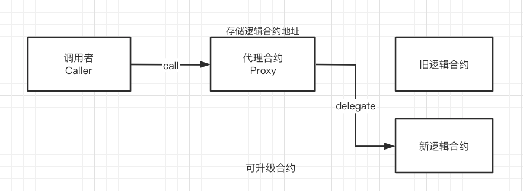
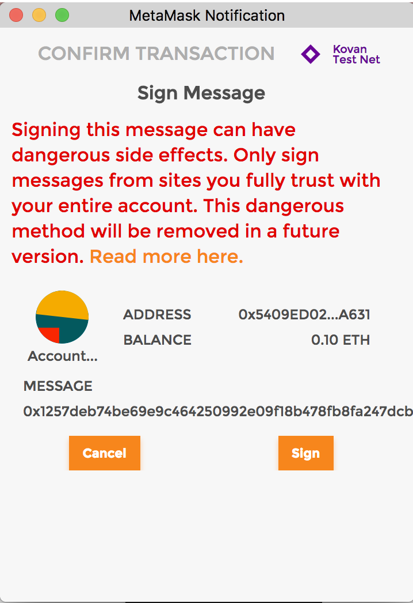
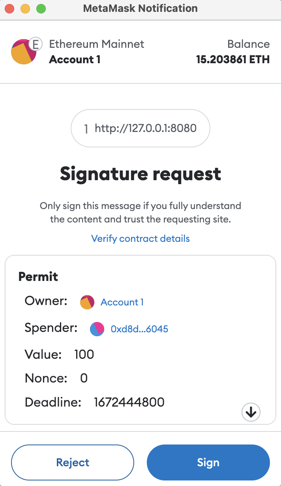
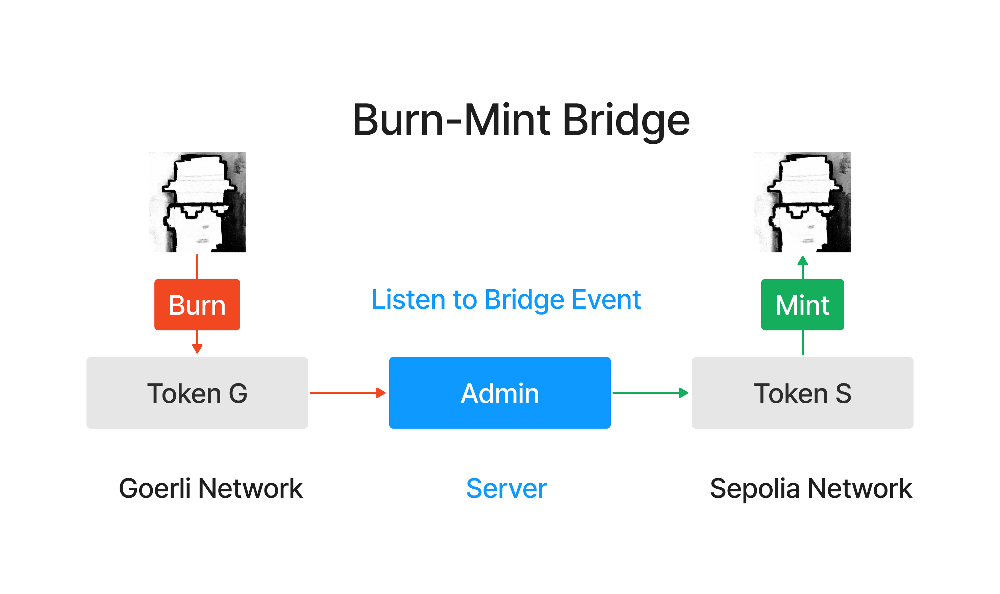

# solidity 应用

## 1. ERC20

`ERC20`是以太坊上的代币标准，来自2015年11月V神参与的[EIP20](https://eips.ethereum.org/EIPS/eip-20)。它实现了代币转账的基本逻辑：

- 账户余额（`balanceOf()`）
- 转账（`transfer()`）
- 授权转账（`transferFrom()`）
- 授权（`approve()`）
- 代币总供给（`totalSupply()`）
- 授权转账额度（`allowance()`）
- 代币信息（可选）：名称（`name()`），代号（`symbol()`），小数位数（`decimals()`）

### 1.1 IERC20

`IERC20`是`ERC20`代币标准的接口合约，规定了`ERC20`代币需要实现的函数和事件。之所以需要定义接口，是因为有了规范后，就存在所有的`ERC20`代币都通用的函数名称，输入参数，输出参数。在接口函数中，只需要定义函数名称，输入参数，输出参数，并不关心函数内部如何实现。因此，函数就分位内部和外部两个内容，一个重点是实现，另一个是对外接口，约定共同数据。这就是为什么需要`ERC20.sol`和`IERC20.sol`两个文件实现一个合约。

### 1.2 事件

`IERC20`定义了2个事件：`Transfer`事件和`Approval`事件，分别在转账和授权时被释放

```js
/**
 * @dev 释放条件：当 `value` 单位的货币从账户 (`from`) 转账到另一账户 (`to`)时.
 */
event Transfer(address indexed from, address indexed to, uint256 value);

/**
 * @dev 释放条件：当 `value` 单位的货币从账户 (`owner`) 授权给另一账户 (`spender`)时.
 */
event Approval(address indexed owner, address indexed spender, uint256 value);
```

### 1.3 函数

`IERC20`定义了6个函数，提供了转移代币的基本功能，并允许代币获得批准，以便其他链上第三方使用。

- `totalSupply()`返回代币总供给

```js
/**
 * @dev 返回代币总供给.
 */
function totalSupply() external view returns (uint256);
```

- `balanceOf()`返回账户余额

```js
/**
 * @dev 返回账户`account`所持有的代币数.
 */
function balanceOf(address account) external view returns (uint256);
```

- `transfer()`转账

```js
/**
 * @dev 转账 `amount` 单位代币，从调用者账户到另一账户 `to`.
 *
 * 如果成功，返回 `true`.
 *
 * 释放 {Transfer} 事件.
 */
function transfer(address to, uint256 amount) external returns (bool);
```

- `allowance()`返回授权额度

```js
/**
 * @dev 返回`owner`账户授权给`spender`账户的额度，默认为0。
 *
 * 当{approve} 或 {transferFrom} 被调用时，`allowance`会改变.
 */
function allowance(address owner, address spender) external view returns (uint256);
```

- `approve()`授权

```js
/**
 * @dev 调用者账户给`spender`账户授权 `amount`数量代币。
 *
 * 如果成功，返回 `true`.
 *
 * 释放 {Approval} 事件.
 */
function approve(address spender, uint256 amount) external returns (bool);
```

- `transferFrom()`授权转账

```js
/**
 * @dev 通过授权机制，从`from`账户向`to`账户转账`amount`数量代币。转账的部分会从调用者的`allowance`中扣除。
 *
 * 如果成功，返回 `true`.
 *
 * 释放 {Transfer} 事件.
 */
function transferFrom(
    address from,
    address to,
    uint256 amount
) external returns (bool);
```

### 1.4 实现ERC20

#### 1.4.1 状态变量

我们需要状态变量来记录账户余额，授权额度和代币信息。其中`balanceOf`, `allowance`和`totalSupply`为`public`类型，会自动生成一个同名`getter`函数，实现`IERC20`规定的`balanceOf()`, `allowance()`和`totalSupply()`。而`name`, `symbol`, `decimals`则对应代币的名称，代号和小数位数。

**注意**：用`override`修饰`public`变量，会重写继承自父合约的与变量同名的`getter`函数，比如`IERC20`中的`balanceOf()`函数。

```js
mapping(address => uint256) public override balanceOf;

mapping(address => mapping(address => uint256)) public override allowance;

uint256 public override totalSupply;   // 代币总供给

string public name;   // 名称
string public symbol;  // 代号

uint8 public decimals = 18; // 小数位数
```

#### 1.4.2 函数

- 构造函数：初始化代币名称、代号

```js
constructor(string memory name_, string memory symbol_){
    name = name_;
    symbol = symbol_;
}
```

- `transfer()`函数：实现`IERC20`中的`transfer`函数，代币转账逻辑。调用方扣除`amount`数量代币，接收方增加相应代币。土狗币会魔改这个函数，加入税收、分红、抽奖等逻辑。

```js
function transfer(address recipient, uint amount) public override returns (bool) {
    balanceOf[msg.sender] -= amount;
    balanceOf[recipient] += amount;
    emit Transfer(msg.sender, recipient, amount);
    return true;
}
```

- `approve()`函数：实现`IERC20`中的`approve`函数，代币授权逻辑。被授权方`spender`可以支配授权方的`amount`数量的代币。`spender`可以是`EOA`账户，也可以是合约账户：当你用uniswap交易代币时，你需要将代币授权给uniswap合约。

```js
function approve(address spender, uint amount) public override returns (bool) {
    allowance[msg.sender][spender] = amount;
    emit Approval(msg.sender, spender, amount);
    return true;
}
```

- `transferFrom()`函数：实现`IERC20`中的`transferFrom`函数，授权转账逻辑。被授权方将授权方`sender`的`amount`数量的代币转账给接收方`recipient`。

```js
function transferFrom(
    address sender,
    address recipient,
    uint amount
) public override returns (bool) {
    allowance[sender][msg.sender] -= amount;
    balanceOf[sender] -= amount;
    balanceOf[recipient] += amount;
    emit Transfer(sender, recipient, amount);
    return true;
}
```

- `mint()`函数：铸造代币函数，不在`IERC20`标准中。这里为了教程方便，任何人可以铸造任意数量的代币，实际应用中会加入权限管理，只有`owner`可以铸造代币：

```js
function mint(uint amount) external {
    balanceOf[msg.sender] += amount;
    totalSupply += amount;
    emit Transfer(address(0), msg.sender, amount);
}
```

- `burn()`函数：销毁代币函数，不在`IERC20`标准中。

```js
function burn(uint amount) external {
    balanceOf[msg.sender] -= amount;
    totalSupply -= amount;
    emit Transfer(msg.sender, address(0), amount);
}
```

## 2. 代币水龙头

代币水龙头是让用户免费领取代币的应用。

最早的代币水龙头是比特币（BTC）水龙头：在2010年，BTC的价格只有不到$0.1，并且持有人很少。为了扩大影响力，比特币社区的Gavin Andresen开发了BTC水龙头，让别人可以免费领BTC。撸羊毛大家都喜欢，当时就有很多人去撸，一部分变为了BTC的信徒。BTC水龙头一共送出了超过19,700枚BTC，现在价值约6亿美元！

### 2.1 ERC20水龙头合约

这里，我们实现一个简版的ERC20水龙头，逻辑非常简单：我们将一些ERC20代币转到水龙头合约里，用户可以通过合约的`requestToken()`函数来领取100单位的代币，每个地址只能领一次。

#### 2.1.1 状态变量

在水龙头合约中定义了3个状态变量

- `amountAllowed`设定每次能领取代币数量（默认为100，不是一百枚，因为代币有小数位数）
- `tokenContract`记录发放的ERC20代币合约地址
- `requestedAddress`记录领取过代币的地址

```js
uint256 public amountAllowed = 100; // 每次领 100 单位代币
address public tokenContract;   // token合约地址
mapping(address => bool) public requestedAddress;   // 记录领取过代币的地址
```

#### 2.1.2 事件

水龙头合约中定义了1个`SendToken`事件，记录了每次领取代币的地址和数量，在`requestTokens()`函数被调用时释放。

```js
// SendToken事件    
event SendToken(address indexed Receiver, uint256 indexed Amount); 
```

#### 2.1.3 函数

合约中只有两个函数：

- 构造函数：初始化`tokenContract`状态变量，确定发放的ERC20代币地址

```js
// 部署时设定ERC20代币合约
constructor(address _tokenContract) {
  tokenContract = _tokenContract; // set token contract
}
```

- `requestTokens()`函数，用户调用它可以领取代币

```js
// 用户领取代币函数
function requestTokens() external {
    require(!requestedAddress[msg.sender], "Can't Request Multiple Times!"); // 每个地址只能领一次
    IERC20 token = IERC20(tokenContract); // 创建IERC20合约对象
    require(token.balanceOf(address(this)) >= amountAllowed, "Faucet Empty!"); // 水龙头空了

    token.transfer(msg.sender, amountAllowed); // 发送token
    requestedAddress[msg.sender] = true; // 记录领取地址 
    
    emit SendToken(msg.sender, amountAllowed); // 释放SendToken事件
}
```

## 3. 空投合约

空投（Airdrop）是币圈中一种营销策略，项目方将代币免费发放给特定用户群体。为了拿到空投资格，用户通常需要完成一些简单的任务，如测试产品、分享新闻、介绍朋友等。项目方通过空投可以获得种子用户，而用户可以获得一笔财富，两全其美。

因为每次接收空投的用户很多，项目方不可能一笔一笔的转账。利用智能合约批量发放ERC20代币，可以显著提高空投效率。

### 3.1 空投代币合约

`Airdrop`空投合约逻辑非常简单：利用循环，一笔交易将ERC20代币发送给多个地址。合约中包含两个函数：

- `getSum()`函数：返回uint数组的和

```js
// 数组求和函数
function getSum(uint256[] calldata _arr) public pure returns(uint sum){
    for(uint i = 0; i < _arr.length; i++)
        sum = sum + _arr[i];
}
```

- `multiTransferToken()`函数：用于发送ERC20代币空投，包含3个参数：
  - `_token`：代币合约地址（`address`类型）
  - `_addresses`：接收空投的用户地址数组（`address[]`类型）
  - `_amounts`：空投数量数组，对应`_addresses`里每个地址的数量（`uint[]`类型）

该函数有两个检查：第一个`require`检查了`_addresses`和`_amounts`两个数组长度是否相等；第二个`require`检查了空投合约的授权额度大于要空投的代币数量总和。

```js
/// @notice 向多个地址转账ERC20代币，使用前需要先授权
///
/// @param _token 转账的ERC20代币地址
/// @param _addresses 空投地址数组
/// @param _amounts 代币数量数组（每个地址的空投数量）
function multiTransferToken(
    address _token,
    address[] calldata _addresses,
    uint256[] calldata _amounts
    ) external {
    // 检查：_addresses和_amounts数组的长度相等
    require(_addresses.length == _amounts.length, "Lengths of Addresses and Amounts NOT EQUAL");
    IERC20 token = IERC20(_token); // 声明IERC合约变量
    uint _amountSum = getSum(_amounts); // 计算空投代币总量
    // 检查：授权代币数量 >= 空投代币总量
    require(token.allowance(msg.sender, address(this)) >= _amountSum, "Need Approve ERC20 token");

    // for循环，利用transferFrom函数发送空投
    for (uint8 i; i < _addresses.length; i++) {
        token.transferFrom(msg.sender, _addresses[i], _amounts[i]);
    }
}
```

- `multiTransferETH()`函数：发送ETH空投，包含2个参数
  - `_addresses`：接收空投的用户地址数组（`address[]`类型）
  - `_amounts`：空投数量数组，对应`_addresses`里每个地址的数量（`uint[]`类型）

```js
/// 向多个地址转账ETH
function multiTransferETH(
    address payable[] calldata _addresses,
    uint256[] calldata _amounts
) public payable {
    // 检查：_addresses和_amounts数组的长度相等
    require(_addresses.length == _amounts.length, "Lengths of Addresses and Amounts NOT EQUAL");
    uint _amountSum = getSum(_amounts); // 计算空投ETH总量
    // 检查转入ETH等于空投总量
    require(msg.value == _amountSum, "Transfer amount error");
    // for循环，利用transfer函数发送ETH
    for (uint256 i = 0; i < _addresses.length; i++) {
        // 注释代码有Dos攻击风险, 并且transfer 也是不推荐写法
        // Dos攻击 具体参考 https://github.com/AmazingAng/WTF-Solidity/blob/main/S09_DoS/readme.md
        // _addresses[i].transfer(_amounts[i]);
        (bool success, ) = _addresses[i].call{value: _amounts[i]}("");
        if (!success) {
            failTransferList[_addresses[i]] = _amounts[i];
        }
    }
}
```

## 4. ERC721

BTC和ETH这类代币都属于同质化代币，矿工挖出的第1枚BTC与第10000枚BTC并没有不同，是等价的。但世界中很多物品是不同质的，其中包括房产、古董、虚拟艺术品等等，这类物品无法用同质化代币抽象。因此，以太坊[EIP721](https://eips.ethereum.org/EIPS/eip-721)提出了ERC721标准，来抽象非同质化的物品。

### 4.0 EIP与ERC

这里有一个点需要理解，本节标题是`ERC721`，这里又提到了`EIP721`,这两个是什么关系呢？

`EIP`全称`Ethereum Improvement Proposals`(以太坊改进建议), 是以太坊开发者社区提出的改进建议, 是一系列以编号排定的文件, 类似互联网上`IETF`的`RFC`。

`EIP`可以是Ethereum生态中任意领域的改进, 比如新特性、ERC、协议改进、编程工具等等。

`ERC`全称`Ethereum Request For Comment`(以太坊意见征求稿), 用以记录以太坊上应用级的各种开发标准和协议。如典型的Token标准(`ERC20`, `ERC721`)、名字注册(`ERC26`, `ERC13`), URI范式(`ERC67`), Library/Package格式(`EIP82`), 钱包格式(`EIP75`,`EIP85`)。

`ERC`协议标准是影响以太坊发展的重要因素, 像`ERC20`, `ERC223`, `ERC721`, `ERC777`等, 都是对以太坊生态产生了很大影响。

所以最终结论：`EIP`包含`ERC`。

### 4.1 ERC165

通过[ERC165标准](https://eips.ethereum.org/EIPS/eip-165)，智能合约可以声明它支持的接口，供其他合约检查。简单的说，`ERC165`就是检查一个智能合约是不是支持了`ERC721`，`ERC1155`的接口。

`IERC165`接口合约只声明了一个`supportsInterface`函数，输入要查询的interfaceId接口id，若合约实现了该接口id，则返回`true`：

```js
interface IERC165 {
    /**
     * @dev 如果合约实现了查询的`interfaceId`，则返回true
     * 规则详见：https://eips.ethereum.org/EIPS/eip-165#how-interfaces-are-identified[EIP section]
     *
     */
    function supportsInterface(bytes4 interfaceId) external view returns (bool);
}
```

我们可以看下`ERC721`是如何实现`supportsInterface()`函数的：

```js
    function supportsInterface(bytes4 interfaceId) external pure override returns (bool)
    {
        return
            interfaceId == type(IERC721).interfaceId ||
            interfaceId == type(IERC165).interfaceId;
    }
```

当查询的是`IERC721`或`IERC165`的接口id时，返回`true`；反之返回`false`。

### 4.2 IERC721

`IERC721`是`ERC721`标准的接口合约，规定了`ERC721`要实现的基本函数。它利用`tokenId`来表示特定的非同质化代币，授权或转账都要明确`tokenId`；而`ERC20`只需要明确转账的数额即可。

#### 4.2.1 IERC接口

```js
/**
 * @dev ERC721标准接口.
 */
interface IERC721 is IERC165 {
    event Transfer(address indexed from, address indexed to, uint256 indexed tokenId);
    event Approval(address indexed owner, address indexed approved, uint256 indexed tokenId);
    event ApprovalForAll(address indexed owner, address indexed operator, bool approved);

    function balanceOf(address owner) external view returns (uint256 balance);

    function ownerOf(uint256 tokenId) external view returns (address owner);

    function safeTransferFrom(
        address from,
        address to,
        uint256 tokenId,
        bytes calldata data
    ) external;

    function safeTransferFrom(
        address from,
        address to,
        uint256 tokenId
    ) external;

    function transferFrom(
        address from,
        address to,
        uint256 tokenId
    ) external;

    function approve(address to, uint256 tokenId) external;

    function setApprovalForAll(address operator, bool _approved) external;

    function getApproved(uint256 tokenId) external view returns (address operator);

    function isApprovedForAll(address owner, address operator) external view returns (bool);
}
```

#### 4.2.2 IERC721事件

`IERC721`包含3个事件，其中`Transfer`和`Approval`事件在`ERC20`中也有。

- `Transfer`事件：在转账时被释放，记录代币的发出地址`from`，接收地址`to`和`tokenid`。
- `Approval`事件：在授权时释放，记录授权地址`owner`，被授权地址`approved`和`tokenid`。
- `ApprovalForAll`事件：在批量授权时释放，记录批量授权的发出地址`owner`，被授权地址`operator`和授权与否的`approved`。

#### 4.2.3 IERC721函数

- `balanceOf`：返回某地址的NFT持有量balance。
- `ownerOf`：返回某tokenId的主人owner。
- `transferFrom`：普通转账，参数为转出地址from，接收地址to和tokenId。
- `safeTransferFrom`：安全转账（如果接收方是合约地址，会要求实现ERC721Receiver接口）。参数为转出地址from，接收地址to和tokenId。
- `approve`：授权另一个地址使用你的NFT。参数为被授权地址approve和tokenId。
- `getApproved`：查询tokenId被批准给了哪个地址。
- `setApprovalForAll`：将自己持有的该系列NFT批量授权给某个地址operator。
- `isApprovedForAll`：查询某地址的NFT是否批量授权给了另一个operator地址。
- `safeTransferFrom`：安全转账的重载函数，参数里面包含了data。

#### 4.2.4 IERC721Receiver

如果一个合约没有实现`ERC721`的相关函数，转入的NFT就进了黑洞，永远转不出来了。为了防止误转账，`ERC721`实现了`safeTransferFrom()`安全转账函数，目标合约必须实现了`IERC721Receiver`接口才能接收`ERC721`代币，不然会`revert`。`IERC721Receiver`接口只包含一个`onERC721Received()`函数。

```js
// ERC721接收者接口：合约必须实现这个接口来通过安全转账接收ERC721
interface IERC721Receiver {
    function onERC721Received(
        address operator,
        address from,
        uint tokenId,
        bytes calldata data
    ) external returns (bytes4);
}
```

我们看下`ERC721`利用`_checkOnERC721Received`来确保目标合约实现了`onERC721Received()`函数（返回`onERC721Received`的`selector`）：

```js
function _checkOnERC721Received(
    address operator,
    address from,
    address to,
    uint256 tokenId,
    bytes memory data
) internal {
    if (to.code.length > 0) {
        try IERC721Receiver(to).onERC721Received(operator, from, tokenId, data) returns (bytes4 retval) {
            if (retval != IERC721Receiver.onERC721Received.selector) {
                // Token rejected
                revert IERC721Errors.ERC721InvalidReceiver(to);
            }
        } catch (bytes memory reason) {
            if (reason.length == 0) {
                // non-IERC721Receiver implementer
                revert IERC721Errors.ERC721InvalidReceiver(to);
            } else {
                /// @solidity memory-safe-assembly
                assembly {
                    revert(add(32, reason), mload(reason))
                }
            }
        }
    }
}
```

#### 4.2.5 IERC721Metadata

`IERC721Metadata`是`ERC721`的拓展接口，实现了3个查询metadata元数据的常用函数：

- `name()`：返回代币名称。
- `symbol()`：返回代币代号。
- `tokenURI()`：通过tokenId查询metadata的链接url，ERC721特有的函数。

```js
interface IERC721Metadata is IERC721 {
    function name() external view returns (string memory);

    function symbol() external view returns (string memory);

    function tokenURI(uint256 tokenId) external view returns (string memory);
}
```

### 4.3 ERC721主合约

`ERC721`主合约实现了`IERC721`，`IERC165`和`IERC721Metadata`定义的所有功能，包含4个状态变量和17个函数。实现都比较简单，每个函数的功能见代码注释：

```js
// SPDX-License-Identifier: MIT
// by 0xAA
pragma solidity ^0.8.21;

import "./IERC165.sol";
import "./IERC721.sol";
import "./IERC721Receiver.sol";
import "./IERC721Metadata.sol";
import "./String.sol";

contract ERC721 is IERC721, IERC721Metadata{
    using Strings for uint256; // 使用String库，

    // Token名称
    string public override name;
    // Token代号
    string public override symbol;
    // tokenId 到 owner address 的持有人映射
    mapping(uint => address) private _owners;
    // address 到 持仓数量 的持仓量映射
    mapping(address => uint) private _balances;
    // tokenID 到 授权地址 的授权映射
    mapping(uint => address) private _tokenApprovals;
    //  owner地址。到operator地址 的批量授权映射
    mapping(address => mapping(address => bool)) private _operatorApprovals;

    // 错误 无效的接收者
    error ERC721InvalidReceiver(address receiver);

    /**
     * 构造函数，初始化`name` 和`symbol` .
     */
    constructor(string memory name_, string memory symbol_) {
        name = name_;
        symbol = symbol_;
    }

    // 实现IERC165接口supportsInterface
    function supportsInterface(bytes4 interfaceId)
        external
        pure
        override
        returns (bool)
    {
        return
            interfaceId == type(IERC721).interfaceId ||
            interfaceId == type(IERC165).interfaceId ||
            interfaceId == type(IERC721Metadata).interfaceId;
    }

    // 实现IERC721的balanceOf，利用_balances变量查询owner地址的balance。
    function balanceOf(address owner) external view override returns (uint) {
        require(owner != address(0), "owner = zero address");
        return _balances[owner];
    }

    // 实现IERC721的ownerOf，利用_owners变量查询tokenId的owner。
    function ownerOf(uint tokenId) public view override returns (address owner) {
        owner = _owners[tokenId];
        require(owner != address(0), "token doesn't exist");
    }

    // 实现IERC721的isApprovedForAll，利用_operatorApprovals变量查询owner地址是否将所持NFT批量授权给了operator地址。
    function isApprovedForAll(address owner, address operator)
        external
        view
        override
        returns (bool)
    {
        return _operatorApprovals[owner][operator];
    }

    // 实现IERC721的setApprovalForAll，将持有代币全部授权给operator地址。调用_setApprovalForAll函数。
    function setApprovalForAll(address operator, bool approved) external override {
        _operatorApprovals[msg.sender][operator] = approved;
        emit ApprovalForAll(msg.sender, operator, approved);
    }

    // 实现IERC721的getApproved，利用_tokenApprovals变量查询tokenId的授权地址。
    function getApproved(uint tokenId) external view override returns (address) {
        require(_owners[tokenId] != address(0), "token doesn't exist");
        return _tokenApprovals[tokenId];
    }
     
    // 授权函数。通过调整_tokenApprovals来，授权 to 地址操作 tokenId，同时释放Approval事件。
    function _approve(
        address owner,
        address to,
        uint tokenId
    ) private {
        _tokenApprovals[tokenId] = to;
        emit Approval(owner, to, tokenId);
    }

    // 实现IERC721的approve，将tokenId授权给 to 地址。条件：to不是owner，且msg.sender是owner或授权地址。调用_approve函数。
    function approve(address to, uint tokenId) external override {
        address owner = _owners[tokenId];
        require(
            msg.sender == owner || _operatorApprovals[owner][msg.sender],
            "not owner nor approved for all"
        );
        _approve(owner, to, tokenId);
    }

    // 查询 spender地址是否可以使用tokenId（需要是owner或被授权地址）
    function _isApprovedOrOwner(
        address owner,
        address spender,
        uint tokenId
    ) private view returns (bool) {
        return (spender == owner ||
            _tokenApprovals[tokenId] == spender ||
            _operatorApprovals[owner][spender]);
    }

    /*
     * 转账函数。通过调整_balances和_owner变量将 tokenId 从 from 转账给 to，同时释放Transfer事件。
     * 条件:
     * 1. tokenId 被 from 拥有
     * 2. to 不是0地址
     */
    function _transfer(
        address owner,
        address from,
        address to,
        uint tokenId
    ) private {
        require(from == owner, "not owner");
        require(to != address(0), "transfer to the zero address");

        _approve(owner, address(0), tokenId);

        _balances[from] -= 1;
        _balances[to] += 1;
        _owners[tokenId] = to;

        emit Transfer(from, to, tokenId);
    }
    
    // 实现IERC721的transferFrom，非安全转账，不建议使用。调用_transfer函数
    function transferFrom(
        address from,
        address to,
        uint tokenId
    ) external override {
        address owner = ownerOf(tokenId);
        require(
            _isApprovedOrOwner(owner, msg.sender, tokenId),
            "not owner nor approved"
        );
        _transfer(owner, from, to, tokenId);
    }

    /**
     * 安全转账，安全地将 tokenId 代币从 from 转移到 to，会检查合约接收者是否了解 ERC721 协议，以防止代币被永久锁定。调用了_transfer函数和_checkOnERC721Received函数。条件：
     * from 不能是0地址.
     * to 不能是0地址.
     * tokenId 代币必须存在，并且被 from拥有.
     * 如果 to 是智能合约, 他必须支持 IERC721Receiver-onERC721Received.
     */
    function _safeTransfer(
        address owner,
        address from,
        address to,
        uint tokenId,
        bytes memory _data
    ) private {
        _transfer(owner, from, to, tokenId);
        _checkOnERC721Received(from, to, tokenId, _data);
    }

    /**
     * 实现IERC721的safeTransferFrom，安全转账，调用了_safeTransfer函数。
     */
    function safeTransferFrom(
        address from,
        address to,
        uint tokenId,
        bytes memory _data
    ) public override {
        address owner = ownerOf(tokenId);
        require(
            _isApprovedOrOwner(owner, msg.sender, tokenId),
            "not owner nor approved"
        );
        _safeTransfer(owner, from, to, tokenId, _data);
    }

    // safeTransferFrom重载函数
    function safeTransferFrom(
        address from,
        address to,
        uint tokenId
    ) external override {
        safeTransferFrom(from, to, tokenId, "");
    }

    /** 
     * 铸造函数。通过调整_balances和_owners变量来铸造tokenId并转账给 to，同时释放Transfer事件。铸造函数。通过调整_balances和_owners变量来铸造tokenId并转账给 to，同时释放Transfer事件。
     * 这个mint函数所有人都能调用，实际使用需要开发人员重写，加上一些条件。
     * 条件:
     * 1. tokenId尚不存在。
     * 2. to不是0地址.
     */
    function _mint(address to, uint tokenId) internal virtual {
        require(to != address(0), "mint to zero address");
        require(_owners[tokenId] == address(0), "token already minted");

        _balances[to] += 1;
        _owners[tokenId] = to;

        emit Transfer(address(0), to, tokenId);
    }

    // 销毁函数，通过调整_balances和_owners变量来销毁tokenId，同时释放Transfer事件。条件：tokenId存在。
    function _burn(uint tokenId) internal virtual {
        address owner = ownerOf(tokenId);
        require(msg.sender == owner, "not owner of token");

        _approve(owner, address(0), tokenId);

        _balances[owner] -= 1;
        delete _owners[tokenId];

        emit Transfer(owner, address(0), tokenId);
    }

    // _checkOnERC721Received：函数，用于在 to 为合约的时候调用IERC721Receiver-onERC721Received, 以防 tokenId 被不小心转入黑洞。
    function _checkOnERC721Received(address from, address to, uint256 tokenId, bytes memory data) private {
        if (to.code.length > 0) {
            try IERC721Receiver(to).onERC721Received(msg.sender, from, tokenId, data) returns (bytes4 retval) {
                if (retval != IERC721Receiver.onERC721Received.selector) {
                    revert ERC721InvalidReceiver(to);
                }
            } catch (bytes memory reason) {
                if (reason.length == 0) {
                    revert ERC721InvalidReceiver(to);
                } else {
                    /// @solidity memory-safe-assembly
                    assembly {
                        revert(add(32, reason), mload(reason))
                    }
                }
            }
        }
    }

    /**
     * 实现IERC721Metadata的tokenURI函数，查询metadata。
     */
    function tokenURI(uint256 tokenId) public view virtual override returns (string memory) {
        require(_owners[tokenId] != address(0), "Token Not Exist");

        string memory baseURI = _baseURI();
        return bytes(baseURI).length > 0 ? string(abi.encodePacked(baseURI, tokenId.toString())) : "";
    }

    /**
     * 计算{tokenURI}的BaseURI，tokenURI就是把baseURI和tokenId拼接在一起，需要开发重写。
     * BAYC的baseURI为ipfs://QmeSjSinHpPnmXmspMjwiXyN6zS4E9zccariGR3jxcaWtq/ 
     */
    function _baseURI() internal view virtual returns (string memory) {
        return "";
    }
}

```

### 4.4 ERC165与ERC721详解

上面说到,为了防止NFT被转到一个没有能力操作NFT的合约中去,目标必须正确实现`ERC721TokenReceiver`接口：

```js
interface ERC721TokenReceiver {
    function onERC721Received(address _operator, address _from, uint256 _tokenId, bytes _data) external returns(bytes4);
}
```

拓展到编程语言的世界中去，无论是Java的interface，还是Rust的Trait(当然solidity中和trait更像的是library)，只要是和接口沾边的，都在透露着一种这样的意味：接口是某些行为的集合(在solidity中更甚，接口完全等价于函数选择器的集合)，某个类型只要实现了某个接口，就表明该类型拥有这样的一种功能。因此，只要某个contract类型实现了上述的`ERC721TokenReceiver`接口(更具体而言就是实现了`onERC721Received`这个函数),该contract类型就对外表明了自己拥有管理NFT的能力。当然操作NFT的逻辑被实现在该合约其他的函数中。 ERC721标准在执行`safeTransferFrom`的时候会检查目标合约是否实现了`onERC721Received`函数,这是一种利用ERC165思想进行的操作。

**那究竟什么是ERC165呢?**

ERC165是一种对外表明自己实现了哪些接口的技术标准。就像上面所说的，实现了一个接口就表明合约拥有种特殊能力。有一些合约与其他合约交互时，期望目标合约拥有某些功能，那么合约之间就能够通过ERC165标准对对方进行查询以检查对方是否拥有相应的能力。

以ERC721合约为例，当外部对某个合约进行检查其是否是ERC721时，[怎么做？](https://eips.ethereum.org/EIPS/eip-165#how-to-detect-if-a-contract-implements-erc-165) 。按照这个说法，检查步骤应该是首先检查该合约是否实现了ERC165, 再检查该合约实现的其他特定接口。此时该特定接口是IERC721. IERC721的是ERC721的基本接口(为什么说基本，是因为还有其他的诸如`ERC721Metadata`, `ERC721Enumerable`这样的拓展)：

```js
/// 注意这个**0x80ac58cd**
///  **⚠⚠⚠ Note: the ERC-165 identifier for this interface is 0x80ac58cd. ⚠⚠⚠**
interface ERC721 /* is ERC165 */ {
    event Transfer(address indexed _from, address indexed _to, uint256 indexed _tokenId);

    event Approval(address indexed _owner, address indexed _approved, uint256 indexed _tokenId);

    event ApprovalForAll(address indexed _owner, address indexed _operator, bool _approved);

    function balanceOf(address _owner) external view returns (uint256);

    function ownerOf(uint256 _tokenId) external view returns (address);

    function safeTransferFrom(address _from, address _to, uint256 _tokenId, bytes data) external payable;

    function safeTransferFrom(address _from, address _to, uint256 _tokenId) external payable;

    function transferFrom(address _from, address _to, uint256 _tokenId) external payable;

    function approve(address _approved, uint256 _tokenId) external payable;

    function setApprovalForAll(address _operator, bool _approved) external;

    function getApproved(uint256 _tokenId) external view returns (address);

    function isApprovedForAll(address _owner, address _operator) external view returns (bool);
}
```

**0x80ac58cd**= `bytes4(keccak256(ERC721.Transfer.selector) ^ keccak256(ERC721.Approval.selector) ^ ··· ^keccak256(ERC721.isApprovedForAll.selector))`，这是ERC165规定的计算方式。

那么，类似的，能够计算出ERC165本身的接口(它的接口里只有一个`function supportsInterface(bytes4 interfaceID) external view returns (bool);`函数，对其进行`bytes4(keccak256(supportsInterface.selector))`得到**0x01ffc9a7**。此外，ERC721还定义了一些拓展接口，比如`ERC721Metadata`，长这样：

```js
///  Note: the ERC-165 identifier for this interface is 0x5b5e139f.
interface ERC721Metadata /* is ERC721 */ {
    function name() external view returns (string _name);
    function symbol() external view returns (string _symbol);
    function tokenURI(uint256 _tokenId) external view returns (string); // 这个很重要，前端展示的小图片的链接都是这个函数返回的
}
```

这个**0x5b5e139f**的计算就是:

```js
IERC721Metadata.name.selector ^ IERC721Metadata.symbol.selector ^ IERC721Metadata.tokenURI.selector
```

solamte实现的ERC721.sol是怎么完成这些ERC165要求的特性的呢？

```js
function supportsInterface(bytes4 interfaceId) public view virtual returns (bool) {
        return
            interfaceId == 0x01ffc9a7 || // ERC165 Interface ID for ERC165
            interfaceId == 0x80ac58cd || // ERC165 Interface ID for ERC721
            interfaceId == 0x5b5e139f; // ERC165 Interface ID for ERC721Metadata
}
```

没错就这么简单。当外界按照[link1](https://eips.ethereum.org/EIPS/eip-165#how-to-detect-if-a-contract-implements-erc-165)的步骤去做检查的时候，如果外界想检查这个合约是否实现了165,好说，就是`supportsInterface`函数在入参是**0x01ffc9a7**时必须返回true，在入参是0xffffffff时，返回值必须是false。上述实现完美达成要求。

当外界想检查这个合约是否是ERC721的时候，好说，入参是0x80ac58cd的时候表明外界想做这个检查。返回true。

当外界想检查这个合约是否实现ERC721的拓展ERC721Metadata接口时，入参是0x5b5e139f。好说，返回了true。

并且由于该函数是`virtual`的。因此该合约的使用者可以继承该合约，然后继续实现ERC721Enumerable接口。实现完里面的什么`totalSupply`之类的函数之后，把继承的`supportsInterface`重实现为

```js
function supportsInterface(bytes4 interfaceId) public view virtual returns (bool) {
        return
            interfaceId == 0x01ffc9a7 || // ERC165 Interface ID for ERC165
            interfaceId == 0x80ac58cd || // ERC165 Interface ID for ERC721
            interfaceId == 0x5b5e139f || // ERC165 Interface ID for ERC721Metadata
            interfaceId == 0x780e9d63;   // ERC165 Interface ID for ERC721Enumerable
}
```

**优雅，简洁，可拓展性拉满。**

ERC721标准仍在不断发展中，目前比较流行的版本为ERC721Enumerable（提高NFT可访问性）和ERC721A（节约铸造gas）。

## 5. 荷兰拍卖

荷兰拍卖（Dutch Auction）是一种特殊的拍卖形式。 亦称“减价拍卖”，它是指拍卖标的的竞价由高到低依次递减直到第一个竞买人应价（达到或超过底价）时击槌成交的一种拍卖。

在币圈，很多NFT通过荷兰拍卖发售，其中包括Azuki和World of Women，其中Azuki通过荷兰拍卖筹集了超过8000枚ETH。

项目方非常喜欢这种拍卖形式，主要有两个原因

1. 荷兰拍卖的价格由最高慢慢下降，能让项目方获得最大的收入。
2. 拍卖持续较长时间（通常6小时以上），可以避免gas war。

### 5.1 `DutchAuction`合约

代码基于`Azuki`的[代码](https://etherscan.io/address/0xed5af388653567af2f388e6224dc7c4b3241c544#code)简化而成。`DucthAuction`合约继承了之前介绍的`ERC721`和`Ownable`合约：

```js
// SPDX-License-Identifier: MIT
pragma solidity ^0.8.21;

import "@openzeppelin/contracts/access/Ownable.sol";
import "https://github.com/AmazingAng/WTF-Solidity/blob/main/34_ERC721/ERC721.sol";

contract DutchAuction is Ownable, ERC721 {
```

#### 5.1.1 `DutchAuction`状态变量

合约中一共有9个状态变量，其中有6个和拍卖相关，他们是：

- `COLLECTION_SIZE`：NFT总量。
- `AUCTION_START_PRICE`：荷兰拍卖起拍价，也是最高价。
- `AUCTION_END_PRICE`：荷兰拍卖结束价，也是最低价/地板价。
- `AUCTION_TIME`：拍卖持续时长。
- `AUCTION_DROP_INTERVAL`：每过多久时间，价格衰减一次。
- `auctionStartTime`：拍卖起始时间（区块链时间戳，`block.timestamp`）。

```js
uint256 public constant COLLECTOIN_SIZE = 10000; // NFT总数
uint256 public constant AUCTION_START_PRICE = 1 ether; // 起拍价(最高价)
uint256 public constant AUCTION_END_PRICE = 0.1 ether; // 结束价(最低价/地板价)
uint256 public constant AUCTION_TIME = 10 minutes; // 拍卖时间，为了测试方便设为10分钟
uint256 public constant AUCTION_DROP_INTERVAL = 1 minutes; // 每过多久时间，价格衰减一次
uint256 public constant AUCTION_DROP_PER_STEP =
    (AUCTION_START_PRICE - AUCTION_END_PRICE) /
    (AUCTION_TIME / AUCTION_DROP_INTERVAL); // 每次价格衰减步长
    
uint256 public auctionStartTime; // 拍卖开始时间戳
string private _baseTokenURI;   // metadata URI
uint256[] private _allTokens; // 记录所有存在的tokenId 
```

#### 5.1.2 `DutchAuction`函数

荷兰拍卖合约中共有9个函数，与ERC721相关的函数我们这里不再重复介绍，只介绍和拍卖相关的函数。

- 设定拍卖起始时间：我们在构造函数中会声明当前区块时间为起始时间，项目方也可以通过`setAuctionStartTime()`函数来调整：

```js
constructor() ERC721("WTF Dutch Auctoin", "WTF Dutch Auctoin") {
    auctionStartTime = block.timestamp;
}

// auctionStartTime setter函数，onlyOwner
function setAuctionStartTime(uint32 timestamp) external onlyOwner {
    auctionStartTime = timestamp;
}
```

- 获取拍卖实时价格：`getAuctionPrice()`函数通过当前区块时间以及拍卖相关的状态变量来计算实时拍卖价格。

当`block.timestamp`小于起始时间，价格为最高价`AUCTION_START_PRICE`；

当`block.timestamp`大于结束时间，价格为最低价`AUCTION_END_PRICE`；

当`block.timestamp`处于两者之间时，则计算出当前的衰减价格。

```js
// 获取拍卖实时价格
function getAuctionPrice()
    public
    view
    returns (uint256)
{
    if (block.timestamp < auctionStartTime) {
    return AUCTION_START_PRICE;
    }else if (block.timestamp - auctionStartTime >= AUCTION_TIME) {
    return AUCTION_END_PRICE;
    } else {
    uint256 steps = (block.timestamp - auctionStartTime) /
        AUCTION_DROP_INTERVAL;
    return AUCTION_START_PRICE - (steps * AUCTION_DROP_PER_STEP);
    }
}
```

- 用户拍卖并铸造NFT：用户通过调用`auctionMint()`函数，支付ETH参加荷兰拍卖并铸造NFT。

该函数首先检查拍卖是否开始/铸造是否超出NFT总量。接着，合约通过`getAuctionPrice()`和铸造数量计算拍卖成本，并检查用户支付的ETH是否足够：如果足够，则将NFT铸造给用户，并退回超额的ETH；反之，则回退交易。

```js
// 拍卖mint函数
function auctionMint(uint256 quantity) external payable{
    uint256 _saleStartTime = uint256(auctionStartTime); // 建立local变量，减少gas花费
    require(
    _saleStartTime != 0 && block.timestamp >= _saleStartTime,
    "sale has not started yet"
    ); // 检查是否设置起拍时间，拍卖是否开始
    require(
    totalSupply() + quantity <= COLLECTOIN_SIZE,
    "not enough remaining reserved for auction to support desired mint amount"
    ); // 检查是否超过NFT上限

    uint256 totalCost = getAuctionPrice() * quantity; // 计算mint成本
    require(msg.value >= totalCost, "Need to send more ETH."); // 检查用户是否支付足够ETH
    
    // Mint NFT
    for(uint256 i = 0; i < quantity; i++) {
        uint256 mintIndex = totalSupply();
        _mint(msg.sender, mintIndex);
        _addTokenToAllTokensEnumeration(mintIndex);
    }
    // 多余ETH退款
    if (msg.value > totalCost) {
        payable(msg.sender).transfer(msg.value - totalCost); //注意一下这里是否有重入的风险
    }
}
```

- 项目方取出筹集的ETH：项目方可以通过`withdrawMoney()`函数提走拍卖筹集的ETH。

```js
// 提款函数，onlyOwner
function withdrawMoney() external onlyOwner {
    (bool success, ) = msg.sender.call{value: address(this).balance}(""); // call函数的调用方式详见第22讲
    require(success, "Transfer failed.");
}
```

## 6. 默克尔树 Merkle Tree

`Merkle Tree`，也叫默克尔树或哈希树，是区块链的底层加密技术，被比特币和以太坊区块链广泛采用。`Merkle Tree`是一种自下而上构建的加密树，每个叶子是对应数据的哈希，而每个非叶子为它的2个子节点的哈希。


`Merkle Tree`允许对大型数据结构的内容进行有效和安全的验证（`Merkle Proof`）。对于有N个叶子结点的`Merkle Tree`，在已知`root`根值的情况下，验证某个数据是否有效（属于`Merkle Tree`叶子结点）只需要`ceil(log₂N)`个数据（也叫`proof`），非常高效。如果数据有误，或者给的`proof`错误，则无法还原出`root`根植。 下面的例子中，叶子L1的`Merkle proof`为`Hash 0-1`和`Hash 1`：知道这两个值，就能验证L1的值是不是在`Merkle Tree`的叶子中。为什么呢？ 因为通过叶子L1我们就可以算出`Hash 0-0`，我们又知道了`Hash 0-1`，那么`Hash 0-0`和`Hash 0-1`就可以联合算出`Hash 0`，然后我们又知道`Hash 1`，`Hash 0`和`Hash 1`就可以联合算出`Top Hash`，也就是`root`节点的`hash`。


### 生成`Merkle Tree`

我们可以利用[网页](https://lab.miguelmota.com/merkletreejs/example/)或者Javascript库[merkletreejs](https://github.com/miguelmota/merkletreejs)来生成Merkle Tree。

这里我们用网页来生成4个地址作为叶子结点的`Merkle Tree`。叶子结点输入：

```js
[
"0x5B38Da6a701c568545dCfcB03FcB875f56beddC4", 
"0xAb8483F64d9C6d1EcF9b849Ae677dD3315835cb2",
"0x4B20993Bc481177ec7E8f571ceCaE8A9e22C02db",
"0x78731D3Ca6b7E34aC0F824c42a7cC18A495cabaB"
]
```

在菜单里选上`Keccak-256`, `hashLeaves`和`sortPairs`选项，然后点击`Compute`，`Merkle Tree`就生成好了。`Merkle Tree`展开为：

```js
└─ 根: eeefd63003e0e702cb41cd0043015a6e26ddb38073cc6ffeb0ba3e808ba8c097
   ├─ 9d997719c0a5b5f6db9b8ac69a988be57cf324cb9fffd51dc2c37544bb520d65
   │  ├─ 叶子0：5931b4ed56ace4c46b68524cb5bcbf4195f1bbaacbe5228fbd090546c88dd229
   │  └─ 叶子1：999bf57501565dbd2fdcea36efa2b9aef8340a8901e3459f4a4c926275d36cdb
   └─ 4726e4102af77216b09ccd94f40daa10531c87c4d60bba7f3b3faf5ff9f19b3c
      ├─ 叶子2：04a10bfd00977f54cc3450c9b25c9b3a502a089eba0097ba35fc33c4ea5fcb54
      └─ 叶子3：dfbe3e504ac4e35541bebad4d0e7574668e16fefa26cd4172f93e18b59ce9486
```

### `Merkle Proof`验证

通过网站，我们可以得到地址0的`proof`如下，即图2中蓝色结点的哈希值：

```js
[
  "0x999bf57501565dbd2fdcea36efa2b9aef8340a8901e3459f4a4c926275d36cdb",
  "0x4726e4102af77216b09ccd94f40daa10531c87c4d60bba7f3b3faf5ff9f19b3c"
]
```

我们利用`MerkleProof`库来验证：

```js
library MerkleProof {
    /**
     * @dev 当通过`proof`和`leaf`重建出的`root`与给定的`root`相等时，返回`true`，数据有效。
     * 在重建时，叶子节点对和元素对都是排序过的。
     */
    function verify(
        bytes32[] memory proof,
        bytes32 root,
        bytes32 leaf
    ) internal pure returns (bool) {
        return processProof(proof, leaf) == root;
    }

    /**
     * @dev Returns 通过Merkle树用`leaf`和`proof`计算出`root`. 当重建出的`root`和给定的`root`相同时，`proof`才是有效的。
     * 在重建时，叶子节点对和元素对都是排序过的。
     */
    function processProof(bytes32[] memory proof, bytes32 leaf) internal pure returns (bytes32) {
        bytes32 computedHash = leaf;
        for (uint256 i = 0; i < proof.length; i++) {
            computedHash = _hashPair(computedHash, proof[i]);
        }
        return computedHash;
    }

    // Sorted Pair Hash
    function _hashPair(bytes32 a, bytes32 b) private pure returns (bytes32) {
        return a < b ? keccak256(abi.encodePacked(a, b)) : keccak256(abi.encodePacked(b, a));
    }
}
```

`MerkleProof`库有三个函数：

1. `verify()`函数：利用`proof`数来验证`leaf`是否属于根为`root`的`Merkle Tree`中，如果是，则返回`true`。它调用了`processProof()`函数。
2. `processProof()`函数：利用`proof`和`leaf`依次计算出`Merkle Tree`的`root`。它调用了`_hashPair()`函数。
3. `_hashPair()`函数：用`keccak256()`函数计算非根节点对应的两个子节点的哈希（排序后）。

我们将地址0的`Hash`，`root`和对应的`proof`输入到`verify()`函数，将返回`true`。因为地址0的`Hash`在根为`root`的`Merkle Tree`中，且`proof`正确。如果改变了其中任意一个值，都将返回`false`。

### 利用`Merkle Tree`发放NFT白名单

一份拥有800个地址的白名单，更新一次所需的gas fee很容易超过1个ETH。而由于`Merkle Tree`验证时，`leaf`和`proof`可以存在后端，链上仅需存储一个`root`的值，非常节省`gas`，项目方经常用它来发放白名单。很多`ERC721`标准的NFT和`ERC20`标准代币的白名单/空投都是利用`Merkle Tree`发出的，比如`optimism`的空投。

这里，我们介绍如何利用`MerkleTree`合约来发放NFT白名单：

```js
contract MerkleTree is ERC721 {
    bytes32 immutable public root; // Merkle树的根
    mapping(address => bool) public mintedAddress;   // 记录已经mint的地址

    // 构造函数，初始化NFT合集的名称、代号、Merkle树的根
    constructor(string memory name, string memory symbol, bytes32 merkleroot)
    ERC721(name, symbol)
    {
        root = merkleroot;
    }

    // 利用Merkle树验证地址并完成mint
    function mint(address account, uint256 tokenId, bytes32[] calldata proof)
    external
    {
        require(_verify(_leaf(account), proof), "Invalid merkle proof"); // Merkle检验通过
        require(!mintedAddress[account], "Already minted!"); // 地址没有mint过
        _mint(account, tokenId); // mint
        mintedAddress[account] = true; // 记录mint过的地址
    }

    // 计算Merkle树叶子的哈希值
    function _leaf(address account)
    internal pure returns (bytes32)
    {
        return keccak256(abi.encodePacked(account));
    }

    // Merkle树验证，调用MerkleProof库的verify()函数
    function _verify(bytes32 leaf, bytes32[] memory proof)
    internal view returns (bool)
    {
        return MerkleProof.verify(proof, root, leaf);
    }
}
```

`MerkleTree`合约继承了`ERC721`标准，并利用了`MerkleProof`库。

#### 状态变量

合约中共有两个状态变量：

- `root`存储了`Merkle Tree`的根，部署合约的时候赋值。
- `mintedAddress`是一个`mapping`，记录了已经`mint`过的地址，某地址`mint`成功后进行赋值。

#### 函数

合约中共有4个函数：

- 构造函数：初始化NFT的名称和代号，还有`Merkle Tree`的`root`。
- `mint()`函数：利用白名单铸造NFT。参数为白名单地址`account`，铸造的`tokenId`和`proof`。首先验证`address`是否在白名单中，验证通过则把序号为`tokenId`的NFT铸造给该地址，并将它记录到`mintedAddress`。此过程中调用了`_leaf()`和`_verify()`函数。
- `_leaf()`函数：计算了`Merkle Tree`的叶子地址的哈希。
- `_verify()`函数：调用了`MerkleProof`库的`verify()`函数，进行`Merkle Tree`验证。

## 7. 数字签名 Signature

简单介绍以太坊中的数字签名ECDSA，以及如何利用它发放NFT白名单。代码中的ECDSA库由OpenZeppelin的同名库简化而成。

### 数字签名

如果你用过`opensea`交易NFT，对签名就不会陌生。下图是小狐狸（`metamask`）钱包进行签名时弹出的窗口，它可以证明你拥有私钥的同时不需要对外公布私钥。


以太坊使用的数字签名算法叫双椭圆曲线数字签名算法（`ECDSA`），基于双椭圆曲线“私钥-公钥”对的数字签名算法。它主要起到了[三个作用](https://en.wikipedia.org/wiki/Digital_signature)：

1. **身份认证**：证明签名方是私钥的持有人。
2. **不可否认**：发送方不能否认发送过这个消息。
3. **完整性**：通过验证针对传输消息生成的数字签名，可以验证消息是否在传输过程中被篡改。

### `ECDSA`合约

ECDSA标准中包含两个部分：

1. 签名者利用`私钥`（隐私的）对消息（公开的）创建`签名`（公开的）。
2. 其他人使用`消息`（公开的）和`签名`（公开的）恢复签名者的`公钥`（公开的）并验证`签名`。

我们将配合ECDSA库讲解这两个部分。本教程所用的`私钥`，`公钥`，`消息`，`以太坊签名`消息，签名如下所示：

```js
私钥: 0x227dbb8586117d55284e26620bc76534dfbd2394be34cf4a09cb775d593b6f2b
公钥: 0xe16C1623c1AA7D919cd2241d8b36d9E79C1Be2A2
消息: 0x1bf2c0ce4546651a1a2feb457b39d891a6b83931cc2454434f39961345ac378c
以太坊签名消息: 0xb42ca4636f721c7a331923e764587e98ec577cea1a185f60dfcc14dbb9bd900b
签名: 0x390d704d7ab732ce034203599ee93dd5d3cb0d4d1d7c600ac11726659489773d559b12d220f99f41d17651b0c1c6a669d346a397f8541760d6b32a5725378b241c
```

#### 创建签名

1. **打包消息**：在以太坊的`ECDSA`标准中，被签名的消息是一组数据的`keccak256`哈希，为`bytes32`类型。我们可以把任何想要签名的内容利用`abi.encodePacked()`函数打包，然后用`keccak256()`计算哈希，作为消息。我们例子中的消息是由一个`address`类型变量和一个`uint256`类型变量得到的：

```js
/*
    * 将mint地址（address类型）和tokenId（uint256类型）拼成消息msgHash
    * _account: 0x5B38Da6a701c568545dCfcB03FcB875f56beddC4
    * _tokenId: 0
    * 对应的消息msgHash: 0x1bf2c0ce4546651a1a2feb457b39d891a6b83931cc2454434f39961345ac378c
    */
function getMessageHash(address _account, uint256 _tokenId) public pure returns(bytes32){
    return keccak256(abi.encodePacked(_account, _tokenId));
}
```

2. **计算以太坊签名消息**： 消息可以是能被执行的交易，也可以是其他任何形式。为了避免用户误签了恶意交易，`EIP191`提倡在消息前加上`"\x19Ethereum Signed Message:\n32"`字符，并再做一次`keccak256`哈希，作为以太坊签名消息。经过`toEthSignedMessageHash()`函数处理后的消息，不能被用于执行交易:

```js
/**
 * @dev 返回 以太坊签名消息
 * `hash`：消息
 * 遵从以太坊签名标准：https://eth.wiki/json-rpc/API#eth_sign[`eth_sign`]
 * 以及`EIP191`:https://eips.ethereum.org/EIPS/eip-191`
 * 添加"\x19Ethereum Signed Message:\n32"字段，防止签名的是可执行交易。
 */
function toEthSignedMessageHash(bytes32 hash) public pure returns (bytes32) {
    // 哈希的长度为32
    return keccak256(abi.encodePacked("\x19Ethereum Signed Message:\n32", hash));
}
```

处理后的消息为：

```js
以太坊签名消息: 0xb42ca4636f721c7a331923e764587e98ec577cea1a185f60dfcc14dbb9bd900b
```

3-1. **利用钱包签名**：日常操作中，大部分用户都是通过这种方式进行签名。在获取到需要签名的消息之后，我们需要使用`metamask`钱包进行签名。`metamask`的`personal_sign`方法会自动把`消息`转换为`以太坊签名消息`，然后发起签名。所以我们只需要输入`消息`和`签名者钱包account`即可。需要注意的是输入的`签名者钱包account`需要和`metamask`当前连接的account一致才能使用。

因此首先把例子中的`私钥`导入到小狐狸钱包，然后打开浏览器的`console`页面：`Chrome菜单-更多工具-开发者工具-Console`。在连接钱包的状态下（如连接opensea，否则会出现错误），依次输入以下指令进行签名：

```js
ethereum.enable()
account = "0xe16C1623c1AA7D919cd2241d8b36d9E79C1Be2A2"
hash = "0x1bf2c0ce4546651a1a2feb457b39d891a6b83931cc2454434f39961345ac378c"
ethereum.request({method: "personal_sign", params: [account, hash]})
```

在返回的结果中（`Promise`的`PromiseResult`）可以看到创建好的签名。不同账户有不同的私钥，创建的签名值也不同。利用教程的私钥创建的签名如下所示：

```js
0x390d704d7ab732ce034203599ee93dd5d3cb0d4d1d7c600ac11726659489773d559b12d220f99f41d17651b0c1c6a669d346a397f8541760d6b32a5725378b241c
```

3-2. **利用web3.py签名**： 批量调用中更倾向于使用代码进行签名，以下是基于web3.py的实现。

```py
from web3 import Web3, HTTPProvider
from eth_account.messages import encode_defunct

private_key = "0x227dbb8586117d55284e26620bc76534dfbd2394be34cf4a09cb775d593b6f2b"
address = "0x5B38Da6a701c568545dCfcB03FcB875f56beddC4"
rpc = 'https://rpc.ankr.com/eth'
w3 = Web3(HTTPProvider(rpc))

#打包信息
msg = Web3.solidity_keccak(['address','uint256'], [address,0])
print(f"消息：{msg.hex()}")
#构造可签名信息
message = encode_defunct(hexstr=msg.hex())
#签名
signed_message = w3.eth.account.sign_message(message, private_key=private_key)
print(f"签名：{signed_message['signature'].hex()}")
```

运行的结果如下所示。计算得到的消息，签名和前面的案例一致。

```js
消息：0x1bf2c0ce4546651a1a2feb457b39d891a6b83931cc2454434f39961345ac378c
签名：0x390d704d7ab732ce034203599ee93dd5d3cb0d4d1d7c600ac11726659489773d559b12d220f99f41d17651b0c1c6a669d346a397f8541760d6b32a5725378b241c
```

#### 验证签名

为了验证签名，验证者需要拥有`消息`，`签名`，和签名使用的`公钥`。我们能验证签名的原因是只有`私钥`的持有者才能够针对交易生成这样的签名，而别人不能。

4. **通过签名和消息恢复公钥**：`签名`是由数学算法生成的。这里我们使用的是`rsv签名`，`签名`中包含`r, s, v`三个值的信息。而后，我们可以通过`r, s, v`及`以太坊签名消息`来求得`公钥`。下面的`recoverSigner()`函数实现了上述步骤，它利用`以太坊签名消息 _msgHash`和`签名 _signature`恢复`公钥`（使用了简单的内联汇编）：

```js
// @dev 从_msgHash和签名_signature中恢复signer地址
function recoverSigner(bytes32 _msgHash, bytes memory _signature) internal pure returns (address){
    // 检查签名长度，65是标准r,s,v签名的长度
    require(_signature.length == 65, "invalid signature length");
    bytes32 r;
    bytes32 s;
    uint8 v;
    // 目前只能用assembly (内联汇编)来从签名中获得r,s,v的值
    assembly {
        /*
        前32 bytes存储签名的长度 (动态数组存储规则)
        add(sig, 32) = sig的指针 + 32
        等效为略过signature的前32 bytes
        mload(p) 载入从内存地址p起始的接下来32 bytes数据
        */
        // 读取长度数据后的32 bytes
        r := mload(add(_signature, 0x20))
        // 读取之后的32 bytes
        s := mload(add(_signature, 0x40))
        // 读取最后一个byte
        v := byte(0, mload(add(_signature, 0x60)))
    }
    // 使用ecrecover(全局函数)：利用 msgHash 和 r,s,v 恢复 signer 地址
    return ecrecover(_msgHash, v, r, s);
}
```

参数分别为：

```js
_msgHash：0xb42ca4636f721c7a331923e764587e98ec577cea1a185f60dfcc14dbb9bd900b
_signature：0x390d704d7ab732ce034203599ee93dd5d3cb0d4d1d7c600ac11726659489773d559b12d220f99f41d17651b0c1c6a669d346a397f8541760d6b32a5725378b241c
```

5. **对比公钥并验证签名**： 接下来，我们只需要比对恢复的`公钥`与签名者公钥`_signer`是否相等：若相等，则签名有效；否则，签名无效：

```js
/**
 * @dev 通过ECDSA，验证签名地址是否正确，如果正确则返回true
 * _msgHash为消息的hash
 * _signature为签名
 * _signer为签名地址
 */
function verify(bytes32 _msgHash, bytes memory _signature, address _signer) internal pure returns (bool) {
    return recoverSigner(_msgHash, _signature) == _signer;
}
```

参数分别为：

```js
_msgHash：0xb42ca4636f721c7a331923e764587e98ec577cea1a185f60dfcc14dbb9bd900b
_signature：0x390d704d7ab732ce034203599ee93dd5d3cb0d4d1d7c600ac11726659489773d559b12d220f99f41d17651b0c1c6a669d346a397f8541760d6b32a5725378b241c
_signer：0xe16C1623c1AA7D919cd2241d8b36d9E79C1Be2A2
```

### 利用签名发放白名单

NFT项目方可以利用`ECDSA`的这个特性发放白名单。由于签名是链下的，不需要`gas`，因此这种白名单发放模式比`Merkle Tree`模式还要经济。方法非常简单，项目方利用项目方账户把白名单发放地址签名（可以加上地址可以铸造的`tokenId`）。然后`mint`的时候利用`ECDSA`检验签名是否有效，如果有效，则给他`mint`。

`SignatureNFT`合约实现了利用签名发放NFT白名单。

#### 状态变量

合约中共有两个状态变量：

- `signer`：`公钥`，项目方签名地址。
- `mintedAddress`是一个`mapping`，记录了已经`mint`过的地址。

#### 函数

合约中共有4个函数：

- 构造函数初始化NFT的名称和代号，还有`ECDSA`的签名地址`signer`。
- `mint()`函数接受地址`address`，`tokenId`和`_signature`三个参数，验证签名是否有效：如果有效，则把`tokenId`的NFT铸造给`address`地址，并将它记录到`mintedAddress`。它调用了`getMessageHash()`，`ECDSA.toEthSignedMessageHash()`和`verify()`函数。
- `getMessageHash()`函数将mint地址（`address`类型）和`tokenId`（`uint256`类型）拼成消息。
- `verify()`函数调用了`ECDSA`库的`verify()`函数，来进行`ECDSA`签名验证。

```js
contract SignatureNFT is ERC721 {
    address immutable public signer; // 签名地址
    mapping(address => bool) public mintedAddress;   // 记录已经mint的地址

    // 构造函数，初始化NFT合集的名称、代号、签名地址
    constructor(string memory _name, string memory _symbol, address _signer)
    ERC721(_name, _symbol)
    {
        signer = _signer;
    }

    // 利用ECDSA验证签名并mint
    function mint(address _account, uint256 _tokenId, bytes memory _signature)
    external
    {
        bytes32 _msgHash = getMessageHash(_account, _tokenId); // 将_account和_tokenId打包消息
        bytes32 _ethSignedMessageHash = ECDSA.toEthSignedMessageHash(_msgHash); // 计算以太坊签名消息
        require(verify(_ethSignedMessageHash, _signature), "Invalid signature"); // ECDSA检验通过
        require(!mintedAddress[_account], "Already minted!"); // 地址没有mint过
        _mint(_account, _tokenId); // mint
        mintedAddress[_account] = true; // 记录mint过的地址
    }

    /*
     * 将mint地址（address类型）和tokenId（uint256类型）拼成消息msgHash
     * _account: 0x5B38Da6a701c568545dCfcB03FcB875f56beddC4
     * _tokenId: 0
     * 对应的消息: 0x1bf2c0ce4546651a1a2feb457b39d891a6b83931cc2454434f39961345ac378c
     */
    function getMessageHash(address _account, uint256 _tokenId) public pure returns(bytes32){
        return keccak256(abi.encodePacked(_account, _tokenId));
    }

    // ECDSA验证，调用ECDSA库的verify()函数
    function verify(bytes32 _msgHash, bytes memory _signature)
    public view returns (bool)
    {
        return ECDSA.verify(_msgHash, _signature, signer);
    }
}
```

## 8. NFT交易所

Opensea是以太坊上最大的NFT交易平台，总交易总量达到了$300亿。Opensea在交易中抽成2.5%，因此它通过用户交易至少获利了$7.5亿。另外，它的运作并不去中心化，且不准备发币补偿用户。NFT玩家苦Opensea久已，今天我们就利用智能合约搭建一个零手续费的去中心化NFT交易所：`NFTSwap`。

### 设计逻辑

- 卖家：出售NFT的一方，可以挂单`list`、撤单`revoke`、修改价格`update`。
- 买家：购买NFT的一方，可以购买`purchase`。
- 订单：卖家发布的NFT链上订单，一个系列的同一`tokenId`最多存在一个订单，其中包含挂单价格`price`和持有人`owner`信息。当一个订单交易完成或被撤单后，其中信息清零。

### `NFTSwap`合约

#### 事件

合约包含4个事件，对应挂单`list`、撤单`revoke`、修改价格`update`、购买`purchase`这四个行为：

```js
event List(address indexed seller, address indexed nftAddr, uint256 indexed tokenId, uint256 price);
event Purchase(address indexed buyer, address indexed nftAddr, uint256 indexed tokenId, uint256 price);
event Revoke(address indexed seller, address indexed nftAddr, uint256 indexed tokenId);    
event Update(address indexed seller, address indexed nftAddr, uint256 indexed tokenId, uint256 newPrice);
```

#### 订单

NFT订单抽象为`Order`结构体，包含挂单价格`price`和持有人`owner`信息。`nftList`映射记录了订单是对应的NFT系列（合约地址）和`tokenId`信息。

```js
// 定义order结构体
struct Order{
    address owner;
    uint256 price; 
}
// NFT Order映射
mapping(address => mapping(uint256 => Order)) public nftList;
```

#### 回退函数

在NFTSwap中，用户使用ETH购买NFT。因此，合约需要实现`fallback()`函数来接收ETH。

```js
fallback() external payable{}
```

#### onERC721Received

`ERC721`的安全转账函数会检查接收合约是否实现了`onERC721Received()`函数，并返回正确的选择器`selector`。用户下单之后，需要将NFT发送给`NFTSwap`合约。因此`NFTSwap`继承`IERC721Receiver`接口，并实现`onERC721Received()`函数：

```js
contract NFTSwap is IERC721Receiver{

    // 实现{IERC721Receiver}的onERC721Received，能够接收ERC721代币
    function onERC721Received(
        address operator,
        address from,
        uint tokenId,
        bytes calldata data
    ) external override returns (bytes4){
        return IERC721Receiver.onERC721Received.selector;
    }
```

#### 交易

合约实现了4个交易相关的函数：

- 挂单`list()`：卖家创建NFT并创建订单，并释放`List`事件。参数为NFT合约地址`_nftAddr`，NFT对应的`_tokenId`，挂单价格`_price`（注意：单位是`wei`）。成功后，NFT会从卖家转到`NFTSwap`合约中。

```js
// 挂单: 卖家上架NFT，合约地址为_nftAddr，tokenId为_tokenId，价格_price为以太坊（单位是wei）
function list(address _nftAddr, uint256 _tokenId, uint256 _price) public{
    IERC721 _nft = IERC721(_nftAddr); // 声明IERC721接口合约变量
    require(_nft.getApproved(_tokenId) == address(this), "Need Approval"); // 合约得到授权
    require(_price > 0); // 价格大于0

    Order storage _order = nftList[_nftAddr][_tokenId]; //设置NF持有人和价格
    _order.owner = msg.sender;
    _order.price = _price;
    // 将NFT转账到合约
    _nft.safeTransferFrom(msg.sender, address(this), _tokenId);

    // 释放List事件
    emit List(msg.sender, _nftAddr, _tokenId, _price);
}
```

- 撤单`revoke()`：卖家撤回挂单，并释放`Revoke`事件。参数为NFT合约地址`_nftAddr`，NFT对应的`_tokenId`。成功后，NFT会从`NFTSwap`合约转回卖家。

```js
// 撤单： 卖家取消挂单
function revoke(address _nftAddr, uint256 _tokenId) public {
    Order storage _order = nftList[_nftAddr][_tokenId]; // 取得Order        
    require(_order.owner == msg.sender, "Not Owner"); // 必须由持有人发起
    // 声明IERC721接口合约变量
    IERC721 _nft = IERC721(_nftAddr);
    require(_nft.ownerOf(_tokenId) == address(this), "Invalid Order"); // NFT在合约中
    
    // 将NFT转给卖家
    _nft.safeTransferFrom(address(this), msg.sender, _tokenId);
    delete nftList[_nftAddr][_tokenId]; // 删除order
    
    // 释放Revoke事件
    emit Revoke(msg.sender, _nftAddr, _tokenId);
}
```

- 修改价格`update()`：卖家修改NFT订单价格，并释放`Update`事件。参数为NFT合约地址`_nftAddr`，NFT对应的`_tokenId`，更新后的挂单价格`_newPrice`（注意：单位是`wei`）。

```js
// 调整价格: 卖家调整挂单价格
function update(address _nftAddr, uint256 _tokenId, uint256 _newPrice) public {
    require(_newPrice > 0, "Invalid Price"); // NFT价格大于0
    Order storage _order = nftList[_nftAddr][_tokenId]; // 取得Order        
    require(_order.owner == msg.sender, "Not Owner"); // 必须由持有人发起
    // 声明IERC721接口合约变量
    IERC721 _nft = IERC721(_nftAddr);
    require(_nft.ownerOf(_tokenId) == address(this), "Invalid Order"); // NFT在合约中
    
    // 调整NFT价格
    _order.price = _newPrice;
    
    // 释放Update事件
    emit Update(msg.sender, _nftAddr, _tokenId, _newPrice);
}
```

- 购买`purchase`：买家支付ETH购买挂单的NFT，并释放`Purchase`事件。参数为NFT合约地址`_nftAddr`，NFT对应的`_tokenId`。成功后，ETH将转给卖家，NFT将从`NFTSwap`合约转给买家。

```js
// 购买: 买家购买NFT，合约为_nftAddr，tokenId为_tokenId，调用函数时要附带ETH
function purchase(address _nftAddr, uint256 _tokenId) payable public {
    Order storage _order = nftList[_nftAddr][_tokenId]; // 取得Order        
    require(_order.price > 0, "Invalid Price"); // NFT价格大于0
    require(msg.value >= _order.price, "Increase price"); // 购买价格大于标价
    // 声明IERC721接口合约变量
    IERC721 _nft = IERC721(_nftAddr);
    require(_nft.ownerOf(_tokenId) == address(this), "Invalid Order"); // NFT在合约中

    // 将NFT转给买家
    _nft.safeTransferFrom(address(this), msg.sender, _tokenId);
    // 将ETH转给卖家，多余ETH给买家退款
    payable(_order.owner).transfer(_order.price);
    payable(msg.sender).transfer(msg.value-_order.price);

    delete nftList[_nftAddr][_tokenId]; // 删除order

    // 释放Purchase事件
    emit Purchase(msg.sender, _nftAddr, _tokenId, _order.price);
}
```

## 9. 链上随机数

很多以太坊上的应用都需要用到随机数，例如NFT随机抽取`tokenId`、抽盲盒、`gamefi`战斗中随机分胜负等等。但是由于以太坊上所有数据都是公开透明（`public`）且确定性（`deterministic`）的，它没法像其他编程语言一样给开发者提供生成随机数的方法。这一讲我们将介绍链上（哈希函数）和链下（`chainlink`预言机）随机数生成的两种方法，并利用它们做一款`tokenId`随机铸造的NFT。

### 链上随机数生成

我们可以将一些链上的全局变量作为种子，利用`keccak256()`哈希函数来获取伪随机数。这是因为哈希函数具有灵敏性和均一性，可以得到“看似”随机的结果。下面的`getRandomOnchain()`函数利用全局变量`block.timestamp`，`msg.sender`和`blockhash(block.number-1)`作为种子来获取随机数：

```js
/** 
* 链上伪随机数生成
* 利用keccak256()打包一些链上的全局变量/自定义变量
* 返回时转换成uint256类型
*/
function getRandomOnchain() public view returns(uint256){
    // remix运行blockhash会报错
    bytes32 randomBytes = keccak256(abi.encodePacked(block.timestamp, msg.sender, blockhash(block.number-1)));
    
    return uint256(randomBytes);
}
```

**注意**:，这个方法并不安全：

- 首先，`block.timestamp`，`msg.sender`和`blockhash(block.number-1)`这些变量都是公开的，使用者可以预测出用这些种子生成出的随机数，并挑出他们想要的随机数执行合约。
- 其次，矿工可以操纵`blockhash`和`block.timestamp`，使得生成的随机数符合他的利益。

尽管如此，由于这种方法是最便捷的链上随机数生成方法，大量项目方依靠它来生成不安全的随机数，包括知名的项目`meebits`，`loots`等。当然，这些项目也无一例外的被[攻击](https://forum.openzeppelin.com/t/understanding-the-meebits-exploit/8281)了：攻击者可以铸造任何他们想要的稀有NFT，而非随机抽取。

### 链下随机数生成

我们可以在链下生成随机数，然后通过预言机把随机数上传到链上。`Chainlink`提供`VRF`（可验证随机函数）服务，链上开发者可以支付`LINK`代币来获取随机数。 `Chainlink VRF`有两个版本，第二个版本需要官网注册并预付费，比第一个版本多许多操作，需要花费更多的gas，但取消订阅后可以拿回剩余的Link，这里介绍第二个版本`Chainlink VRF V2`。

#### `Chainlink VRF`使用步骤


我们将用一个简单的合约介绍使用`Chainlink VRF`的步骤。`RandomNumberConsumer`合约可以向`VRF`请求随机数，并存储在状态变量`randomWords`中。

1. 申请Subscription并转入`Link`代币

在Chainlink VRF网站[这里](https://vrf.chain.link/)上创建一个`Subscription`，其中邮箱和项目名都是选填

创建完成后往`Subscription`中转入一些`Link`代币。测试网的`LINK`代币可以从[LINK水龙头](https://faucets.chain.link/)领取。

2. 用户合约继承`VRFConsumerBaseV2`

为了使用`VRF`获取随机数，合约需要继承`VRFConsumerBaseV2`合约，并在构造函数中初始化`VRFCoordinatorV2Interface`和`Subscription Id`。

**注意**: 不同链对应不同的参数，在[这里](https://docs.chain.link/vrf/v2/subscription/supported-networks)查询。

教程中我们使用`Sepolia`测试网。

```js
// SPDX-License-Identifier: MIT
pragma solidity ^0.8.21;

import "@chainlink/contracts/src/v0.8/interfaces/VRFCoordinatorV2Interface.sol";
import "@chainlink/contracts/src/v0.8/VRFConsumerBaseV2.sol";

contract RandomNumberConsumer is VRFConsumerBaseV2{

    //请求随机数需要调用VRFCoordinatorV2Interface接口
    VRFCoordinatorV2Interface COORDINATOR;
    
    // 申请后的subId
    uint64 subId;

    //存放得到的 requestId 和 随机数
    uint256 public requestId;
    uint256[] public randomWords;
    
    /**
     * 使用chainlink VRF，构造函数需要继承 VRFConsumerBaseV2
     * 不同链参数填的不一样
     * 具体可以看：https://docs.chain.link/vrf/v2/subscription/supported-networks
     * 网络: Sepolia测试网
     * Chainlink VRF Coordinator 地址: 0x8103B0A8A00be2DDC778e6e7eaa21791Cd364625
     * LINK 代币地址: 0x01BE23585060835E02B77ef475b0Cc51aA1e0709
     * 30 gwei Key Hash: 0x474e34a077df58807dbe9c96d3c009b23b3c6d0cce433e59bbf5b34f823bc56c
     * Minimum Confirmations 最小确认块数 : 3 （数字大安全性高，一般填12）
     * callbackGasLimit gas限制 : 最大 2,500,000
     * Maximum Random Values 一次可以得到的随机数个数 : 最大 500          
     */
    address vrfCoordinator = 0x8103B0A8A00be2DDC778e6e7eaa21791Cd364625;
    bytes32 keyHash = 0x474e34a077df58807dbe9c96d3c009b23b3c6d0cce433e59bbf5b34f823bc56c;
    uint16 requestConfirmations = 3;
    uint32 callbackGasLimit = 200_000;
    uint32 numWords = 3;
    
    constructor(uint64 s_subId) VRFConsumerBaseV2(vrfCoordinator){
        COORDINATOR = VRFCoordinatorV2Interface(vrfCoordinator);
        subId = s_subId;
    }
```

3. 用户合约申请随机数

用户可以调用从`VRFCoordinatorV2Interface`接口合约中的`requestRandomWords`函数申请随机数，并返回申请标识符`requestId`。这个申请会传递给`VRF`合约。

**注意**: 合约部署后，需要把合约加入到`Subscription`的`Consumers`中，才能发送申请。

```js
/** 
 * 向VRF合约申请随机数 
 */
function requestRandomWords() external {
    requestId = COORDINATOR.requestRandomWords(
        keyHash,
        subId,
        requestConfirmations,
        callbackGasLimit,
        numWords
    );
}
```

4. `Chainlink`节点链下生成随机数和数字签名，并发送给`VRF`合约
5. `VRF`合约验证签名有效性
6. 用户合约接收并使用随机数

在VRF合约验证签名有效之后，会自动调用用户合约的回退函数`fulfillRandomness()`，将链下生成的随机数发送过来。用户要把消耗随机数的逻辑写在这里。

注意: 用户申请随机数时调用的`requestRandomness()`和`VRF`合约返回随机数时调用的回退函数`fulfillRandomness()`是两笔交易，调用者分别是用户合约和`VRF`合约，后者比前者晚几分钟（不同链延迟不一样）。

```js
/**
 * VRF合约的回调函数，验证随机数有效之后会自动被调用
 * 消耗随机数的逻辑写在这里
 */
function fulfillRandomWords(uint256 requestId, uint256[] memory s_randomWords) internal override {
    randomWords = s_randomWords;
}
```

### `tokenId`随机铸造的`NFT`

这一节，我们将利用链上和链下随机数来做一款`tokenId`随机铸造的NFT。`Random`合约继承`ERC721`和`VRFConsumerBaseV2`合约。

```js
// SPDX-License-Identifier: MIT
pragma solidity ^0.8.21;

import "https://github.com/AmazingAng/WTF-Solidity/blob/main/34_ERC721/ERC721.sol";
import "@chainlink/contracts/src/v0.8/interfaces/VRFCoordinatorV2Interface.sol";
import "@chainlink/contracts/src/v0.8/VRFConsumerBaseV2.sol";

contract Random is ERC721, VRFConsumerBaseV2{
```

#### 状态变量

- NFT相关
  - `totalSupply`：NFT总供给。
  - `ids`：数组，用于计算可供`mint`的`tokenId`，见`pickRandomUniqueId()`函数。
  - `mintCount`：已经`mint`的数量。
- `Chainlink VRF`相关
  - `COORDINATOR`：调用`VRFCoordinatorV2Interface`接口
  - `vrfCoordinator`:`VRF`合约地址
  - `keyHash`:`VRF`唯一标识符。
  - `requestConfirmations`:确认块数
  - `callbackGasLimit`：`VRF`手续费。
  - `numWords`:请求的随机数个数
  - `subId`：申请的`Subscription Id`
  - `requestId`:申请标识符
  - `requestToSender`：记录申请`VRF`用于铸造的用户地址。

```js
    // NFT相关
    uint256 public totalSupply = 100; // 总供给
    uint256[100] public ids; // 用于计算可供mint的tokenId
    uint256 public mintCount; // 已mint数量

    // chainlink VRF参数
    
    //VRFCoordinatorV2Interface
    VRFCoordinatorV2Interface COORDINATOR;
    
    /**
     * 使用chainlink VRF，构造函数需要继承 VRFConsumerBaseV2
     * 不同链参数填的不一样
     * 网络: Sepolia测试网
     * Chainlink VRF Coordinator 地址: 0x8103B0A8A00be2DDC778e6e7eaa21791Cd364625
     * LINK 代币地址: 0x01BE23585060835E02B77ef475b0Cc51aA1e0709
     * 30 gwei Key Hash: 0x474e34a077df58807dbe9c96d3c009b23b3c6d0cce433e59bbf5b34f823bc56c
     * Minimum Confirmations 最小确认块数 : 3 （数字大安全性高，一般填12）
     * callbackGasLimit gas限制 : 最大 2,500,000
     * Maximum Random Values 一次可以得到的随机数个数 : 最大 500          
     */
    address vrfCoordinator = 0x8103B0A8A00be2DDC778e6e7eaa21791Cd364625;
    bytes32 keyHash = 0x474e34a077df58807dbe9c96d3c009b23b3c6d0cce433e59bbf5b34f823bc56c;
    uint16 requestConfirmations = 3;
    uint32 callbackGasLimit = 1_000_000;
    uint32 numWords = 1;
    uint64 subId;
    uint256 public requestId;
    
    // 记录VRF申请标识对应的mint地址
    mapping(uint256 => address) public requestToSender;
```

#### 构造函数

初始化继承的VRFConsumerBaseV2和ERC721合约的相关变量。

```js
constructor(uint64 s_subId) 
    VRFConsumerBaseV2(vrfCoordinator)
    ERC721("WTF Random", "WTF"){
        COORDINATOR = VRFCoordinatorV2Interface(vrfCoordinator);
        subId = s_subId;
}
```

#### 其他函数

除了构造函数以外，合约里还定义了5个函数。

- `pickRandomUniqueId()`：输入随机数，获取可供`mint`的`tokenId`。
- `getRandomOnchain()`：获取链上随机数（不安全）。
- `mintRandomOnchain()`：利用链上随机数铸造NFT，调用了`getRandomOnchain()`和`pickRandomUniqueId()`。
- `mintRandomVRF()`：申请`Chainlink VRF`用于铸造随机数。由于使用随机数铸造的逻辑在回调函数`fulfillRandomness()`，而回调函数的调用者是`VRF`合约，而非铸造NFT的用户，这里必须利用`requestToSender`状态变量记录`VRF`申请标识符对应的用户地址。
- `fulfillRandomWords()`：`VRF`的回调函数，由`VRF`合约在验证随机数真实性后自动调用，用返回的链下随机数铸造NFT。

```js
/** 
* 输入uint256数字，返回一个可以mint的tokenId
* 算法过程可理解为：totalSupply个空杯子（0初始化的ids）排成一排，每个杯子旁边放一个球，编号为[0, totalSupply - 1]。
每次从场上随机拿走一个球（球可能在杯子旁边，这是初始状态；也可能是在杯子里，说明杯子旁边的球已经被拿走过，则此时新的球从末尾被放到了杯子里）
再把末尾的一个球（依然是可能在杯子里也可能在杯子旁边）放进被拿走的球的杯子里，循环totalSupply次。相比传统的随机排列，省去了初始化ids[]的gas。
*/
function pickRandomUniqueId(uint256 random) private returns (uint256 tokenId) {
    //先计算减法，再计算++, 关注(a++，++a)区别
    uint256 len = totalSupply - mintCount++; // 可mint数量
    require(len > 0, "mint close"); // 所有tokenId被mint完了
    uint256 randomIndex = random % len; // 获取链上随机数

    //随机数取模，得到tokenId，作为数组下标，同时记录value为len-1，如果取模得到的值已存在，则tokenId取该数组下标的value
    tokenId = ids[randomIndex] != 0 ? ids[randomIndex] : randomIndex; // 获取tokenId
    ids[randomIndex] = ids[len - 1] == 0 ? len - 1 : ids[len - 1]; // 更新ids 列表
    ids[len - 1] = 0; // 删除最后一个元素，能返还gas
}

/** 
* 链上伪随机数生成
* keccak256(abi.encodePacked()中填上一些链上的全局变量/自定义变量
* 返回时转换成uint256类型
*/
function getRandomOnchain() public view returns(uint256){
    /*
        * 本例链上随机只依赖区块哈希，调用者地址，和区块时间，
        * 想提高随机性可以再增加一些属性比如nonce等，但是不能根本上解决安全问题
        */
    bytes32 randomBytes = keccak256(abi.encodePacked(blockhash(block.number-1), msg.sender, block.timestamp));
    return uint256(randomBytes);
}

// 利用链上伪随机数铸造NFT
function mintRandomOnchain() public {
    uint256 _tokenId = pickRandomUniqueId(getRandomOnchain()); // 利用链上随机数生成tokenId
    _mint(msg.sender, _tokenId);
}

/** 
 * 调用VRF获取随机数，并mintNFT
 * 要调用requestRandomness()函数获取，消耗随机数的逻辑写在VRF的回调函数fulfillRandomness()中
 * 调用前，需要在Subscriptions中转入足够的Link
 */
function mintRandomVRF() public {
    // 调用requestRandomness获取随机数
    requestId = COORDINATOR.requestRandomWords(
        keyHash,
        subId,
        requestConfirmations,
        callbackGasLimit,
        numWords
    );
    requestToSender[requestId] = msg.sender;
}

/**
 * VRF的回调函数，由VRF Coordinator调用
 * 消耗随机数的逻辑写在本函数中
 */
function fulfillRandomWords(uint256 requestId, uint256[] memory s_randomWords) internal override{
    address sender = requestToSender[requestId]; // 从requestToSender中获取minter用户地址
    uint256 tokenId = pickRandomUniqueId(s_randomWords[0]); // 利用VRF返回的随机数生成tokenId
    _mint(sender, tokenId);
}
```

## 10. ERC1155

`ERC1155`标准，它支持一个合约包含多种代币。我们会发行一个魔改的无聊猿 - `BAYC1155`：它包含10,000种代币，且元数据与`BAYC`一致。

### `EIP1155`

不论是`ERC20`还是`ERC721`标准，每个合约都对应一个独立的代币。假设我们要在以太坊上打造一个类似《魔兽世界》的大型游戏，这需要我们对每个装备都部署一个合约。上千种装备就要部署和管理上千个合约，这非常麻烦。因此，以太坊[EIP1155](https://eips.ethereum.org/EIPS/eip-1155)提出了一个多代币标准`ERC1155`，允许一个合约包含多个同质化和非同质化代币。`ERC1155`在GameFi应用最多，Decentraland、Sandbox等知名链游都使用它。

简单来说，`ERC1155`与之前介绍的非同质化代币标准`ERC721`类似：在`ERC721`中，每个代币都有一个`tokenId`作为唯一标识，每个`tokenId`只对应一个代币；而在`ERC1155`中，每一种代币都有一个`id`作为唯一标识，每个`id`对应一种代币。这样，代币种类就可以非同质的在同一个合约里管理了，并且每种代币都有一个网址`uri`来存储它的元数据，类似`ERC721`的`tokenURI`。下面是`ERC1155`的元数据接口合约`IERC1155MetadataURI`：

```js
/**
 * @dev ERC1155的可选接口，加入了uri()函数查询元数据
 */
interface IERC1155MetadataURI is IERC1155 {
    /**
     * @dev 返回第`id`种类代币的URI
     */
    function uri(uint256 id) external view returns (string memory);
```

那么怎么区分`ERC1155`中的某类代币是同质化还是非同质化代币呢？其实很简单：如果某个`id`对应的代币总量为1，那么它就是非同质化代币，类似`ERC721`；如果某个`id`对应的代币总量大于1，那么他就是同质化代币，因为这些代币都分享同一个`id`，类似`ERC20`。

### `IERC1155`接口合约

`IERC1155`接口合约抽象了`EIP1155`需要实现的功能，其中包含4个事件和6个函数。与`ERC721`不同，因为`ERC1155`包含多类代币，它实现了批量转账和批量余额查询，一次操作多种代币。

```js
// SPDX-License-Identifier: MIT
pragma solidity ^0.8.0;

import "https://github.com/AmazingAng/WTF-Solidity/blob/main/34_ERC721/IERC165.sol";

/**
 * @dev ERC1155标准的接口合约，实现了EIP1155的功能
 * 详见：https://eips.ethereum.org/EIPS/eip-1155[EIP].
 */
interface IERC1155 is IERC165 {
    /**
     * @dev 单类代币转账事件
     * 当`value`个`id`种类的代币被`operator`从`from`转账到`to`时释放.
     */
    event TransferSingle(address indexed operator, address indexed from, address indexed to, uint256 id, uint256 value);

    /**
     * @dev 批量代币转账事件
     * ids和values为转账的代币种类和数量数组
     */
    event TransferBatch(
        address indexed operator,
        address indexed from,
        address indexed to,
        uint256[] ids,
        uint256[] values
    );

    /**
     * @dev 批量授权事件
     * 当`account`将所有代币授权给`operator`时释放
     */
    event ApprovalForAll(address indexed account, address indexed operator, bool approved);

    /**
     * @dev 当`id`种类的代币的URI发生变化时释放，`value`为新的URI
     */
    event URI(string value, uint256 indexed id);

    /**
     * @dev 持仓查询，返回`account`拥有的`id`种类的代币的持仓量
     */
    function balanceOf(address account, uint256 id) external view returns (uint256);

    /**
     * @dev 批量持仓查询，`accounts`和`ids`数组的长度要想等。
     */
    function balanceOfBatch(address[] calldata accounts, uint256[] calldata ids)
        external
        view
        returns (uint256[] memory);

    /**
     * @dev 批量授权，将调用者的代币授权给`operator`地址。
     * 释放{ApprovalForAll}事件.
     */
    function setApprovalForAll(address operator, bool approved) external;

    /**
     * @dev 批量授权查询，如果授权地址`operator`被`account`授权，则返回`true`
     * 见 {setApprovalForAll}函数.
     */
    function isApprovedForAll(address account, address operator) external view returns (bool);

    /**
     * @dev 安全转账，将`amount`单位`id`种类的代币从`from`转账给`to`.
     * 释放{TransferSingle}事件.
     * 要求:
     * - 如果调用者不是`from`地址而是授权地址，则需要得到`from`的授权
     * - `from`地址必须有足够的持仓
     * - 如果接收方是合约，需要实现`IERC1155Receiver`的`onERC1155Received`方法，并返回相应的值
     */
    function safeTransferFrom(
        address from,
        address to,
        uint256 id,
        uint256 amount,
        bytes calldata data
    ) external;

    /**
     * @dev 批量安全转账
     * 释放{TransferBatch}事件
     * 要求：
     * - `ids`和`amounts`长度相等
     * - 如果接收方是合约，需要实现`IERC1155Receiver`的`onERC1155BatchReceived`方法，并返回相应的值
     */
    function safeBatchTransferFrom(
        address from,
        address to,
        uint256[] calldata ids,
        uint256[] calldata amounts,
        bytes calldata data
    ) external;
}
```

#### `IERC1155`事件

- `TransferSingle`事件：单类代币转账事件，在单币种转账时释放。
- `TransferBatch`事件：批量代币转账事件，在多币种转账时释放。
- `ApprovalForAll`事件：批量授权事件，在批量授权时释放。
- `URI`事件：元数据地址变更事件，在`uri`变化时释放。

#### `IERC1155`函数

- `balanceOf()`：单币种余额查询，返回`account`拥有的`id`种类的代币的持仓量。
- `balanceOfBatch()`：多币种余额查询，查询的地址`accounts`数组和代币种类`ids`数组的长度要相等。
- `setApprovalForAll()`：批量授权，将调用者的代币授权给`operator`地址。。
- `isApprovedForAll()`：查询批量授权信息，如果授权地址`operator`被`account`授权，则返回`true`。
- `safeTransferFrom()`：安全单币转账，将`amount`单位`id`种类的代币从`from`地址转账给`to`地址。如果`to`地址是合约，则会验证是否实现了`onERC1155Received()`接收函数。
- `safeBatchTransferFrom()`：安全多币转账，与单币转账类似，只不过转账数量`amounts`和代币种类`ids`变为数组，且长度相等。如果`to`地址是合约，则会验证是否实现了`onERC1155BatchReceived()`接收函数。

#### `ERC1155`接收合约

与`ERC721`标准类似，为了避免代币被转入黑洞合约，`ERC1155`要求代币接收合约继承`IERC1155Receiver`并实现两个接收函数：

- `onERC1155Received()`：单币转账接收函数，接受`ERC1155`安全转账`safeTransferFrom`需要实现并返回自己的选择器`0xf23a6e61`。
- `onERC1155BatchReceived()`：多币转账接收函数，接受`ERC1155`安全多币转账`safeBatchTransferFrom`需要实现并返回自己的选择器`0xbc197c81`。

```js
// SPDX-License-Identifier: MIT
pragma solidity ^0.8.0;

import "https://github.com/AmazingAng/WTF-Solidity/blob/main/34_ERC721/IERC165.sol";

/**
 * @dev ERC1155接收合约，要接受ERC1155的安全转账，需要实现这个合约
 */
interface IERC1155Receiver is IERC165 {
    /**
     * @dev 接受ERC1155安全转账`safeTransferFrom` 
     * 需要返回 0xf23a6e61 或 `bytes4(keccak256("onERC1155Received(address,address,uint256,uint256,bytes)"))`
     */
    function onERC1155Received(
        address operator,
        address from,
        uint256 id,
        uint256 value,
        bytes calldata data
    ) external returns (bytes4);

    /**
     * @dev 接受ERC1155批量安全转账`safeBatchTransferFrom` 
     * 需要返回 0xbc197c81 或 `bytes4(keccak256("onERC1155BatchReceived(address,address,uint256[],uint256[],bytes)"))`
     */
    function onERC1155BatchReceived(
        address operator,
        address from,
        uint256[] calldata ids,
        uint256[] calldata values,
        bytes calldata data
    ) external returns (bytes4);
}
```

### `ERC1155`主合约

`ERC1155`主合约实现了`IERC1155`接口合约规定的函数，还有单币/多币的铸造和销毁函数。

#### `ERC1155`变量

`ERC1155`主合约包含4个状态变量：

- `name`：代币名称
- `symbol`：代币代号
- `_balances`：代币持仓映射，记录代币种类`id`下某地址`account`的持仓量`balances`。
- `_operatorApprovals`：批量授权映射，记录持有地址给另一个地址的授权情况。

#### `ERC1155`函数

`ERC1155`主合约包含`16`个函数：

- 构造函数：初始化状态变量`name`和`symbol`。
- `supportsInterface()`：实现`ERC165`标准，声明它支持的接口，供其他合约检查。
- `balanceOf()`：实现`IERC1155`的`balanceOf()`，查询持仓量。与`ERC721`标准不同，这里需要输入查询的持仓地址`account`以及币种`id`。
- `balanceOfBatch()`：实现`IERC1155`的`balanceOfBatch()`，批量查询持仓量。
- `setApprovalForAll()`：实现`IERC1155`的`setApprovalForAll()`，批量授权，释放`ApprovalForAll`事件。
- `isApprovedForAll()`：实现`IERC1155`的`isApprovedForAll()`，查询批量授权信息。
- `safeTransferFrom()`：实现`IERC1155`的`safeTransferFrom()`，单币种安全转账，释放`TransferSingle`事件。与`ERC721`不同，这里不仅需要填发出方`from`，接收方`to`，代币种类`id`，还需要填转账数额`amount`。
- `safeBatchTransferFrom()`：实现`IERC1155`的`safeBatchTransferFrom()`，多币种安全转账，释放`TransferBatch`事件。
- `_mint()`：单币种铸造函数。
- `_mintBatch()`：多币种铸造函数。
- `_burn()`：单币种销毁函数。
- `_burnBatch()`：多币种销毁函数。
- `_doSafeTransferAcceptanceCheck`：单币种转账的安全检查，被`safeTransferFrom()`调用，确保接收方为合约的情况下，实现了`onERC1155Received()`函数。
- `_doSafeBatchTransferAcceptanceCheck`：多币种转账的安全检查，，被`safeBatchTransferFrom`调用，确保接收方为合约的情况下，实现了`onERC1155BatchReceived()`函数。
- `uri()`：返回`ERC1155`的第`id`种代币存储元数据的网址，类似`ERC721的tokenURI`。
- `baseURI()`：返回`baseURI`，`uri`就是把`baseURI`和`id`拼接在一起，需要开发重写。

```js
// SPDX-License-Identifier: MIT
pragma solidity ^0.8.0;

import "./IERC1155.sol";
import "./IERC1155Receiver.sol";
import "./IERC1155MetadataURI.sol";
import "https://github.com/AmazingAng/WTF-Solidity/blob/main/34_ERC721/Address.sol";
import "https://github.com/AmazingAng/WTF-Solidity/blob/main/34_ERC721/String.sol";
import "https://github.com/AmazingAng/WTF-Solidity/blob/main/34_ERC721/IERC165.sol";

/**
 * @dev ERC1155多代币标准
 * 见 https://eips.ethereum.org/EIPS/eip-1155
 */
contract ERC1155 is IERC165, IERC1155, IERC1155MetadataURI {
    using Address for address; // 使用Address库，用isContract来判断地址是否为合约
    using Strings for uint256; // 使用String库
    // Token名称
    string public name;
    // Token代号
    string public symbol;
    // 代币种类id 到 账户account 到 余额balances 的映射
    mapping(uint256 => mapping(address => uint256)) private _balances;
    // address 到 授权地址 的批量授权映射
    mapping(address => mapping(address => bool)) private _operatorApprovals;

    /**
     * 构造函数，初始化`name` 和`symbol`, uri_
     */
    constructor(string memory name_, string memory symbol_) {
        name = name_;
        symbol = symbol_;
    }

    /**
     * @dev See {IERC165-supportsInterface}.
     */
    function supportsInterface(bytes4 interfaceId) public view virtual override returns (bool) {
        return
            interfaceId == type(IERC1155).interfaceId ||
            interfaceId == type(IERC1155MetadataURI).interfaceId ||
            interfaceId == type(IERC165).interfaceId;
    }

    /**
     * @dev 持仓查询 实现IERC1155的balanceOf，返回account地址的id种类代币持仓量。
     */
    function balanceOf(address account, uint256 id) public view virtual override returns (uint256) {
        require(account != address(0), "ERC1155: address zero is not a valid owner");
        return _balances[id][account];
    }

    /**
     * @dev 批量持仓查询
     * 要求:
     * - `accounts` 和 `ids` 数组长度相等.
     */
    function balanceOfBatch(address[] memory accounts, uint256[] memory ids)
        public view virtual override
        returns (uint256[] memory)
    {
        require(accounts.length == ids.length, "ERC1155: accounts and ids length mismatch");
        uint256[] memory batchBalances = new uint256[](accounts.length);
        for (uint256 i = 0; i < accounts.length; ++i) {
            batchBalances[i] = balanceOf(accounts[i], ids[i]);
        }
        return batchBalances;
    }

    /**
     * @dev 批量授权，调用者授权operator使用其所有代币
     * 释放{ApprovalForAll}事件
     * 条件：msg.sender != operator
     */
    function setApprovalForAll(address operator, bool approved) public virtual override {
        require(msg.sender != operator, "ERC1155: setting approval status for self");
        _operatorApprovals[msg.sender][operator] = approved;
        emit ApprovalForAll(msg.sender, operator, approved);
    }

    /**
     * @dev 查询批量授权.
     */
    function isApprovedForAll(address account, address operator) public view virtual override returns (bool) {
        return _operatorApprovals[account][operator];
    }

    /**
     * @dev 安全转账，将`amount`单位的`id`种类代币从`from`转账到`to`
     * 释放 {TransferSingle} 事件.
     * 要求:
     * - to 不能是0地址.
     * - from拥有足够的持仓量，且调用者拥有授权
     * - 如果 to 是智能合约, 他必须支持 IERC1155Receiver-onERC1155Received.
     */
    function safeTransferFrom(
        address from,
        address to,
        uint256 id,
        uint256 amount,
        bytes memory data
    ) public virtual override {
        address operator = msg.sender;
        // 调用者是持有者或是被授权
        require(
            from == operator || isApprovedForAll(from, operator),
            "ERC1155: caller is not token owner nor approved"
        );
        require(to != address(0), "ERC1155: transfer to the zero address");
        // from地址有足够持仓
        uint256 fromBalance = _balances[id][from];
        require(fromBalance >= amount, "ERC1155: insufficient balance for transfer");
        // 更新持仓量
        unchecked {
            _balances[id][from] = fromBalance - amount;
        }
        _balances[id][to] += amount;
        // 释放事件
        emit TransferSingle(operator, from, to, id, amount);
        // 安全检查
        _doSafeTransferAcceptanceCheck(operator, from, to, id, amount, data);    
    }

    /**
     * @dev 批量安全转账，将`amounts`数组单位的`ids`数组种类代币从`from`转账到`to`
     * 释放 {TransferSingle} 事件.
     * 要求:
     * - to 不能是0地址.
     * - from拥有足够的持仓量，且调用者拥有授权
     * - 如果 to 是智能合约, 他必须支持 IERC1155Receiver-onERC1155BatchReceived.
     * - ids和amounts数组长度相等
     */
    function safeBatchTransferFrom(
        address from,
        address to,
        uint256[] memory ids,
        uint256[] memory amounts,
        bytes memory data
    ) public virtual override {
        address operator = msg.sender;
        // 调用者是持有者或是被授权
        require(
            from == operator || isApprovedForAll(from, operator),
            "ERC1155: caller is not token owner nor approved"
        );
        require(ids.length == amounts.length, "ERC1155: ids and amounts length mismatch");
        require(to != address(0), "ERC1155: transfer to the zero address");

        // 通过for循环更新持仓  
        for (uint256 i = 0; i < ids.length; ++i) {
            uint256 id = ids[i];
            uint256 amount = amounts[i];

            uint256 fromBalance = _balances[id][from];
            require(fromBalance >= amount, "ERC1155: insufficient balance for transfer");
            unchecked {
                _balances[id][from] = fromBalance - amount;
            }
            _balances[id][to] += amount;
        }

        emit TransferBatch(operator, from, to, ids, amounts);
        // 安全检查
        _doSafeBatchTransferAcceptanceCheck(operator, from, to, ids, amounts, data);    
    }

    /**
     * @dev 铸造
     * 释放 {TransferSingle} 事件.
     */
    function _mint(
        address to,
        uint256 id,
        uint256 amount,
        bytes memory data
    ) internal virtual {
        require(to != address(0), "ERC1155: mint to the zero address");

        address operator = msg.sender;

        _balances[id][to] += amount;
        emit TransferSingle(operator, address(0), to, id, amount);

        _doSafeTransferAcceptanceCheck(operator, address(0), to, id, amount, data);
    }

    /**
     * @dev 批量铸造
     * 释放 {TransferBatch} 事件.
     */
    function _mintBatch(
        address to,
        uint256[] memory ids,
        uint256[] memory amounts,
        bytes memory data
    ) internal virtual {
        require(to != address(0), "ERC1155: mint to the zero address");
        require(ids.length == amounts.length, "ERC1155: ids and amounts length mismatch");

        address operator = msg.sender;

        for (uint256 i = 0; i < ids.length; i++) {
            _balances[ids[i]][to] += amounts[i];
        }

        emit TransferBatch(operator, address(0), to, ids, amounts);

        _doSafeBatchTransferAcceptanceCheck(operator, address(0), to, ids, amounts, data);
    }

    /**
     * @dev 销毁
     */
    function _burn(
        address from,
        uint256 id,
        uint256 amount
    ) internal virtual {
        require(from != address(0), "ERC1155: burn from the zero address");

        address operator = msg.sender;

        uint256 fromBalance = _balances[id][from];
        require(fromBalance >= amount, "ERC1155: burn amount exceeds balance");
        unchecked {
            _balances[id][from] = fromBalance - amount;
        }

        emit TransferSingle(operator, from, address(0), id, amount);
    }

    /**
     * @dev 批量销毁
     */
    function _burnBatch(
        address from,
        uint256[] memory ids,
        uint256[] memory amounts
    ) internal virtual {
        require(from != address(0), "ERC1155: burn from the zero address");
        require(ids.length == amounts.length, "ERC1155: ids and amounts length mismatch");

        address operator = msg.sender;

        for (uint256 i = 0; i < ids.length; i++) {
            uint256 id = ids[i];
            uint256 amount = amounts[i];

            uint256 fromBalance = _balances[id][from];
            require(fromBalance >= amount, "ERC1155: burn amount exceeds balance");
            unchecked {
                _balances[id][from] = fromBalance - amount;
            }
        }

        emit TransferBatch(operator, from, address(0), ids, amounts);
    }

    // @dev ERC1155的安全转账检查
    function _doSafeTransferAcceptanceCheck(
        address operator,
        address from,
        address to,
        uint256 id,
        uint256 amount,
        bytes memory data
    ) private {
        if (to.isContract()) {
            try IERC1155Receiver(to).onERC1155Received(operator, from, id, amount, data) returns (bytes4 response) {
                if (response != IERC1155Receiver.onERC1155Received.selector) {
                    revert("ERC1155: ERC1155Receiver rejected tokens");
                }
            } catch Error(string memory reason) {
                revert(reason);
            } catch {
                revert("ERC1155: transfer to non-ERC1155Receiver implementer");
            }
        }
    }

    // @dev ERC1155的批量安全转账检查
    function _doSafeBatchTransferAcceptanceCheck(
        address operator,
        address from,
        address to,
        uint256[] memory ids,
        uint256[] memory amounts,
        bytes memory data
    ) private {
        if (to.isContract()) {
            try IERC1155Receiver(to).onERC1155BatchReceived(operator, from, ids, amounts, data) returns (
                bytes4 response
            ) {
                if (response != IERC1155Receiver.onERC1155BatchReceived.selector) {
                    revert("ERC1155: ERC1155Receiver rejected tokens");
                }
            } catch Error(string memory reason) {
                revert(reason);
            } catch {
                revert("ERC1155: transfer to non-ERC1155Receiver implementer");
            }
        }
    }

    /**
     * @dev 返回ERC1155的id种类代币的uri，存储metadata，类似ERC721的tokenURI.
     */
    function uri(uint256 id) public view virtual override returns (string memory) {
        string memory baseURI = _baseURI();
        return bytes(baseURI).length > 0 ? string(abi.encodePacked(baseURI, id.toString())) : "";
    }

    /**
     * 计算{uri}的BaseURI，uri就是把baseURI和tokenId拼接在一起，需要开发重写.
     */
    function _baseURI() internal view virtual returns (string memory) {
        return "";
    }
}
```

### `BAYC`，但是`ERC1155`

我们魔改下`ERC721`标准的无聊猿`BAYC`，创建一个免费铸造的`BAYC1155`。我们修改`_baseURI()`函数，使得`BAYC1155`的`uri`和`BAYC`的`tokenURI`一样。这样，`BAYC1155`元数据会与无聊猿的相同：

```js
// SPDX-License-Identifier: MIT
// by 0xAA
pragma solidity ^0.8.21;

import "./ERC1155.sol";

contract BAYC1155 is ERC1155{
    uint256 constant MAX_ID = 10000; 
    // 构造函数
    constructor() ERC1155("BAYC1155", "BAYC1155"){
    }

    //BAYC的baseURI为ipfs://QmeSjSinHpPnmXmspMjwiXyN6zS4E9zccariGR3jxcaWtq/ 
    function _baseURI() internal pure override returns (string memory) {
        return "ipfs://QmeSjSinHpPnmXmspMjwiXyN6zS4E9zccariGR3jxcaWtq/";
    }
    
    // 铸造函数
    function mint(address to, uint256 id, uint256 amount) external {
        // id 不能超过10,000
        require(id < MAX_ID, "id overflow");
        _mint(to, id, amount, "");
    }

    // 批量铸造函数
    function mintBatch(address to, uint256[] memory ids, uint256[] memory amounts) external {
        // id 不能超过10,000
        for (uint256 i = 0; i < ids.length; i++) {
            require(ids[i] < MAX_ID, "id overflow");
        }
        _mintBatch(to, ids, amounts, "");
    }
}
```

## 11. WETH

### 什么是WETH？

`WETH` (Wrapped ETH)是`ETH`的带包装版本。我们常见的`WETH`，`WBTC`，`WBNB`，都是带包装的原生代币。那么我们为什么要包装它们？

在2015年，ERC20标准出现，该代币标准旨在为以太坊上的代币制定一套标准化的规则，从而简化了新代币的发布，并使区块链上的所有代币相互可比。不幸的是，以太币本身并不符合`ERC20`标准。`WETH`的开发是为了提高区块链之间的互操作性 ，并使`ETH`可用于去中心化应用程序（dApps）。它就像是给原生代币穿了一件智能合约做的衣服：穿上衣服的时候，就变成了`WETH`，符合`ERC20`同质化代币标准，可以跨链，可以用于dApp；脱下衣服，它可1:1兑换ETH。

### `WETH`合约

目前在用的[主网WETH合约](https://rinkeby.etherscan.io/token/0xc778417e063141139fce010982780140aa0cd5ab?a=0xe16c1623c1aa7d919cd2241d8b36d9e79c1be2a2)写于2015年，非常老，那时候solidity是0.4版本。我们用0.8版本重新写一个`WETH`。

`WETH`符合`ERC20`标准，它比普通的`ERC20`多了两个功能：

1. 存款：包装，用户将`ETH`存入`WETH`合约，并获得等量的`WETH`。
2. 取款：拆包装，用户销毁`WETH`，并获得等量的`ETH`。

```js
// SPDX-License-Identifier: MIT
pragma solidity ^0.8.0;

import "@openzeppelin/contracts/token/ERC20/ERC20.sol";

contract WETH is ERC20{
    // 事件：存款和取款
    event  Deposit(address indexed dst, uint wad);
    event  Withdrawal(address indexed src, uint wad);

    // 构造函数，初始化ERC20的名字和代号
    constructor() ERC20("WETH", "WETH"){
    }

    // 回调函数，当用户往WETH合约转ETH时，会触发deposit()函数
    fallback() external payable {
        deposit();
    }
    // 回调函数，当用户往WETH合约转ETH时，会触发deposit()函数
    receive() external payable {
        deposit();
    }

    // 存款函数，当用户存入ETH时，给他铸造等量的WETH
    function deposit() public payable {
        _mint(msg.sender, msg.value);
        emit Deposit(msg.sender, msg.value);
    }

    // 提款函数，用户销毁WETH，取回等量的ETH
    function withdraw(uint amount) public {
        require(balanceOf(msg.sender) >= amount);
        _burn(msg.sender, amount);
        payable(msg.sender).transfer(amount);
        emit Withdrawal(msg.sender, amount);
    }
}
```

#### 继承

`WETH`符合`ERC20`代币标准，因此`WETH`合约继承了`ERC20`合约。

#### 事件

`WETH`合约共有2个事件：

1. `Deposit`：存款事件，在存款的时候释放。
2. `Withdraw`：取款事件，在取款的时候释放。

#### 函数

除了`ERC20`标准的函数外，`WETH`合约有4个函数：

- 构造函数：初始化`WETH`的名字和代号。
- 回调函数：`fallback()`和`receive()`，当用户往`WETH`合约转`ETH`的时候，会自动触发`deposit()`存款函数，获得等量的`WETH`。
- `deposit()`：存款函数，当用户存入`ETH`时，给他铸造等量的`WETH`。
- `withdraw()`：取款函数，让用户销毁`WETH`，并归还等量的`ETH`。

## 12. 分账

分账合约，该合约允许将ETH按权重转给一组账户中，进行分账。代码部分由OpenZeppelin库的[PaymentSplitter合约](https://github.com/OpenZeppelin/openzeppelin-contracts/blob/master/contracts/finance/PaymentSplitter.sol)简化而来。

分账就是按照一定比例分钱财。在现实中，经常会有“分赃不均”的事情发生；而在区块链的世界里，`Code is Law`，我们可以事先把每个人应分的比例写在智能合约中，获得收入后，再由智能合约来进行分账。

### 分账合约

分账合约(`PaymentSplit`)具有以下几个特点：

1. 在创建合约时定好分账受益人`payees`和每人的份额`shares`。
2. 份额可以是相等，也可以是其他任意比例。
3. 在该合约收到的所有`ETH`中，每个受益人将能够提取与其分配的份额成比例的金额。
4. 分账合约遵循`Pull Payment`模式，付款不会自动转入账户，而是保存在此合约中。受益人通过调用`release()`函数触发实际转账。

```js
// SPDX-License-Identifier: MIT
pragma solidity ^0.8.21;

/**
 * 分账合约
 * @dev 这个合约会把收到的ETH按事先定好的份额分给几个账户。收到ETH会存在分账合约中，需要每个受益人调用release()函数来领取。
 */
contract PaymentSplit{
```

#### 事件

分账合约中共有3个事件：

- `PayeeAdded`：增加受益人事件。
- `PaymentReleased`：受益人提款事件。
- `PaymentReceived`：分账合约收款事件。

```js
// 事件
event PayeeAdded(address account, uint256 shares); // 增加受益人事件
event PaymentReleased(address to, uint256 amount); // 受益人提款事件
event PaymentReceived(address from, uint256 amount); // 合约收款事件
```

#### 状态变量

分账合约中共有5个状态变量，用来记录受益地址、份额、支付出去的`ETH`等变量：

- `totalShares`：总份额，为`shares`的和。
- `totalReleased`：从分账合约向受益人支付出去的`ETH`，为`released`的和。
- `payees`：`address`数组，记录受益人地址
- `shares`：`address`到`uint256`的映射，记录每个受益人的份额。
- `released`：`address`到`uint256`的映射，记录分账合约支付给每个受益人的金额。

```js
uint256 public totalShares; // 总份额
uint256 public totalReleased; // 总支付

mapping(address => uint256) public shares; // 每个受益人的份额
mapping(address => uint256) public released; // 支付给每个受益人的金额
address[] public payees; // 受益人数组
```

#### 函数

分账合约中共有6个函数：

- 构造函数：始化受益人数组`_payees`和分账份额数组`_shares`，其中数组长度不能为0，两个数组长度要相等。`_shares`中元素要大于0，`_payees`中地址不能为0地址且不能有重复地址。
- `receive()`：回调函数，在分账合约收到`ETH`时释放`PaymentReceived`事件。
- `release()`：分账函数，为有效受益人地址`_account`分配相应的`ETH`。任何人都可以触发这个函数，但ETH会转给受益人地址`account`。调用了`releasable()`函数。
- `releasable()`：计算一个受益人地址应领取的`ETH`。调用了`pendingPayment()`函数。
- `pendingPayment()`：根据受益人地址`_account`, 分账合约总收入`_totalReceived`和该地址已领取的钱`_alreadyReleased`，计算该受益人现在应分的`ETH`。
- `_addPayee()`：新增受益人函数及其份额函数。在合约初始化的时候被调用，之后不能修改。

```js
/**
 * @dev 初始化受益人数组_payees和分账份额数组_shares
 * 数组长度不能为0，两个数组长度要相等。_shares中元素要大于0，_payees中地址不能为0地址且不能有重复地址
 */
constructor(address[] memory _payees, uint256[] memory _shares) payable {
    // 检查_payees和_shares数组长度相同，且不为0
    require(_payees.length == _shares.length, "PaymentSplitter: payees and shares length mismatch");
    require(_payees.length > 0, "PaymentSplitter: no payees");
    // 调用_addPayee，更新受益人地址payees、受益人份额shares和总份额totalShares
    for (uint256 i = 0; i < _payees.length; i++) {
        _addPayee(_payees[i], _shares[i]);
    }
}

/**
 * @dev 回调函数，收到ETH释放PaymentReceived事件
 */
receive() external payable virtual {
    emit PaymentReceived(msg.sender, msg.value);
}

/**
 * @dev 为有效受益人地址_account分帐，相应的ETH直接发送到受益人地址。任何人都可以触发这个函数，但钱会打给account地址。
 * 调用了releasable()函数。
 */
function release(address payable _account) public virtual {
    // account必须是有效受益人
    require(shares[_account] > 0, "PaymentSplitter: account has no shares");
    // 计算account应得的eth
    uint256 payment = releasable(_account);
    // 应得的eth不能为0
    require(payment != 0, "PaymentSplitter: account is not due payment");
    // 更新总支付totalReleased和支付给每个受益人的金额released
    totalReleased += payment;
    released[_account] += payment;
    // 转账
    _account.transfer(payment);
    emit PaymentReleased(_account, payment);
}

/**
 * @dev 计算一个账户能够领取的eth。
 * 调用了pendingPayment()函数。
 */
function releasable(address _account) public view returns (uint256) {
    // 计算分账合约总收入totalReceived
    uint256 totalReceived = address(this).balance + totalReleased;
    // 调用_pendingPayment计算account应得的ETH
    return pendingPayment(_account, totalReceived, released[_account]);
}

/**
 * @dev 根据受益人地址`_account`, 分账合约总收入`_totalReceived`和该地址已领取的钱`_alreadyReleased`，计算该受益人现在应分的`ETH`。
 */
function pendingPayment(
    address _account,
    uint256 _totalReceived,
    uint256 _alreadyReleased
) public view returns (uint256) {
    // account应得的ETH = 总应得ETH - 已领到的ETH
    return (_totalReceived * shares[_account]) / totalShares - _alreadyReleased;
}

/**
 * @dev 新增受益人_account以及对应的份额_accountShares。只能在构造器中被调用，不能修改。
 */
function _addPayee(address _account, uint256 _accountShares) private {
    // 检查_account不为0地址
    require(_account != address(0), "PaymentSplitter: account is the zero address");
    // 检查_accountShares不为0
    require(_accountShares > 0, "PaymentSplitter: shares are 0");
    // 检查_account不重复
    require(shares[_account] == 0, "PaymentSplitter: account already has shares");
    // 更新payees，shares和totalShares
    payees.push(_account);
    shares[_account] = _accountShares;
    totalShares += _accountShares;
    // 释放增加受益人事件
    emit PayeeAdded(_account, _accountShares);
}
```

## 13. 线性释放

介绍代币归属条款，并写一个线性释放ERC20代币的合约。代码由OpenZeppelin的VestingWallet合约简化而来。

### 代币归属条款

在传统金融领域，一些公司会向员工和管理层提供股权。但大量股权同时释放会在短期产生抛售压力，拖累股价。因此，公司通常会引入一个归属期来延迟承诺资产的所有权。同样的，在区块链领域，Web3初创公司会给团队分配代币，同时也会将代币低价出售给风投和私募。如果他们把这些低成本的代币同时提到交易所变现，币价将被砸穿，散户直接成为接盘侠。

所以，项目方一般会约定代币归属条款（token vesting），在归属期内逐步释放代币，减缓抛压，并防止团队和资本方过早躺平。

### 线性释放

线性释放指的是代币在归属期内匀速释放。举个例子，某私募持有365,000枚`ICU`代币，归属期为1年（365天），那么每天会释放1,000枚代币。

下面，我们就写一个锁仓并线性释放`ERC20`代币的合约`TokenVesting`。它的逻辑很简单：

- 项目方规定线性释放的起始时间、归属期和受益人。
- 项目方将锁仓的`ERC20`代币转账给`TokenVesting`合约。
- 受益人可以调用`release`函数，从合约中取出释放的代币。

#### 事件

线性释放合约中共有1个事件。

- `ERC20Released`：提币事件，当受益人提取释放代币时释放。

```js
contract TokenVesting {
    // 事件
    event ERC20Released(address indexed token, uint256 amount); // 提币事件
```

#### 状态变量

线性释放合约中共有4个状态变量。

- `beneficiary`：受益人地址。
- `start`：归属期起始时间戳。
- `duration`：归属期，单位为秒。
- `erc20Released`：代币地址->释放数量的映射，记录受益人已领取的代币数量。

```js
// 状态变量
mapping(address => uint256) public erc20Released; // 代币地址->释放数量的映射，记录已经释放的代币
address public immutable beneficiary; // 受益人地址
uint256 public immutable start; // 起始时间戳
uint256 public immutable duration; // 归属期
```

#### 函数

线性释放合约中共有3个函数。

- 构造函数：初始化受益人地址，归属期(秒), 起始时间戳。参数为受益人地址`beneficiaryAddress`和归属期`durationSeconds`。为了方便，起始时间戳用的部署时的区块链时间戳`block.timestamp`。
- `release()`：提取代币函数，将已释放的代币转账给受益人。调用了`vestedAmount()`函数计算可提取的代币数量，释放`ERC20Released`事件，然后将代币`transfer`给受益人。参数为代币地址`token`。
- `vestedAmount()`：根据线性释放公式，查询已经释放的代币数量。开发者可以通过修改这个函数，自定义释放方式。参数为代币地址`token`和查询的时间戳`timestamp`。

```js
/**
 * @dev 初始化受益人地址，释放周期(秒), 起始时间戳(当前区块链时间戳)
 */
constructor(
    address beneficiaryAddress,
    uint256 durationSeconds
) {
    require(beneficiaryAddress != address(0), "VestingWallet: beneficiary is zero address");
    beneficiary = beneficiaryAddress;
    start = block.timestamp;
    duration = durationSeconds;
}

/**
 * @dev 受益人提取已释放的代币。
 * 调用vestedAmount()函数计算可提取的代币数量，然后transfer给受益人。
 * 释放 {ERC20Released} 事件.
 */
function release(address token) public {
    // 调用vestedAmount()函数计算可提取的代币数量
    uint256 releasable = vestedAmount(token, uint256(block.timestamp)) - erc20Released[token];
    // 更新已释放代币数量
    erc20Released[token] += releasable;
    // 转代币给受益人
    emit ERC20Released(token, releasable);
    IERC20(token).transfer(beneficiary, releasable);
}

/**
 * @dev 根据线性释放公式，计算已经释放的数量。开发者可以通过修改这个函数，自定义释放方式。
 * @param token: 代币地址
 * @param timestamp: 查询的时间戳
 */
function vestedAmount(address token, uint256 timestamp) public view returns (uint256) {
    // 合约里总共收到了多少代币（当前余额 + 已经提取）
    uint256 totalAllocation = IERC20(token).balanceOf(address(this)) + erc20Released[token];
    // 根据线性释放公式，计算已经释放的数量
    if (timestamp < start) {
        return 0;
    } else if (timestamp > start + duration) {
        return totalAllocation;
    } else {
        return (totalAllocation * (timestamp - start)) / duration;
    }
}
```

## 14. 代币锁

介绍什么是流动性提供者`LP`代币，为什么要锁定流动性，并写一个简单的`ERC20`代币锁合约。

代币锁(Token Locker)是一种简单的时间锁合约，它可以把合约中的代币锁仓一段时间，受益人在锁仓期满后可以取走代币。代币锁一般是用来锁仓流动性提供者`LP`代币的。

### 什么是`LP`代币？

区块链中，用户在去中心化交易所DEX上交易代币，例如`Uniswap`交易所。DEX和中心化交易所(CEX)不同，去中心化交易所使用自动做市商(`AMM`)机制，需要用户或项目方提供资金池，以使得其他用户能够即时买卖。简单来说，用户/项目方需要质押相应的币对（比如`ETH/DAI`）到资金池中，作为补偿，DEX会给他们铸造相应的流动性提供者`LP`代币凭证，证明他们质押了相应的份额，供他们收取手续费。

### 为什么要锁定流动性？

如果项目方毫无征兆的撤出流动性池中的`LP`代币，那么投资者手中的代币就无法变现，直接归零了。这种行为也叫`rug-pull`，仅2021年，各种`rug-pull`骗局从投资者那里骗取了价值超过28亿美元的加密货币。

但是如果`LP`代币是锁仓在代币锁合约中，在锁仓期结束以前，项目方无法撤出流动性池，也没办法`rug pull`。因此代币锁可以防止项目方过早跑路（要小心锁仓期满跑路的情况）。

### 代币锁合约

下面，我们就写一个锁仓`ERC20`代币的合约`TokenLocker`。它的逻辑很简单：

- 开发者在部署合约时规定锁仓的时间，受益人地址，以及代币合约。
- 开发者将代币转入`TokenLocker`合约。
- 在锁仓期满，受益人可以取走合约里的代币。

#### 事件

`TokenLocker`合约中共有2个事件。

- `TokenLockStart`：锁仓开始事件，在合约部署时释放，记录受益人地址，代币地址，锁仓起始时间，和结束时间。
- `Release`：代币释放事件，在受益人取出代币时释放，记录记录受益人地址，代币地址，释放代币时间，和代币数量。

```js
// 事件
event TokenLockStart(address indexed beneficiary, address indexed token, uint256 startTime, uint256 lockTime);
event Release(address indexed beneficiary, address indexed token, uint256 releaseTime, uint256 amount);
```

#### 状态变量

`TokenLocker`合约中共有4个状态变量。

- `token`：锁仓代币地址。
- `beneficiary`：受益人地址。
- `lockTime`：锁仓时间(秒)。
- `startTime`：锁仓起始时间戳(秒)。

```js
// 被锁仓的ERC20代币合约
IERC20 public immutable token;
// 受益人地址
address public immutable beneficiary;
// 锁仓时间(秒)
uint256 public immutable lockTime;
// 锁仓起始时间戳(秒)
uint256 public immutable startTime;
```

#### 函数

`TokenLocker`合约中共有2个函数。

- 构造函数：初始化代币合约，受益人地址，以及锁仓时间。
- `release()`：在锁仓期满后，将代币释放给受益人。需要受益人主动调用`release()`函数提取代币。

```js
/**
 * @dev 部署时间锁合约，初始化代币合约地址，受益人地址和锁仓时间。
 * @param token_: 被锁仓的ERC20代币合约
 * @param beneficiary_: 受益人地址
 * @param lockTime_: 锁仓时间(秒)
 */
constructor(
    IERC20 token_,
    address beneficiary_,
    uint256 lockTime_
) {
    require(lockTime_ > 0, "TokenLock: lock time should greater than 0");
    token = token_;
    beneficiary = beneficiary_;
    lockTime = lockTime_;
    startTime = block.timestamp;

    emit TokenLockStart(beneficiary_, address(token_), block.timestamp, lockTime_);
}

/**
 * @dev 在锁仓时间过后，将代币释放给受益人。
 */
function release() public {
    require(block.timestamp >= startTime+lockTime, "TokenLock: current time is before release time");

    uint256 amount = token.balanceOf(address(this));
    require(amount > 0, "TokenLock: no tokens to release");

    token.transfer(beneficiary, amount);

    emit Release(msg.sender, address(token), block.timestamp, amount);
}
```

## 15. 时间锁

介绍时间锁和时间锁合约。代码由Compound的[Timelock合约](https://github.com/compound-finance/compound-protocol/blob/master/contracts/Timelock.sol)简化而来。

时间锁（Timelock）是银行金库和其他高安全性容器中常见的锁定机制。它是一种计时器，旨在防止保险箱或保险库在预设时间之前被打开，即便开锁的人知道正确密码。

在区块链，时间锁被`DeFi`和`DAO`大量采用。它是一段代码，他可以将智能合约的某些功能锁定一段时间。它可以大大改善智能合约的安全性，举个例子，假如一个黑客黑了`Uniswap`的多签，准备提走金库的钱，但金库合约加了2天锁定期的时间锁，那么黑客从创建提钱的交易，到实际把钱提走，需要2天的等待期。在这一段时间，项目方可以找应对办法，投资者可以提前抛售代币减少损失。

### 时间锁合约

下面，我们介绍一下时间锁`Timelock`合约。它的逻辑并不复杂：

- 在创建`Timelock`合约时，项目方可以设定锁定期，并把合约的管理员设为自己。
- 时间锁主要有三个功能：
  - 创建交易，并加入到时间锁队列。
  - 在交易的锁定期满后，执行交易。
  - 后悔了，取消时间锁队列中的某些交易。
- 项目方一般会把时间锁合约设为重要合约的管理员，例如金库合约，再通过时间锁操作他们。
- 时间锁合约的管理员一般为项目的多签钱包，保证去中心化。

#### 事件

`Timelock`合约中共有4个事件。

- `QueueTransaction`：交易创建并进入时间锁队列的事件。
- `ExecuteTransaction`：锁定期满后交易执行的事件。
- `CancelTransaction`：交易取消事件。
- `NewAdmin`：修改管理员地址的事件。

```js
// 事件
// 交易取消事件
event CancelTransaction(bytes32 indexed txHash, address indexed target, uint value, string signature,  bytes data, uint executeTime);
// 交易执行事件
event ExecuteTransaction(bytes32 indexed txHash, address indexed target, uint value, string signature,  bytes data, uint executeTime);
// 交易创建并进入队列 事件
event QueueTransaction(bytes32 indexed txHash, address indexed target, uint value, string signature, bytes data, uint executeTime);
// 修改管理员地址的事件
event NewAdmin(address indexed newAdmin);
```

#### 状态变量

`Timelock`合约中共有4个状态变量。

- `admin`：管理员地址。
- `delay`：锁定期。
- `GRACE_PERIOD`：交易过期时间。如果交易到了执行的时间点，但在`GRACE_PERIOD`没有被执行，就会过期。
- `queuedTransactions`：进入时间锁队列交易的标识符`txHash`到`bool`的映射，记录所有在时间锁队列中的交易。

```js
// 状态变量
address public admin; // 管理员地址
uint public constant GRACE_PERIOD = 7 days; // 交易有效期，过期的交易作废
uint public delay; // 交易锁定时间 （秒）
mapping (bytes32 => bool) public queuedTransactions; // txHash到bool，记录所有在时间锁队列中的交易
```

#### 修饰器

`Timelock`合约中共有2个`modifier`。

- `onlyOwner()`：被修饰的函数只能被管理员执行。
- `onlyTimelock()`：被修饰的函数只能被时间锁合约执行。

```js
// onlyOwner modifier
modifier onlyOwner() {
    require(msg.sender == admin, "Timelock: Caller not admin");
    _;
}

// onlyTimelock modifier
modifier onlyTimelock() {
    require(msg.sender == address(this), "Timelock: Caller not Timelock");
    _;
}
```

#### 函数

`Timelock`合约中共有7个函数。

- 构造函数：初始化交易锁定时间（秒）和管理员地址。
- `queueTransaction()`：创建交易并添加到时间锁队列中。参数比较复杂，因为要描述一个完整的交易：
  - `target`：目标合约地址
  - `value`：发送ETH数额
  - `signature`：调用的函数签名（function signature）
  - `data`：交易的call data
  - `executeTime`：交易执行的区块链时间戳。

    调用这个函数时，要保证交易预计执行时间`executeTime`大于当前区块链时间戳+锁定时间`delay`。交易的唯一标识符为所有参数的哈希值，利用`getTxHash()`函数计算。进入队列的交易会更新在`queuedTransactions`变量中，并释放`QueueTransaction`事件。

- `executeTransaction()`：执行交易。它的参数与`queueTransaction()`相同。要求被执行的交易在时间锁队列中，达到交易的执行时间，且没有过期。执行交易时用到了solidity的低级成员函数`call`。
- `cancelTransaction()`：取消交易。它的参数与`queueTransaction()`相同。它要求被取消的交易在队列中，会更新`queuedTransactions`并释放`CancelTransaction`事件。
- `changeAdmin()`：修改管理员地址，只能被`Timelock`合约调用。
- `getBlockTimestamp()`：获取当前区块链时间戳。
- `getTxHash()`：返回交易的标识符，为很多交易参数的`hash`。

```js
/**
 * @dev 构造函数，初始化交易锁定时间 （秒）和管理员地址
 */
constructor(uint delay_) {
    delay = delay_;
    admin = msg.sender;
}

/**
 * @dev 改变管理员地址，调用者必须是Timelock合约。
 */
function changeAdmin(address newAdmin) public onlyTimelock {
    admin = newAdmin;

    emit NewAdmin(newAdmin);
}

/**
 * @dev 创建交易并添加到时间锁队列中。
 * @param target: 目标合约地址
 * @param value: 发送eth数额
 * @param signature: 要调用的函数签名（function signature）
 * @param data: call data，里面是一些参数
 * @param executeTime: 交易执行的区块链时间戳
 *
 * 要求：executeTime 大于 当前区块链时间戳+delay
 */
function queueTransaction(address target, uint256 value, string memory signature, bytes memory data, uint256 executeTime) public onlyOwner returns (bytes32) {
    // 检查：交易执行时间满足锁定时间
    require(executeTime >= getBlockTimestamp() + delay, "Timelock::queueTransaction: Estimated execution block must satisfy delay.");
    // 计算交易的唯一识别符：一堆东西的hash
    bytes32 txHash = getTxHash(target, value, signature, data, executeTime);
    // 将交易添加到队列
    queuedTransactions[txHash] = true;

    emit QueueTransaction(txHash, target, value, signature, data, executeTime);
    return txHash;
}

/**
 * @dev 取消特定交易。
 *
 * 要求：交易在时间锁队列中
 */
function cancelTransaction(address target, uint256 value, string memory signature, bytes memory data, uint256 executeTime) public onlyOwner{
    // 计算交易的唯一识别符：一堆东西的hash
    bytes32 txHash = getTxHash(target, value, signature, data, executeTime);
    // 检查：交易在时间锁队列中
    require(queuedTransactions[txHash], "Timelock::cancelTransaction: Transaction hasn't been queued.");
    // 将交易移出队列
    queuedTransactions[txHash] = false;

    emit CancelTransaction(txHash, target, value, signature, data, executeTime);
}

/**
 * @dev 执行特定交易。
 *
 * 要求：
 * 1. 交易在时间锁队列中
 * 2. 达到交易的执行时间
 * 3. 交易没过期
 */
function executeTransaction(address target, uint256 value, string memory signature, bytes memory data, uint256 executeTime) public payable onlyOwner returns (bytes memory) {
    bytes32 txHash = getTxHash(target, value, signature, data, executeTime);
    // 检查：交易是否在时间锁队列中
    require(queuedTransactions[txHash], "Timelock::executeTransaction: Transaction hasn't been queued.");
    // 检查：达到交易的执行时间
    require(getBlockTimestamp() >= executeTime, "Timelock::executeTransaction: Transaction hasn't surpassed time lock.");
    // 检查：交易没过期
    require(getBlockTimestamp() <= executeTime + GRACE_PERIOD, "Timelock::executeTransaction: Transaction is stale.");
    // 将交易移出队列
    queuedTransactions[txHash] = false;

    // 获取call data
    bytes memory callData;
    if (bytes(signature).length == 0) {
        callData = data;
    } else {
        callData = abi.encodePacked(bytes4(keccak256(bytes(signature))), data);
    }
    // 利用call执行交易
    (bool success, bytes memory returnData) = target.call{value: value}(callData);
    require(success, "Timelock::executeTransaction: Transaction execution reverted.");

    emit ExecuteTransaction(txHash, target, value, signature, data, executeTime);

    return returnData;
}

/**
 * @dev 获取当前区块链时间戳
 */
function getBlockTimestamp() public view returns (uint) {
    return block.timestamp;
}

/**
 * @dev 将一堆东西拼成交易的标识符
 */
function getTxHash(
    address target,
    uint value,
    string memory signature,
    bytes memory data,
    uint executeTime
) public pure returns (bytes32) {
    return keccak256(abi.encode(target, value, signature, data, executeTime));
}
```

## 16. 代理合约

介绍代理合约（Proxy Contract）。教学代码由OpenZeppelin的[Proxy合约](https://github.com/OpenZeppelin/openzeppelin-contracts/blob/master/contracts/proxy/Proxy.sol)简化而来。

### 代理模式

Solidity合约部署在链上之后，代码是不可变的（immutable）。这样既有优点，也有缺点：

- 优点：安全，用户知道会发生什么（大部分时候）。
- 坏处：就算合约中存在bug，也不能修改或升级，只能部署新合约。但是新合约的地址与旧的不一样，且合约的数据也需要花费大量gas进行迁移。

有没有办法在合约部署后进行修改或升级呢？答案是有的，那就是**代理模式**。


代理模式将合约数据和逻辑分开，分别保存在不同合约中。我们拿上图中简单的代理合约为例，数据（状态变量）存储在代理合约中，而逻辑（函数）保存在另一个逻辑合约中。代理合约（Proxy）通过`delegatecall`，将函数调用全权委托给逻辑合约（Implementation）执行，再把最终的结果返回给调用者（Caller）。

代理模式主要有两个好处：

1. 可升级：当我们需要升级合约的逻辑时，只需要将代理合约指向新的逻辑合约。
2. 省gas：如果多个合约复用一套逻辑，我们只需部署一个逻辑合约，然后再部署多个只保存数据的代理合约，指向逻辑合约。

### 代理合约

下面我们介绍一个简单的代理合约。它有三个部分：代理合约`Proxy`，逻辑合约`Logic`，和一个调用示例`Caller`。它的逻辑并不复杂：

- 首先部署逻辑合约`Logic`。
- 创建代理合约`Proxy`，状态变量`implementation`记录`Logic`合约地址。
- `Proxy`合约利用回调函数`fallback`，将所有调用委托给`Logic`合约
- 最后部署调用示例`Caller`合约，调用`Proxy`合约。

**注意**：`Logic`合约和`Proxy`合约的状态变量存储结构相同，不然`delegatecall`会产生意想不到的行为，有安全隐患。

#### 代理合约`Proxy`

`Proxy`合约不长，但是用到了内联汇编，因此比较难理解。它只有一个状态变量，一个构造函数，和一个回调函数。状态变量`implementation`，在构造函数中初始化，用于保存`Logic`合约地址。

```js
contract Proxy {
    address public implementation; // 逻辑合约地址。implementation合约同一个位置的状态变量类型必须和Proxy合约的相同，不然会报错。

    /**
     * @dev 初始化逻辑合约地址
     */
    constructor(address implementation_){
        implementation = implementation_;
    }
```

`Proxy`的回调函数将外部对本合约的调用委托给`Logic`合约。这个回调函数很别致，它利用内联汇编（inline assembly），让本来不能有返回值的回调函数有了返回值。其中用到的内联汇编操作码：

- `calldatacopy(t, f, s)`：将`calldata`（输入数据）从位置f开始复制s字节到`mem`（内存）的位置`t`。
- `delegatecall(g, a, in, insize, out, outsize)`：调用地址a的合约，输入为`mem[in..(in+insize))`，输出为`mem[out..(out+outsize))`，提供gwei的以太坊gas。这个操作码在错误时返回`0`，在成功时返回`1`。
- `returndatacopy(t, f, s)`：将`returndata`（输出数据）从位置f开始复制s字节到`mem`（内存）的位置t。
- `switch`：基础版`if/else`，不同的情况`case`返回不同值。可以有一个默认的`default`情况。
- `return(p, s)`：终止函数执行, 返回数据`mem[p..(p+s))`。
- `revert(p, s)`：终止函数执行, 回滚状态，返回数据`mem[p..(p+s))`。

```js
/**
* @dev 回调函数，将本合约的调用委托给 `implementation` 合约
* 通过assembly，让回调函数也能有返回值
*/
fallback() external payable {
    address _implementation = implementation;
    assembly {
        // 将msg.data拷贝到内存里
        // calldatacopy操作码的参数: 内存起始位置，calldata起始位置，calldata长度
        calldatacopy(0, 0, calldatasize())

        // 利用delegatecall调用implementation合约
        // delegatecall操作码的参数：gas, 目标合约地址，input mem起始位置，input mem长度，output area mem起始位置，output area mem长度
        // output area起始位置和长度位置，所以设为0
        // delegatecall成功返回1，失败返回0
        let result := delegatecall(gas(), _implementation, 0, calldatasize(), 0, 0)

        // 将return data拷贝到内存
        // returndata操作码的参数：内存起始位置，returndata起始位置，returndata长度
        returndatacopy(0, 0, returndatasize())

        switch result
        // 如果delegate call失败，revert
        case 0 {
            revert(0, returndatasize())
        }
        // 如果delegate call成功，返回mem起始位置为0，长度为returndatasize()的数据（格式为bytes）
        default {
            return(0, returndatasize())
        }
    }
}
```

#### 逻辑合约`Logic`

这是一个非常简单的逻辑合约，只是为了演示代理合约。它包含2个变量，1个事件，1个函数：

- `implementation`：占位变量，与`Proxy`合约保持一致，防止插槽冲突。
- `x`：`uint`变量，被设置为`99`。
- `CallSuccess`事件：在调用成功时释放。
- `increment()`函数：会被`Proxy`合约调用，释放`CallSuccess`事件，并返回一个`uint`，它的`selector`为`0xd09de08a`。如果直接调用`increment()`回返回`100`，但是通过`Proxy`调用它会返回`1`，大家可以想想为什么？

```js
/**
 * @dev 逻辑合约，执行被委托的调用
 */
contract Logic {
    address public implementation; // 与Proxy保持一致，防止插槽冲突
    uint public x = 99;
    event CallSuccess(); // 调用成功事件

    // 这个函数会释放CallSuccess事件并返回一个uint。
    // 函数selector: 0xd09de08a
    function increment() external returns(uint) {
        emit CallSuccess();
        return x + 1;
    }
}
```

#### 调用者合约`Caller`

`Caller`合约会演示如何调用一个代理合约，它也非常简单。

它有1个变量，2个函数：

- `proxy`：状态变量，记录代理合约地址。
- 构造函数：在部署合约时初始化`proxy`变量。
- `increase()`：利用`call`来调用代理合约的`increment()`函数，并返回一个`uint`。在调用时，我们利用`abi.encodeWithSignature()`获取了`increment()`函数的`selector`。在返回时，利用`abi.decode()`将返回值解码为`uint`类型。

```js
/**
 * @dev Caller合约，调用代理合约，并获取执行结果
 */
contract Caller{
    address public proxy; // 代理合约地址

    constructor(address proxy_){
        proxy = proxy_;
    }

    // 通过代理合约调用increment()函数
    function increment() external returns(uint) {
        ( , bytes memory data) = proxy.call(abi.encodeWithSignature("increment()"));
        return abi.decode(data,(uint));
    }
}
```

## 17. 可升级合约

介绍可升级合约（Upgradeable Contract）。教学用的合约由OpenZeppelin中的合约简化而来，可能有安全问题，不要用于生产环境。

如果你理解了代理合约，就很容易理解可升级合约。它就是一个可以更改逻辑合约的代理合约。



下面我们实现一个简单的可升级合约，它包含3个合约：代理合约，旧的逻辑合约，和新的逻辑合约。

### 代理合约

这个代理合约比[16-代理合约](#16-代理合约)中的简单。我们没有在它的fallback()函数中使用内联汇编，而仅仅用了`implementation.delegatecall(msg.data);`。因此，回调函数没有返回值，但足够教学使用了。

它包含3个变量：

- `implementation`：逻辑合约地址。
- `admin`：admin地址。
- `words`：字符串，可以通过逻辑合约的函数改变。

它包含3个函数：

- 构造函数：初始化admin和逻辑合约地址。
- `fallback()`：回调函数，将调用委托给逻辑合约。
- `upgrade()`：升级函数，改变逻辑合约地址，只能由admin调用。

```js
// SPDX-License-Identifier: MIT
// wtf.academy
pragma solidity ^0.8.21;

// 简单的可升级合约，管理员可以通过升级函数更改逻辑合约地址，从而改变合约的逻辑。
// 教学演示用，不要用在生产环境
contract SimpleUpgrade {
    address public implementation; // 逻辑合约地址
    address public admin; // admin地址
    string public words; // 字符串，可以通过逻辑合约的函数改变

    // 构造函数，初始化admin和逻辑合约地址
    constructor(address _implementation){
        admin = msg.sender;
        implementation = _implementation;
    }

    // fallback函数，将调用委托给逻辑合约
    fallback() external payable {
        (bool success, bytes memory data) = implementation.delegatecall(msg.data);
    }

    // 升级函数，改变逻辑合约地址，只能由admin调用
    function upgrade(address newImplementation) external {
        require(msg.sender == admin);
        implementation = newImplementation;
    }
}
```

### 旧逻辑合约

这个逻辑合约包含3个状态变量，与保持代理合约一致，防止插槽冲突。它只有一个函数`foo()`，将代理合约中的`words`的值改为`"old"`。

```js
// 逻辑合约1
contract Logic1 {
    // 状态变量和proxy合约一致，防止插槽冲突
    address public implementation;
    address public admin;
    string public words; // 字符串，可以通过逻辑合约的函数改变

    // 改变proxy中状态变量，选择器： 0xc2985578
    function foo() public{
        words = "old";
    }
}
```

### 新逻辑合约

这个逻辑合约包含3个状态变量，与保持代理合约一致，防止插槽冲突。它只有一个函数`foo()`，将代理合约中的`words`的值改为`"new"`。

```js
// 逻辑合约2
contract Logic2 {
    // 状态变量和proxy合约一致，防止插槽冲突
    address public implementation;
    address public admin;
    string public words; // 字符串，可以通过逻辑合约的函数改变

    // 改变proxy中状态变量，选择器：0xc2985578
    function foo() public{
        words = "new";
    }
}
```

## 18. 透明代理

介绍代理合约的选择器冲突（Selector Clash），以及这一问题的解决方案：透明代理（Transparent Proxy）。教学代码由OpenZeppelin的[TransparentUpgradeableProxy](https://github.com/OpenZeppelin/openzeppelin-contracts/blob/master/contracts/proxy/transparent/TransparentUpgradeableProxy.sol)简化而成，不应用于生产。

### 选择器冲突

智能合约中，函数选择器（selector）是函数签名的哈希的前4个字节。例如mint(address account)的选择器为bytes4(keccak256("mint(address)"))，也就是0x6a627842。

由于函数选择器仅有4个字节，范围很小，因此两个不同的函数可能会有相同的选择器，例如下面两个函数：

```js
// 选择器冲突的例子
contract Foo {
    function burn(uint256) external {}
    function collate_propagate_storage(bytes16) external {}
}
```

示例中，函数`burn()`和`collate_propagate_storage()`的选择器都为`0x42966c68`，是一样的，这种情况被称为“选择器冲突”。在这种情况下，`EVM`无法通过函数选择器分辨用户调用哪个函数，因此该合约无法通过编译。

由于代理合约和逻辑合约是两个合约，就算他们之间存在“选择器冲突”也可以正常编译，这可能会导致很严重的安全事故。举个例子，如果逻辑合约的a函数和代理合约的升级函数的选择器相同，那么管理人就会在调用`a`函数的时候，将代理合约升级成一个黑洞合约，后果不堪设想。

目前，有两个可升级合约标准解决了这一问题：透明代理`Transparent Proxy`和通用可升级代理`UUPS`。

### 透明代理

透明代理的逻辑非常简单：管理员可能会因为“函数选择器冲突”，在调用逻辑合约的函数时，误调用代理合约的可升级函数。那么限制管理员的权限，不让他调用任何逻辑合约的函数，就能解决冲突：

- 管理员变为工具人，仅能调用代理合约的可升级函数对合约升级，不能通过回调函数调用逻辑合约。
- 其它用户不能调用可升级函数，但是可以调用逻辑合约的函数。

#### 代理合约

它包含3个变量：

- `implementation`：逻辑合约地址。
- `admin`：admin地址。
- `words`：字符串，可以通过逻辑合约的函数改变。

它包含3个函数：

- 构造函数：初始化admin和逻辑合约地址。
- `fallback()`：回调函数，将调用委托给逻辑合约，不能由`admin`调用。
- `upgrade()`：升级函数，改变逻辑合约地址，只能由`admin`调用。

```js
// 透明可升级合约的教学代码，不要用于生产。
contract TransparentProxy {
    address implementation; // logic合约地址
    address admin; // 管理员
    string public words; // 字符串，可以通过逻辑合约的函数改变

    // 构造函数，初始化admin和逻辑合约地址
    constructor(address _implementation){
        admin = msg.sender;
        implementation = _implementation;
    }

    // fallback函数，将调用委托给逻辑合约
    // 不能被admin调用，避免选择器冲突引发意外
    fallback() external payable {
        require(msg.sender != admin);
        (bool success, bytes memory data) = implementation.delegatecall(msg.data);
    }

    // 升级函数，改变逻辑合约地址，只能由admin调用
    function upgrade(address newImplementation) external {
        if (msg.sender != admin) revert();
        implementation = newImplementation;
    }
}
```

#### 逻辑合约

这里的新、旧逻辑合约与[17-可升级合约](#17-可升级合约)一样。逻辑合约包含3个状态变量，与保持代理合约一致，防止插槽冲突；包含一个函数`foo()`，旧逻辑合约会将`words`的值改为`"old"`，新的会改为`"new"`。

```js
// 旧逻辑合约
contract Logic1 {
    // 状态变量和proxy合约一致，防止插槽冲突
    address public implementation;
    address public admin;
    string public words; // 字符串，可以通过逻辑合约的函数改变

    // 改变proxy中状态变量，选择器： 0xc2985578
    function foo() public{
        words = "old";
    }
}

// 新逻辑合约
contract Logic2 {
    // 状态变量和proxy合约一致，防止插槽冲突
    address public implementation;
    address public admin;
    string public words; // 字符串，可以通过逻辑合约的函数改变

    // 改变proxy中状态变量，选择器：0xc2985578
    function foo() public{
        words = "new";
    }
}
```

## 19. 通用可升级代理

介绍代理合约中选择器冲突（Selector Clash）的另一个解决办法：通用可升级代理（UUPS，universal upgradeable proxy standard）。教学代码由OpenZeppelin的`UUPSUpgradeable`简化而成，不应用于生产。

### UUPS

我们在[18-透明代理](#18-透明代理)已经学习了"选择器冲突"（Selector Clash），即合约存在两个选择器相同的函数，可能会造成严重后果。作为透明代理的替代方案，UUPS也能解决这一问题。

UUPS（universal upgradeable proxy standard，通用可升级代理）将升级函数放在逻辑合约中。这样一来，如果有其它函数与升级函数存在“选择器冲突”，编译时就会报错。

下表中概括了普通可升级合约，透明代理，和UUPS的不同点：


### UUPS合约

首先我们要复习一下`delegatecall`。如果用户A通过合约B（代理合约）去`delegatecall`合约C（逻辑合约），上下文仍是合约B的上下文，`msg.sender`仍是用户A而不是合约B。因此，UUPS合约可以将升级函数放在逻辑合约中，并检查调用者是否为管理员。

#### UUPS的代理合约

UUPS的代理合约看起来像是个不可升级的代理合约，非常简单，因为升级函数被放在了逻辑合约中。它包含3个变量：

- `implementation`：逻辑合约地址。
- `admin`：admin地址。
- `words`：字符串，可以通过逻辑合约的函数改变。

它包含2个函数

- 构造函数：初始化admin和逻辑合约地址。
- `fallback()`：回调函数，将调用委托给逻辑合约。

```js
contract UUPSProxy {
    address public implementation; // 逻辑合约地址
    address public admin; // admin地址
    string public words; // 字符串，可以通过逻辑合约的函数改变

    // 构造函数，初始化admin和逻辑合约地址
    constructor(address _implementation){
        admin = msg.sender;
        implementation = _implementation;
    }

    // fallback函数，将调用委托给逻辑合约
    fallback() external payable {
        (bool success, bytes memory data) = implementation.delegatecall(msg.data);
    }
}
```

#### UUPS的逻辑合约

UUPS的逻辑合约与[17-可升级合约](#17-可升级合约)中的不同是多了个升级函数。UUPS逻辑合约包含3个状态变量，与保持代理合约一致，防止插槽冲突。它包含2个

- `upgrade()`：升级函数，将改变逻辑合约地址`implementation`，只能由`admin`调用。
- `foo()`：旧UUPS逻辑合约会将`words`的值改为`"old"`，新的会改为`"new"`。

```js
// UUPS逻辑合约（升级函数写在逻辑合约内）
contract UUPS1{
    // 状态变量和proxy合约一致，防止插槽冲突
    address public implementation;
    address public admin;
    string public words; // 字符串，可以通过逻辑合约的函数改变

    // 改变proxy中状态变量，选择器： 0xc2985578
    function foo() public{
        words = "old";
    }

    // 升级函数，改变逻辑合约地址，只能由admin调用。选择器：0x0900f010
    // UUPS中，逻辑合约中必须包含升级函数，不然就不能再升级了。
    function upgrade(address newImplementation) external {
        require(msg.sender == admin);
        implementation = newImplementation;
    }
}

// 新的UUPS逻辑合约
contract UUPS2{
    // 状态变量和proxy合约一致，防止插槽冲突
    address public implementation;
    address public admin;
    string public words; // 字符串，可以通过逻辑合约的函数改变

    // 改变proxy中状态变量，选择器： 0xc2985578
    function foo() public{
        words = "new";
    }

    // 升级函数，改变逻辑合约地址，只能由admin调用。选择器：0x0900f010
    // UUPS中，逻辑合约中必须包含升级函数，不然就不能再升级了。
    function upgrade(address newImplementation) external {
        require(msg.sender == admin);
        implementation = newImplementation;
    }
}
```

## 20. 多签钱包

V神曾说过，多签钱包要比硬件钱包更加安全（[推文](https://twitter.com/VitalikButerin/status/1558886893995134978?s=20&t=4WyoEWhwHNUtAuABEIlcRw)）。这一讲，我们将介绍多签钱包，并且写一个极简版多签钱包合约。教学代码（150行代码）由gnosis safe合约（几千行代码）简化而成。

### 多签钱包

多签钱包是一种电子钱包，特点是交易被多个私钥持有者（多签人）授权后才能执行：例如钱包由3个多签人管理，每笔交易需要至少2人签名授权。多签钱包可以防止单点故障（私钥丢失，单人作恶），更加去中心化，更加安全，被很多DAO采用。

Gnosis Safe多签钱包是以太坊最流行的多签钱包，管理近400亿美元资产，合约经过审计和实战测试，支持多链（以太坊，BSC，Polygon等），并提供丰富的DAPP支持。

### 多签钱包合约

在以太坊上的多签钱包其实是智能合约，属于合约钱包。下面我们写一个极简版多签钱包`MultisigWallet`合约，它的逻辑非常简单：

1. 设置多签人和门槛（链上）：部署多签合约时，我们需要初始化多签人列表和执行门槛（至少n个多签人签名授权后，交易才能执行）。Gnosis Safe多签钱包支持增加/删除多签人以及改变执行门槛，但在咱们的极简版中不考虑这一功能。
2. 创建交易（链下）：一笔待授权的交易包含以下内容
   1. `to`：目标合约。
   2. `value`：交易发送的以太坊数量。
   3. `data`：calldata，包含调用函数的选择器和参数。
   4. `nonce`：初始为0，随着多签合约每笔成功执行的交易递增的值，可以防止签名重放攻击。
   5. `chainid`：链id，防止不同链的签名重放攻击。
3. 收集多签签名（链下）：将上一步的交易ABI编码并计算哈希，得到交易哈希，然后让多签人签名，并拼接到一起的到打包签名。

```js
交易哈希: 0xc1b055cf8e78338db21407b425114a2e258b0318879327945b661bfdea570e66

多签人A签名: 0x014db45aa753fefeca3f99c2cb38435977ebb954f779c2b6af6f6365ba4188df542031ace9bdc53c655ad2d4794667ec2495196da94204c56b1293d0fbfacbb11c

多签人B签名: 0xbe2e0e6de5574b7f65cad1b7062be95e7d73fe37dd8e888cef5eb12e964ddc597395fa48df1219e7f74f48d86957f545d0fbce4eee1adfbaff6c267046ade0d81c

打包签名：
0x014db45aa753fefeca3f99c2cb38435977ebb954f779c2b6af6f6365ba4188df542031ace9bdc53c655ad2d4794667ec2495196da94204c56b1293d0fbfacbb11cbe2e0e6de5574b7f65cad1b7062be95e7d73fe37dd8e888cef5eb12e964ddc597395fa48df1219e7f74f48d86957f545d0fbce4eee1adfbaff6c267046ade0d81c
```

4. 调用多签合约的执行函数，验证签名并执行交易（链上）。

#### 事件

`MultisigWallet`合约有2个事件，`ExecutionSuccess`和`ExecutionFailure`，分别在交易成功和失败时释放，参数为交易哈希。

```js
event ExecutionSuccess(bytes32 txHash);    // 交易成功事件
event ExecutionFailure(bytes32 txHash);    // 交易失败事件
```

#### 状态变量

`MultisigWallet`合约有5个状态变量：

1. `owners`：多签持有人数组
2. `isOwner`：`address => bool`的映射，记录一个地址是否为多签持有人。
3. `ownerCount`：多签持有人数量
4. `threshold`：多签执行门槛，交易至少有n个多签人签名才能被执行。
5. `nonce`：初始为0，随着多签合约每笔成功执行的交易递增的值，可以防止签名重放攻击。

```js
address[] public owners;                   // 多签持有人数组
mapping(address => bool) public isOwner;   // 记录一个地址是否为多签持有人
uint256 public ownerCount;                 // 多签持有人数量
uint256 public threshold;                  // 多签执行门槛，交易至少有n个多签人签名才能被执行。
uint256 public nonce;                      // nonce，防止签名重放攻击
```

#### 函数

`MultisigWallet`合约有6个函数：

- 构造函数：调用`_setupOwners()`，初始化和多签持有人和执行门槛相关的变量。

```js
// 构造函数，初始化owners, isOwner, ownerCount, threshold
constructor(
    address[] memory _owners,
    uint256 _threshold
) {
    _setupOwners(_owners, _threshold);
}
```

- `_setupOwners()`：在合约部署时被构造函数调用，初始化`owners`，`isOwner`，`ownerCount`，`threshold`状态变量。传入的参数中，执行门槛需大于等于1且小于等于多签人数；多签地址不能为0地址且不能重复。

```js
/// @dev 初始化owners, isOwner, ownerCount,threshold
/// @param _owners: 多签持有人数组
/// @param _threshold: 多签执行门槛，至少有几个多签人签署了交易
function _setupOwners(address[] memory _owners, uint256 _threshold) internal {
    // threshold没被初始化过
    require(threshold == 0, "WTF5000");
    // 多签执行门槛 小于 多签人数
    require(_threshold <= _owners.length, "WTF5001");
    // 多签执行门槛至少为1
    require(_threshold >= 1, "WTF5002");

    for (uint256 i = 0; i < _owners.length; i++) {
        address owner = _owners[i];
        // 多签人不能为0地址，本合约地址，不能重复
        require(owner != address(0) && owner != address(this) && !isOwner[owner], "WTF5003");
        owners.push(owner);
        isOwner[owner] = true;
    }
    ownerCount = _owners.length;
    threshold = _threshold;
}
```

- `execTransaction()`：在收集足够的多签签名后，验证签名并执行交易。传入的参数为目标地址`to`，发送的以太坊数额`value`，数据`data`，以及打包签名`signatures`。打包签名就是将收集的多签人对交易哈希的签名，按多签持有人地址从小到大顺序，打包到一个[bytes]数据中。这一步调用了`encodeTransactionData()`编码交易，调用了`checkSignatures()`检验签名是否有效、数量是否达到执行门槛。

```js
/// @dev 在收集足够的多签签名后，执行交易
/// @param to 目标合约地址
/// @param value msg.value，支付的以太坊
/// @param data calldata
/// @param signatures 打包的签名，对应的多签地址由小到达，方便检查。 ({bytes32 r}{bytes32 s}{uint8 v}) (第一个多签的签名, 第二个多签的签名 ... )
function execTransaction(
    address to,
    uint256 value,
    bytes memory data,
    bytes memory signatures
) public payable virtual returns (bool success) {
    // 编码交易数据，计算哈希
    bytes32 txHash = encodeTransactionData(to, value, data, nonce, block.chainid);
    nonce++;  // 增加nonce
    checkSignatures(txHash, signatures); // 检查签名
    // 利用call执行交易，并获取交易结果
    (success, ) = to.call{value: value}(data);
    require(success , "WTF5004");
    if (success) emit ExecutionSuccess(txHash);
    else emit ExecutionFailure(txHash);
}
```

- `checkSignatures()`：检查签名和交易数据的哈希是否对应，数量是否达到门槛，若否，交易会`revert`。单个签名长度为65字节，因此打包签名的长度要长于`threshold * 65`。调用了`signatureSplit()`分离出单个签名。这个函数的大致思路：
  - 用`ecdsa`获取签名地址.
  - 利用`currentOwner > lastOwner`确定签名来自不同多签（多签地址递增）。
  - 利用`isOwner[currentOwner]`确定签名者为多签持有人。

```js
/**
 * @dev 检查签名和交易数据是否对应。如果是无效签名，交易会revert
 * @param dataHash 交易数据哈希
 * @param signatures 几个多签签名打包在一起
 */
function checkSignatures(
    bytes32 dataHash,
    bytes memory signatures
) public view {
    // 读取多签执行门槛
    uint256 _threshold = threshold;
    require(_threshold > 0, "WTF5005");

    // 检查签名长度足够长
    require(signatures.length >= _threshold * 65, "WTF5006");

    // 通过一个循环，检查收集的签名是否有效
    // 大概思路：
    // 1. 用ecdsa先验证签名是否有效
    // 2. 利用 currentOwner > lastOwner 确定签名来自不同多签（多签地址递增）
    // 3. 利用 isOwner[currentOwner] 确定签名者为多签持有人
    address lastOwner = address(0);
    address currentOwner;
    uint8 v;
    bytes32 r;
    bytes32 s;
    uint256 i;
    for (i = 0; i < _threshold; i++) {
        (v, r, s) = signatureSplit(signatures, i);
        // 利用ecrecover检查签名是否有效
        currentOwner = ecrecover(keccak256(abi.encodePacked("\x19Ethereum Signed Message:\n32", dataHash)), v, r, s);
        require(currentOwner > lastOwner && isOwner[currentOwner], "WTF5007");
        lastOwner = currentOwner;
    }
}
```

- `signatureSplit()`：将单个签名从打包的签名分离出来，参数分别为打包签名`signatures`和要读取的签名位置`pos`。利用了内联汇编，将签名的`r`，`s`，和`v`三个值分离出来。

```js
/// 将单个签名从打包的签名分离出来
/// @param signatures 打包签名
/// @param pos 要读取的多签index.
function signatureSplit(bytes memory signatures, uint256 pos)
    internal
    pure
    returns (
        uint8 v,
        bytes32 r,
        bytes32 s
    )
{
    // 签名的格式：{bytes32 r}{bytes32 s}{uint8 v}
    assembly {
        let signaturePos := mul(0x41, pos)
        r := mload(add(signatures, add(signaturePos, 0x20)))
        s := mload(add(signatures, add(signaturePos, 0x40)))
        v := and(mload(add(signatures, add(signaturePos, 0x41))), 0xff)
    }
}
```

- `encodeTransactionData()`：将交易数据打包并计算哈希，利用了`abi.encode()`和`keccak256()`函数。这个函数可以计算出一个交易的哈希，然后在链下让多签人签名并收集，再调用`execTransaction()`函数执行。

```js
/// @dev 编码交易数据
/// @param to 目标合约地址
/// @param value msg.value，支付的以太坊
/// @param data calldata
/// @param _nonce 交易的nonce.
/// @param chainid 链id
/// @return 交易哈希bytes.
function encodeTransactionData(
    address to,
    uint256 value,
    bytes memory data,
    uint256 _nonce,
    uint256 chainid
) public pure returns (bytes32) {
    bytes32 safeTxHash =
        keccak256(
            abi.encode(
                to,
                value,
                keccak256(data),
                _nonce,
                chainid
            )
        );
    return safeTxHash;
}
```

PeopleDao Gnosis Safe 中英文[使用教程](https://peopledao.mirror.xyz/nFCBXda8B5ZxQVqSbbDOn2frFDpTxNVtdqVBXGIjj0s)

## 21. ERC4626 代币化金库标准

我们经常说 DeFi 是货币乐高，可以通过组合多个协议来创造新的协议；但由于 DeFi 缺乏标准，严重影响了它的可组合性。而 ERC4626 扩展了 ERC20 代币标准，旨在推动收益金库的标准化。这一讲，我们将介绍 DeFi 新一代标准 ERC4626，并写一个简单的金库合约。教学代码参考 openzeppelin 和 solmate 中的 ERC4626 合约，仅用作教学。

### 金库

金库合约是 DeFi 乐高中的基础，它允许你把基础资产（代币）质押到合约中，换取一定收益，包括以下应用场景:

- 收益农场: 在Yearn Finance中，你可以质押`USDT`获取利息。
- 借贷: 在AAVE中，你可以出借`ETH`获取存款利息和贷款。
- 质押: 在Lido中，你可以质押`ETH`参与ETH 2.0质押，得到可以生息的`stETH`。

### ERC4626


由于金库合约缺乏标准，写法五花八门，一个收益聚合器需要写很多接口对接不同的 DeFi 项目。ERC4626 代币化金库标准（Tokenized Vault Standard）横空出世，使得 DeFi 能够轻松扩展。它具有以下优点:

1. 代币化: ERC4626继承了ERC20，向金库存款时，将得到同样符合ERC20标准的金库份额，比如质押ETH，自动获得stETH。
2. 更好的流通性: 由于代币化，你可以在不取回基础资产的情况下，利用金库份额做其他事情。拿Lido的stETH为例，你可以用它在Uniswap上提供流动性或交易，而不需要取出其中的ETH。
3. 更好的可组合性: 有了标准之后，用一套接口可以和所有ERC4626金库交互，让基于金库的应用、插件、工具开发更容易。

总而言之，ERC4626 对于 DeFi 的重要性不亚于 ERC721 对于 NFT 的重要性。

### ERC4626 要点

ERC4626 标准主要实现了一下几个逻辑：

1. ERC20: ERC4626继承了ERC20，金库份额就是用ERC20代币代表的：用户将特定的ERC20基础资产（比如WETH）存进金库，合约会给他铸造特定数量的金库份额代币；当用户从金库中提取基础资产时，会销毁相应数量的金库份额代币。`asset()`函数会返回金库的基础资产的代币地址。
2. 存款逻辑：让用户存入基础资产，并铸造相应数量的金库份额。相关函数为`deposit()`和`mint()`。`deposit(uint assets, address receiver)`函数让用户存入`assets`单位的资产，并铸造相应数量的金库份额给`receiver`地址。`mint(uint shares, address receiver)`与它类似，只不过是以将铸造的金库份额作为参数。
3. 提款逻辑：让用户销毁金库份额，并提取金库中相应数量的基础资产。相关函数为`withdraw()`和`redeem()`，前者以取出基础资产数量为参数，后者以销毁的金库份额为参数。
4. 会计和限额逻辑：ERC4626标准中其他的函数是为了统计金库中的资产，存款/提款限额，和存款/提款的基础资产和金库份额数量。

### IERC4626 接口合约

IERC4626 接口合约共包含 2 个事件:

- `Deposit`事件: 存款时触发。
- `Withdraw`事件: 取款时触发。

IERC4626 接口合约还包含 16 个函数，根据功能分为 4 大类：元数据，存款/提款逻辑，会计逻辑，和存款/提款限额逻辑。

- 元数据
  - `asset()`: 返回金库的基础资产代币地址，用于存款，取款。
- 存款/提款逻辑
  - `deposit()`: 存款函数，用户向金库存入`assets`单位的基础资产，然后合约铸造`shares`单位的金库额度给`receiver`地址。会释放`Deposit`事件。
  - `mint()`: 铸造函数（也是存款函数），用户指定想获得的`shares`单位的金库额度，函数经过计算后得出需要存入的`assets`单位的基础资产数量，然后合约从用户账户转出`assets`单位的基础资产，再给`receiver`地址铸造指定数量的金库额度。会释放`Deposit`事件。
  - `withdraw()`: 提款函数，`owner`地址销毁`share`单位的金库额度，然后合约将相应数量的基础资产发送给`receiver`地址。
  - `redeem()`: 赎回函数（也是提款函数），`owner`地址销毁`shares`数量的金库额度，然后合约将相应单位的基础资产发给`receiver`地址
- 会计逻辑
  - `totalAssets()`: 返回金库中管理的基础资产代币总额。
  - `convertToShares()`: 返回利用一定数额基础资产可以换取的金库额度。
  - `convertToAssets()`: 返回利用一定数额金库额度可以换取的基础资产。
  - `previewDeposit()`: 用于用户在当前链上环境模拟存款一定数额的基础资产能够获得的金库额度。
  - `previewMint()`: 用于用户在当前链上环境模拟铸造一定数额的金库额度需要存款的基础资产数量。
  - `previewWithdraw()`: 用于用户在当前链上环境模拟提款一定数额的基础资产需要赎回的金库份额。
  - `previewRedeem()`: 用于链上和链下用户在当前链上环境模拟销毁一定数额的金库额度能够赎回的基础资产数量。
- 存款/提款限额逻辑
  - `maxDeposit()`: 返回某个用户地址单次存款可存的最大基础资产数额。
  - `maxMint()`: 返回某个用户地址单次铸造可以铸造的最大金库额度。
  - `maxWithdraw()`: 返回某个用户地址单次取款可以提取的最大基础资产额度。
  - `maxRedeem()`: 返回某个用户地址单次赎回可以销毁的最大金库额度。

```js
// SPDX-License-Identifier: MIT
// Author: 0xAA from WTF Academy

pragma solidity ^0.8.0;

import "@openzeppelin/contracts/token/ERC20/IERC20.sol";
import "@openzeppelin/contracts/token/ERC20/extensions/IERC20Metadata.sol";

/**
 * @dev ERC4626 "代币化金库标准"的接口合约
 * https://eips.ethereum.org/EIPS/eip-4626[ERC-4626].
 */
interface IERC4626 is IERC20, IERC20Metadata {
    /*//////////////////////////////////////////////////////////////
                                 事件
    //////////////////////////////////////////////////////////////*/
    // 存款时触发
    event Deposit(address indexed sender, address indexed owner, uint256 assets, uint256 shares);

    // 取款时触发
    event Withdraw(
        address indexed sender,
        address indexed receiver,
        address indexed owner,
        uint256 assets,
        uint256 shares
    );

    /*//////////////////////////////////////////////////////////////
                            元数据
    //////////////////////////////////////////////////////////////*/
    /**
     * @dev 返回金库的基础资产代币地址 （用于存款，取款）
     * - 必须是 ERC20 代币合约地址.
     * - 不能revert
     */
    function asset() external view returns (address assetTokenAddress);

    /*//////////////////////////////////////////////////////////////
                        存款/提款逻辑
    //////////////////////////////////////////////////////////////*/
    /**
     * @dev 存款函数: 用户向金库存入 assets 单位的基础资产，然后合约铸造 shares 单位的金库额度给 receiver 地址
     *
     * - 必须释放 Deposit 事件.
     * - 如果资产不能存入，必须revert，比如存款数额大大于上限等。
     */
    function deposit(uint256 assets, address receiver) external returns (uint256 shares);

    /**
     * @dev 铸造函数: 用户需要存入 assets 单位的基础资产，然后合约给 receiver 地址铸造 share 数量的金库额度
     * - 必须释放 Deposit 事件.
     * - 如果全部金库额度不能铸造，必须revert，比如铸造数额大大于上限等。
     */
    function mint(uint256 shares, address receiver) external returns (uint256 assets);

    /**
     * @dev 提款函数: owner 地址销毁 share 单位的金库额度，然后合约将 assets 单位的基础资产发送给 receiver 地址
     * - 释放 Withdraw 事件
     * - 如果全部基础资产不能提取，将revert
     */
    function withdraw(uint256 assets, address receiver, address owner) external returns (uint256 shares);

    /**
     * @dev 赎回函数: owner 地址销毁 shares 数量的金库额度，然后合约将 assets 单位的基础资产发给 receiver 地址
     * - 释放 Withdraw 事件
     * - 如果金库额度不能全部销毁，则revert
     */
    function redeem(uint256 shares, address receiver, address owner) external returns (uint256 assets);

    /*//////////////////////////////////////////////////////////////
                            会计逻辑
    //////////////////////////////////////////////////////////////*/

    /**
     * @dev 返回金库中管理的基础资产代币总额
     * - 要包含利息
     * - 要包含费用
     * - 不能revert
     */
    function totalAssets() external view returns (uint256 totalManagedAssets);

    /**
     * @dev 返回利用一定数额基础资产可以换取的金库额度
     * - 不要包含费用
     * - 不包含滑点
     * - 不能revert
     */
    function convertToShares(uint256 assets) external view returns (uint256 shares);

    /**
     * @dev 返回利用一定数额金库额度可以换取的基础资产
     * - 不要包含费用
     * - 不包含滑点
     * - 不能revert
     */
    function convertToAssets(uint256 shares) external view returns (uint256 assets);

    /**
     * @dev 用于链上和链下用户在当前链上环境模拟存款一定数额的基础资产能够获得的金库额度
     * - 返回值要接近且不大于在同一交易进行存款得到的金库额度
     * - 不要考虑 maxDeposit 等限制，假设用户的存款交易会成功
     * - 要考虑费用
     * - 不能revert
     * NOTE: 可以利用 convertToAssets 和 previewDeposit 返回值的差值来计算滑点
     */
    function previewDeposit(uint256 assets) external view returns (uint256 shares);

    /**
     * @dev 用于链上和链下用户在当前链上环境模拟铸造 shares 数额的金库额度需要存款的基础资产数量
     * - 返回值要接近且不小于在同一交易进行铸造一定数额金库额度所需的存款数量
     * - 不要考虑 maxMint 等限制，假设用户的存款交易会成功
     * - 要考虑费用
     * - 不能revert
     */
    function previewMint(uint256 shares) external view returns (uint256 assets);

    /**
     * @dev 用于链上和链下用户在当前链上环境模拟提款 assets 数额的基础资产需要赎回的金库份额
     * - 返回值要接近且不大于在同一交易进行提款一定数额基础资产所需赎回的金库份额
     * - 不要考虑 maxWithdraw 等限制，假设用户的提款交易会成功
     * - 要考虑费用
     * - 不能revert
     */
    function previewWithdraw(uint256 assets) external view returns (uint256 shares);

    /**
     * @dev 用于链上和链下用户在当前链上环境模拟销毁 shares 数额的金库额度能够赎回的基础资产数量
     * - 返回值要接近且不小于在同一交易进行销毁一定数额的金库额度所能赎回的基础资产数量
     * - 不要考虑 maxRedeem 等限制，假设用户的赎回交易会成功
     * - 要考虑费用
     * - 不能revert.
     */
    function previewRedeem(uint256 shares) external view returns (uint256 assets);

    /*//////////////////////////////////////////////////////////////
                     存款/提款限额逻辑
    //////////////////////////////////////////////////////////////*/
    /**
     * @dev 返回某个用户地址单次存款可存的最大基础资产数额。
     * - 如果有存款上限，那么返回值应该是个有限值
     * - 返回值不能超过 2 ** 256 - 1
     * - 不能revert
     */
    function maxDeposit(address receiver) external view returns (uint256 maxAssets);

    /**
     * @dev 返回某个用户地址单次铸造可以铸造的最大金库额度
     * - 如果有铸造上限，那么返回值应该是个有限值
     * - 返回值不能超过 2 ** 256 - 1
     * - 不能revert
     */
    function maxMint(address receiver) external view returns (uint256 maxShares);

    /**
     * @dev 返回某个用户地址单次取款可以提取的最大基础资产额度
     * - 返回值应该是个有限值
     * - 不能revert
     */
    function maxWithdraw(address owner) external view returns (uint256 maxAssets);

    /**
     * @dev 返回某个用户地址单次赎回可以销毁的最大金库额度
     * - 返回值应该是个有限值
     * - 如果没有其他限制，返回值应该是 balanceOf(owner)
     * - 不能revert
     */
    function maxRedeem(address owner) external view returns (uint256 maxShares);
}
```

### ERC4626 合约

下面，我们实现一个极简版的代币化金库合约：

- 构造函数初始化基础资产的合约地址，金库份额的代币名称和符号。注意，金库份额的代币名称和符号要和基础资产有关联，比如基础资产叫`WTF`，金库份额最好叫`vWTF`。
- 存款时，当用户向金库存`x`单位的基础资产，会铸造`x`单位（等量）的金库份额。
- 取款时，当用户销毁`x`单位的金库份额，会提取`x`单位（等量）的基础资产。

**注意**: 在实际使用时，要特别小心和会计逻辑相关函数的计算是向上取整还是向下取整，可以参考[openzeppelin](https://github.com/OpenZeppelin/openzeppelin-contracts/blob/master/contracts/token/ERC20/extensions/ERC4626.sol)和[solmate](https://github.com/transmissions11/solmate/blob/main/src/mixins/ERC4626.sol)的实现。本节的教学例子中不考虑它。

```js
// SPDX-License-Identifier: MIT
pragma solidity >=0.8.0;

import {IERC4626} from "./IERC4626.sol";
import {ERC20, IERC20Metadata} from "@openzeppelin/contracts/token/ERC20/ERC20.sol";

/**
 * @dev ERC4626 "代币化金库标准"合约，仅供教学使用，不要用于生产
 */
contract ERC4626 is ERC20, IERC4626 {
    /*//////////////////////////////////////////////////////////////
                    状态变量
    //////////////////////////////////////////////////////////////*/
    ERC20 private immutable _asset; // 
    uint8 private immutable _decimals;

    constructor(
        ERC20 asset_,
        string memory name_,
        string memory symbol_
    ) ERC20(name_, symbol_) {
        _asset = asset_;
        _decimals = asset_.decimals();

    }

    /** @dev See {IERC4626-asset}. */
    function asset() public view virtual override returns (address) {
        return address(_asset);
    }

    /**
     * See {IERC20Metadata-decimals}.
     */
    function decimals() public view virtual override(IERC20Metadata, ERC20) returns (uint8) {
        return _decimals;
    }

    /*//////////////////////////////////////////////////////////////
                        存款/提款逻辑
    //////////////////////////////////////////////////////////////*/
    /** @dev See {IERC4626-deposit}. */
    function deposit(uint256 assets, address receiver) public virtual returns (uint256 shares) {
        // 利用 previewDeposit() 计算将获得的金库份额
        shares = previewDeposit(assets);

        // 先 transfer 后 mint，防止重入
        _asset.transferFrom(msg.sender, address(this), assets);
        _mint(receiver, shares);

        // 释放 Deposit 事件
        emit Deposit(msg.sender, receiver, assets, shares);
    }

    /** @dev See {IERC4626-mint}. */
    function mint(uint256 shares, address receiver) public virtual returns (uint256 assets) {
        // 利用 previewMint() 计算需要存款的基础资产数额
        assets = previewMint(shares);

        // 先 transfer 后 mint，防止重入
        _asset.transferFrom(msg.sender, address(this), assets);
        _mint(receiver, shares);

        // 释放 Deposit 事件
        emit Deposit(msg.sender, receiver, assets, shares);

    }

    /** @dev See {IERC4626-withdraw}. */
    function withdraw(
        uint256 assets,
        address receiver,
        address owner
    ) public virtual returns (uint256 shares) {
        // 利用 previewWithdraw() 计算将销毁的金库份额
        shares = previewWithdraw(assets);

        // 如果调用者不是 owner，则检查并更新授权
        if (msg.sender != owner) {
            _spendAllowance(owner, msg.sender, shares);
        }

        // 先销毁后 transfer，防止重入
        _burn(owner, shares);
        _asset.transfer(receiver, assets);

        // 释放 Withdraw 事件
        emit Withdraw(msg.sender, receiver, owner, assets, shares);
    }

    /** @dev See {IERC4626-redeem}. */
    function redeem(
        uint256 shares,
        address receiver,
        address owner
    ) public virtual returns (uint256 assets) {
        // 利用 previewRedeem() 计算能赎回的基础资产数额
        assets = previewRedeem(shares);

        // 如果调用者不是 owner，则检查并更新授权
        if (msg.sender != owner) {
            _spendAllowance(owner, msg.sender, shares);
        }

        // 先销毁后 transfer，防止重入
        _burn(owner, shares);
        _asset.transfer(receiver, assets);

        // 释放 Withdraw 事件       
        emit Withdraw(msg.sender, receiver, owner, assets, shares);
    }

    /*//////////////////////////////////////////////////////////////
                            会计逻辑
    //////////////////////////////////////////////////////////////*/
    /** @dev See {IERC4626-totalAssets}. */
    function totalAssets() public view virtual returns (uint256){
        // 返回合约中基础资产持仓
        return _asset.balanceOf(address(this));
    }

    /** @dev See {IERC4626-convertToShares}. */
    function convertToShares(uint256 assets) public view virtual returns (uint256) {
        uint256 supply = totalSupply();
        // 如果 supply 为 0，那么 1:1 铸造金库份额
        // 如果 supply 不为0，那么按比例铸造
        return supply == 0 ? assets : assets * supply / totalAssets();
    }

    /** @dev See {IERC4626-convertToAssets}. */
    function convertToAssets(uint256 shares) public view virtual returns (uint256) {
        uint256 supply = totalSupply();
        // 如果 supply 为 0，那么 1:1 赎回基础资产
        // 如果 supply 不为0，那么按比例赎回
        return supply == 0 ? shares : shares * totalAssets() / supply;
    }

    /** @dev See {IERC4626-previewDeposit}. */
    function previewDeposit(uint256 assets) public view virtual returns (uint256) {
        return convertToShares(assets);
    }

    /** @dev See {IERC4626-previewMint}. */
    function previewMint(uint256 shares) public view virtual returns (uint256) {
        return convertToAssets(shares);
    }

    /** @dev See {IERC4626-previewWithdraw}. */
    function previewWithdraw(uint256 assets) public view virtual returns (uint256) {
        return convertToShares(assets);
    }

    /** @dev See {IERC4626-previewRedeem}. */
    function previewRedeem(uint256 shares) public view virtual returns (uint256) {
        return convertToAssets(shares);
    }

    /*//////////////////////////////////////////////////////////////
                     存款/提款限额逻辑
    //////////////////////////////////////////////////////////////*/
    /** @dev See {IERC4626-maxDeposit}. */
    function maxDeposit(address) public view virtual returns (uint256) {
        return type(uint256).max;
    }

    /** @dev See {IERC4626-maxMint}. */
    function maxMint(address) public view virtual returns (uint256) {
        return type(uint256).max;
    }

    /** @dev See {IERC4626-maxWithdraw}. */
    function maxWithdraw(address owner) public view virtual returns (uint256) {
        return convertToAssets(balanceOf(owner));
    }

    /** @dev See {IERC4626-maxRedeem}. */
    function maxRedeem(address owner) public view virtual returns (uint256) {
        return balanceOf(owner);
    }
}
```

## 22. EIP712 类型化数据签名

之前我们介绍了 EIP191 签名标准（personal sign） ，它可以给一段消息签名。但是它过于简单，当签名数据比较复杂时，用户只能看到一串十六进制字符串（数据的哈希），无法核实签名内容是否与预期相符。



[EIP712类型化数据签名](https://eips.ethereum.org/EIPS/eip-712)是一种更高级、更安全的签名方法。当支持 EIP712 的 Dapp 请求签名时，钱包会展示签名消息的原始数据，用户可以在验证数据符合预期之后签名。



### EIP712 使用方法

EIP712 的应用一般包含链下签名（前端或脚本）和链上验证（合约）两部分，下面我们用一个简单的例子`EIP712Storage`来介绍EIP712的使用方法。`EIP712Storage`合约有一个状态变量`number`，需要验证EIP712签名才可以更改。

#### 链下签名

1. EIP712签名必须包含一个`EIP712Domain`部分，它包含了合约的name，version（一般约定为 “1”），chainId，和verifyingContract（验证签名的合约地址）。

```js
EIP712Domain: [
    { name: "name", type: "string" },
    { name: "version", type: "string" },
    { name: "chainId", type: "uint256" },
    { name: "verifyingContract", type: "address" },
]
```

这些信息会在用户签名时显示，并确保只有特定链的特定合约才能验证签名。你需要在脚本中传入相应参数。

```js
const domain = {
    name: "EIP712Storage",
    version: "1",
    chainId: "1",
    verifyingContract: "0xf8e81D47203A594245E36C48e151709F0C19fBe8",
};
```

2. 你需要根据使用场景自定义一个签名的数据类型，他要与合约匹配。在`EIP712Storage`例子中，我们定义了一个`Storage`类型，它有两个成员: `address`类型的`spender`，指定了可以修改变量的调用者；`uint256`类型的`number`，指定了变量修改后的值。

```js
const types = {
    Storage: [
        { name: "spender", type: "address" },
        { name: "number", type: "uint256" },
    ],
};
```

3. 创建一个 message 变量，传入要被签名的类型化数据。

```js
const message = {
    spender: "0x5B38Da6a701c568545dCfcB03FcB875f56beddC4",
    number: "100",
};
```


4. 调用钱包对象的`signTypedData()`方法，传入前面步骤中的`domain`，`types`，和`message`变量进行签名（这里使用`ethersjs v6`）。

```js
// 获得provider
const provider = new ethers.BrowserProvider(window.ethereum)
// 获得signer后调用signTypedData方法进行eip712签名
const signature = await signer.signTypedData(domain, types, message);
console.log("Signature:", signature);
```


#### 链上验证

接下来就是`EIP712Storage`合约部分，它需要验证签名，如果通过，则修改`number`状态变量。它有5个状态变量。

1. `EIP712DOMAIN_TYPEHASH`: `EIP712Domain`的类型哈希，为常量。
2. `STORAGE_TYPEHASH`: `Storage`的类型哈希，为常量。
3. `DOMAIN_SEPARATOR`: 这是混合在签名中的每个域 (Dapp) 的唯一值，由`EIP712DOMAIN_TYPEHASH`以及`EIP712Domain`（name, version, chainId, verifyingContract）组成，在`constructor()`中初始化。
4. `number`: 合约中存储值的状态变量，可以被`permitStore()`方法修改。
5. `owner`: 合约所有者，在`constructor()`中初始化，在`permitStore()`方法中验证签名的有效性。

另外，`EIP712Storage`合约有3个函数。

1. 构造函数: 初始化`DOMAIN_SEPARATOR`和`owner`。
2. `retrieve()`: 读取`number`的值。
3. `permitStore`: 验证EIP712签名，并修改`number`的值。首先，它先将签名拆解为`r`, `s`, `v`。然后用`DOMAIN_SEPARATOR`, `STORAGE_TYPEHASH`, 调用者地址，和输入的`_num`参数拼出签名的消息文本`digest`。最后利用`ECDSA`的`recover()`方法恢复出签名者地址，如果签名有效，则更新`number`的值。

```js
// SPDX-License-Identifier: MIT
// By 0xAA
pragma solidity ^0.8.0;

import "@openzeppelin/contracts/utils/cryptography/ECDSA.sol";

contract EIP712Storage {
    using ECDSA for bytes32;

    bytes32 private constant EIP712DOMAIN_TYPEHASH = keccak256("EIP712Domain(string name,string version,uint256 chainId,address verifyingContract)");
    bytes32 private constant STORAGE_TYPEHASH = keccak256("Storage(address spender,uint256 number)");
    bytes32 private DOMAIN_SEPARATOR;
    uint256 number;
    address owner;

    constructor(){
        DOMAIN_SEPARATOR = keccak256(abi.encode(
            EIP712DOMAIN_TYPEHASH, // type hash
            keccak256(bytes("EIP712Storage")), // name
            keccak256(bytes("1")), // version
            block.chainid, // chain id
            address(this) // contract address
        ));
        owner = msg.sender;
    }

    /**
     * @dev Store value in variable
     */
    function permitStore(uint256 _num, bytes memory _signature) public {
        // 检查签名长度，65是标准r,s,v签名的长度
        require(_signature.length == 65, "invalid signature length");
        bytes32 r;
        bytes32 s;
        uint8 v;
        // 目前只能用assembly (内联汇编)来从签名中获得r,s,v的值
        assembly {
            /*
            前32 bytes存储签名的长度 (动态数组存储规则)
            add(sig, 32) = sig的指针 + 32
            等效为略过signature的前32 bytes
            mload(p) 载入从内存地址p起始的接下来32 bytes数据
            */
            // 读取长度数据后的32 bytes
            r := mload(add(_signature, 0x20))
            // 读取之后的32 bytes
            s := mload(add(_signature, 0x40))
            // 读取最后一个byte
            v := byte(0, mload(add(_signature, 0x60)))
        }

        // 获取签名消息hash
        bytes32 digest = keccak256(abi.encodePacked(
            "\x19\x01",
            DOMAIN_SEPARATOR,
            keccak256(abi.encode(STORAGE_TYPEHASH, msg.sender, _num))
        ));

        address signer = digest.recover(v, r, s); // 恢复签名者
        require(signer == owner, "EIP712Storage: Invalid signature"); // 检查签名

        // 修改状态变量
        number = _num;
    }

    /**
     * @dev Return value
     * @return value of 'number'
     */
    function retrieve() public view returns (uint256){
        return number;
    }
}
```

## 23. ERC-2612 ERC20Permit

这一讲，我们介绍 ERC20 代币的一个拓展，ERC20Permit，支持使用签名进行授权，改善用户体验。它在 EIP-2612 中被提出，已纳入以太坊标准，并被`USDC`，`ARB`等代币使用。

### ERC20

ERC20，以太坊最流行的代币标准。它流行的一个主要原因是`approve`和`transferFrom`两个函数搭配使用，使得代币不仅可以在外部拥有账户（EOA）之间转移，还可以被其他合约使用。

但是，ERC20的`approve`函数限制了只有代币所有者才能调用，这意味着所有`ERC20`代币的初始操作必须由EOA执行。举个例子，用户A在去中心化交易所使用`USDT`交换`ETH`，必须完成两个交易：第一步用户A调用`approve`将`USDT`授权给合约，第二步用户A调用合约进行交换。非常麻烦，并且用户必须持有`ETH`用于支付交易的gas。

### ERC20Permit

EIP-2612提出了ERC20Permit，扩展了ERC20标准，添加了一个`permit`函数，允许用户通过 EIP-712签名修改授权，而不是通过`msg.sender`。这有两点好处：

1. 授权这步仅需用户在链下签名，减少一笔交易。
2. 签名后，用户可以委托第三方进行后续交易，不需要持有 ETH：用户 A 可以将签名发送给 拥有gas的第三方 B，委托 B 来执行后续交易。


### 合约

#### IERC20Permit 接口合约

首先，让我们学习下 ERC20Permit 的接口合约，它定义了 3 个函数：

- `permit()`: 根据`owner`的签名, 将`owenr`的ERC20代币余额授权给`spender`，数量为`value`。要求：
  - `spender`不能是零地址。
  - `deadline`必须是未来的时间戳。
  - `v`，`r`和`s`必须是`owner`对EIP712格式的函数参数的有效`secp256k1`签名。
  - 签名必须使用`owner`当前的nonce。
- `nonces()`: 返回`owner`的当前nonce。每次为`permit()`函数生成签名时，都必须包括此值。每次成功调用`permit()`函数都会将`owner`的 nonce 增加 1，防止多次使用同一个签名。
- `DOMAIN_SEPARATOR()`: 返回用于编码`permit()`函数的签名的域分隔符（domain separator）。

```js
// SPDX-License-Identifier: MIT
pragma solidity ^0.8.0;

/**
 * @dev ERC20 Permit 扩展的接口，允许通过签名进行批准，如 https://eips.ethereum.org/EIPS/eip-2612[EIP-2612]中定义。
 */
interface IERC20Permit {
    /**
     * @dev 根据owner的签名, 将 `owenr` 的ERC20余额授权给 `spender`，数量为 `value`
     */
    function permit(
        address owner,
        address spender,
        uint256 value,
        uint256 deadline,
        uint8 v,
        bytes32 r,
        bytes32 s
    ) external;

    /**
     * @dev 返回 `owner` 的当前 nonce。每次为 {permit} 生成签名时，都必须包括此值。
     */
    function nonces(address owner) external view returns (uint256);

    /**
     * @dev 返回用于编码 {permit} 的签名的域分隔符（domain separator）
     */
    // solhint-disable-next-line func-name-mixedcase
    function DOMAIN_SEPARATOR() external view returns (bytes32);
}
```

#### ERC20Permit 合约

下面，让我们写一个简单的 ERC20Permit 合约，它实现了 IERC20Permit 定义的所有接口。合约包含 2 个状态变量:

- `_nonces`: `address -> uint`的映射，记录了所有用户当前的nonce值
- `_PERMIT_TYPEHASH`: 常量，记录了`permit()`函数的类型哈希

合约包含 5 个函数:

- 构造函数: 初始化代币的`name`和`symbol`。
- `permit()`: ERC20Permit最核心的函数，实现了IERC20Permit的`permit()`。它首先检查签名是否过期，然后用`_PERMIT_TYPEHASH`, `owner`, `spender`, `value`, `nonce`, `deadline`还原签名消息，并验证签名是否有效。如果签名有效，则调用ERC20的`_approve()`函数进行授权操作。
- `nonces()`: 实现了IERC20Permit的`nonces()`函数。
- `DOMAIN_SEPARATOR()`: 实现了IERC20Permit的`DOMAIN_SEPARATOR()`函数。
- `_useNonce()`: 消费`nonce`的函数，返回用户当前的`nonce`，并增加1。

```js
// SPDX-License-Identifier: MIT

pragma solidity ^0.8.0;

import "./IERC20Permit.sol";
import "@openzeppelin/contracts/token/ERC20/ERC20.sol";
import "@openzeppelin/contracts/utils/cryptography/ECDSA.sol";
import "@openzeppelin/contracts/utils/cryptography/EIP712.sol";

/**
 * @dev ERC20 Permit 扩展的接口，允许通过签名进行批准，如 https://eips.ethereum.org/EIPS/eip-2612[EIP-2612]中定义。
 *
 * 添加了 {permit} 方法，可以通过帐户签名的消息更改帐户的 ERC20 余额（参见 {IERC20-allowance}）。通过不依赖 {IERC20-approve}，代币持有者的帐户无需发送交易，因此完全不需要持有 Ether。
 */
contract ERC20Permit is ERC20, IERC20Permit, EIP712 {
    mapping(address => uint) private _nonces;

    bytes32 private constant _PERMIT_TYPEHASH =
        keccak256("Permit(address owner,address spender,uint256 value,uint256 nonce,uint256 deadline)");

    /**
     * @dev 初始化 EIP712 的 name 以及 ERC20 的 name 和 symbol
     */
    constructor(string memory name, string memory symbol) EIP712(name, "1") ERC20(name, symbol){}

    /**
     * @dev See {IERC20Permit-permit}.
     */
    function permit(
        address owner,
        address spender,
        uint256 value,
        uint256 deadline,
        uint8 v,
        bytes32 r,
        bytes32 s
    ) public virtual override {
        // 检查 deadline
        require(block.timestamp <= deadline, "ERC20Permit: expired deadline");

        // 拼接 Hash
        bytes32 structHash = keccak256(abi.encode(_PERMIT_TYPEHASH, owner, spender, value, _useNonce(owner), deadline));
        bytes32 hash = _hashTypedDataV4(structHash);

        // 从签名和消息计算 signer，并验证签名
        address signer = ECDSA.recover(hash, v, r, s);
        require(signer == owner, "ERC20Permit: invalid signature");

        // 授权
        _approve(owner, spender, value);
    }

    /**
     * @dev See {IERC20Permit-nonces}.
     */
    function nonces(address owner) public view virtual override returns (uint256) {
        return _nonces[owner];
    }

    /**
     * @dev See {IERC20Permit-DOMAIN_SEPARATOR}.
     */
    function DOMAIN_SEPARATOR() external view override returns (bytes32) {
        return _domainSeparatorV4();
    }

    /**
     * @dev "消费nonce": 返回 `owner` 当前的 `nonce`，并增加 1。
     */
    function _useNonce(address owner) internal virtual returns (uint256 current) {
        current = _nonces[owner];
        _nonces[owner] += 1;
    }
}
```

### 安全注意

ERC20Permit利用链下签名进行授权给用户带来了便利，同时带来了风险。一些黑客会利用这一特性进行钓鱼攻击，骗取用户签名并盗取资产。2023年4月的一起针对USDC的[签名钓鱼攻击](https://twitter.com/0xAA_Science/status/1652880488095440897?s=20)让一位用户损失了 228w u 的资产。

**签名时，一定要谨慎的阅读签名内容！**

同时，一些合约在集成`permit`时，也会带来DoS（拒绝服务）的风险。因为`permit`在执行时会用掉当前的`nonce`值，如果合约的函数中包含`permit`操作，则攻击者可以通过抢跑执行`permit`从而使得目标交易因为`nonce`被占用而回滚。

## 24. 跨链桥

这一讲，我们介绍跨链桥，能将资产从一条区块链转移到另一条区块链的基础设施，并实现一个简单的跨链桥。

### 什么是跨链桥

跨链桥是一种区块链协议，它允许在两个或多个区块链之间移动数字资产和信息。例如，一个在以太坊主网上运行的ERC20代币，可以通过跨链桥转移到其他兼容以太坊的侧链或独立链。

同时，跨链桥不是区块链原生支持的，跨链操作需要可信第三方来执行，这也带来了风险。近两年，针对跨链桥的攻击已造成超过**20亿美元**的用户资产损失。

### 跨链桥的种类

跨链桥主要有以下三种类型：

- **Burn/Mint**：在源链上销毁（burn）代币，然后在目标链上创建（mint）同等数量的代币。此方法好处是代币的总供应量保持不变，但是需要跨链桥拥有代币的铸造权限，适合项目方搭建自己的跨链桥。



- **Stake/Mint**：在源链上锁定（stake）代币，然后在目标链上创建（mint）同等数量的代币（凭证）。源链上的代币被锁定，当代币从目标链移回源链时再解锁。这是一般跨链桥使用的方案，不需要任何权限，但是风险也较大，当源链的资产被黑客攻击时，目标链上的凭证将变为空气。


### 搭建一个简单的跨链桥

为了更好理解这个跨链桥，我们将搭建一个简单的跨链桥，并实现Goerli测试网和Sepolia测试网之间的ERC20代币转移。我们使用的是burn/mint方式，源链上的代币将被销毁，并在目标链上创建。这个跨链桥由一个智能合约（部署在两条链上）和一个Ethers.js脚本组成。

**请注意，这是一个非常简单的跨链桥实现，仅用于教学目的。它没有处理一些可能出现的问题，如交易失败、链的重组等。在生产环境中，建议使用专业的跨链桥解决方案或其他经过充分测试和审计的框架。**

#### 跨链代币合约

首先，我们需要在Goerli和Sepolia测试网上部署一个ERC20代币合约，`CrossChainToken`。这个合约中定义了代币的名字、符号和总供应量，还有一个用于跨链转移的`bridge()`函数。

```js
// SPDX-License-Identifier: MIT
pragma solidity ^0.8.20;

import "@openzeppelin/contracts/token/ERC20/ERC20.sol";
import "@openzeppelin/contracts/access/Ownable.sol";

contract CrossChainToken is ERC20, Ownable {

    // Bridge event
    event Bridge(address indexed user, uint256 amount);
    // Mint event
    event Mint(address indexed to, uint256 amount);

    /**
     * @param name Token Name
     * @param symbol Token Symbol
     * @param totalSupply Token Supply
     */
    constructor(
        string memory name,
        string memory symbol,
        uint256 totalSupply
    ) payable ERC20(name, symbol) Ownable(msg.sender) {
        _mint(msg.sender, totalSupply);
    }

    /**
     * Bridge function
     * @param amount: burn amount of token on the current chain and mint on the other chain
     */
    function bridge(uint256 amount) public {
        _burn(msg.sender, amount);
        emit Bridge(msg.sender, amount);
    }

    /**
     * Mint function
     */
    function mint(address to, uint amount) external onlyOwner {
        _mint(to, amount);
        emit  Mint(to, amount);
    }
}
```

这个合约有三个主要的函数：

- `constructor()`: 构造函数，在部署合约时会被调用一次，用于初始化代币的名字、符号和总供应量。
- `bridge()`: 用户调用此函数进行跨链转移，它会销毁用户指定数量的代币，并释放`Bridge`事件。
- `mint()`: 只有合约的所有者才能调用此函数，用于处理跨链事件，并释放`Mint`事件。当用户在另一条链调用`bridge()`函数销毁代币，脚本会监听`Bridge`事件，并给用户在目标链铸造代币。

#### 跨链脚本

有了代币合约之后，我们需要一个服务器来处理跨链事件。我们可以编写一个ethers.js脚本（v6版本）监听Bridge事件，当事件被触发时，在目标链上创建同样数量的代币。

```js
import { ethers } from "ethers";

// 初始化两条链的provider
const providerGoerli = new ethers.JsonRpcProvider("Goerli_Provider_URL");
const providerSepolia = new ethers.JsonRpcProvider("Sepolia_Provider_URL://eth-sepolia.g.alchemy.com/v2/RgxsjQdKTawszh80TpJ-14Y8tY7cx5W2");

// 初始化两条链的signer
// privateKey填管理者钱包的私钥
const privateKey = "Your_Key";
const walletGoerli = new ethers.Wallet(privateKey, providerGoerli);
const walletSepolia = new ethers.Wallet(privateKey, providerSepolia);

// 合约地址和ABI
const contractAddressGoerli = "0xa2950F56e2Ca63bCdbA422c8d8EF9fC19bcF20DD";
const contractAddressSepolia = "0xad20993E1709ed13790b321bbeb0752E50b8Ce69";

const abi = [
    "event Bridge(address indexed user, uint256 amount)",
    "function bridge(uint256 amount) public",
    "function mint(address to, uint amount) external",
];

// 初始化合约实例
const contractGoerli = new ethers.Contract(contractAddressGoerli, abi, walletGoerli);
const contractSepolia = new ethers.Contract(contractAddressSepolia, abi, walletSepolia);

const main = async () => {
    try{
        console.log(`开始监听跨链事件`)

        // 监听chain Sepolia的Bridge事件，然后在Goerli上执行mint操作，完成跨链
        contractSepolia.on("Bridge", async (user, amount) => {
            console.log(`Bridge event on Chain Sepolia: User ${user} burned ${amount} tokens`);

            // 在执行burn操作
            let tx = await contractGoerli.mint(user, amount);
            await tx.wait();

            console.log(`Minted ${amount} tokens to ${user} on Chain Goerli`);
        });

        // 监听chain Goerli的Bridge事件，然后在Sepolia上执行mint操作，完成跨链
        contractGoerli.on("Bridge", async (user, amount) => {
            console.log(`Bridge event on Chain Goerli: User ${user} burned ${amount} tokens`);

            // 在执行burn操作
            let tx = await contractSepolia.mint(user, amount);
            await tx.wait();

            console.log(`Minted ${amount} tokens to ${user} on Chain Sepolia`);
        });
    } catch(e) {
        console.log(e);
    }
}

main();
```

## 25. 多重调用

这一讲，我们将介绍 MultiCall 多重调用合约，它的设计目的在于一次交易中执行多个函数调用，这样可以显著降低交易费用并提高效率。

### MultiCall

在Solidity中，MultiCall（多重调用）合约的设计能让我们在一次交易中执行多个函数调用。它的优点如下：

- 方便性：MultiCall能让你在一次交易中对不同合约的不同函数进行调用，同时这些调用还可以使用不同的参数。比如你可以一次性查询多个地址的ERC20代币余额。
- 节省gas：MultiCall能将多个交易合并成一次交易中的多个调用，从而节省gas。
- 原子性：MultiCall能让用户在一笔交易中执行所有操作，保证所有操作要么全部成功，要么全部失败，这样就保持了原子性。比如，你可以按照特定的顺序进行一系列的代币交易。

### MultiCall 合约

接下来让我们一起来研究一下MultiCall合约，它由MakerDAO的[MultiCall](https://github.com/mds1/multicall/blob/main/src/Multicall3.sol)简化而成。

MultiCall 合约定义了两个结构体:

- `Call`: 这是一个调用结构体，包含要调用的目标合约`target`，指示是否允许调用失败的标记`allowFailure`，和要调用的字节码`call data`。
- `Result`: 这是一个结果结构体，包含了指示调用是否成功的标记`success`和调用返回的字节码`return data`。

该合约只包含了一个函数，用于执行多重调用：

- `multicall()`: 这个函数的参数是一个由Call结构体组成的数组，这样做可以确保传入的target和data的长度一致。函数通过一个循环来执行多个调用，并在调用失败时回滚交易。

```js
// SPDX-License-Identifier: MIT
pragma solidity ^0.8.19;

contract Multicall {
    // Call结构体，包含目标合约target，是否允许调用失败allowFailure，和call data
    struct Call {
        address target;
        bool allowFailure;
        bytes callData;
    }

    // Result结构体，包含调用是否成功和return data
    struct Result {
        bool success;
        bytes returnData;
    }

    /// @notice 将多个调用（支持不同合约/不同方法/不同参数）合并到一次调用
    /// @param calls Call结构体组成的数组
    /// @return returnData Result结构体组成的数组
    function multicall(Call[] calldata calls) public returns (Result[] memory returnData) {
        uint256 length = calls.length;
        returnData = new Result[](length);
        Call calldata calli;

        // 在循环中依次调用
        for (uint256 i = 0; i < length; i++) {
            Result memory result = returnData[i];
            calli = calls[i];
            (result.success, result.returnData) = calli.target.call(calli.callData);
            // 如果 calli.allowFailure 和 result.success 均为 false，则 revert
            if (!(calli.allowFailure || result.success)){
                revert("Multicall: call failed");
            }
        }
    }
}
```

## 26. 去中心化交易所

这一讲，我们将介绍恒定乘积自动做市商（Constant Product Automated Market Maker, CPAMM），它是去中心化交易所的核心机制，被Uniswap，PancakeSwap等一系列DEX采用。教学合约由[Uniswap-v2](https://github.com/Uniswap/v2-core)合约简化而来，包括了CPAMM最核心的功能。

### 自动做市商

自动做市商（Automated Market Maker，简称 AMM）是一种算法，或者说是一种在区块链上运行的智能合约，它允许数字资产之间的去中心化交易。AMM 的引入开创了一种全新的交易方式，无需传统的买家和卖家进行订单匹配，而是通过一种预设的数学公式（比如，常数乘积公式）创建一个流动性池，使得用户可以随时进行交易。

接下来，我们以可乐（$COLA）和美元（$USD）的市场为例，给大家介绍 AMM。为了方便，我们规定一下符号: $x$ 和 $y$ 分别表示市场中可乐和美元的总量， $\Delta x$ 和 $\Delta y$ 分别表示一笔交易中可乐和美元的变化量，$L$ 和 $\Delta L$ 表示总流动性和流动性的变化量。

#### 恒定总和自动做市商

恒定总和自动做市商（Constant Sum Automated Market Maker, CSAMM）是最简单的自动做市商模型，我们从它开始。它在交易时的约束为:

$$k=x+y$$

其中 $k$ 为常数。也就是说，在交易前后市场中可乐和美元数量的总和保持不变。举个例子，市场中流动性有 10 瓶可乐和 10 美元，此时 $k=20$，可乐的价格为 1 美元/瓶。我很渴，想拿出 2 美元来换可乐。交易后市场中的美元总量变为 12，根据约束$k=20$，交易后市场中有 8 瓶可乐，价格为 1 美元/瓶。我在交易中得到了 2 瓶可乐，价格为 1 美元/瓶。

CSAMM 的优点是可以保证代币的相对价格不变，这点在稳定币兑换中很重要，大家都希望 1 USDT 总能兑换出 1 USDC。但它的缺点也很明显，它的流动性很容易耗尽：我只需要 10 美元，就可以把市场上可乐的流动性耗尽，其他想喝可乐的用户就没法交易了。

下面我们介绍拥有”无限“流动性的恒定乘积自动做市商。

#### 恒定乘积自动做市商

恒定乘积自动做市商（CPAMM）是最流行的自动做市商模型，最早被Uniswap采用。它在交易时的约束为:

$$k=x*y$$

其中 $k$ 为常数。也就是说，在交易前后市场中可乐和美元数量的乘积保持不变。同样的例子，市场中流动性有 10 瓶可乐和 10 美元，此时 $k=100$，可乐的价格为 1 美元/瓶。我很渴，想拿出 10 美元来换可乐。如果在 CSAMM 中，我的交易会换来 10 瓶可乐，并耗尽市场上可乐的流动性。但在 CPAMM 中，交易后市场中的美元总量变为 20，根据约束 $k=100$，交易后市场中有 5 瓶可乐，价格为 $20/5 = 4$ 美元/瓶。我在交易中得到了 5 瓶可乐，价格为 $10/5 = 2$ 美元/瓶。

CPAMM 的优点是拥有“无限”流动性：代币的相对价格会随着买卖而变化，越稀缺的代币相对价格会越高，避免流动性被耗尽。上面的例子中，交易让可乐从 1 美元/瓶 上涨到 4 美元/瓶，从而避免市场上的可乐被买断。

下面，让我们建立一个基于 CPAMM 的极简的去中心化交易所。

### 去中心化交易所

下面，我们用智能合约写一个去中心化交易所`SimpleSwap`，支持用户交易一对代币。

`SimpleSwap`继承了ERC20代币标准，方便记录流动性提供者提供的流动性。在构造器中，我们指定一对代币地址`token0`和`token1`，交易所仅支持这对代币。`reserve0`和`reserve1`记录了合约中代币的储备量。

```js
contract SimpleSwap is ERC20 {
    // 代币合约
    IERC20 public token0;
    IERC20 public token1;

    // 代币储备量
    uint public reserve0;
    uint public reserve1;

    // 构造器，初始化代币地址
    constructor(IERC20 _token0, IERC20 _token1) ERC20("SimpleSwap", "SS") {
        token0 = _token0;
        token1 = _token1;
    }
}
```

交易所主要有两类参与者：流动性提供者（Liquidity Provider，LP）和交易者（Trader）。下面我们分别实现这两部分的功能。

#### 流动性提供

流动性提供者给市场提供流动性，让交易者获得更好的报价和流动性，并收取一定费用。

首先，我们需要实现添加流动性的功能。当用户向代币池添加流动性时，合约要记录添加的LP份额。根据Uniswap V2，LP份额如下计算：

1. 代币池被首次添加流动性时，LP份额 $\Delta{L}$ 由添加代币数量乘积的平方根决定:

    $$\Delta{L}=\sqrt{\Delta{x} *\Delta{y}}$$

2. 非首次添加流动性时，LP份额由添加代币数量占池子代币储备量的比例决定（两个代币的比例取更小的那个）:

    $$\Delta{L}=L*\min{(\frac{\Delta{x}}{x}, \frac{\Delta{y}}{y})}$$

因为 `SimpleSwap` 合约继承了 ERC20 代币标准，在计算好LP份额后，可以将份额以代币形式铸造给用户。

下面的 `addLiquidity()` 函数实现了添加流动性的功能，主要步骤如下：

1. 将用户添加的代币转入合约，需要用户事先给合约授权。
2. 根据公式计算添加的流动性份额，并检查铸造的LP数量。
3. 更新合约的代币储备量。
4. 给流动性提供者铸造LP代币。
5. 释放 `Mint` 事件。

```js
event Mint(address indexed sender, uint amount0, uint amount1);

// 添加流动性，转进代币，铸造LP
// @param amount0Desired 添加的token0数量
// @param amount1Desired 添加的token1数量
function addLiquidity(uint amount0Desired, uint amount1Desired) public returns(uint liquidity){
    // 将添加的流动性转入Swap合约，需事先给Swap合约授权
    token0.transferFrom(msg.sender, address(this), amount0Desired);
    token1.transferFrom(msg.sender, address(this), amount1Desired);
    // 计算添加的流动性
    uint _totalSupply = totalSupply();
    if (_totalSupply == 0) {
        // 如果是第一次添加流动性，铸造 L = sqrt(x * y) 单位的LP（流动性提供者）代币
        liquidity = sqrt(amount0Desired * amount1Desired);
    } else {
        // 如果不是第一次添加流动性，按添加代币的数量比例铸造LP，取两个代币更小的那个比例
        liquidity = min(amount0Desired * _totalSupply / reserve0, amount1Desired * _totalSupply /reserve1);
    }

    // 检查铸造的LP数量
    require(liquidity > 0, 'INSUFFICIENT_LIQUIDITY_MINTED');

    // 更新储备量
    reserve0 = token0.balanceOf(address(this));
    reserve1 = token1.balanceOf(address(this));

    // 给流动性提供者铸造LP代币，代表他们提供的流动性
    _mint(msg.sender, liquidity);

    emit Mint(msg.sender, amount0Desired, amount1Desired);
}
```

接下来，我们需要实现移除流动性的功能。当用户从池子中移除流动性 $\Delta{L}$ 时，合约要销毁LP份额代币，并按比例将代币返还给用户。返还代币的计算公式如下:

接下来，我们需要实现移除流动性的功能。当用户从池子中移除流动性 $\Delta{L}$ 时，合约要销毁LP份额代币，并按比例将代币返还给用户。返还代币的计算公式如下:

下面的 `removeLiquidity()` 函数实现移除流动性的功能，主要步骤如下：

1. 获取合约中的代币余额。
2. 按LP的比例计算要转出的代币数量。
3. 检查代币数量。
4. 销毁LP份额。
5. 将相应的代币转账给用户。
6. 更新储备量。
5. 释放 `Burn` 事件。

```js
// 移除流动性，销毁LP，转出代币
// 转出数量 = (liquidity / totalSupply_LP) * reserve
// @param liquidity 移除的流动性数量
function removeLiquidity(uint liquidity) external returns (uint amount0, uint amount1) {
    // 获取余额
    uint balance0 = token0.balanceOf(address(this));
    uint balance1 = token1.balanceOf(address(this));
    // 按LP的比例计算要转出的代币数量
    uint _totalSupply = totalSupply();
    amount0 = liquidity * balance0 / _totalSupply;
    amount1 = liquidity * balance1 / _totalSupply;
    // 检查代币数量
    require(amount0 > 0 && amount1 > 0, 'INSUFFICIENT_LIQUIDITY_BURNED');
    // 销毁LP
    _burn(msg.sender, liquidity);
    // 转出代币
    token0.transfer(msg.sender, amount0);
    token1.transfer(msg.sender, amount1);
    // 更新储备量
    reserve0 = token0.balanceOf(address(this));
    reserve1 = token1.balanceOf(address(this));

    emit Burn(msg.sender, amount0, amount1);
}
```

至此，合约中与流动性提供者相关的功能完成了，接下来是交易的部分。

#### 交易

在Swap合约中，用户可以使用一种代币交易另一种。那么我用 $\Delta{x}$单位的 token0，可以交换多少单位的 token1 呢？下面我们来简单推导一下。

根据恒定乘积公式，交易前：

$$k=x*y$$

交易后，有：

$$k=(x+\Delta{x})*(y+\Delta{y})$$

交易前后 $k$ 值不变，联立上面等式，可以得到：

$$\Delta{y}=-\frac{\Delta{x}*y}{x+\Delta{x}}$$

因此，可以交换到的代币数量 $\Delta{y}$ 由 $\Delta{x}$，$x$，和 $y$ 决定。注意 $\Delta{x}$ 和 $\Delta{y}$ 的符号相反，因为转入会增加代币储备量，而转出会减少。

下面的 `getAmountOut()` 实现了给定一个资产的数量和代币对的储备，计算交换另一个代币的数量。

```js
// 给定一个资产的数量和代币对的储备，计算交换另一个代币的数量
function getAmountOut(uint amountIn, uint reserveIn, uint reserveOut) public pure returns (uint amountOut) {
    require(amountIn > 0, 'INSUFFICIENT_AMOUNT');
    require(reserveIn > 0 && reserveOut > 0, 'INSUFFICIENT_LIQUIDITY');
    amountOut = amountIn * reserveOut / (reserveIn + amountIn);
}
```

有了这一核心公式后，我们可以着手实现交易功能了。下面的 `swap()` 函数实现了交易代币的功能，主要步骤如下：

1. 用户在调用函数时指定用于交换的代币数量，交换的代币地址，以及换出另一种代币的最低数量。
2. 判断是 token0 交换 token1，还是 token1 交换 token0。
3. 利用上面的公式，计算交换出代币的数量。
4. 判断交换出的代币是否达到了用户指定的最低数量，这里类似于交易的滑点。
5. 将用户的代币转入合约。
6. 将交换的代币从合约转给用户。
7. 更新合约的代币储备量。
8. 释放 `Swap` 事件。

```js
// swap代币
// @param amountIn 用于交换的代币数量
// @param tokenIn 用于交换的代币合约地址
// @param amountOutMin 交换出另一种代币的最低数量
function swap(uint amountIn, IERC20 tokenIn, uint amountOutMin) external returns (uint amountOut, IERC20 tokenOut){
    require(amountIn > 0, 'INSUFFICIENT_OUTPUT_AMOUNT');
    require(tokenIn == token0 || tokenIn == token1, 'INVALID_TOKEN');
    
    uint balance0 = token0.balanceOf(address(this));
    uint balance1 = token1.balanceOf(address(this));

    if(tokenIn == token0){
        // 如果是token0交换token1
        tokenOut = token1;
        // 计算能交换出的token1数量
        amountOut = getAmountOut(amountIn, balance0, balance1);
        require(amountOut > amountOutMin, 'INSUFFICIENT_OUTPUT_AMOUNT');
        // 进行交换
        tokenIn.transferFrom(msg.sender, address(this), amountIn);
        tokenOut.transfer(msg.sender, amountOut);
    }else{
        // 如果是token1交换token0
        tokenOut = token0;
        // 计算能交换出的token1数量
        amountOut = getAmountOut(amountIn, balance1, balance0);
        require(amountOut > amountOutMin, 'INSUFFICIENT_OUTPUT_AMOUNT');
        // 进行交换
        tokenIn.transferFrom(msg.sender, address(this), amountIn);
        tokenOut.transfer(msg.sender, amountOut);
    }

    // 更新储备量
    reserve0 = token0.balanceOf(address(this));
    reserve1 = token1.balanceOf(address(this));

    emit Swap(msg.sender, amountIn, address(tokenIn), amountOut, address(tokenOut));
}
```

### Swap 合约

`SimpleSwap` 的完整代码如下：

```js
// SPDX-License-Identifier: MIT
pragma solidity ^0.8.19;

import "@openzeppelin/contracts/token/ERC20/ERC20.sol";

contract SimpleSwap is ERC20 {
    // 代币合约
    IERC20 public token0;
    IERC20 public token1;

    // 代币储备量
    uint public reserve0;
    uint public reserve1;

    // 事件
    event Mint(address indexed sender, uint amount0, uint amount1);
    event Burn(address indexed sender, uint amount0, uint amount1);
    event Swap(
        address indexed sender,
        uint amountIn,
        address tokenIn,
        uint amountOut,
        address tokenOut
        );

    // 构造器，初始化代币地址
    constructor(IERC20 _token0, IERC20 _token1) ERC20("SimpleSwap", "SS") {
        token0 = _token0;
        token1 = _token1;
    }

    // 取两个数的最小值
    function min(uint x, uint y) internal pure returns (uint z) {
        z = x < y ? x : y;
    }

    // 计算平方根 babylonian method (https://en.wikipedia.org/wiki/Methods_of_computing_square_roots#Babylonian_method)
    function sqrt(uint y) internal pure returns (uint z) {
        if (y > 3) {
            z = y;
            uint x = y / 2 + 1;
            while (x < z) {
                z = x;
                x = (y / x + x) / 2;
            }
        } else if (y != 0) {
            z = 1;
        }
    }

    // 添加流动性，转进代币，铸造LP
    // 如果首次添加，铸造的LP数量 = sqrt(amount0 * amount1)
    // 如果非首次，铸造的LP数量 = min(amount0/reserve0, amount1/reserve1)* totalSupply_LP
    // @param amount0Desired 添加的token0数量
    // @param amount1Desired 添加的token1数量
    function addLiquidity(uint amount0Desired, uint amount1Desired) public returns(uint liquidity){
        // 将添加的流动性转入Swap合约，需事先给Swap合约授权
        token0.transferFrom(msg.sender, address(this), amount0Desired);
        token1.transferFrom(msg.sender, address(this), amount1Desired);
        // 计算添加的流动性
        uint _totalSupply = totalSupply();
        if (_totalSupply == 0) {
            // 如果是第一次添加流动性，铸造 L = sqrt(x * y) 单位的LP（流动性提供者）代币
            liquidity = sqrt(amount0Desired * amount1Desired);
        } else {
            // 如果不是第一次添加流动性，按添加代币的数量比例铸造LP，取两个代币更小的那个比例
            liquidity = min(amount0Desired * _totalSupply / reserve0, amount1Desired * _totalSupply /reserve1);
        }

        // 检查铸造的LP数量
        require(liquidity > 0, 'INSUFFICIENT_LIQUIDITY_MINTED');

        // 更新储备量
        reserve0 = token0.balanceOf(address(this));
        reserve1 = token1.balanceOf(address(this));

        // 给流动性提供者铸造LP代币，代表他们提供的流动性
        _mint(msg.sender, liquidity);

        emit Mint(msg.sender, amount0Desired, amount1Desired);
    }

    // 移除流动性，销毁LP，转出代币
    // 转出数量 = (liquidity / totalSupply_LP) * reserve
    // @param liquidity 移除的流动性数量
    function removeLiquidity(uint liquidity) external returns (uint amount0, uint amount1) {
        // 获取余额
        uint balance0 = token0.balanceOf(address(this));
        uint balance1 = token1.balanceOf(address(this));
        // 按LP的比例计算要转出的代币数量
        uint _totalSupply = totalSupply();
        amount0 = liquidity * balance0 / _totalSupply;
        amount1 = liquidity * balance1 / _totalSupply;
        // 检查代币数量
        require(amount0 > 0 && amount1 > 0, 'INSUFFICIENT_LIQUIDITY_BURNED');
        // 销毁LP
        _burn(msg.sender, liquidity);
        // 转出代币
        token0.transfer(msg.sender, amount0);
        token1.transfer(msg.sender, amount1);
        // 更新储备量
        reserve0 = token0.balanceOf(address(this));
        reserve1 = token1.balanceOf(address(this));

        emit Burn(msg.sender, amount0, amount1);
    }

    // 给定一个资产的数量和代币对的储备，计算交换另一个代币的数量
    // 由于乘积恒定
    // 交换前: k = x * y
    // 交换后: k = (x + delta_x) * (y + delta_y)
    // 可得 delta_y = - delta_x * y / (x + delta_x)
    // 正/负号代表转入/转出
    function getAmountOut(uint amountIn, uint reserveIn, uint reserveOut) public pure returns (uint amountOut) {
        require(amountIn > 0, 'INSUFFICIENT_AMOUNT');
        require(reserveIn > 0 && reserveOut > 0, 'INSUFFICIENT_LIQUIDITY');
        amountOut = amountIn * reserveOut / (reserveIn + amountIn);
    }

    // swap代币
    // @param amountIn 用于交换的代币数量
    // @param tokenIn 用于交换的代币合约地址
    // @param amountOutMin 交换出另一种代币的最低数量
    function swap(uint amountIn, IERC20 tokenIn, uint amountOutMin) external returns (uint amountOut, IERC20 tokenOut){
        require(amountIn > 0, 'INSUFFICIENT_OUTPUT_AMOUNT');
        require(tokenIn == token0 || tokenIn == token1, 'INVALID_TOKEN');

        uint balance0 = token0.balanceOf(address(this));
        uint balance1 = token1.balanceOf(address(this));

        if(tokenIn == token0){
            // 如果是token0交换token1
            tokenOut = token1;
            // 计算能交换出的token1数量
            amountOut = getAmountOut(amountIn, balance0, balance1);
            require(amountOut > amountOutMin, 'INSUFFICIENT_OUTPUT_AMOUNT');
            // 进行交换
            tokenIn.transferFrom(msg.sender, address(this), amountIn);
            tokenOut.transfer(msg.sender, amountOut);
        }else{
            // 如果是token1交换token0
            tokenOut = token0;
            // 计算能交换出的token1数量
            amountOut = getAmountOut(amountIn, balance1, balance0);
            require(amountOut > amountOutMin, 'INSUFFICIENT_OUTPUT_AMOUNT');
            // 进行交换
            tokenIn.transferFrom(msg.sender, address(this), amountIn);
            tokenOut.transfer(msg.sender, amountOut);
        }

        // 更新储备量
        reserve0 = token0.balanceOf(address(this));
        reserve1 = token1.balanceOf(address(this));

        emit Swap(msg.sender, amountIn, address(tokenIn), amountOut, address(tokenOut));
    }
}
```

**推荐阅读**: [Programming DeFi: Uniswap V2](https://jeiwan.net/posts/programming-defi-uniswapv2-1/)和[Uniswap v3 book](https://y1cunhui.github.io/uniswapV3-book-zh-cn/)。

## 27. 闪电贷

“闪电贷攻击”这个词大家一定听说过，但是什么是闪电贷？如何编写闪电贷合约？这一讲，我们将介绍区块链中的闪电贷，实现基于Uniswap V2，Uniswap V3，和AAVE V3的闪电贷合约，并使用Foundry进行测试。

### 闪电贷

你第一次听说"闪电贷"一定是在Web3，因为Web2没有这个东西。闪电贷（Flashloan）是DeFi的一种创新，它允许用户在一个交易中借出并迅速归还资金，而无需提供任何抵押。

想象一下，你突然在市场中发现了一个套利机会，但是需要准备100万u的资金才能完成套利。在Web2，你去银行申请贷款，需要审批，很可能错过套利的机会。另外，如果套利失败，你不光要支付利息，还需要归还损失的本金。

而在Web3，你可以在DeFI平台（Uniswap，AAVE，Dodo）中进行闪电贷获取资金，就可以在无担保的情况下借100万u的代币，执行链上套利，最后再归还贷款和利息。

闪电贷利用了以太坊交易的原子性：一个交易（包括其中的所有操作）要么完全执行，要么完全不执行。如果一个用户尝试使用闪电贷并在同一个交易中没有归还资金，那么整个交易都会失败并被回滚，就像它从未发生过一样。因此，DeFi平台不需要担心借款人还不上款，因为还不上的话就意味着钱没借出去；同时，借款人也不用担心套利不成功，因为套利不成功的话就还不上款，也就意味着借钱没成功。


### 闪电贷实战

下面，我们分别介绍如何在Uniswap V2，Uniswap V3，和AAVE V3的实现闪电贷合约。

#### 1. Uniswap V2闪电贷

[Uniswap V2 Pair](https://github.com/Uniswap/v2-core/blob/master/contracts/UniswapV2Pair.sol#L159)合约的swap()函数支持闪电贷。与闪电贷业务相关的代码如下：

```js
function swap(uint amount0Out, uint amount1Out, address to, bytes calldata data) external lock {
    // 其他逻辑...

    // 乐观的发送代币到to地址
    if (amount0Out > 0) _safeTransfer(_token0, to, amount0Out);
    if (amount1Out > 0) _safeTransfer(_token1, to, amount1Out);

    // 调用to地址的回调函数uniswapV2Call
    if (data.length > 0) IUniswapV2Callee(to).uniswapV2Call(msg.sender, amount0Out, amount1Out, data);

    // 其他逻辑...

    // 通过k=x*y公式，检查闪电贷是否归还成功
    require(balance0Adjusted.mul(balance1Adjusted) >= uint(_reserve0).mul(_reserve1).mul(1000**2), 'UniswapV2: K');
}
```

在`swap()`函数中：

1. 先将池子中的代币乐观的转移给了`to`地址。
2. 如果传入的`data`长度大于`0`，就会调用`to`地址的回调函数`uniswapV2Call`，执行闪电贷逻辑。
3. 最后通过`k=x*y`检查闪电贷是否归还成功，如果不成功，则回滚交易。

下面，我们完成闪电贷合约`UniswapV2Flashloan.sol`。我们让它继承`IUniswapV2Callee`，并将闪电贷的核心逻辑写在回调函数`uniswapV2Call`中。

整体逻辑很简单，在闪电贷函数`flashloan()`中，我们从Uniswap V2的`WETH-DAI`池子借`WETH`。触发闪电贷之后，回调函数`uniswapV2Call`会被Pair合约调用，我们不进行套利，仅在计算利息后归还闪电贷。Uniswap V2闪电贷的利息为每笔`0.3%`。

**注意**：回调函数一定要做好权限控制，确保只有Uniswap的Pair合约可以调用，否则的话合约中的资金会被黑客盗光。

```js
// SPDX-License-Identifier: MIT
pragma solidity ^0.8.20;

import "./Lib.sol";

// UniswapV2闪电贷回调接口
interface IUniswapV2Callee {
    function uniswapV2Call(address sender, uint amount0, uint amount1, bytes calldata data) external;
}

// UniswapV2闪电贷合约
contract UniswapV2Flashloan is IUniswapV2Callee {
    address private constant UNISWAP_V2_FACTORY =
        0x5C69bEe701ef814a2B6a3EDD4B1652CB9cc5aA6f;

    address private constant DAI = 0x6B175474E89094C44Da98b954EedeAC495271d0F;
    address private constant WETH = 0xC02aaA39b223FE8D0A0e5C4F27eAD9083C756Cc2;

    IUniswapV2Factory private constant factory = IUniswapV2Factory(UNISWAP_V2_FACTORY);

    IERC20 private constant weth = IERC20(WETH);

    IUniswapV2Pair private immutable pair;

    constructor() {
        pair = IUniswapV2Pair(factory.getPair(DAI, WETH));
    }

    // 闪电贷函数
    function flashloan(uint wethAmount) external {
        // calldata长度大于1才能触发闪电贷回调函数
        bytes memory data = abi.encode(WETH, wethAmount);

        // amount0Out是要借的DAI, amount1Out是要借的WETH
        pair.swap(0, wethAmount, address(this), data);
    }

    // 闪电贷回调函数，只能被 DAI/WETH pair 合约调用
    function uniswapV2Call(
        address sender,
        uint amount0,
        uint amount1,
        bytes calldata data
    ) external {
        // 确认调用的是 DAI/WETH pair 合约
        address token0 = IUniswapV2Pair(msg.sender).token0(); // 获取token0地址
        address token1 = IUniswapV2Pair(msg.sender).token1(); // 获取token1地址
        assert(msg.sender == factory.getPair(token0, token1)); // ensure that msg.sender is a V2 pair

        // 解码calldata
        (address tokenBorrow, uint256 wethAmount) = abi.decode(data, (address, uint256));

        // flashloan 逻辑，这里省略
        require(tokenBorrow == WETH, "token borrow != WETH");

        // 计算flashloan费用
        // fee / (amount + fee) = 3/1000
        // 向上取整
        uint fee = (amount1 * 3) / 997 + 1;
        uint amountToRepay = amount1 + fee;

        // 归还闪电贷
        weth.transfer(address(pair), amountToRepay);
    }
}
```

Foundry测试合约`UniswapV2Flashloan.t.sol`：

```js
// SPDX-License-Identifier: MIT
pragma solidity ^0.8.20;

import "forge-std/Test.sol";
import "../src/UniswapV2Flashloan.sol";

address constant WETH = 0xC02aaA39b223FE8D0A0e5C4F27eAD9083C756Cc2;

contract UniswapV2FlashloanTest is Test {
    IWETH private weth = IWETH(WETH);

    UniswapV2Flashloan private flashloan;

    function setUp() public {
        flashloan = new UniswapV2Flashloan();
    }

    function testFlashloan() public {
        // 换weth，并转入flashloan合约，用做手续费
        weth.deposit{value: 1e18}();
        weth.transfer(address(flashloan), 1e18);
        // 闪电贷借贷金额
        uint amountToBorrow = 100 * 1e18;
        flashloan.flashloan(amountToBorrow);
    }

    // 手续费不足，会revert
    function testFlashloanFail() public {
        // 换weth，并转入flashloan合约，用做手续费
        weth.deposit{value: 1e18}();
        weth.transfer(address(flashloan), 3e17);
        // 闪电贷借贷金额
        uint amountToBorrow = 100 * 1e18;
        // 手续费不足
        vm.expectRevert();
        flashloan.flashloan(amountToBorrow);
    }
}
```

在测试合约中，我们分别测试了手续费充足和不足的情况，你可以在安装Foundry后使用下面的命令行进行测试（你可以将RPC换成其他以太坊RPC）：

```shell
FORK_URL=https://singapore.rpc.blxrbdn.com
forge test  --fork-url $FORK_URL --match-path test/UniswapV2Flashloan.t.sol -vv
```

#### 2. Uniswap V3闪电贷

与Uniswap V2在`swap()`交换函数中间接支持闪电贷不同，Uniswap V3在[Pool池合约](https://github.com/Uniswap/v3-core/blob/main/contracts/UniswapV3Pool.sol#L791C1-L835C1)中加入了`flash()`函数直接支持闪电贷，核心代码如下：

```js
function flash(
    address recipient,
    uint256 amount0,
    uint256 amount1,
    bytes calldata data
) external override lock noDelegateCall {
    // 其他逻辑...

    // 乐观的发送代币到to地址
    if (amount0 > 0) TransferHelper.safeTransfer(token0, recipient, amount0);
    if (amount1 > 0) TransferHelper.safeTransfer(token1, recipient, amount1);

    // 调用to地址的回调函数uniswapV3FlashCallback
    IUniswapV3FlashCallback(msg.sender).uniswapV3FlashCallback(fee0, fee1, data);

    // 检查闪电贷是否归还成功
    uint256 balance0After = balance0();
    uint256 balance1After = balance1();
    require(balance0Before.add(fee0) <= balance0After, 'F0');
    require(balance1Before.add(fee1) <= balance1After, 'F1');

    // sub is safe because we know balanceAfter is gt balanceBefore by at least fee
    uint256 paid0 = balance0After - balance0Before;
    uint256 paid1 = balance1After - balance1Before;

    // 其他逻辑...
}
```

下面，我们完成闪电贷合约`UniswapV3Flashloan.sol`。我们让它继承`IUniswapV3FlashCallback`，并将闪电贷的核心逻辑写在回调函数`uniswapV3FlashCallback`中。

整体逻辑与V2的类似，在闪电贷函数`flashloan()`中，我们从Uniswap V3的`WETH-DAI`池子借`WETH`。触发闪电贷之后，回调函数`uniswapV3FlashCallback`会被Pool合约调用，我们不进行套利，仅在计算利息后归还闪电贷。Uniswap V3每笔闪电贷的手续费与交易手续费一致。

**注意**：回调函数一定要做好权限控制，确保只有Uniswap的Pair合约可以调用，否则的话合约中的资金会被黑客盗光。

```js
// SPDX-License-Identifier: MIT
pragma solidity ^0.8.20;

import "./Lib.sol";

// UniswapV3闪电贷回调接口
// 需要实现并重写uniswapV3FlashCallback()函数
interface IUniswapV3FlashCallback {
    /// 在实现中，你必须偿还池中由 flash 发送的代币及计算出的费用金额。
    /// 调用此方法的合约必须经由官方 UniswapV3Factory 部署的 UniswapV3Pool 检查。
    /// @param fee0 闪电贷结束时，应支付给池的 token0 的费用金额
    /// @param fee1 闪电贷结束时，应支付给池的 token1 的费用金额
    /// @param data 通过 IUniswapV3PoolActions#flash 调用由调用者传递的任何数据
    function uniswapV3FlashCallback(
        uint256 fee0,
        uint256 fee1,
        bytes calldata data
    ) external;
}

// UniswapV3闪电贷合约
contract UniswapV3Flashloan is IUniswapV3FlashCallback {
    address private constant UNISWAP_V3_FACTORY = 0x1F98431c8aD98523631AE4a59f267346ea31F984;

    address private constant DAI = 0x6B175474E89094C44Da98b954EedeAC495271d0F;
    address private constant WETH = 0xC02aaA39b223FE8D0A0e5C4F27eAD9083C756Cc2;
    uint24 private constant poolFee = 3000;

    IERC20 private constant weth = IERC20(WETH);
    IUniswapV3Pool private immutable pool;

    constructor() {
        pool = IUniswapV3Pool(getPool(DAI, WETH, poolFee));
    }

    function getPool(
        address _token0,
        address _token1,
        uint24 _fee
    ) public pure returns (address) {
        PoolAddress.PoolKey memory poolKey = PoolAddress.getPoolKey(
            _token0,
            _token1,
            _fee
        );
        return PoolAddress.computeAddress(UNISWAP_V3_FACTORY, poolKey);
    }

    // 闪电贷函数
    function flashloan(uint wethAmount) external {
        bytes memory data = abi.encode(WETH, wethAmount);
        IUniswapV3Pool(pool).flash(address(this), 0, wethAmount, data);
    }

    // 闪电贷回调函数，只能被 DAI/WETH pair 合约调用
    function uniswapV3FlashCallback(
        uint fee0,
        uint fee1,
        bytes calldata data
    ) external {
        // 确认调用的是 DAI/WETH pair 合约
        require(msg.sender == address(pool), "not authorized");

        // 解码calldata
        (address tokenBorrow, uint256 wethAmount) = abi.decode(data, (address, uint256));

        // flashloan 逻辑，这里省略
        require(tokenBorrow == WETH, "token borrow != WETH");

        // 归还闪电贷
        weth.transfer(address(pool), wethAmount + fee1);
    }
}
```

Foundry测试合约`UniswapV3Flashloan.t.sol`：

```js
// SPDX-License-Identifier: MIT
pragma solidity ^0.8.20;

import {Test, console2} from "forge-std/Test.sol";
import "../src/UniswapV3Flashloan.sol";

address constant WETH = 0xC02aaA39b223FE8D0A0e5C4F27eAD9083C756Cc2;

contract UniswapV2FlashloanTest is Test {
    IWETH private weth = IWETH(WETH);

    UniswapV3Flashloan private flashloan;

    function setUp() public {
        flashloan = new UniswapV3Flashloan();
    }

    function testFlashloan() public {
        // 换weth，并转入flashloan合约，用做手续费
        weth.deposit{value: 1e18}();
        weth.transfer(address(flashloan), 1e18);

        uint balBefore = weth.balanceOf(address(flashloan));
        console2.logUint(balBefore);
        // 闪电贷借贷金额
        uint amountToBorrow = 1 * 1e18;
        flashloan.flashloan(amountToBorrow);
    }

    // 手续费不足，会revert
    function testFlashloanFail() public {
        // 换weth，并转入flashloan合约，用做手续费
        weth.deposit{value: 1e18}();
        weth.transfer(address(flashloan), 1e17);
        // 闪电贷借贷金额
        uint amountToBorrow = 100 * 1e18;
        // 手续费不足
        vm.expectRevert();
        flashloan.flashloan(amountToBorrow);
    }
}
```

在测试合约中，我们分别测试了手续费充足和不足的情况，你可以在安装Foundry后使用下面的命令行进行测试（你可以将RPC换成其他以太坊RPC）：

```shell
FORK_URL=https://singapore.rpc.blxrbdn.com
forge test  --fork-url $FORK_URL --match-path test/UniswapV3Flashloan.t.sol -vv
```

#### 3. AAVE V3闪电贷

AAVE是去中心的借贷平台，它的[Pool合约](https://github.com/aave/aave-v3-core/blob/master/contracts/protocol/pool/Pool.sol#L424)通过`flashLoan()`和`flashLoanSimple()`两个函数支持单资产和多资产的闪电贷。这里，我们仅利用`flashLoan()`实现单个资产（`WETH`）的闪电贷。

下面，我们完成闪电贷合约`AaveV3Flashloan.sol`。我们让它继承`IFlashLoanSimpleReceiver`，并将闪电贷的核心逻辑写在回调函数`executeOperation`中。

整体逻辑与V2的类似，在闪电贷函数`flashloan()`中，我们从AAVE V3的`WETH`池子借`WETH`。触发闪电贷之后，回调函数`executeOperation`会被Pool合约调用，我们不进行套利，仅在计算利息后归还闪电贷。AAVE V3闪电贷的手续费默认为每笔`0.05%`，比Uniswap的要低。

**注意**：回调函数一定要做好权限控制，确保只有AAVE的Pool合约可以调用，并且发起者是本合约，否则的话合约中的资金会被黑客盗光。

```js
// SPDX-License-Identifier: MIT
pragma solidity ^0.8.20;

import "./Lib.sol";

interface IFlashLoanSimpleReceiver {
    /**
    * @notice 在接收闪电借款资产后执行操作
    * @dev 确保合约能够归还债务 + 额外费用，例如，具有
    *      足够的资金来偿还，并已批准 Pool 提取总金额
    * @param asset 闪电借款资产的地址
    * @param amount 闪电借款资产的数量
    * @param premium 闪电借款资产的费用
    * @param initiator 发起闪电贷款的地址
    * @param params 初始化闪电贷款时传递的字节编码参数
    * @return 如果操作的执行成功则返回 True，否则返回 False
    */
    function executeOperation(
        address asset,
        uint256 amount,
        uint256 premium,
        address initiator,
        bytes calldata params
    ) external returns (bool);
}

// AAVE V3闪电贷合约
contract AaveV3Flashloan {
    address private constant AAVE_V3_POOL =
        0x87870Bca3F3fD6335C3F4ce8392D69350B4fA4E2;

    address private constant WETH = 0xC02aaA39b223FE8D0A0e5C4F27eAD9083C756Cc2;

    ILendingPool public aave;

    constructor() {
        aave = ILendingPool(AAVE_V3_POOL);
    }

    // 闪电贷函数
    function flashloan(uint256 wethAmount) external {
        aave.flashLoanSimple(address(this), WETH, wethAmount, "", 0);
    }

    // 闪电贷回调函数，只能被 pool 合约调用
    function executeOperation(address asset, uint256 amount, uint256 premium, address initiator, bytes calldata)
        external
        returns (bool)
    {
        // 确认调用的是 DAI/WETH pair 合约
        require(msg.sender == AAVE_V3_POOL, "not authorized");
        // 确认闪电贷发起者是本合约
        require(initiator == address(this), "invalid initiator");

        // flashloan 逻辑，这里省略

        // 计算flashloan费用
        // fee = 5/1000 * amount
        uint fee = (amount * 5) / 10000 + 1;
        uint amountToRepay = amount + fee;

        // 归还闪电贷
        IERC20(WETH).approve(AAVE_V3_POOL, amountToRepay);

        return true;
    }
}
```

Foundry测试合约`AaveV3Flashloan.t.sol`：

```js
// SPDX-License-Identifier: MIT
pragma solidity ^0.8.20;

import "forge-std/Test.sol";
import "../src/AaveV3Flashloan.sol";

address constant WETH = 0xC02aaA39b223FE8D0A0e5C4F27eAD9083C756Cc2;

contract UniswapV2FlashloanTest is Test {
    IWETH private weth = IWETH(WETH);

    AaveV3Flashloan private flashloan;

    function setUp() public {
        flashloan = new AaveV3Flashloan();
    }

    function testFlashloan() public {
        // 换weth，并转入flashloan合约，用做手续费
        weth.deposit{value: 1e18}();
        weth.transfer(address(flashloan), 1e18);
        // 闪电贷借贷金额
        uint amountToBorrow = 100 * 1e18;
        flashloan.flashloan(amountToBorrow);
    }

    // 手续费不足，会revert
    function testFlashloanFail() public {
        // 换weth，并转入flashloan合约，用做手续费
        weth.deposit{value: 1e18}();
        weth.transfer(address(flashloan), 4e16);
        // 闪电贷借贷金额
        uint amountToBorrow = 100 * 1e18;
        // 手续费不足
        vm.expectRevert();
        flashloan.flashloan(amountToBorrow);
    }
}
```

在测试合约中，我们分别测试了手续费充足和不足的情况，你可以在安装Foundry后使用下面的命令行进行测试（你可以将RPC换成其他以太坊RPC）：

```shell
FORK_URL=https://singapore.rpc.blxrbdn.com
forge test  --fork-url $FORK_URL --match-path test/AaveV3Flashloan.t.sol -vv
```
