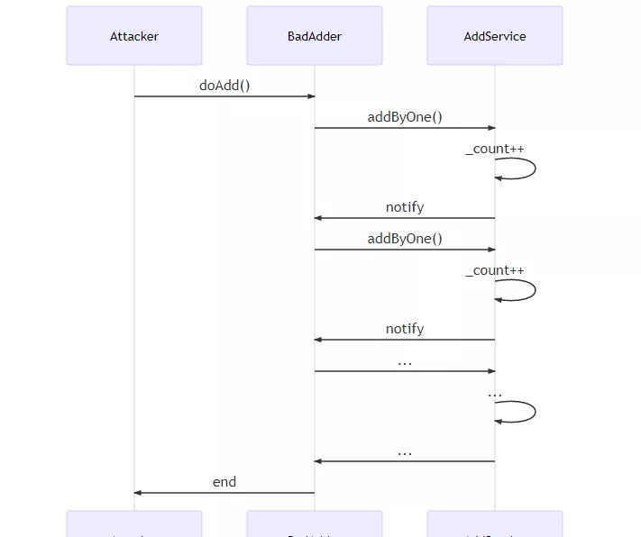
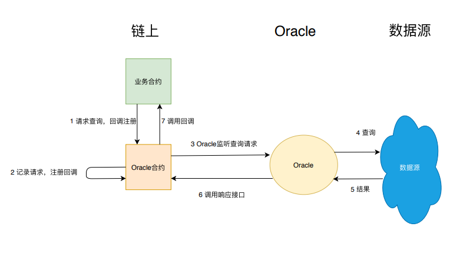

# Solidity Best Practice

- [Solidity Best Practice](#solidity-best-practice)
  - [solidity 安全](#solidity-安全)
    - [开发理念](#开发理念)
    - [Metamask 项目方给 solidity 程序员的安全建议](#metamask-项目方给-solidity-程序员的安全建议)
      - [1. 正确使用`assert(), require(), revert()`](#1-正确使用assert-require-revert)
      - [2. `modifier` 仅用于检查](#2-modifier-仅用于检查)
      - [3. 注意整数除法的舍入](#3-注意整数除法的舍入)
      - [4. 注意抽象合约`abstract`和接口`interface`之间的权衡](#4-注意抽象合约abstract和接口interface之间的权衡)
      - [5. Fallback function 后备函数](#5-fallback-function-后备函数)
        - [保持 fallback function 简单](#保持-fallback-function-简单)
        - [检查回退函数中的数据长度](#检查回退函数中的数据长度)
      - [6. 显式标记应付函数和状态变量](#6-显式标记应付函数和状态变量)
      - [7. 显式标记函数和状态变量的可见性](#7-显式标记函数和状态变量的可见性)
      - [8. 将编译指示锁定到特定的编译器版本](#8-将编译指示锁定到特定的编译器版本)
      - [9. 使用事件来监控合约活动](#9-使用事件来监控合约活动)
      - [10. 请注意，“内置”函数可能会被隐藏](#10-请注意内置函数可能会被隐藏)
      - [11. 避免使用 tx.origin](#11-避免使用-txorigin)
      - [12. 时间戳依赖](#12-时间戳依赖)
        - [时间戳操作](#时间戳操作)
        - [15 秒规则](#15-秒规则)
        - [避免 block.number 用作时间戳](#避免-blocknumber-用作时间戳)
      - [13. 多重继承注意事项](#13-多重继承注意事项)
      - [14. 使用接口类型而不是地址来保证类型安全](#14-使用接口类型而不是地址来保证类型安全)
      - [15. 避免 `extcodesize` 用于检查外部拥有的帐户](#15-避免-extcodesize-用于检查外部拥有的帐户)
  - [solidity 设计模式](#solidity-设计模式)
    - [安全性(Security)](#安全性security)
      - [Checks-Effects-Interaction - 保证状态完整，再做外部调用](#checks-effects-interaction---保证状态完整再做外部调用)
      - [Mutex - 禁止递归](#mutex---禁止递归)
    - [可维护性（Maintenance）](#可维护性maintenance)
      - [Data segregation - 数据与逻辑相分离](#data-segregation---数据与逻辑相分离)
    - [Satellite - 分解合约功能](#satellite---分解合约功能)
    - [Contract Registry - 跟踪最新合约](#contract-registry---跟踪最新合约)
    - [Contract Relay - 代理调用最新合约](#contract-relay---代理调用最新合约)
    - [生命周期（Lifecycle）](#生命周期lifecycle)
      - [Mortal - 允许合约自毁](#mortal---允许合约自毁)
      - [Automatic Deprecation - 允许合约自动停止服务](#automatic-deprecation---允许合约自动停止服务)
    - [权限（Authorization）](#权限authorization)
      - [Ownership](#ownership)
    - [行为控制（Action And Control）](#行为控制action-and-control)
      - [Commit - Reveal - 延迟秘密泄露](#commit---reveal---延迟秘密泄露)
      - [Oracle - 读取链外数据](#oracle---读取链外数据)
  - [项目开发工具](#项目开发工具)
    - [利用 foundry 开发 solidity 项目](#利用-foundry-开发-solidity-项目)
      - [foundry 初始化](#foundry-初始化)
        - [solidity lint](#solidity-lint)
      - [构建 \& 测试](#构建--测试)
      - [部署 \& 验证](#部署--验证)
    - [利用 hardhat 开发 solidity 项目](#利用-hardhat-开发-solidity-项目)
      - [hardhat 初始化](#hardhat-初始化)
      - [hardhat 编译 \& 测试](#hardhat-编译--测试)
        - [合约覆盖率](#合约覆盖率)
      - [hardhat 部署](#hardhat-部署)
  - [参考资料](#参考资料)

## solidity 安全

**来源**：[smart-contract-best-practices](https://github.com/ConsenSys/smart-contract-best-practices)

### 开发理念

- **对可能的错误有所准备。任何有意义的智能合约或多或少都存在错误。因此你的代码必须能够正确的处理出现的 bug 和漏洞**。始终保证以下规则：
  - 当智能合约出现错误时，停止合约，（“断路开关”）
  - 管理账户的资金风险（限制（转账）速率、最大（转账）额度）
  - 有效的途径来进行 bug 修复和功能提升
- **谨慎发布智能合约。 尽量在正式发布智能合约之前发现并修复可能的 bug。**
  - 对智能合约进行彻底的测试，并在任何新的攻击手法被发现后及时的测试(包括已经发布的合约)
  - 从 alpha 版本在测试网（testnet）上发布开始便提供 bug 赏金计划
  - 阶段性发布，每个阶段都提供足够的测试
- **保持智能合约的简洁。复杂会增加出错的风险。**
  - 确保智能合约逻辑简洁
  - 确保合约和函数模块化
  - 使用已经被广泛使用的合约或工具（比如，不要自己写一个随机数生成器）
  - 条件允许的话，清晰明了比性能更重要
  - 只在你系统的去中心化部分使用区块链
- **保持更新**
  - 在任何新的漏洞被发现时检查你的智能合约
  - 尽可能快的将使用到的库或者工具更新到最新
  - 使用最新的安全技术
- **清楚区块链的特性**。尽管你先前所拥有的编程经验同样适用于以太坊开发，但这里仍然有些陷阱你需要留意：
  - 特别小心针对外部合约的调用，因为你可能执行的是一段恶意代码然后更改控制流程
  - 清楚你的 public function 是公开的，意味着可以被恶意调用。（在以太坊上）你的 private data 也是对他人可见的
  - 清楚 gas 的花费和区块的 gas limit

### Metamask 项目方给 solidity 程序员的安全建议

**来源**：[Solidity Best Practices for Smart Contract Security](https://consensys.io/blog/solidity-best-practices-for-smart-contract-security)

#### 1. 正确使用`assert(), require(), revert()`

函数 `assert` 和 `require` 可用于检查条件，如果条件不满足则抛出异常。

`assert` 函数只能用于测试内部错误和检查不变量。

应该使用 `require` 函数来确保满足有效条件，例如输入或合约状态变量，或者验证来自外部合约调用的返回值。 （**注**: solidity 在 0.8.4 版本引入自定义 `error` 功能，所以这个版本之前用 `require`，之后用 `revert`-`error` 来确保满足有效条件）

遵循这种范式可以让形式化分析工具来验证无效操作码永远不会被运行：这意味着代码中没有不变量被违反并且被形式化验证。

```solidity
pragma solidity ^0.5.0;

contract Sharer {
    function sendHalf(address payable addr) public payable returns (uint balance) {
        require(msg.value % 2 == 0, "偶数required."); //Require() 可以加一个自定义消息
        uint balanceBeforeTransfer = address(this).balance;
        (bool success, ) = addr.call.value(msg.value / 2)("");
        require(success);
        // 如果success为false，就revert。下面的总是成立。
        assert(address(this).balance == balanceBeforeTransfer - msg.value / 2); // used for internal error checking
        return address(this).balance;
    }
}
```

#### 2. `modifier` 仅用于检查

修饰符（`modifier`）内的代码通常在函数体之前执行，因此任何状态更改或外部调用都会违反 `Checks-Effects-Interactions`模式。此外，开发人员也可能不会注意到这些语句，因为修饰符的代码可能远离函数声明。例如，修饰符的外部调用可能导致重入攻击：

```solidity
contract Registry {
    address owner;

    function isVoter(address _addr) external returns(bool) {
        // Code
    }
}

contract Election {
    Registry registry;

    modifier isEligible(address _addr) {
        require(registry.isVoter(_addr));
        _;
    }

    function vote() isEligible(msg.sender) public {
        // Code
    }
}
```

在这种情况下，`Registry`合约可以通过调用`isVoter()`中的`Election.vote()` 进行重入攻击。

**注意**：使用 `modifier` 替换多个函数中的重复条件检查，例如 `isOwner()`，否则在函数内部使用 `require` 或 `revert`。这使您的智能合约代码更具可读性和更易于审计。

#### 3. 注意整数除法的舍入

所有整数除法都向下舍入到最接近的整数。如果您需要更高的精度，请考虑使用乘数，或同时存储分子和分母。

```solidity
// bad
uint x = 5 / 2; // Result is 2, all integer division rounds DOWN to the nearest integer
```

使用乘数可以防止四舍五入，在将来使用 x 时需要考虑这个乘数：

```solidity
// good
uint multiplier = 10;
uint x = (5 * multiplier) / 2;
```

存储分子和分母意味着你可以计算 `numerator/denominator` 链下的结果：

```solidity
// good
uint numerator = 5;
uint denominator = 2;
```

#### 4. 注意抽象合约`abstract`和接口`interface`之间的权衡

接口和抽象合约都为智能合约提供了一种可定制和可重用的方法。`Solidity 0.4.11` 中引入的接口类似于抽象合约，但不能实现任何功能。接口也有限制，例如不能访问存储或从其他接口继承，这通常使抽象合约更实用。虽然，接口对于在实现之前设计合约肯定有用。此外，重要的是要记住，如果合约继承自抽象合约，它必须通过覆盖实现所有未实现的功能，否则它也将是抽象的。

#### 5. Fallback function 后备函数

**注**：`Solidity 0.5.0`时还没有`receive`函数且`fallback`函数当时也直接声明为`function()`。

##### 保持 fallback function 简单

当合约被发送一个没有参数的消息（或者没有函数匹配）或，`fallback function`会被调用。当被`.send()`或`.transfer`触发时，`fallback function`只能访问`2300 gas`。如果您希望能够从`send()`或`.transfer()`接收`ETH`，那么您在后备函数中最多可以做的就是记录一个事件。如果需要计算更多`gas`，请使用适当的函数。

```solidity
// bad
function() payable { balances[msg.sender] += msg.value; }

// good
function deposit() payable external { balances[msg.sender] += msg.value; }

function() payable { require(msg.data.length == 0); emit LogDepositReceived(msg.sender); }
```

##### 检查回退函数中的数据长度

由于 `fallback function` 不仅在普通以太传输（没有 `msg.data`）时调用，并且也在没有其他函数匹配时调用，如果后备函数仅用于记录接收到的 `ETH`，则应检查数据是否为空。否则，如果你的合约使用不正确，调用了不存在的函数，调用者将不会注意到。

```solidity
// bad
function() payable { emit LogDepositReceived(msg.sender); }

// good
function() payable { require(msg.data.length == 0); emit LogDepositReceived(msg.sender); }
```

#### 6. 显式标记应付函数和状态变量

从 `Solidity 0.4.0` 开始，每个接收以太币的函数都必须使用 `payable` 修饰符，否则如果交易有 `msg.value > 0` 将被 `revert`。

**注意**：可能不明显的事情： `payable` 修饰符仅适用于来自 `external` 合约的调用。如果我在同一个合约的 `payable` 函数中调用了一个非 `payable` 函数，这个非 `payable` 函数不会失败，尽管 `msg.value` 不为零。

#### 7. 显式标记函数和状态变量的可见性

明确标记函数和状态变量的可见性。函数可以指定为 `external`， `public`，`internal` 或 `private`。请理解它们之间的差异，例如，`external` 可能足以代替 `public`。而对于状态变量，`external` 是不用的。明确标记可见性将更容易捕捉关于谁可以调用函数或访问变量的错误。

1. `External` 函数是合约接口的一部分。`external` 函数 `f` 不能在内部调用（即 `f()` 不工作，但 `this.f()` 工作）。外部函数在接收大量数据时效率更高。
2. `Public` 函数是合约接口的一部分，既可以在内部调用，也可以通过消息调用。对于公共状态变量，会生成一个自动 `getter` 函数。
3. `Internal` 函数和状态变量只能在内部访问，不使用 `this`.
4. `Private` 函数和状态变量仅对定义它们的合约可见，而在派生合约中不可见。 注意：合约内的所有内容对区块链外部的所有观察者都是可见的，甚至是 `Private` 变量。

```solidity
// bad
uint x; // the default is internal for state variables, but it should be made explicit
function buy() { // the default is public
    // public code
}

// good
uint private y;
function buy() external {
    // only callable externally or using this.buy()
}

function utility() public {
    // callable externally, as well as internally: changing this code requires thinking about both cases.
}

function internalAction() internal {
    // internal code
}
```

#### 8. 将编译指示锁定到特定的编译器版本

合约应该使用与它们经过最多测试的相同编译器版本和标志来部署。锁定 `pragma` 有助于确保合约不会被意外部署，例如使用可能具有更高风险未发现错误的最新编译器。合约也可能由其他人部署，并且 `pragma` 指示原作者预期的编译器版本。

```solidity
// bad
pragma solidity ^0.4.4;


// good
pragma solidity 0.4.4;
```

**注意**：浮动 `pragma` 版本（即 `^0.4.25`）可以用 `0.4.26-nightly.2018.9.25` 编译，但不应使用 `nightly` 版本来编译生产代码。

**警告**：当合约打算供其他开发人员使用时，可以允许 `Pragma` 语句浮动，例如库或 `EthPM` 包中的合约。否则，开发人员需要手动更新编译指示才能在本地编译。

#### 9. 使用事件来监控合约活动

有一种方法可以在部署后监控合约的活动是很有用的。实现这一点的一种方法是查看合约的所有交易，但这可能还不够，因为合约之间的消息调用不会记录在区块链中。此外，它只显示输入参数，而不是对状态进行的实际更改。事件也可用于触发用户界面中的功能。

```solidity
contract Charity {
    mapping(address => uint) balances;

    function donate() payable public {
        balances[msg.sender] += msg.value;
    }
}

contract Game {
    function buyCoins() payable public {
        // 5% goes to charity
        charity.donate.value(msg.value / 20)();
    }
}
```

在这里， `Game` 合约将内部调用 `Charity.donate()`. 该交易不会出现在 `Charity` 的外部交易列表中，而只在内部交易中可见。

事件是记录合约中发生的事情的便捷方式。发出的事件与其他合约数据一起留在区块链中，可供将来审计。这是对上述示例的改进，使用事件来提供慈善机构的捐赠历史。

```solidity
contract Charity {
    // define event
    event LogDonate(uint _amount);

    mapping(address => uint) balances;

    function donate() payable public {
        balances[msg.sender] += msg.value;
        // emit event
        emit LogDonate(msg.value);
    }
}

contract Game {
    function buyCoins() payable public {
        // 5% goes to charity
        charity.donate.value(msg.value / 20)();
    }
}
```

在这里，无论是否直接通过合约的所有交易都 `Charity` 将与捐赠的金额一起显示在该合约的事件列表中。

**注意**：优先使用更新的 Solidity 结构。首选结构/别名，例如 `selfdestruct` (而不是 `suicide`) 和 `keccak256` (而不是 `sha3`)。类似的模式 `require(msg.sender.send(1 ether))` 也可以简化为使用 `transfer()`，如 `msg.sender.transfer(1 ether)`. 查看 `Solidity` 更改日志 以了解更多类似更改。

#### 10. 请注意，“内置”函数可能会被隐藏

目前可以 在 `Solidity` 中隐藏内置的全局变量。这允许合约覆盖内置插件的功能，例如 `msg` 和 `revert()`。尽管这是有意为之，但它可能会误导合约用户对合约的真实行为。

```solidity
contract PretendingToRevert {
    function revert() internal constant {}
}

contract ExampleContract is PretendingToRevert {
    function somethingBad() public {
        revert();
    }
}
```

合约用户（和审计员）应该了解他们打算使用的任何应用程序的完整智能合约源代码。

#### 11. 避免使用 tx.origin

永远不要 `tx.origin` 用于授权，另一个合约可以有一个方法来调用你的合约（例如，用户有一些资金）并且你的合约将授权该交易，因为你的地址位于 `tx.origin`.

```solidity
contract MyContract {

    address owner;

    function MyContract() public {
        owner = msg.sender;
    }

    function sendTo(address receiver, uint amount) public {
        require(tx.origin == owner);
        (bool success, ) = receiver.call.value(amount)("");
        require(success);
    }

}

contract AttackingContract {

    MyContract myContract;
    address attacker;

    function AttackingContract(address myContractAddress) public {
        myContract = MyContract(myContractAddress);
        attacker = msg.sender;
    }

    function() public {
        myContract.sendTo(attacker, msg.sender.balance);
    }

}
```

您应该使用 `msg.sender` 授权（如果另一个合约调用您的合约 `msg.sender` 将是该合约的地址，而不是调用该合约的用户的地址）。

**警告**：除了授权问题外， `tx.origin` 将来有可能从以太坊协议中删除，因此使用的代码 `tx.origin` 将与未来版本不兼容. Vitalik："不要假设 `tx.origin` 将继续存在"。

还值得一提的是，通过使用 `tx.origin` 您会限制合约之间的互操作性，因为使用 `tx.origin` 的合约不能被另一个合约使用，因为合约不能是 `tx.origin`.

#### 12. 时间戳依赖

使用时间戳执行合约中的关键功能时，有三个主要考虑因素，尤其是当操作涉及资金转移时。

##### 时间戳操作

请注意，区块的时间戳可以由矿工操纵。考虑这个合约：

```solidity
uint256 constant private salt =  block.timestamp;

function random(uint Max) constant private returns (uint256 result){
    //get the best seed for randomness
    uint256 x = salt * 100/Max;
    uint256 y = salt * block.number/(salt % 5) ;
    uint256 seed = block.number/3 + (salt % 300) + Last_Payout + y;
    uint256 h = uint256(block.blockhash(seed));

    return uint256((h / x)) % Max + 1; //random number between 1 and Max
}
```

当合约使用时间戳播种一个随机数时，矿工实际上可以在区块被验证后的 15 秒内发布一个时间戳，从而有效地允许矿工预先计算一个更有利于他们中奖机会的选项。时间戳不是随机的，不应在该上下文中使用。

##### 15 秒规则

黄皮书 （Ethereum 的参考规范）没有规定多少块可以在时间上漂移的限制，但它确实规定每个时间戳应该大于其父时间戳。流行的以太坊协议实现 Geth 和 Parity 都拒绝未来时间戳超过 15 秒的块。因此，评估时间戳使用的一个好的经验法则是：如果您的时间相关事件的规模可以变化 15 秒并保持完整性，那么可以使用`block.timestamp`.

##### 避免 block.number 用作时间戳

可以使用 `block.number` 属性和 平均块时间来估计时间增量，但这不是未来的证据，因为出块时间可能会改变（例如 分叉重组 和 难度炸弹）。但在只持续几天的销售中，15 秒规则允许人们获得更可靠的时间估计。

#### 13. 多重继承注意事项

在 Solidity 中使用多重继承时，了解编译器如何构成继承图非常重要。

```solidity
contract Final {
    uint public a;
    function Final(uint f) public {
        a = f;
    }
}

contract B is Final {
    int public fee;

    function B(uint f) Final(f) public {
    }
    function setFee() public {
        fee = 3;
    }
}

contract C is Final {
    int public fee;

    function C(uint f) Final(f) public {
    }
    function setFee() public {
        fee = 5;
    }
}

contract A is B, C {
  function A() public B(3) C(5) {
      setFee();
  }
}
```

部署合约时，编译器将从右到左线性化继承（在关键字`is`之后 ，父项从最基类到最派生列出）。这是合约 `A` 的线性化：

```solidity
Final <- B <- C <- A
```

线性化的结果将产生 `fee = 5` 的值，因为 `C` 是最接近衍生的合约。这似乎很明显，但想象一下 `C` 能够隐藏关键函数、重新排序布尔子句并导致开发人员编写可利用的合约的场景。静态分析目前不会引发被遮盖的函数的问题，因此必须手动检查。

#### 14. 使用接口类型而不是地址来保证类型安全

当函数将合约地址作为参数时，最好传递接口或合约类型而不是纯 `address`。因为如果函数在源代码的其他地方被调用，编译器将提供额外的类型安全保证。

在这里，我们看到了两种选择：

```solidity
contract Validator {
    function validate(uint) external returns(bool);
}

contract TypeSafeAuction {
    // good
    function validateBet(Validator _validator, uint _value) internal returns(bool) {
        bool valid = _validator.validate(_value);
        return valid;
    }
}

contract TypeUnsafeAuction {
    // bad
    function validateBet(address _addr, uint _value) internal returns(bool) {
        Validator validator = Validator(_addr);
        bool valid = validator.validate(_value);
        return valid;
    }
}
```

可以从下面示例中看出使用`TypeSafeAuction`合约的好处 。如果 `validateBet()` 使用 `address` 参数或合约类型而不是`Validator`合约类型，编译器将抛出此错误：

```solidity
contract NonValidator{}

contract Auction is TypeSafeAuction {
    NonValidator nonValidator;

    function bet(uint _value) {
        bool valid = validateBet(nonValidator, _value); // TypeError: Invalid type for argument in function call.
                                                        // Invalid implicit conversion from contract NonValidator
                                                        // to contract Validator requested.
    }
}
```

#### 15. 避免 `extcodesize` 用于检查外部拥有的帐户

以下修饰符（或类似的检查）通常用于验证调用是来自外部拥有的账户（`EOA`）还是合约账户：

```solidity
// bad
modifier isNotContract(address _a) {
  uint size;
  assembly {
    size := extcodesize(_a)
  }
    require(size == 0);
     _;
}
```

这个想法很简单：如果一个地址包含代码，它就不是一个 `EOA`，而是一个合约账户。但是，合约在构建期间没有可用的源代码。这意味着在构造函数运行时，它可以调用其他合约，但 `extcodesize` 在它的地址返回零。下面是一个最小的例子，展示了如何绕过这个检查：

```solidity
contract OnlyForEOA {
    uint public flag;

    // bad
    modifier isNotContract(address _a){
        uint len;
        assembly { len := extcodesize(_a) }
        require(len == 0);
        _;
    }

    function setFlag(uint i) public isNotContract(msg.sender){
        flag = i;
    }
}

contract FakeEOA {
    constructor(address _a) public {
        OnlyForEOA c = OnlyForEOA(_a);
        c.setFlag(1);
    }
}
```

因为可以预先计算合约地址，所以如果它检查一个在 `block n` 处为空，但在 `block n` 之后被部署的合约，依然会失败。

警告：这个问题很微妙。如果您的目标是阻止其他合约调用您的合约，那么 `extcodesize` 检查可能就足够了。另一种方法是检查 的值 (`tx.origin == msg.sender`)，尽管这也有缺点。

在其他情况下， `extcodesize` 可能会为您服务。在这里描述所有这些超出了范围。了解 `EVM` 的基本行为并使用您的判断。

## solidity 设计模式

**来源**：

1. [Design Patterns For Smart Contracts In the Ethereum Ecosystem](https://eprints.cs.univie.ac.at/5665/1/bare_conf.pdf)
2. [solidity 设计模式](https://fisco-bcos-documentation.readthedocs.io/zh-cn/latest/docs/articles/3_features/35_contract/solidity_design_patterns.html)

### 安全性(Security)

智能合约编写，首要考虑的就是安全性问题。在区块链世界中，恶意代码数不胜数。如果你的合约包含了跨合约调用，就要特别当心，要确认外部调用是否可信，尤其当其逻辑不为你所掌控的时候。如果缺乏防人之心，那些“居心叵测”的外部代码就可能将你的合约破坏殆尽。比如，外部调用可通过恶意回调，使代码被反复执行，从而破坏合约状态，这种攻击手法就是著名的 Reentrance Attack（重入攻击）。这里，先引入一个重入攻击的小实验，以便让读者了解为什么外部调用可能导致合约被破坏，同时帮助更好地理解即将介绍的两种提升合约安全性的设计模式。

关于重入攻击，这里举个精简的例子。AddService 合约是一个简单的计数器，每个外部合约可以调用 AddService 合约的 addByOne 来将字段\_count 加一，同时通过 require 来强制要求每个外部合约最多只能调用一次该函数。这样，\_count 字段就精确的反应出 AddService 被多少合约调用过。在 addByOne 函数的末尾，AddService 会调用外部合约的回调函数 notify。AddService 的代码如下：

```solidity
contract AddService{

    uint private _count;
    mapping(address=>bool) private _adders;

    function addByOne() public {
        //强制要求每个地址只能调用一次
        require(_adders[msg.sender] == false, "You have added already");
        //计数
        _count++;
        //调用账户的回调函数
        AdderInterface adder = AdderInterface(msg.sender);
        adder.notify();
        //将地址加入已调用集合
        _adders[msg.sender] = true;
    }
}

contract AdderInterface{
    function notify() public;
}
```

如果 AddService 如此部署，恶意攻击者可以轻易控制 AddService 中的\_count 数目，使该计数器完全失效。攻击者只需要部署一个合约 BadAdder，就可通过它来调用 AddService，就可以达到攻击效果。BadAdder 合约如下：

```solidity

contract BadAdder is AdderInterface{

    AddService private _addService = //...;
    uint private _calls;

    //回调
    function notify() public{
        if(_calls > 5){
            return;
        }
        _calls++;
        //Attention !!!!!!
        _addService.addByOne();
    }

    function doAdd() public{
        _addService.addByOne();
    }
}
```

BadAdder 在回调函数 notify 中，反过来继续调用 AddService，由于 AddService 糟糕的代码设计，require 条件检测语句被轻松绕过，攻击者可以直击\_count 字段，使其被任意地重复添加。攻击过程的时序图如下：



在这个例子中，AddService 难以获知调用者的回调逻辑，但依然轻信了这个外部调用，而攻击者利用了 AddService 糟糕的代码编排，导致悲剧的发生。本例子中去除了实际的业务意义，攻击后果仅仅是\_count 值失真。真正的重入攻击，可对业务造成严重后果。比如在统计投票数目是，投票数会被改得面目全非。打铁还需自身硬，如果想屏蔽这类攻击，合约需要遵循良好的编码模式，下面将介绍两个可有效解除此类攻击的设计模式。

#### Checks-Effects-Interaction - 保证状态完整，再做外部调用

该模式是编码风格约束，可有效避免重放攻击。通常情况下，一个函数可能包含三个部分：

- Checks：参数验证
- Effects：修改合约状态
- Interaction：外部交互

这个模式要求合约按照 Checks-Effects-Interaction 的顺序来组织代码。它的好处在于进行外部调用之前，Checks-Effects 已完成合约自身状态所有相关工作，使得状态完整、逻辑自洽，这样外部调用就无法利用不完整的状态进行攻击了。回顾前文的 AddService 合约，并没有遵循这个规则，在自身状态没有更新完的情况下去调用了外部代码，外部代码自然可以横插一刀，让\_adders[msg.sender]=true 永久不被调用，从而使 require 语句失效。我们以 checks-effects-interaction 的角度审阅原来的代码：

```solidity
    //Checks
    require(_adders[msg.sender] == false, "You have added already");
    //Effects
    _count++;
    //Interaction
    AdderInterface adder = AdderInterface(msg.sender);
    adder.notify();
    //Effects
    _adders[msg.sender] = true;
```

只要稍微调整顺序，满足 Checks-Effects-Interaction 模式，悲剧就得以避免：

```solidity
    //Checks
    require(_adders[msg.sender] == false, "You have added already");
    //Effects
    _count++;
    _adders[msg.sender] = true;
    //Interaction
    AdderInterface adder = AdderInterface(msg.sender);
    adder.notify();
```

由于\_adders 映射已经修改完毕，当恶意攻击者想递归地调用 addByOne，require 这道防线就会起到作用，将恶意调用拦截在外。虽然该模式并非解决重入攻击的唯一方式，但依然推荐开发者遵循。

#### Mutex - 禁止递归

Mutex 模式也是解决重入攻击的有效方式。它通过提供一个简单的修饰符来防止函数被递归调用：

```solidity
contract Mutex {
    bool locked;
    modifier noReentrancy() {
        //防止递归
        require(!locked, "Reentrancy detected");
        locked = true;
        _;
        locked = false;
    }

    //调用该函数将会抛出Reentrancy detected错误
    function some() public noReentrancy{
        some();
    }
}
```

在这个例子中，调用 some 函数前会先运行 noReentrancy 修饰符，将 locked 变量赋值为 true。如果此时又递归地调用了 some，修饰符的逻辑会再次激活，由于此时的 locked 属性已为 true，修饰符的第一行代码会抛出错误。

### 可维护性（Maintenance）

在区块链中，合约一旦部署，就无法更改。当合约出现了 bug，通常要面对以下问题：

1. 合约上已有的业务数据怎么处理？
2. 怎么尽可能减少升级影响范围，让其余功能不受影响？
3. 依赖它的其他合约该怎么办？

回顾面向对象编程，其核心思想是将变化的事物和不变的事物相分离，以阻隔变化在系统中的传播。所以，设计良好的代码通常都组织得高度模块化、高内聚低耦合。利用这个经典的思想可解决上面的问题。

#### Data segregation - 数据与逻辑相分离

了解该设计模式之前，先看看下面这个合约代码：

```solidity
contract Computer{

    uint private _data;

    function setData(uint data) public {
        _data = data;
    }

    function compute() public view returns(uint){
        return _data * 10;
    }
}
```

此合约包含两个能力，一个是存储数据(setData 函数)，另一个是运用数据进行计算(compute 函数）。如果合约部署一段时间后，发现 compute 写错了，比如不应是乘以 10，而要乘以 20，就会引出前文如何升级合约的问题。这时，可以部署一个新合约，并尝试将已有数据迁移到新的合约上，但这是一个很重的操作，一方面要编写迁移工具的代码，另一方面原先的数据完全作废，空占着宝贵的节点存储资源。

所以，预先在编程时进行模块化十分必要。如果我们将”数据”看成不变的事物，将”逻辑”看成可能改变的事物，就可以完美避开上述问题。Data Segregation（意为数据分离）模式很好地实现了这一想法。该模式要求一个业务合约和一个数据合约：数据合约只管数据存取，这部分是稳定的；而业务合约则通过数据合约来完成逻辑操作。

结合前面的例子，我们将数据读写操作专门转移到一个合约 DataRepository 中：

```solidity
contract DataRepository{

    uint private _data;

    function setData(uint data) public {
        _data = data;
    }

    function getData() public view returns(uint){
        return _data;
    }
}
```

计算功能被单独放入一个业务合约中：

```solidity
contract Computer{
    DataRepository private _dataRepository;
    constructor(address addr){
        _dataRepository =DataRepository(addr);
    }

    //业务代码
    function compute() public view returns(uint){
        return _dataRepository.getData() * 10;
    }
}
```

这样，只要数据合约是稳定的，业务合约的升级就很轻量化了。比如，当我要把 Computer 换成 ComputerV2 时，原先的数据依然可以被复用。

### Satellite - 分解合约功能

一个复杂的合约通常由许多功能构成，如果这些功能全部耦合在一个合约中，当某一个功能需要更新时，就不得不去部署整个合约，正常的功能都会受到波及。Satellite 模式运用单一职责原则解决上述问题，提倡将合约子功能放到子合约里，每个子合约（也称为卫星合约）只对应一个功能。当某个子功能需要修改，只要创建新的子合约，并将其地址更新到主合约里即可，其余功能不受影响。

举个简单的例子，下面这个合约的 setVariable 功能是将输入数据进行计算（compute 函数），并将计算结果存入合约状态\_variable：

```solidity
contract Base {
    uint public _variable;

    function setVariable(uint data) public {
        _variable = compute(data);
    }

    //计算
    function compute(uint a) internal returns(uint){
        return a * 10;
    }
}
```

如果部署后，发现 compute 函数写错，希望乘以的系数是 20，就要重新部署整个合约。但如果一开始按照 Satellite 模式操作，则只需部署相应的子合约。

首先，我们先将 compute 函数剥离到一个单独的卫星合约中去：

```solidity
contract Satellite {
    function compute(uint a) public returns(uint){
        return a * 10;
    }
}
```

然后，主合约依赖该子合约完成 setVariable：

```solidity
contract Base {
    uint public _variable;

    function setVariable(uint data) public {
        _variable = _satellite.compute(data);
    }

     Satellite _satellite;
    //更新子合约（卫星合约）
    function updateSatellite(address addr) public {
        _satellite = Satellite(addr);
    }
}
```

这样，当我们需要修改 compute 函数时，只需部署这样一个新合约，并将它的地址传入到 Base.updateSatellite 即可：

```solidity
contract Satellite2{
    function compute(uint a) public returns(uint){
        return a * 20;
    }
}
```

### Contract Registry - 跟踪最新合约

在 Satellite 模式中，如果一个主合约依赖子合约，在子合约升级时，主合约需要更新对子合约的地址引用，这通过 updateXXX 来完成，例如前文的 updateSatellite 函数。这类接口属于维护性接口，与实际业务无关，过多暴露此类接口会影响主合约美观，让调用者的体验大打折扣。Contract Registry 设计模式优雅地解决了这个问题。在该设计模式下，会有一个专门的合约 Registry 跟踪子合约的每次升级情况，主合约可通过查询此 Registyr 合约取得最新的子合约地址。卫星合约重新部署后，新地址通过 Registry.update 函数来更新。

```solidity
contract Registry{

    address _current;
    address[] _previous;

    //子合约升级了，就通过update函数更新地址
    function update(address newAddress) public{
        if(newAddress != _current){
            _previous.push(_current);
            _current = newAddress;
        }
    }

    function getCurrent() public view returns(address){
        return _current;
    }
}
```

主合约依赖于 Registry 获取最新的卫星合约地址。

```solidity
contract Base {
    uint public _variable;

    function setVariable(uint data) public {
        Satellite satellite = Satellite(_registry.getCurrent());
        _variable = satellite.compute(data);
    }

    Registry private _registry = //...;
}
```

### Contract Relay - 代理调用最新合约

该设计模式所解决问题与 Contract Registry 一样，即主合约无需暴露维护性接口就可调用最新子合约。该模式下，存在一个代理合约，和子合约享有相同接口，负责将主合约的调用请求传递给真正的子合约。卫星合约重新部署后，新地址通过 SatelliteProxy.update 函数来更新。

```solidity
contract SatelliteProxy{
    address _current;
    function compute(uint a) public returns(uint){
        Satellite satellite = Satellite(_current);
        return satellite.compute(a);
    }

    //子合约升级了，就通过update函数更新地址
    function update(address newAddress) public{
        if(newAddress != _current){
            _current = newAddress;
        }
    }
}


contract Satellite {
    function compute(uint a) public returns(uint){
        return a * 10;
    }
}
```

主合约依赖于 SatelliteProxy：

```solidity
contract Base {
    uint public _variable;

    function setVariable(uint data) public {
        _variable = _proxy.compute(data);
    }
    SatelliteProxy private _proxy = //...;
}
```

### 生命周期（Lifecycle）

在默认情况下，一个合约的生命周期近乎无限——除非赖以生存的区块链被消灭。但很多时候，用户希望缩短合约的生命周期。这一节将介绍两个简单模式提前终结合约生命。

#### Mortal - 允许合约自毁

字节码中有一个 selfdestruct 指令（计划未来被弃用，[eip-4758](https://eips.ethereum.org/EIPS/eip-4758)），用于销毁合约。所以只需要暴露出自毁接口即可：

```solidity
contract Mortal{

    //自毁
    function destroy() public{
        selfdestruct(msg.sender);
    }
}
```

#### Automatic Deprecation - 允许合约自动停止服务

如果你希望一个合约在指定期限后停止服务，而不需要人工介入，可以使用 Automatic Deprecation 模式。

```solidity
contract AutoDeprecated{

    uint private _deadline;

    function setDeadline(uint time) public {
        _deadline = time;
    }

    modifier notExpired(){
        require(now <= _deadline);
        _;
    }

    function service() public notExpired{
        //some code
    }
}
```

当用户调用 service，notExpired 修饰符会先进行日期检测，这样，一旦过了特定时间，调用就会因过期而被拦截在 notExpired 层。

### 权限（Authorization）

前文中有许多管理性接口，这些接口如果任何人都可调用，会造成严重后果，例如上文中的自毁函数，假设任何人都能访问，其严重性不言而喻。所以，一套保证只有特定账户能够访问的权限控制设计模式显得尤为重要。

#### Ownership

对于权限的管控，可以采用 Ownership 模式。该模式保证了只有合约的拥有者才能调用某些函数。首先需要有一个 Owned 合约：

```solidity
contract Owned{

    address public _owner;

    constructor() {
        _owner = msg.sender;
    }

    modifier onlyOwner(){
        require(_owner == msg.sender);
        _;
    }
}
```

如果一个业务合约，希望某个函数只由拥有者调用，该怎么办呢？如下：

```solidity
contract Biz is Owned{
    function manage() public onlyOwner{
    }
}
```

这样，当调用 manage 函数时，onlyOwner 修饰符就会先运行并检测调用者是否与合约拥有者一致，从而将无授权的调用拦截在外。

### 行为控制（Action And Control）

这类模式一般针对具体场景使用，这节将主要介绍基于隐私的编码模式和与链外数据交互的设计模式。

#### Commit - Reveal - 延迟秘密泄露

链上数据都是公开透明的，一旦某些隐私数据上链，任何人都可看到，并且再也无法撤回。Commit And Reveal 模式允许用户将要保护的数据转换为不可识别数据，比如一串哈希值，直到某个时刻再揭示哈希值的含义，展露真正的原值。以投票场景举例，假设需要在所有参与者都完成投票后再揭示投票内容，以防这期间参与者受票数影响。我们可以看看，在这个场景下所用到的具体代码：

```solidity
contract CommitReveal {

    struct Commit {
        string choice;
        string secret;
        uint status;
    }

    mapping(address => mapping(bytes32 => Commit)) public userCommits;
    event LogCommit(bytes32, address);
    event LogReveal(bytes32, address, string, string);

    function commit(bytes32 commit) public {
        Commit storage userCommit = userCommits[msg.sender][commit];
        require(userCommit.status == 0);
        userCommit.status = 1; // committed
        emit LogCommit(commit, msg.sender);
    }

    function reveal(string choice, string secret, bytes32 commit) public {
        Commit storage userCommit = userCommits[msg.sender][commit];
        require(userCommit.status == 1);
        require(commit == keccak256(choice, secret));
        userCommit.choice = choice;
        userCommit.secret = secret;
        userCommit.status = 2;
        emit LogReveal(commit, msg.sender, choice, secret);
    }
}
```

#### Oracle - 读取链外数据

目前，链上的智能合约生态相对封闭，无法获取链外数据，影响了智能合约的应用范围。链外数据可极大扩展智能合约的使用范围，比如在保险业中，如果智能合约可读取到现实发生的意外事件，就可自动执行理赔。获取外部数据会通过名为 Oracle 的链外数据层来执行。当业务方的合约尝试获取外部数据时，会先将查询请求存入到某个 Oracle 专用合约内；Oracle 会监听该合约，读取到这个查询请求后，执行查询，并调用业务合约响应接口使合约获取结果。



下面定义了一个 Oracle 合约：

```solidity
contract Oracle {
    address oracleSource = 0x123; // known source

    struct Request {
        bytes data;
        function(bytes memory) external callback;
}

    Request[] requests;
    event NewRequest(uint);
    modifier onlyByOracle() {
        require(msg.sender == oracleSource); _;
    }

    function query(bytes data, function(bytes memory) external callback) public {
        requests.push(Request(data, callback));
        emit NewRequest(requests.length - 1);
    }

    //回调函数，由Oracle调用
    function reply(uint requestID, bytes response) public onlyByOracle() {
        requests[requestID].callback(response);
    }
}
```

业务方合约与 Oracle 合约进行交互：

```solidity
contract BizContract {
    Oracle _oracle;

    constructor(address oracle){
        _oracle = Oracle(oracle);
    }

    modifier onlyByOracle() {
        require(msg.sender == address(_oracle));
        _;
    }

    function updateExchangeRate() {
        _oracle.query("USD", this.oracleResponse);
    }

    //回调函数，用于读取响应
    function oracleResponse(bytes response) onlyByOracle {
    // use the data
    }
}
```

## 项目开发工具

### 利用 foundry 开发 solidity 项目

#### foundry 初始化

```shell
# 利用foundry初始化整个项目
forge init
```

##### solidity lint

```shell
# 初始化solhint 代码检查工具
solhint --init
```

将`.solhint.json`更新为:

```json
{
  "extends": "solhint:default",
  "rules": {
    "explicit-types": "error",
    "max-states-count": "error",
    "no-console": "error",
    "no-empty-blocks": "error",
    "no-global-import": "error",
    "no-unused-import": "error",
    "no-unused-vars": "error",
    "one-contract-per-file": "error",
    "payable-fallback": "error",
    "reason-string": "error",
    "const-name-snakecase": "error",
    "contract-name-camelcase": "error",
    "event-name-camelcase": "error",
    "func-name-mixedcase": "error",
    "immutable-vars-naming": "error",
    "use-forbidden-name": "error",
    "var-name-mixedcase": "error",
    "imports-on-top": "error",
    "visibility-modifier-order": "error",
    "gas-custom-errors": "error",
    "quotes": "error",
    "avoid-call-value": "error",
    "avoid-low-level-calls": "error",
    "avoid-sha3": "error",
    "avoid-suicide": "error",
    "avoid-throw": "error",
    "avoid-tx-origin": "error",
    "check-send-result": "error",
    "compiler-version": "error",
    "func-visibility": ["error", { "ignoreConstructors": true }],
    "multiple-sends": "error",
    "no-complex-fallback": "error",
    "no-inline-assembly": "error",
    "not-rely-on-block-hash": "error",
    "reentrancy": "error",
    "state-visibility": "error"
  }
}
```

可直接使用[.solhint.json](./.solhint.json)或者根据[solhint 官方](https://protofire.github.io/solhint/)设定符合项目的 lint rules。

#### 构建 & 测试

```shell
forge build

forge test
```

```shell
# 查看测试覆盖率，为保障合约安全，建议覆盖率100%
forge coverage
```

#### 部署 & 验证

```shell
# 部署同时自动验证合约
forge create --rpc-url <your_rpc_url> \
             --private-key <your_private_key> \
             --etherscan-api-key <your_etherscan_api_key> \  # 用于通过Etherscan，进行合约验证
             --verify \
             src/MyContract.sol:MyContract
```

**注意**：一次只能部署一个合约

### 利用 hardhat 开发 solidity 项目

#### hardhat 初始化

```shell
# 在项目空文件夹中
npm init

# 安装hardhat依赖
npm install --save-dev hardhat

# 初始化hardhat项目
npx hardhat
```

[solidity lint](#solidity-lint)

#### hardhat 编译 & 测试

```shell
# 编译合约
npx hardhat compile

# 测试合约
npx hardhat test
```

##### 合约覆盖率

利用[solidity-coverage](https://github.com/sc-forks/solidity-coverage)

```shell
npm install --save-dev solidity-coverage
```

在`hardhat.config.js`添加 plugin

```json
require('solidity-coverage')
```

```shell
# 查看测试覆盖率，为保障合约安全，建议覆盖率100%
npx hardhat coverage
```

可以通过`coverage/index.html`查看具体结果，例[index.html](index.html)

#### hardhat 部署

在`ignition/modules`文件夹下实现对应合约的部署代码，如

```js
const { buildModule } = require("@nomicfoundation/hardhat-ignition/modules");

const JAN_1ST_2030 = 1893456000;
const ONE_GWEI = 1_000_000_000n;

module.exports = buildModule("LockModule", (m) => {
  const unlockTime = m.getParameter("unlockTime", JAN_1ST_2030);
  const lockedAmount = m.getParameter("lockedAmount", ONE_GWEI);

  const lock = m.contract("Lock", [unlockTime], {
    value: lockedAmount,
  });

  return { lock };
});
```

部署:

```shell
npx hardhat ignition deploy ./ignition/modules/Lock.js
```

通过 hardhat 启动一个本地以太坊节点，用于本地测试

```shell
npx hardhat node
```

部署到本地节点

```shell
npx hardhat ignition deploy ./ignition/modules/Lock.js --network localhost
```

通过修改`hardhat.config.js`中的 networks，添加或修改需要部署的区块链网络，如

```json
networks: {
    polygon: {
      url: "https://polygon.llamarpc.com",
      accounts: [POLYGON_API_KEY],
      chainId: 137,
    },
  }
```

部署到 polygon 网络

```shell
npx hardhat ignition deploy ./ignition/modules/Lock.js --network polygon
```

## 参考资料

- [The Smart Contract Security Field Guide for Developers](https://scsfg.io/developers/)
- [以太坊智能合约 —— 最佳安全开发指南](https://github.com/ConsenSys/smart-contract-best-practices/blob/master/README-zh.md)
- [Solidity Best Practices: Building Robust Smart Contracts](https://medium.com/@rohit.nagra7861/solidity-best-practices-building-robust-smart-contracts-c95dd1dbf645)
- [solidity style guide](https://docs.soliditylang.org/en/develop/style-guide.html)
- [foundry best practices](https://book.getfoundry.sh/tutorials/best-practices)
- [hardhat docs](https://hardhat.org/hardhat-runner/docs/getting-started#overview)
- [solhint](https://protofire.github.io/solhint/)
- [solidity coverage](https://github.com/sc-forks/solidity-coverage)
- [Solidity Best Practices for Smart Contract Security](https://consensys.io/blog/solidity-best-practices-for-smart-contract-security)
