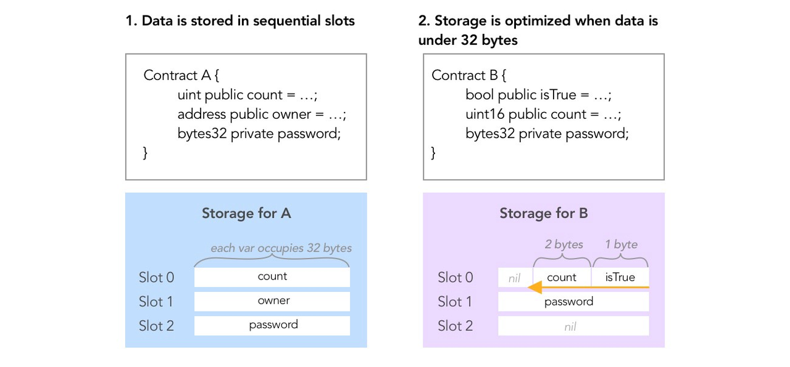

# solidity gas 优化

来源：[solidity gas optimization summary](https://github.com/sunxingdi/solidity-gas-optimization-summary)

## 整体介绍

Gas 消耗场景：部署合约，调用合约（包含读和写）。

Gas 消耗大小：

- 写操作 > 读操作
- 存储 > 内存 > 字节码
- 链上交互 > 链下交互
- 运行成本 >> 部署成本
- 高频交互 >> 低频交互
- 用户交互 >> 管理员交互

Gas 廉价操作：

- 读写内存变量
- 读取常量和不可变变量
- 读取和写入局部变量
- 读取 calldata 变量，例如 calldata 数组和结构
- 内部函数调用

Gas 昂贵操作：

- 读取和写入存储变量（状态变量）
- 外部函数调用
- 循环

## 具体措施

### 1. 避免使用不必要的存储

- 使用固定常量和临时内存来最小化存储
- 将大数据存储在链下（IPFS），链上只存储哈希值

### 2. 使用较新的 ABI 编码器

- 较新的编码器在结构、数组、函数参数中使用更少的 Gas
- 可能会不兼容历史版本

### 3. 尽量少使用 for 循环

- 每次迭代都会消耗 gas，请尽量减少循环
- 如果需要循环，请限制每个循环的范围和计算
- Map/filter/reduce 模式通常比 for 循环便宜

### 4. 优化昂贵操作的顺序

- SSTORE：存储操作，付费。SLOAD：加载操作，免费
- 在更昂贵的 SSTORE 之前执行更便宜的 SLOAD。
- 将像 address(this) 这样的静态调用移出循环。
- 请注意 Gas 成本顺序 – SLOAD < 其他操作 < SSTORE。

### 5. 尽可能进行链下预计算

- 在外部进行哈希、签名等计算。
- 传入预先计算的值以节省链上 gas。
- 允许使用更快的语言，如 Python 或 Go。

### 6. 优化数据布局

- 在结构和数组中连续存储数据比单独的变量更便宜。打包数据花费更少的天然气。
- 打包插槽和连续存储更便宜。
- 将经常访问的数据分组在一起。
- 按尺寸排序，首先是最小的类型。

### 7. 使用事件而不是日志

- 对于调试来说，事件是比日志更便宜的记录数据的方式
- 事件记录数据的成本降低了 75%。
- 对于跟踪和调试很有用。
- 索引参数有助于过滤事件日志。

### 8. 尽量减少链上数据的读写

- 在内存中读写比在存储中读写更便宜。
- 在临时变量中读写比在存储中读写更便宜。

### 9. 开启 Solidity 优化器

- Solidity 编译器用于生成高度优化的字节码。
- 在编译框架配置中配置启用优化器。{“优化器”：{“启用”：true，“运行”：200 } }

### 10. 尽量使用变量打包

- 尽可能将多个变量合并到一个存储槽中。
- Solidity 变量将数据存储在 256 位内存槽中，这意味着单个槽无法容纳的数据将占用下一个槽。
- 存储器中有 2^256 个槽位，每个槽位可容纳 32 个字节。
- 结构体和数组数据总是开始一个新的槽。
- 结构体和数组数据后面的项目总是开始一个新的存储槽。
- 存储槽举例：

```solidity
//占用3个存储槽位
uint128 x;
uint256 y;
uint128 z;

//占用2个存储槽位
uint128 x;
uint128 y;
uint256 z;
```

- 变量类型和字节大小：

| type     | bytesize |
| -------- | -------- |
| bool     | 1        |
| bytes1   | 1        |
| bytes8   | 8        |
| bytes32  | 32       |
| address  | 20       |
| contract | 20       |
| uint8    | 1        |
| uint16   | 2        |
| uint32   | 4        |
| uint128  | 16       |
| uint256  | 32       |
| int256   | 32       |

- 存储布局示意图：



### 11. 状态数据与字节码数据

```solidity
uint256 public _a = 10;           //读操作消耗gas多。SLOAD操作
uint256 public constant _b = 10;  //读操作消耗gas少。MLOAD操作
return 1000;                      //读操作消耗gas少。MLOAD操作
```

- `_a`变量存储在状态树中，使用`SLOAD`指令读操作（从存储中读），消耗 gas 多。可修改。
- `_b`常量存储在内存中，使用`MLOAD`指令读操作（从内存中读），消耗 gas 少。不可修改。
- `1000`数值存储在内存中，使用`MLOAD`指令读操作（从内存中读），消耗 gas 少。不可修改。

### 12. do-while 比 for 循环更节省

- do while 会在执行语句后检查条件，从而节省 gas 费用。

### 13. ++i 比 i++ 更节省

- i++需要 4 次操作。
- ++i 需要 2 次操作。

### 14. 使用 unchecked{}避免溢出

```solidity
for (uint256 i; i < 200;) {
    ++i;            //gas多
    unchecked{++i;} //gas少
}
```

### 15. 使用合适的数据类型

- Solidity 在进行算术运算时，会根据需要将较小的整数类型自动提升为 `uint256` 类型，以避免溢出或精度丢失。这种隐式类型转换有助于确保运算结果不超出 `uint256` 的范围，并提供更大的整数计算能力。比如：`unchecked{++i;}`
- 类型转换 `uint16` —> `uint256` 将消耗更多的 gas
- `uint256` 比 `uint16` 消耗的 gas 多

### 16. 函数参数：calldata 比内存更便宜

```solidity
function loop(uint256[] memory   x) public {}; //gas多
function loop(uint256[] calldata x) public {}; //gas少，不可修改
```

### 17. 使用内存缓存读取存储变量

- 每当您多次从存储中读取数据时，将变量缓存在内存中会更便宜。

```solidity
uint256 data = 1;

function SaveGas() public {
    uint256 solution = i + data;   //直接读状态变量（SLOAD），gas多

    uint256 _data = data;          //使用内存缓存
    uint256 solution = i + _data ; //再读取内存缓存（MLOAD），gas少
}
```

### 18. 在内存中缓存读取外部值

```solidity
当重复进行外部调用时，当调用之间的值没有改变时，缓存这些值：
// Before
require(core.controller().hasRole(core.controller().MANAGER_ROLE(), msg.sender));

// After
IController memory controller = core.controller();require(controller.hasRole(controller.MANAGER_ROLE(), msg.sender));
```

### 19. 第一次写入时节省 gas

存储槽：

- 每个存储槽可以包含长度不超过 32 字节的字。
- 存储槽从位置 0 开始（就像数组索引）。
- 总共有 2²⁵⁶ 个存储槽可用（用于读/写）。

存储成本：

- 初始化一个存储槽（第一次，或如果该槽不包含任何值），从零到非零值，花费 20,000 gas
- 修改一个存储槽的值需要 5,000 个 Gas
- 删除存储槽中的数值，需要退还 15,000 Gas。
- 存储写操作：每个存储槽第一次写入的燃料消耗是 20000 gas。
- 存储读操作：如果该存储槽已经被修改过，则需要消耗 800 gas；如果该存储槽未被修改过，则只需要消耗 200 gas。
- 声明存储变量而不初始化：不产生 gas 成本。

操作码存储成本：

- `SSTORE`（将 32 字节字保存到存储中）：当存储值从零设置为非零时为 22100 个 Gas，或者当存储值的零值保持不变或设置为零时为 5000 个 Gas。这假设是首次访问。
- `SLOAD`（从存储中加载一个字）：首次访问 2100 Gas，如果已经访问过 100 Gas
- `MSTORE`（保存一个单词到记忆中）：3 Gas
- `MLOAD`（从记忆中加载一个单词）：3 Gas

```solidity
contract SaveGas {

    uint256 _data0;     //未初始化，默认为零值，gas多
    uint256 _data1 = 9; //已初始化，gas少

    // #执行1次: 43494 gas
    // #执行n次: 23594 gas
    function setData0(uint256 x) public {
        _data0 = x;
    }

    // #执行1次: 23594 gas
    // #执行n次: 23594 gas
    function setData1(uint256 x) public {
        _data1 = x;
    }
}
```

### 20. 调用结构体数据

- 复制到内存中读取缓存方式
- 读取结构体中的最小化数据

```solidity
struct MyData {
    uint128 x;
    uint128 y;
    uint256 z;
}

mapping(address => MyData) _userData;

//方式1：gas多
MyData memory mydata = _userData[msg.sender];
return mydata.z;

//方式2：gas少
return _userData[msg.sender].z;
```

### 21. 对于不变的数据使用常量和不可变变量

- 常量和不可变变量在编译时不占用存储槽。它们保存在合约字节码内。如：
- Immutable：不可变类型，定义后只能赋值一次，之后不可变。
- constant：常量类型，定义时赋值，之后不可变

### 22. 递增 1 和递减 1

```solidity
//gas费依次降低
number += 1;         return number; //Gas used : 43800
number = number + 1; return number; //Gas used : 43787
return number++;                    //Gas used : 43634
return ++number;                    //Gas used : 43628（推荐）
```

### 23. 整数上溢/下溢

- Solidity 版本 0.8.0 之前，使用 SafeMath 库函数检查溢出。
- Solidity 版本 0.8.0 之后，编译器会进行溢出检查，但是检查动作需要消耗 gas 费。
- 如果能确保数据不会溢出，可以使用 unchecked 函数告诉编译器取消检查，从而节省 gas。

```solidity
uint8 number=255;
++numberOne;            //该语句将报错
unchecked{++numberTwo;} //该语句不报错，number值将溢出翻转为0
```

### 24. 使用 revert 代替 require

```solidity
//gas多
require(_number > 10, "number too small please");
//gas少
error NotEnough();
if ( _number < 10 ){revert NotEnough();}
```

### 25. 避免在内存中加载太多数据

- 使用小数组时（小内存），gas 消耗呈线性增长。
- 使用大数组时（大内存），gas 消耗呈二次方式增长。

```solidity
//内存使用：消耗gas

10：398 gas
20：371 gas
30：477 gas
40：516 gas
50：556 gas
60：662 gas
70：746 gas
80：765 gas
90：874 gas

10000：255806 gas
20000：901812 gas
30000：1938576 gas
40000：3365898 gas
50000：5183844 gas
60000：7392481 gas
70000：9991722 gas
80000：12981522 gas
90000：16362035 gas
```

### 26. require 判断放在函数顶部

- 如果 require 语句失败，则在恢复时将剩余部分 gas 退还给用户。

### 27. 比较语句将成本低的操作放在前面

- 使用&&或||与语句进行比较操作时 require；应该将操作中成本较低的部分放在前面，这样如果失败，编译器将不会比较第二部分，从而节省 gas 使用量。

### 28. 删除冗余库的引用

- 比如：`import './SafeMath.sol' as SafeMath;` 如果不需要，就不要导入。

### 29. 显示标记函数的可见性

- 显式函数可见性通常可以在智能合约安全性和 Gas 优化方面带来好处。例如，显式标记外部函数会强制将函数参数存储位置设置为 calldata，这样每次执行函数时都会节省 gas。

### 30. 使用正确的数据类型

- 使用 `uint` 代替 `string`
- `uint256` 比 `uint8` 消耗的 gas 少 [see why](https://ethereum.stackexchange.com/questions/3067/why-does-uint8-cost-more-gas-than-uint256). 如果开发人员使用大小小于 32 字节的项目，智能合约的 Gas 消耗可能会更高，因为以太坊虚拟机一次只能处理 32 字节。为了将元素的大小增加到必要的大小，EVM 必须执行额外的操作。
- 使用 `bytes` 代替 `byte[]`
- 如果 `bytes` 的长度可以限制，使用 `bytes1~bytes32` 之间的最小值
- `bytes32` 比 `string` 消耗的 gas 少

### 31. 不应在循环中操作存储变量

- 由于 `SLOAD` 和 `SSTORE` 操作码昂贵，管理存储中的变量比管理内存中的变量要昂贵得多。因此，不应在循环中使用存储变量（状态变量）。创建一个临时变量来表示全局变量，循环完成后，将临时变量的值重新分配给全局变量（状态变量）。

### 32. 使用映射而不是数组

- 除非需要迭代或可以打包数据类型，否则建议使用映射来管理数据列表以节省 gas。这对于内存和存储都有好处。映射的另一个优点是您可以访问任何值，而不必像其他情况那样迭代数组。

### 33. 最小化链上数据

- 您在存储变量中保存的数据越少，您需要的 gas 就越少。将所有数据保留在链下，仅将智能合约的关键信息保存在链上。
- 使用事件来存储数据是一种流行但不明智的 Gas 优化方法，因为虽然相对于变量在事件中存储数据成本更低，但事件中的数据无法被链上的其他智能合约访问。

### 34. 释放未使用的存储空间

- 删除未使用的变量有助于释放空间并获得天然气退款。删除未使用的变量与使用默认值重新分配值类型具有相同的效果。

```solidity
//Using delete keyword
delete myVariable;

//Or assigning the value 0 if integer
myInt = 0;
```

### 35. 函数使用外部可见性修饰符

- `public` 相当于外部可见+内部可见，所以 `public` 比 `external` 消耗 gas 多

```solidity
contract gas_optimization {
    uint256 message = 1;
    //2437 gas
    function func1() public view returns (uint256){return message;}
    //2415 gas
    function func2() external view returns (uint256){return message;}
    //infinite gas
    function func3() private view returns (uint256){return message;}
    //infinite gas
    function func4() internal view returns (uint256){return message;}
}
```

### 36. 在内存中处理存储变量

- 如果要更新存储变量，首先将存储变量存入内存中，计算内存变量中的所有内容，再赋值存储变量。这最大限度地减少了区块链的写入操作数量，有效降低了 Gas 成本。

```solidity
contract gas_optimization {
    uint256 message_1 = 0;
    uint256 message_2 = 0;

    //79735 gas
    function one() public returns (uint256){

        for(uint i=0; i<=100; i++)
            message_1 = message_1 + i;
        return message_1;
    }
    //59329 gas
    function two() external returns  (uint256){

        uint256 _message = message_2;
        for(uint i=0; i<=100; i++)
            _message = _message + i;

        message_2 = _message;
        return message_2;
    }
}
```

### 37. 不要初始化零值

- 编写 `for` 循环时，不要将变量初始化为零 ( `uint256 index = 0;` )。相反，请使用 `uint256 index;`因为默认值 `uint256` 为零。这种做法可以让你通过避免初始化来节省一些 gas。

```solidity
contract gas_optimization {
    uint256 message_1 = 0;
    //79713 gas
    function one1() public returns (uint256){
            for(uint i=0; i<=100; i++)
                message_1 = message_1 + i;
            return message_1;
    }
}

contract gas_optimization {
    uint256 message_1 = 0;
    //79706 gas
    function one1() public returns (uint256){
            for(uint i; i<=100; i++)
                message_1 = message_1 + i;
            return message_1;
    }
}
```

### 38. 使用事件来记录数据

- 使用事件进行数据记录，而不是直接将数据存储在合约中。
- 基于事件的数据存储注意事项：虽然在事件中存储数据比变量更便宜，但值得注意的是，链上的其他智能合约无法访问这些数据。使用事件进行数据存储时应仔细考虑此限制。

### 39. 释放不再使用的存储槽（退款）

- 当不再需要存储槽时，将其值设置为零（本质上是将变量“清零”）可能会导致大量的天然气退款。具体来说，此操作将退还 15,000 Gas。

```solidity
uint256 public value1;
// Clear the storage slot by zeroing the variables
// This refunds 15,000 gas
assembly {
   sstore(value1.slot, 0)
}
```

### 40. 销毁不再使用的合约（退款）

- 使用 `selfdestruct` 操作码销毁合约并将任何剩余资金发送给合约所有者 ( `msg.sender` )。此操作退还 24,000 个 Gas。

```solidity
// Selfdestruct and refund 24,000 gas
selfdestruct(payable(msg.sender));
```

### 41. 数据类型和包装

- 尽可能使用 `bytes32`，因为它是最优化的存储类型。
- `bytes32`是一种 32 字节的数据类型，它是 Solidity 中最节省 Gas 的存储类型。当您使用的数据在 32 字节以内时，`bytes32`建议使用 以获得最佳的 Gas 使用量。
- 如果可以限制字节长度，请使用从 `bytes1` 到 `bytes32` 的尽可能最小的数量。
- 如果您正在处理可变长度字节数组，建议使用最小的大小来容纳您的数据。例如，如果您的数据大小在 5 个字节之内，则使用 `bytes5` 而不是 `bytes32` 可以节省 gas。
- 使用 `bytes32` 比使用 `string` 便宜。
- 存储和操作数据 `bytes32` 比使用字符串更节省 gas，因为字符串涉及动态存储分配。`bytes32` 是固定大小的类型，而 `string` 可以具有可变长度，从而导致更高的 Gas 成本。
- 变量打包仅发生在存储中——内存和调用数据不打包。
- Solidity 将变量打包在存储中，以最大限度地降低天然气成本。但是，这种打包不会发生在内存中或函数调用期间。优化存储时，请注意变量在存储中的组织方式，以最大限度地降低合约的总体存储成本。
- 尝试打包函数参数或局部变量不会节省空间。
- 将变量打包在函数参数或局部变量中不会节省 gas。EVM（以太坊虚拟机）在 32 字节字上运行，因此即使您使用较小的类型，它们通常也会被填充以填充 32 字节字。
- 在 `uint8` 中存储小数字可能并不便宜。
- 在 `uint8` 变量中存储一个小数字并不比存储在 in 中便宜，`uint256` 因为 in 中的数字 `uint8` 用数字填充以填充 32 个字节。此外，由于需要转换，较小类型的操作有时可能会消耗更多的气体。
- 使用继承函数而不是组合函数。（TODO：待 Remix 验证）
- 在 Solidity 中，使用继承通常比组合更简单、更节省燃料。当通过继承扩展合约时，子合约可以有效地将其变量与父合约的变量打包在一起。注意顺序：变量的顺序由 C3 线性化决定。您需要知道的是子变量位于父变量之后。这可以实现更高效的存储包装，这是优化气体使用的关键。

### 42. 使用存储指针

- 在内存和存储之间进行复制会消耗一些 gas，所以不要将数组从存储复制到内存；使用存储指针。

```solidity
contract StoragePointerExample {
    uint256[] public numbers;

    constructor() {
        numbers.push(1);
        numbers.push(2);
        numbers.push(3);
    }

    function updateNumber(uint256 _index, uint256 _newValue) public {
        // 使用存储指针修改数组元素的值
        uint256 storagePointer = numbers[_index];
        storagePointer = _newValue;
    }
}
```

### 43. 如何选择映射与数组

- 经验法则：选择数组上的映射可以更好地节省 gas，特别是在数据集很大或需要直接访问的情况下。然而，对于较小的数据集或当迭代是关键时，数组可能是一个实用的选择。如果不需要按顺序迭代数据，则优先使用映射而不是数组进行直接索引操作。
- 何时使用映射：当您需要直接访问特定元素而不迭代整个集合时，以键值对形式组织的映射可以提供更高效的解决方案。它们在元素检索比迭代更频繁的场景中特别有用。
- 何时使用数组：数组是按顺序排列的集合，最适合需要迭代元素或使用小型、易于打包的数据类型的情况。此外，在处理数组时，有效地使用内存数组来管理函数中的数据。

### 44. 优化变量可见性

- 避免公共变量，使用私有变量来节省 gas。

```solidity
//uint256 public numbers;
uint256 private numbers;
```

### 45. 简化返回值

- 在函数中命名返回值，从而无需单独的局部变量。例如，在计算乘积的函数中，您可以直接命名返回值，从而简化流程。

```solidity
// Use return values efficiently
function calculateProduct(uint256 a, uint256 b) external pure returns (uint256 product) {
   // Naming the return value directly
   product = a * b;
}
```

### 46. 尽量使用固定的变量

- 固定变量与动态变量：固定大小的变量总是比动态变量便宜。如果数组的大小已知，最好使用内存数组，固定大小的内存数组可以用来节省 gas。如果我们知道数组应该有多长，我们就指定一个固定的大小。
- 固定字符串与动态字符串：同样的规则适用于字符串。字符串或字节变量的大小是动态调整的；如果我们的字符串足够短，可以容纳，我们应该使用 `byte32`。如果我们绝对需要一个动态数组，最好将我们的函数构造为加法而不是减法。扩展数组需要消耗恒定的 gas，而截断数组则需要线性的 gas。

### 47. 尽量使用外部函数

- 函数应尽可能标记为外部函数，因为外部函数比公共函数更节省燃料。这是因为外部函数期望从外部调用传递参数，这可以节省 gas。

### 48. 最小化公共变量

- 每个变量位置都会有额外的 22 个 gas，因此最小化公共变量可以降低 gas 成本。公共变量隐式创建一个 getter 函数，它可以增加合约的大小和气体使用量。

### 49. 调整函数顺序

- 将经常调用的函数放在合约的前面。这可能会优化合约的执行，因为频繁访问的代码路径可能会从这种排序中受益。

### 50. 尽量减少函数参数

- 减少函数中参数的数量可以节省 gas，因为更大的输入数据会增加 gas 成本，因为更多的数据存储在内存中。

### 51. 使用付费函数

- 付费函数比非付费函数稍微更省油。这是因为编译器不需要检查应付函数中的 Ether 传输。
- 当 Solidity 编译时，非 payable 函数会获得更多操作码来检查 ETH 是否未发送。因此，付费功能的 Gas 成本更便宜。

### 52. 使用函数替换修饰符

- Solidity 修饰符会增加代码大小。有时，将修改器的逻辑实现为函数可以减少整体合约大小并节省 gas。
- 尽量少用修饰符：修饰符的代码放置在修改后的函数中，这会增加其大小和气体使用量。为了避免这种情况，请减少修饰符的数量。

### 53. 单行交换变量

- 在一条指令中，可以交换两个变量的值。使用：`(a, b) = (b, a)` 而不是使用辅助变量进行交换。

### 54. 对于无符号整数，> 0 比 != 0 更昂贵

- 与启用优化器的 `require` 语句中的无符号整数相比，`!= 0` 成本减少 6 GAS 。

```solidity
// Before
require(_value > 0);

// After
require(_value != 0);
```

### 55. 拆分使用 `&&` 的 `require()` 语句可以节省 Gas

- 与`&&`在单个 `require` 语句中使用运算符来检查多个条件不同，使用多个 `require` 语句（每个 `require` 语句有 1 个条件）将为每个节省 3 GAS：

```solidity
// Before
require(result >= MIN_64x64 && result <= MAX_64x64);

// After
require(result >= MIN_64x64);
require(result <= MAX_64x64);
```

### 56. 将 require 消息缩短至少于 32 个字符 超过 32 个字符的字符串将需要超过 1 个存储槽，从而消耗更多的 Gas。考虑将消息长度减少到少于 32 个字符或使用错误代码

```solidity
// Before
require(value > 2, "This require statement message exceeds thirty two characters.");

// After
require(value > 2, "A201")
```

### 57. 使用自定义错误而不是恢复字符串来节省 Gas

```solidity
// Before
revert("xxx");

// After
error Unauthorized();
revert Unauthorized();
```

### 58. 非严格的不等式比严格的不等式便宜

- 非严格不等式：`>=`
- 严格不等式： `>`
- 在 EVM 中，没有用于非严格不等式 ( `>=`, `<=` ) 的操作码，并且执行两个操作 ( `>` + `=` ) 考虑替换 `>=` 为严格对应的 `>`：

```solidity
// Before
require(value >= 2);

// After
require(value > 3);
```

### 59. 缩短昂贵的操作 短路的工作原理是首先对成本较低的操作进行排序，以便在第一个操作评估为 `true` 时跳过成本较高的操作

```solidity
// f(x) is low cost
// g(y) is expensive

// Ordering should go as follows
f(x) || g(y)
f(x) && g(y)
```

### 60. 使用内联汇编函数

- 我相信使用内联汇编函数在智能合约中编写函数比您尝试在合约中进行的任何更改更具成本效益。Solidity 中一个简单的 `for` 循环函数，需要 x 数量的 wei。而用 Solidity 的内联汇编编写的相同函数只需 0.7(x) 的 wei 量。

### 61. 重构修饰符以调用本地函数

- 重构修饰符以调用本地函数，而不是直接将代码放在修饰符中，从而节省字节码大小，从而节省部署成本，修饰符代码会在使用它的所有实例中进行复制，从而增加字节码大小。通过对内部函数进行折射，可以以一次 `JUMP` 的代价显著减少字节码大小。仅当您受到字节码大小的限制时才考虑这样做。

```solidity
// Before
modifier onlyOwner() {
    require(owner() == msg.sender, "Ownable: caller is not the owner");
    _;
}

// After
modifier onlyOwner() {
    _checkOwner(); //JUMP
    _;
}

function _checkOwner() internal view virtual {
    require(owner() == msg.sender, "Ownable: caller is not the owner");
}
```

### 62. 值类型使用索引事件

- 使用索引事件，因为与非索引事件相比，它们的成本更低
- 对 `uint`、`bool` 和 `address` 等值类型使用 `indexed` 关键字可以节省 Gas 成本。然而，这只适用于值类型，而索引字节和字符串比它们的未索引版本更昂贵。

### 63. 使用 `struct` 来强制数组长度匹配

- 在处理不同的输入数组时使用 `struct` 来强制数组长度匹配
- 当所有输入数组的长度需要相同时，使用 `struct` 组合多个输入数组，这样您就不必手动验证它们的长度。

```solidity
// Before
function vote(uint8[] calldata v, bytes[32] calldata r,  bytes[32] calldata s) public {
    require(v.length == r.length == s.length, "not matching");
}

// After
struct Signature {
    uint8 v;
    bytes32 r;
    bytes32 s;
}

function vote(Signature[] calldata sig) public {
    // no need for length check
}
```

### 64. 使用最新的编译器版本

- 使用较新的编译器版本和优化器可以免费提供气体优化和额外的安全检查！

### 65. For 循环优化最佳实践

- 先将遍历对象 `arr.length` 存入内存或字节码中，再执行循环遍历
- 增量方法中 `++i` 消耗 gas 费更低
- 可以将后置条件设置为 `unchecked`
- `uint i` 默认值是 0，不需要再显示初始化为 0

```solidity
//For循环最佳实践
uint length = arr.length;
for (uint i; i < length;) {
    unchecked { ++i; }
}
```

### 66. 报错日志中使用较短的字符串 比如检查函数

```solidity
require（condition，description）
revert（description）
```

### 67. 使用克隆进行合约部署

```solidity
// OpenZeppelin：Cheap Contract Deployment Through Clones
function _executeTransfer(address _owner, uint256 _idx) internal {
    (bytes32 salt, ) = precompute(_owner, _idx);
    new FlashEscrow{salt: salt}( //gas: deployment can cost less through clones
        nftAddress,
        _encodeFlashEscrowPayload(_idx)
    );
}
```

### 68. 使用修饰符代替函数来节省 gas

```shell
优化前：
部署 Inlined.sol：110473 gas
执行 Inlined.foo：21556 gas

优化后：
部署 Modifier.sol：108727 gas
执行 Modifier.foo：21532 gas
```

- 这 0.8.9 需要启用编译器和优化。正如您所看到的，使用修饰符进行部署更便宜，并且可以节省大约 30 个 gas。但有时修饰符会增加合约的代码大小。

```solidity
// Before
pragma solidity 0.8.9;
contract Inlined {
    function isNotExpired(bool _true) internal view {
        require(_true == true, "Exchange: EXPIRED");
    }
    function foo(bool _test) public returns(uint){
        isNotExpired(_test);
        return 1;
    }
}

// After
pragma solidity 0.8.9;
contract Modifier {
    modifier isNotExpired(bool _true) {
        require(_true == true, "Exchange: EXPIRED");
        _;
    }
    function foo(bool _test) public isNotExpired(_test)returns(uint){
        return 1;
    }
}
```

### 69. 在修饰符中使用 internal view 函数来节省字节码

- 建议将修饰符 require 语句移至 internal virtual function. 这减少了使用修饰符的编译合约的大小。当多次使用修饰符时，将 require 放入内部函数会减少合约大小。private 和 internal 的部署成本和功能没有区别。

### 70. 使用右移/左移代替除法/乘法

- 可以通过将 log2(x) 右移/左移来计算与任何 2 的幂数 x 的除法/乘法。虽然 DIV 操作码使用 5 个 Gas，但 SHR 操作码仅使用 3 个 Gas。此外，Solidity 的除法运算还包括防止除以 0 的操作，可以使用移位来绕过该除法。

### 71. 显性设置函数或变量的可见性

- 出于安全的原因，最好严格定义函数或变量的可见性，这不会影响执行时的 gas 消耗，但会影响部署时的 gas 消耗。

```shell
变量：
public部署时比internal和private消耗多。
public执行时比internal、private相同。

函数：
internal和private函数的部署成本相同。
```

### 72. 仔细选择函数名称

- 您的函数将转换为函数选择器，它们是函数名称的 `keccak256` 哈希值的前四个字节。
- 当您的智能合约被调用时，Solidity 会编译代码，按顺序检查您是否正在调用每个函数选择器，直到找到它为止。
- 如果您有一个非常常用的函数，请确保其选择器的值较低，因此它可能是第一个进行的比较。
- 节省的费用非常小（2 个函数时 44 个 Gas），对于大多数智能合约来说，这不是一个考虑因素，但这是一个真正节省每一点 Gas 的巧妙技巧。

### 73. 按照最便宜的顺序使用链式条件语句

```solidity
//gas消耗：func1() < func2() < func3()

func1()&&func2()&&func3()
func1()||func2()||func3()
```

### 74. 使用 push 添加数组元素

- 这是一个非常明显的问题，但如果您有一个数组，其中已有元素，并且您想向其中添加新项目，请使用而`.push()`不是覆盖整个数组。

```solidity
contract Example {
  uint[] favNumbers;

  // running this (after setting favNumbers to [50]
  // cost 84,213 gas
  function unoptimized() public {
    // makes no assumption about what favNumbers was set to, as it overwrites it
    favNumbers = [50, 51, 52];
  }

  // running this (after setting favNumbers to [50]
  // cost 81,457 gas
  function optimized() public {
    // assumes that when this is run, favNumbers was set to [50]
    favNumbers.push(50);
    favNumbers.push(51);
    favNumbers.push(52);
  }
}
```

### 75. 从 0 向上计数可能需要更多 Gas

- 如果您有计数器，从零到非零值的成本会更高。
- 例如，比较这两个合约——第一个合约调用 `amILuckyVisitor()` 三次要便宜得多。当然，`CountDown` 合约中的部署成本会更高，必须 `counter` 设置为 3。
- 如果将来余额可能会再次变为非零余额，则有时将余额保持在至少 1 的值（而不将其重置为 0）也可能会更便宜。但您仍然需要考虑可能的退款（设置为零值）

```solidity
contract CountDown {
    uint counter = 3;
    constructor() payable {}
    // gas on first run: 30416
    // gas on second run: 30416
    // gas on third run: 36163
    function amILuckyVisitor() payable public {
        counter--;
        if(counter == 0) {
            selfdestruct(payable(msg.sender));
        }
    }
}


contract CountUp {
    uint counter = 0;
    constructor() payable {}
    // gas on first run: 50081
    // gas on second run: 30416
    // gas on third run: 36163
    function amILuckyVisitor() payable public {
        counter++;
        if(counter == 3) {
            selfdestruct(payable(msg.sender));
        }
    }
}
```

### 76. 不要比较布尔型

```solidity
if(something == true)：成本高
if(something)：成本低
```

### 77. 使用 `selfbalance` 获取余额

- 获取智能合约余额的典型方式是调用 `address(this).balance`. 在最新版本的 Solidity 中，这一点得到了优化，但是有许多智能合约仍在使用旧版本的 Solidity。在 v 0.7.6 中，使用 `assembly` 和 `call` 的 Gas 成本更便宜 `selfbalance`。
- 内部调用可节省 15 Gas，外部调用可节省 6 Gas

```solidity
function unoptimised() external returns (uint bal) {
    bal = address(this).balance;
}

function optimised() external returns (uint bal) {
    assembly {
        bal := selfbalance()
    }
}
```

### 78. 尽量把 `revert` 语句放到前面

- 如果函数中有 `revert` 或 `require` 判断，尽量把语句放到前面，以减少 gas 消耗。

### 79. 不要将存储变量用作 bool

- 不要将存储变量用作 `bool`（即 0 或 1），而是使用 `uint256(1)` `uint256(2)`表示真/假，以避免从 `false` 设置为 `true` 时产生 20,000 个 Gas。如果通过像这样的映射访问它 `mapping(address => bool)`，它不会使用额外的存储空间，因为它仍然是一个 256 字节的布尔值。

### 80. 不要使用 `public` 常量

- 不要使用 `public` 常量（例如 `string public constant VERSION = "0.1";` 或 `uint256 public constant FEE = 500;` ） ，将它们设置为私有。如果有人需要访问它们，他们会查看源代码。由于没有公共 `getter` 函数的开销，这将节省部署成本。

### 81. 少进行外部合约调用

- 每次调用外部合约都会花费相当多的 Gas 费用。为了优化气体使用，最好调用一个函数并让它返回您需要的所有数据，而不是为每一项数据调用单独的函数。这可能违背其他语言的最佳编码实践，但可靠性是特殊的。

### 82. 使用预编译合约（内置合约）

- 以太坊协议提前内置了一些合约，为以太坊智能合约开发者提供了一些重要的底层操作，这些合约具有高效性和安全性。
- 预编译合约提供加密、哈希等复杂的库函数。它们需要更少的 Gas，因为代码不在 EVM 上运行。相反，它在客户端节点上本地运行。使用预编译合约可以通过减少执行智能合约所需的计算工作量来节省 gas。预编译合约的一些示例包括椭圆曲线数字签名算法（ECDSA）和 SHA2-256 哈希算法。通过在智能合约中利用这些预编译合约，开发人员可以降低 Gas 成本并提高应用程序的效率。
- 请参阅此处，了解以太坊网络支持的预编译合约的完整列表。预编译合约列表：https://www.evm.codes/precompiled?fork=shanghai

### 83. 使用 Layer 2 解决方案

- 使用 Layer 2 解决方案减少需要在以太坊主网上存储和计算的数据量。
- 汇总、侧链和状态通道等 Layer 2 解决方案可以从以太坊主链上卸载交易处理，从而实现更快、更便宜的交易。通过将大量交易捆绑在一起，这些解决方案减少了链上交易的数量，从而降低了 gas 费用。使用 Layer 2 解决方案还可以提高以太坊的可扩展性，使更多用户和应用程序能够参与网络而不会使网络过载。

### 84. 使用最佳实践合约库

- 比如：OpenZeppelin，OpenZeppelin 是一个开源的智能合约开发框架，提供了一系列经过审计和安全的合约组件、模块和工具，可以帮助开发者构建安全可靠的智能合约。它支持 ERC20、ERC721 等标准代币合约，以及权限管理、升级功能等。

### 85. 使用结构体存储多个变量

- 一次写入多个存储变量时，与更新单个变量相比，请考虑使用结构来减少天然气费用。

### 86. 按字母顺序排列函数

- 虽然不常见，但由于以太坊虚拟机存储函数的方式，按字母顺序排序函数可以稍微减少 Gas 费用。

### 87. 使用 hardhat 的 ETH Gas 报告来评估

- 指导书：https://learnblockchain.cn/docs/hardhat/plugins/hardhat-gas-reporter.html

### 88. 尽可能避免 0 到 1 的存储写入

- 初始化存储变量是合约可以执行的最昂贵的操作之一。
- 当存储变量从零变为非零时，用户必须总共支付 22,100 Gas（零到非零写入为 20,000 Gas，冷存储访问为 2,100 Gas）。
- 这就是为什么 Openzeppelin 可重入保护寄存器使用 1 和 2 而不是 0 和 1 来确定功能是否有效。将存储变量从非零更改为非零仅花费 5,000 个 Gas。

### 89. 使用映射而不是数组来避免长度检查

- 使用映射在每次读取时节省 2,000+ Gas。
- 当您读取数组索引的值时，Solidity 会添加字节码来检查您是否正在从有效索引（即严格小于数组长度的索引）读取，否则它将返回一个紧急错误（紧急错误） （准确地说是（0x32））。这可以防止读取未分配的或更糟糕的已分配的存储/内存位置。
- 由于映射的方式（只是一个键=>值对），不存在这样的检查，我们可以直接从存储槽中读取。请务必注意，以这种方式使用映射时，您的代码应确保您不会读取规范数组的越界索引。

### 90. 在数组上使用 `unsafeAccess` 以避免冗余长度检查

- 使用映射来避免在从数组读取时（同时仍然使用数组）进行长度检查的另一种方法是使用 Openzeppelin 的 `Arrays.sol` 库中的 `unsafeAccess` 函数。这允许开发人员直接访问数组任何给定索引的值，同时跳过长度溢出检查。如果您确定解析到函数中的索引不能超过解析到的数组的长度，那么仅使用它仍然很重要。

### 91. 当使用大量布尔值时，使用 `Bitmap` 而不是 `Bool`

- 一种常见的模式，尤其是在空投中，是在领取空投或 NFT 铸币时将地址标记为“已使用”。
- 然而，由于只需要一位来存储此信息，并且每个槽为 256 位，这意味着一个存储槽可以存储 256 个标志/布尔值。

### 92. 从 n 到 0 而不是从 0 到 n

- 当将存储变量设置为零时，会给予退款，因此如果存储变量的最终状态为零，则用于计数的净 gas 会更少。

### 93. 使用 `create2` 离线计算智能合约地址，避免存储地址设置函数

- 当使用传统合约部署时，可以根据部署者的地址及其随机数确定性地计算智能合约的地址。
- Solady 的 `LibRLP` 库可以帮助我们做到这一点。

### 94. UUPS 升级模式比透明可升级代理对用户来说更省 gas

- 透明的可升级代理模式需要在每次事务发生时从存储槽（由 ERC-1967 定义）中读取管理员地址，以查看调用者是否是管理员。这引入了额外的存储读取。

### 95. 考虑使用 OpenZeppelin 的替代品

- OpenZeppelin 是一个很棒且流行的智能合约库，但还有其他值得考虑的替代方案。这些替代方案提供了更好的燃气效率，并且已经过开发人员的测试和推荐。
- Solmate 和 Solady 是此类替代方案的两个示例。
- Solmate 是一个库，提供了许多常见智能合约模式的高效燃气实现。Solady 是另一个非常注重使用汇编的耗气库。
- 优秀合约库：OpenZeppelin、Solmate 和 Solady

### 96. 常见的数学运算，例如最小值和最大值，具有高效的替代方案

### 97. 使用 `SUB` 或 `XOR` 代替 `ISZERO(EQ())` 来检查不等式

### 98. 使用内联汇编检查地址(0)

### 99. 使用汇编对 96 字节以下的数据进行操作：事件中的哈希和未索引数据

### 100. 当进行多个外部调用时，使用汇编来重用内存空间

### 101. 创建多个合约时，使用 Assembly 重用内存空间

### 102. 通过检查最后一位而不是使用模运算符来测试数字是偶数还是奇数

### 103. `if(条件)` 比 `if(!条件)` 更便宜
