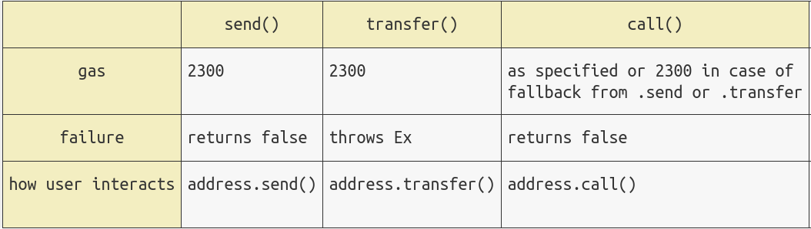

# 13. 未检查的低级调用

介绍智能合约的未检查低级调用（low-level call）的漏洞。失败的低级调用不会让交易回滚，如果合约中忘记对其返回值进行检查，往往会出现严重的问题。

## 低级调用

以太坊的低级调用包括 `call()`，`delegatecall()`，`staticcall()`，和`send()`。这些函数与`Solidity`其他函数不同，当出现异常时，它并不会向上层传递，也不会导致交易完全回滚；它只会返回一个布尔值`false`，传递调用失败的信息。因此，如果未检查低级函数调用的返回值，则无论低级调用失败与否，上层函数的代码会继续运行。

最容易出错的是`send()`：一些合约使用 `send()` 发送 `ETH`，但是 `send()` 限制 `gas` 要低于 `2300`，否则会失败。当目标地址的回调函数比较复杂时，花费的 `gas` 将高于 `2300`，从而导致 `send()` 失败。如果此时在上层函数没有检查返回值的话，交易继续执行，就会出现意想不到的问题。2016 年，有一款叫 `King of Ether` 的链游，因为这个漏洞导致退款无法正常发送（[验尸报告](https://www.kingoftheether.com/postmortem.html)）。



## 漏洞例子

### 银行合约

这个合约是在[重入攻击](./01.md)中的银行合约基础上修改而成。它包含 1 个状态变量`balanceOf`记录所有用户的以太坊余额；并且包含 3 个函数：

- `deposit()`：存款函数，将 ETH 存入银行合约，并更新用户的余额。
- `withdraw()`：提款函数，将调用者的余额转给它。具体步骤和上面故事中一样：查询余额，更新余额，转账。**注意：这个函数没有检查 `send()` 的返回值，提款失败但余额会清零！**
- `getBalance()`：获取银行合约里的 ETH 余额。

```js
contract UncheckedBank {
    mapping (address => uint256) public balanceOf;    // 余额mapping

    // 存入ether，并更新余额
    function deposit() external payable {
        balanceOf[msg.sender] += msg.value;
    }

    // 提取msg.sender的全部ether
    function withdraw() external {
        // 获取余额
        uint256 balance = balanceOf[msg.sender];
        require(balance > 0, "Insufficient balance");
        balanceOf[msg.sender] = 0;
        // Unchecked low-level call
        bool success = payable(msg.sender).send(balance);
    }

    // 获取银行合约的余额
    function getBalance() external view returns (uint256) {
        return address(this).balance;
    }
}
```

### 攻击合约

我们构造了一个攻击合约，它刻画了一个倒霉的储户，取款失败但是银行余额清零：合约回调函数 `receive()` 中的 `revert()` 将回滚交易，因此它无法接收 `ETH`；但是提款函数 `withdraw()` 却能正常调用，清空余额。

```js
contract Attack {
    UncheckedBank public bank; // Bank合约地址

    // 初始化Bank合约地址
    constructor(UncheckedBank _bank) {
        bank = _bank;
    }

    // 回调函数，转账ETH时会失败
    receive() external payable {
        revert();
    }

    // 存款函数，调用时 msg.value 设为存款数量
    function deposit() external payable {
        bank.deposit{value: msg.value}();
    }

    // 取款函数，虽然调用成功，但实际上取款失败
    function withdraw() external payable {
        bank.withdraw();
    }

    // 获取本合约的余额
    function getBalance() external view returns (uint256) {
        return address(this).balance;
    }
}
```

## 预防办法

你可以使用以下几种方法来预防未检查低级调用的漏洞：

1. 检查低级调用的返回值，在上面的银行合约中，我们可以改正 withdraw()。

```js
bool success = payable(msg.sender).send(balance);
require(success, "Failed Sending ETH!")
```

2. 合约转账 ETH 时，使用 call()，并做好重入保护。
3. 使用 OpenZeppelin 的[Address 库](https://github.com/OpenZeppelin/openzeppelin-contracts/blob/master/contracts/utils/Address.sol)，它将检查返回值的低级调用封装好了。
