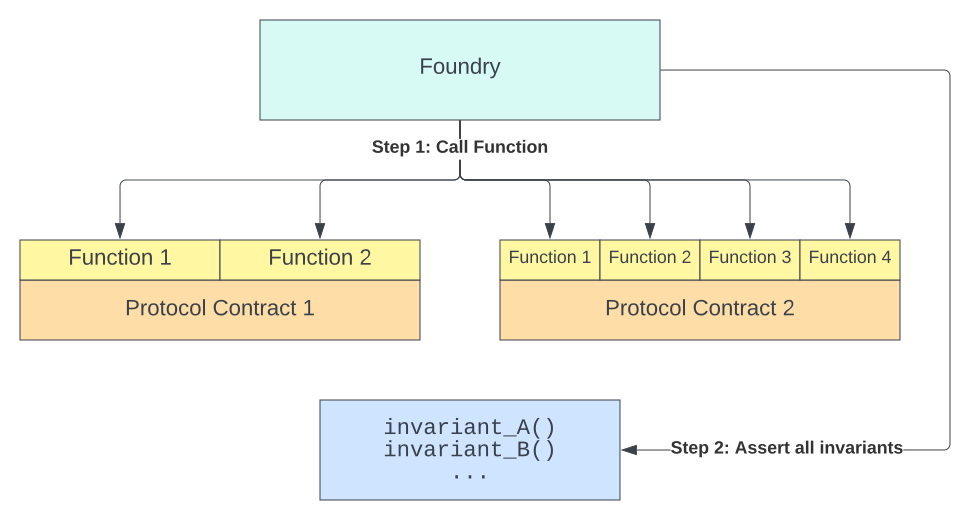
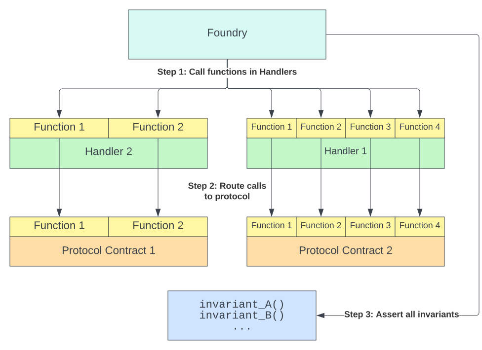

# Foundry

## 什么是 Foundry？

- 使用 Rust 语言编写
- 用于以太坊等 EVM 智能合约开发
- 相比于 Hardhat 等通过 Node.js 完成编译测试的工程项目，Foundry 工程项目的构建、测试执行速度更快
- Foundry 工程支持与其他类型工程集成，如 Hardhat
- 通过 git submodule 并构建目录映射，更加模块化，可以更便捷的引入依赖
- 开发、测试都只需要 solidity 语言
- 通过 Cheatcodes 作弊码，可以操纵区块链的状态，进而更全面的测试
- 测试中包含 gas 使用信息

## 安装

```shell
curl -L https://foundry.paradigm.xyz | bash

foundryup
```

## 初始化一个 Foundry 项目

```shell
forge init
```

初始化的项目目录结构

```shell
$ tree -L 2
.
├── foundry.toml        # Foundry 的 package 配置文件
├── lib                 # Foundry 的依赖库
│   └── forge-std       # 工具 forge 的基础依赖
├── script              # Foundry 的脚本
│   └── Counter.s.sol   # 示例合约 Counter 的脚本
├── src                 # 智能合约的业务逻辑、源代码将会放在这里
│   └── Counter.sol     # 示例合约
└── test                # 测试用例目录
    └── Counter.t.sol   # 示例合约的测试用例
```

### src 目录

项目的核心逻辑

```solidity
// SPDX-License-Identifier: UNLICENSED
pragma solidity ^0.8.13;

contract Counter {          // 一个很简单的 Counter 合约
    uint256 public number;  // 维护一个 public 的 uint256 数字

    // 设置 number 变量的内容
    function setNumber(uint256 newNumber) public {
        number = newNumber;
    }

    // 让 number 变量的内容自增
    function increment() public {
        number++;
    }
}
```

### script 目录

等同于 hardhat 中的 scripts，用于合约部署

```solidity
// SPDX-License-Identifier: UNLICENSED
pragma solidity ^0.8.13; // 许可 和 Solidity版本标识

import "forge-std/Script.sol"; // 引入foundry forge中的Script库
import "../src/Counter.sol"; // 引入要部署的Counter合约

// 部署脚本继承了Script合约
contract CounterScript is Script {
    // 可选函数，在每个函数运行之前被调用
    function setUp() public {}

    // 部署合约时会调用run()函数
    function run() public {
        vm.startBroadcast(); // 开始记录脚本中合约的调用和创建
        new Counter(); // 创建合约
        vm.stopBroadcast(); // 结束记录
    }
}
```

部署命令

```shell
forge script script/Counter.s.sol:CounterScript
```

### test 目录

合约的测试用例

```solidity
// SPDX-License-Identifier: UNLICENSED
pragma solidity ^0.8.13;

import "forge-std/Test.sol";        // 引入 forge-std 中用于测试的依赖
import "../src/Counter.sol";        // 引入用于测试的业务合约

// 基于 forge-std 的 test 合约依赖实现测试用例
contract CounterTest is Test {
    Counter public counter;

    // 初始化测试用例
    function setUp() public {
       counter = new Counter();
       counter.setNumber(0);
    }

    // 基于初始化测试用例
    // 断言测试自增后的 counter 的 number 返回值 同等于 1
    function testIncrement() public {
        counter.increment();
        assertEq(counter.number(), 1);
    }

    // 基于初始化测试用例
    // 执行差异测试测试
    // forge 测试的过程中
    // 为 testSetNumber 函数参数传递不同的 unit256 类型的 x
    // 达到测试 counter 的 setNumber 函数 为不同的 x 设置不同的数
    // 断言 number() 的返回值等同于差异测试的 x 参数
    function testSetNumber(uint256 x) public {
        counter.setNumber(x);
        assertEq(counter.number(), x);
    }

    // 差异测试：参考 https://book.getfoundry.sh/forge/differential-ffi-testing
}
```

### 项目构建 & 测试

项目构建

```shell
$ forge build
Compiling 10 files with 0.8.16
Solc 0.8.16 finished in 3.97s
Compiler run successful
```

运行测试

```shell
$ forge test
No files changed, compilation skipped

Running 2 tests for test/Counter.t.sol:CounterTest
[PASS] testIncrement() (gas: 28312)
[PASS] testSetNumber(uint256) (runs: 256, μ: 27376, ~: 28387)
Test result: ok. 2 passed; 0 failed; finished in 24.43ms
```

### 依赖

Forge 使用 [git submodules](https://git-scm.com/book/en/v2/Git-Tools-Submodules) 管理依赖项，这意味着它可以与任何包含智能合约的 GitHub 代码库一起使用。

#### 安装依赖

```shell
$ forge install transmissions11/solmate
Installing solmate in "/private/var/folders/p_/xbvs4ns92wj3b9xmkc1zkw2w0000gn/T/tmp.FRH0gNvz/deps/lib/solmate" (url: Some("https://github.com/transmissions11/solmate"), tag: None)
    Installed solmate
```

查看 lib 文件夹

```shell
$ tree lib -L 1
lib
├── forge-std
├── solmate
└── weird-erc20

3 directories, 0 files
```

#### 重新映射依赖项

```shell
$ forge remappings
ds-test/=lib/forge-std/lib/ds-test/src/
forge-std/=lib/forge-std/src/
solmate/=lib/solmate/src/
weird-erc20/=lib/weird-erc20/src/
```

这些重新映射意味着：

- 要从 `forge-std` 导入，我们会这样写：`import "forge-std/Contract.sol";`
- 要从 `ds-test` 导入，我们会这样写：`import "ds-test/Contract.sol";`
- 要从 `solmate` 导入，我们会这样写：`import "solmate/Contract.sol";`
- 要从 `weird-erc20` 导入，我们会这样写：`import "weird-erc20/Contract.sol";`

您可以通过在项目的根目录中创建一个 `remappings.txt` 文件来自定义这些重新映射。

#### 更新依赖

```shell
# 更新solmate依赖项
forge update lib/solmate

# 一次对所有依赖项执行更新
forge update
```

#### 删除依赖

```shell
$ forge remove solmate
# ... 等同于 ...
$ forge remove lib/solmate
```

#### Hardhat 兼容

Forge 还支持基于 Hardhat 的项目，其中依赖项是 npm 包（存储在 `node_modules` 中）并且其合约存储在 `contracts` 中而不是 `src` 中。

要启用 Hardhat 兼容模式，请传递 `--hh` 标志。

## Foundry 测试

Forge 可以使用 `forge test` 命令运行测试（用例）。 所有测试都是用 Solidity 编写的。

Forge 将在您的源目录中的任何位置查找测试。 任何具有以`test`开头的函数的合约都被认为是一个测试。 通常，测试将按照约定放在 `test` 中，并以 `.t.sol` 结尾。

下面是在新创建的项目中运行 `forge test` 的示例，该项目只有默认测试：

```shell
$ forge test
No files changed, compilation skipped

Running 2 tests for test/Counter.t.sol:CounterTest
[PASS] testIncrement() (gas: 28312)
[PASS] testSetNumber(uint256) (runs: 256, μ: 27376, ~: 28387)
Test result: ok. 2 passed; 0 failed; finished in 24.43ms
```

可以通过传递过滤器来运行特定测试：

```shell
$ forge test --match-contract ComplicatedContractTest --match-test testDeposit
Compiling 7 files with 0.8.10
Solc 0.8.10 finished in 4.20s
Compiler run successful

Running 2 tests for test/ComplicatedContract.t.sol:ComplicatedContractTest
[PASS] testDepositERC20() (gas: 102237)
[PASS] testDepositETH() (gas: 61458)
Test result: ok. 2 passed; 0 failed; finished in 1.05ms
```

这将在名称中带有 `testDeposit` 的 `ComplicatedContractTest` 测试合约中运行测试。 这些标志的反向版本也存在（`--no-match-contract` 和 `--no-match-test`）。

您可以使用 `--match-path` 与 `glob` 模式匹配的文件名中运行测试。

```shell
$ forge test --match-path test/ContractB.t.sol
No files changed, compilation skipped

Running 1 test for test/ContractB.t.sol:ContractBTest
[PASS] testExample() (gas: 257)
Test result: ok. 1 passed; 0 failed; finished in 492.35µs
```

`--match-path` 标志的反面是 `--no-match-path`。

### 日志和跟踪

`forge test` 的默认行为是只显示通过和失败测试的摘要。 您可以通过增加详细程度（使用`-v`标志）来控制此行为。 每个详细级别都会添加更多信息：

级别 2 (`-vv`)：还会显示测试期间发出的日志。 这包括来自测试的断言错误，显示诸如预期与实际结果等之类的信息。
级别 3 (`-vvv`)：还显示失败测试的堆栈跟踪。
级别 4 (`-vvvv`)：显示所有测试的堆栈跟踪，并显示失败测试的设置（setup）跟踪。
级别 5 (`-vvvvv`)：始终显示堆栈跟踪和设置（setup）跟踪。

### Watch 模式

当您使用`forge test --watch`对文件进行更改时，Forge 可以重新运行您的测试。

默认情况下，仅重新运行更改的测试文件。 如果你想重新运行更改的所有测试，你可以使用 `forge test --watch --run-all`。

### 编写测试

测试是用 Solidity 编写的。 如果测试功能 `revert`，则测试失败，否则通过。

让我们回顾一下最常见的编写测试的方式，使用 Forge 标准库(forge-std) 的 `Test` 合约，这是使用 Forge 编写测试的首选方式。

在本节中，我们将使用 Forge Std 的 `Test` 合约中的函数复习基础知识，该合约本身是 DSTest 的超集。 很快您将学习如何使用 Forge 标准库中的更多高级内容 。

DSTest 提供基本的日志记录和断言功能。 要访问这些函数，请导入 `forge-std/Test.sol` 并继承自测试合约 `Test` ：

```solidity
import "forge-std/Test.sol";
```

一个基本测试

```solidity
pragma solidity 0.8.10;

import "forge-std/Test.sol";

contract ContractBTest is Test {
    uint256 testNumber;

    function setUp() public {
        testNumber = 42;
    }

    function testNumberIs42() public {
        assertEq(testNumber, 42);
    }

    function testFailSubtract43() public {
        testNumber -= 43;
    }
}
```

Forge 在测试中使用以下关键字：

- `setUp`：在每个测试用例运行之前调用的可选函数

```solidity
    function setUp() public {
        testNumber = 42;
    }
```

- `test`：以 `test` 为前缀的函数作为测试用例运行

```solidity
    function testNumberIs42() public {
        assertEq(testNumber, 42);
    }
```

- `testFail`: `test` 前缀的测试的反面 - 如果函数没有 `revert`，则测试失败

```solidity
    function testFailSubtract43() public {
        testNumber -= 43;
    }
```

一个好的实践是结合 `expectRevert` cheatcode 来使用 `test_Revert[If|When]\_Condition` 模式。现在，不再使用 `testFail`，您可以确切地知道发生了什么并且出现了哪些错误：

```solidity
    function testCannotSubtract43() public {
        vm.expectRevert(stdError.arithmeticError);
        testNumber -= 43;
    }
```

测试合约部署到 `0xb4c79daB8f259C7Aee6E5b2Aa729821864227e84`。 如果您在测试中部署合约，则 `0xb4c...7e84` 将是它的部署者。 如果在测试中部署的合约向其部署者授予特殊权限， 例如 `Ownable.sol` 的 `onlyOwner` 修饰符，那么测试合约 `0xb4c...7e84` 将具有这些权限。

**注意**: 测试函数必须具有`external`或`public`可见性。 声明为`internal`或 `private` 不会被 Forge 选中，即使它们以 `test` 为前缀。

### 共享设置

可以通过创建辅助抽象合约并在测试合约中继承它们来使用共享设置：

```solidity
abstract contract HelperContract {
    address constant IMPORTANT_ADDRESS = 0x543d...;
    SomeContract someContract;
    constructor() {...}
}

contract MyContractTest is Test, HelperContract {
    function setUp() public {
        someContract = new SomeContract(0, IMPORTANT_ADDRESS);
        ...
    }
}

contract MyOtherContractTest is Test, HelperContract {
    function setUp() public {
        someContract = new SomeContract(1000, IMPORTANT_ADDRESS);
        ...
    }
}
```

**提示**: 可使用 `getCode` 作弊码部署具有不兼容 Solidity 版本的合约。

### 作弊码（Cheatcodes）

大多数时候，仅仅测试您的智能合约输出是不够的。 为了操纵区块链的状态，以及测试特定的 `reverts` 和事件 `Events`，Foundry 附带了一组作弊码（Cheatcodes)。

作弊码允许您更改区块号、您的身份（地址）等。 它们是通过在特别指定的地址上 （`0x7109709ECfa91a80626fF3989D68f67F5b1DD12D`）调用特定函数来调用的。

您可以通过 Forge 标准库的 `Test` 合约中提供的 `vm` 实例轻松访问作弊码。

让我们为验证只能由所有者调用的智能合约编写一个测试。

```solidity
pragma solidity 0.8.10;

import "forge-std/Test.sol";

error Unauthorized();

contract OwnerUpOnly {
    address public immutable owner;
    uint256 public count;

    constructor() {
        owner = msg.sender;
    }

    function increment() external {
        if (msg.sender != owner) {
            revert Unauthorized();
        }
        count++;
    }
}

contract OwnerUpOnlyTest is Test {
    OwnerUpOnly upOnly;

    function setUp() public {
        upOnly = new OwnerUpOnly();
    }

    function testIncrementAsOwner() public {
        assertEq(upOnly.count(), 0);
        upOnly.increment();
        assertEq(upOnly.count(), 1);
    }
}
```

如果我们现在运行 `forge test`，我们将看到测试通过，因为 `OwnerUpOnlyTest` 是 `OwnerUpOnly` 的所有者（owner）。

```shell
$ forge test
Compiling 7 files with 0.8.10
Solc 0.8.10 finished in 4.25s
Compiler run successful

Running 1 test for test/OwnerUpOnly.t.sol:OwnerUpOnlyTest
[PASS] testIncrementAsOwner() (gas: 29162)
Test result: ok. 1 passed; 0 failed; finished in 928.64µs
```

让我们确保绝对不是所有者的人不能增加计数：

```solidity
contract OwnerUpOnlyTest is Test {
    OwnerUpOnly upOnly;

        // ...

    function testFailIncrementAsNotOwner() public {
        vm.prank(address(0));
        upOnly.increment();
    }
}
```

如果我们现在运行 `forge test`，我们将看到所有测试都通过了。

```shell
$ forge test
No files changed, compilation skipped

Running 2 tests for test/OwnerUpOnly.t.sol:OwnerUpOnlyTest
[PASS] testFailIncrementAsNotOwner() (gas: 8413)
[PASS] testIncrementAsOwner() (gas: 29162)
Test result: ok. 2 passed; 0 failed; finished in 1.03ms
```

测试通过是因为 `prank` 作弊码将我们的身份更改为零地址再进行下一次调用 (`upOnly.increment()`)。 由于我们使用了 `testFail` 前缀，测试用例通过了，但是，使用 `testFail` 被认为是一种反模式(anti-pattern)，因为它没有告诉我们任何关于为什么 `upOnly.increment()` 被 `revert` 的信息。

如果我们在启用跟踪的情况下再次运行测试，我们可以看到 revert 了正确的错误消息。

```shell
$ forge test -vvvv --match-test testFail_IncrementAsNotOwner
No files changed, compilation skipped

Running 1 test for test/OwnerUpOnly.t.sol:OwnerUpOnlyTest
[PASS] testFailIncrementAsNotOwner() (gas: 8413)
Traces:
  [8413] OwnerUpOnlyTest::testFailIncrementAsNotOwner()
    ├─ [0] VM::prank(0x0000000000000000000000000000000000000000)
    │   └─ ← ()
    ├─ [247] 0xce71…c246::increment()
    │   └─ ← 0x82b42900
    └─ ← 0x82b42900

Test result: ok. 1 passed; 0 failed; finished in 2.01ms
```

为了将来的确定性，让我们确保我们 `revert` 了，可以使用 `expectRevert` 作弊码来验证我们不是所有者的情况：

```solidity
contract OwnerUpOnlyTest is Test {
    OwnerUpOnly upOnly;

     // ...

    // Notice that we replaced `testFail` with `test`
    function testIncrementAsNotOwner() public {
        vm.expectRevert(Unauthorized.selector);
        vm.prank(address(0));
        upOnly.increment();
    }
}
```

如果我们最后再一次运行 `forge test`，我们会看到测试仍然通过，但这次我们确信如果因为任何其他原因 `revert` 时，它将总是会失败。

```shell
$ forge test
No files changed, compilation skipped

Running 2 tests for test/OwnerUpOnly.t.sol:OwnerUpOnlyTest
[PASS] testIncrementAsNotOwner() (gas: 8739)
[PASS] testIncrementAsOwner() (gas: 29162)
Test result: ok. 2 passed; 0 failed; finished in 1.15ms
```

另一个可能不那么直观的作弊码是 `expectEmit` 函数。 在查看 `expectEmit` 之前，我们需要了解什么是事件（`Event`）。

事件是合约的可继承成员。 当触发出事件时，参数存储在区块链上。 `indexed` 属性最多可以添加到事件三个参数中，以形成称为 “主题（topic）” 的数据结构。 主题允许用户搜索（过滤）区块链上的事件。

```solidity
pragma solidity 0.8.10;

import "forge-std/Test.sol";

contract EmitContractTest is Test {
    event Transfer(address indexed from, address indexed to, uint256 amount);

    function testExpectEmit() public {
        ExpectEmit emitter = new ExpectEmit();
        // Check that topic 1, topic 2, and data are the same as the following emitted event.
        // Checking topic 3 here doesn't matter, because `Transfer` only has 2 indexed topics.
        vm.expectEmit(true, true, false, true);
        // The event we expect
        emit Transfer(address(this), address(1337), 1337);
        // The event we get
        emitter.t();
    }

    function testExpectEmitDoNotCheckData() public {
        ExpectEmit emitter = new ExpectEmit();
        // Check topic 1 and topic 2, but do not check data
        vm.expectEmit(true, true, false, false);
        // The event we expect
        emit Transfer(address(this), address(1337), 1338);
        // The event we get
        emitter.t();
    }
}

contract ExpectEmit {
    event Transfer(address indexed from, address indexed to, uint256 amount);

    function t() public {
        emit Transfer(msg.sender, address(1337), 1337);
    }
}
```

当我们调用 `vm.expectEmit(true, true, false, true);` 时，我们想要检查下一个事件的第一个和第二个 `indexed` 主题。

`test_ExpectEmit()` 中预期的 `Transfer` 事件意味着我们期望 `from` 是 `address(this)`，而 `to` 是 `address(1337)`。 这与从 `emitter.t()` 发出的事件进行比较。

换句话说，我们正在检查来自 `emitter.t()` 的第一个主题是否等于 `address(this)` 。 `expectEmit` 中的第三个参数设置为 `false`，因为不需要检查 `Transfer` 事件中的第三个主题，因为只有两个主题。 即使我们设置为 `true` 也没关系。

`expectEmit` 中的第 4 个参数设置为 `true`，这意味着我们要检查 "non-indexed topics（非索引主题）"，也称为数据。

例如，我们希望来自 `test_ExpectEmit` 中预期事件的数据（即 `amount`）等于实际发出的事件中的数据。 换句话说，我们断言 `emitter.t()` 发出的 `amount` 等于 `1337`。 如果 `expectEmit` 中的第四个参数设置为 `false`，我们将不会检查 `amount`。

换句话说，`test_ExpectEmit_DoNotCheckData` 是一个有效的测试用例，即使数量不同，因为我们不检查数据。

### Forge 标准库概览

Forge Standard Library（简称 Forge Std）是一个有用的合约集合，可以让编写测试更简单、更快速、更人性化。

使用 Forge Std 是使用 Foundry 编写测试的首选方式。

它提供了开始编写测试所需的所有基本功能：

- `Vm.sol`：最新的作弊码接口
- `console.sol` 和 `console2.sol`：Hardhat 风格的日志记录功能
- `Script.sol`：Solidity 脚本 的基本实用程序
- `Test.sol`：DSTest 的超集，包含标准库、作弊码实例 (`vm`) 和 Hardhat 控制台

导入 `Test.sol` 并在测试合约中继承 `Test` ：

```solidity
import "forge-std/Test.sol";

contract ContractTest is Test { ...
```

现在你可以：

```solidity
// Access Hevm via the `vm` instance
vm.startPrank(alice);

// Assert and log using Dappsys Test
assertEq(dai.balanceOf(alice), 10000e18);

// Log with the Hardhat `console` (`console2`)
console.log(alice.balance);

// Use anything from the Forge Std std-libraries
deal(address(dai), alice, 10000e18);
```

要单独导入 `Vm` 接口或 `console` 库：

```solidity
import "forge-std/Vm.sol";
import "forge-std/console.sol";
```

**注意**： `console2.sol` 包含 `console.sol` 的补丁，允许 Forge 解码控制台调用的跟踪，但它与 Hardhat 不兼容。

```solidity
import "forge-std/console2.sol";
```

#### 标准库

Forge Std 目前由六个标准库组成。

##### Std Logs

Std Logs 扩展了 `DSTest` 库中的日志记录事件。

##### Std Assertions

Std Assertions 扩展了 `DSTest` 库中的断言函数。

##### Std Cheats

Std Cheats 是 Forge 作弊码的包装器，使它们更安全地使用和改进 DX。

你可以通过简单地在测试合约中调用它们来访问 Std Cheats，就像你调用任何其他内部函数一样：

```solidity
// set up a prank as Alice with 100 ETH balance
hoax(alice, 100 ether);
```

##### Std Errors

Std Errors 提供围绕常见内部 Solidity 错误 errors 和回退 reverts 的包装器。

Std Errors 与 `expectRevert` 作弊码结合使用最有用，因为您不需要自己记住内部 Solidity panic codes。 请注意，您必须通过 `stdError` 访问它们，因为这是一个库。

```solidity
// expect an arithmetic error on the next call (e.g. underflow)
vm.expectRevert(stdError.arithmeticError);
```

##### Std Storage

Std Storage 使操作合约存储变得容易。 它可以找到并写入与特定变量关联的存储槽。

`Test` 合约已经提供了一个 `StdStorage` 实例 `stdstore`，您可以通过它访问任何标准存储功能。 请注意，您必须先在测试合约中添加语句：`using stdStorage for StdStorage`。

```solidity
// find the variable `score` in the contract `game`
// and change its value to 10
stdstore
    .target(address(game))
    .sig(game.score.selector)
    .checked_write(10);
```

##### Std Math

Std Math 是一个库，其中包含 Solidity 中未提供的有用的数学函数。

请注意，您必须通过 `stdMath` 访问它们，因为这是一个库。

```solidity
// get the absolute value of -10
uint256 ten = stdMath.abs(-10)
```

### 理解跟踪(Traces)

Forge 可以为失败的测试（`-vvv`）或所有测试（`-vvvv`）生成跟踪(Traces)。

跟踪遵循相同的通用格式：

```shell
  [<Gas Usage>] <Contract>::<Function>(<Parameters>)
    ├─ [<Gas Usage>] <Contract>::<Function>(<Parameters>)
    │   └─ ← <Return Value>
    └─ ← <Return Value>
```

每个跟踪可以有更多的子跟踪（subtraces），每个 subtraces 表示对合约的调用和返回值。

如果您的终端支持颜色，跟踪也会有多种颜色：

- **绿色**：对于不会 revert 的调用
- **红色**：用于有 revert 的调用
- **蓝色**：用于调用作弊码
- **青色**：用于触发日志
- **黄色**：用于合约部署

Gas 使用量（标在方括号中）显示整个函数调用 Gas。 但是，您可能会注意到，有时一条 trace 的 Gas 使用量与其所有 subtraces 的 Gas 使用量和并不完全匹配：

```shell
  [24661] OwnerUpOnlyTest::testIncrementAsOwner()
    ├─ [2262] OwnerUpOnly::count()
    │   └─ ← 0
    ├─ [20398] OwnerUpOnly::increment()
    │   └─ ← ()
    ├─ [262] OwnerUpOnly::count()
    │   └─ ← 1
    └─ ← ()
```

下落不明的 Gas 是由于调用之间发生的一些额外操作，例如算术和存储读/写。

Forge 将尝试解码尽可能多的签名和值，但有时这是不可能的。 在这些情况下，Traces 将出现如下显示：

```shell
  [<Gas Usage>] <Address>::<Calldata>
    └─ ← <Return Data>
```

### 分叉（Fork）测试

Forge 支持使用两种不同的方法在分叉环境中进行测试：

- [分叉模式（Forking Mode）](./foundry.md/#分叉模式) — 通过 `forge test --fork-url` 标志使用一个单独分叉进行所有测试
- [分叉作弊码（Forking Cheatcodes）](./foundry.md/#分叉作弊码) — 通过 forking 作弊码 在 Solidity 测试代码中直接创建、选择和管理多个分叉

使用哪种方法？ 分叉模式提供针对特定分叉环境运行整个测试套件，而分叉作弊码提供更大的灵活性和表现力，可以在测试中使用多个分叉。 您的特定用例和测试策略将有助于知晓使用哪种方法。

#### 分叉模式

要在分叉环境（例如分叉的以太坊主网）中运行所有测试，请通过 `--fork-url` 标志传递 RPC URL：

```shell
forge test --fork-url <your_rpc_url>
```

以下值会更改以反映分叉时链的值：

- `block_number`
- `chain_id`
- `gas_limit`
- `gas_price`
- `block_base_fee_per_gas`
- `block_coinbase`
- `block_timestamp`
- `block_difficulty`

可以使用 `--fork-block-number` 指定要从中分叉的区块高度：

```shell
forge test --fork-url <your_rpc_url> --fork-block-number 1
```

当您需要与现有合约进行交互时，分叉特别有用。 您可以选择以这种方式进行集成测试，就好像您在实际网络上一样。

#### 缓存（Caching）

如果同时指定了 `--fork-url` 和 `--fork-block-number`，那么该块的数据将被缓存以供将来的测试运行。

数据缓存在 `~/.foundry/cache/rpc/<chain name>/<block number>` 中。 要清除缓存，只需删除目录或运行 `forge clean`（删除所有构建工件和缓存目录）。

也可以通过传递 `--no-storage-caching` 或通过配置 `no_storage_caching` 和 `foundry.toml` 完全忽略缓存 `rpc_storage_caching`。

#### 已改进的跟踪 traces

Forge 支持使用 Etherscan 在分叉环境中识别合约。

要使用此功能，请通过 `--etherscan-api-key` 标志传递 Etherscan API 密钥：

```shell
forge test --fork-url <your_rpc_url> --etherscan-api-key <your_etherscan_api_key>
```

或者，您可以设置 `ETHERSCAN_API_KEY` 环境变量。

### 分叉作弊码

分叉作弊码允许您在 Solidity 测试代码中以编程方式进入分叉模式，而不是通过 forge CLI 参数配置分叉模式。 这些作弊码允许您在逐个测试的基础上使用分叉模式，并在测试中使用多个分叉，每个分叉都通过其自己唯一的 `uint256` 标识符进行识别。

#### 用法

重要的是要记住，*所有*测试函数都是隔离的，这意味着每个测试函数都使用 `setUp` 之后的*拷贝*状态执行，并在其自己的独立 EVM 中执行。

因此，在 `setUp` 期间创建的分支可用于测试。 下面的代码示例使用 `createFork` 创建两个分叉，但没有在初始就选择一个。 每个 fork 都有一个唯一标识符 (`uint256 forkId`)，该标识符在首次创建时分配。

通过将该 forkId 传递给 `selectFork` 来启用特定的分叉。

`createSelectFork` 是 `createFork` 加上 `selectFork` 的单行代码。

一次只能有一个活动分叉，当前活动分叉的标识符可以通过 `activeFork` 检索。

类似于 `roll`，您可以使用 `rollFork` 设置分叉的 `block.number`。

要了解选择分叉时会发生什么，了解分叉模式的一般工作方式很重要：

每个分叉都是一个独立的 EVM，即所有分叉都使用完全独立的存储。 唯一的例外是 `msg.sender` 的状态和测试合约本身，它们在分叉更换中是持久的。 换句话说，在 fork A 处于活动状态（`selectFork(A)`）时所做的所有更改仅记录在 fork A 的存储中，如果选择了另一个 fork，则不可用。 但是，测试合约本身（变量）中记录的更改仍然可用，因为测试合约是一个 持久（persistent） 帐户。

`selectFork` 作弊码将 remote 部分设置为分叉的数据源，但是 本地（_local_） 内存在分叉更换期间保持不变。 这也意味着可以使用任何分叉随时调用 selectFork，以设置 _remote_ 数据源。 但是，重要的是要记住上述 `读/写` 访问规则始终适用，这意味着 _写_ 在分叉更换中是持久的。

#### 例子

##### 创建和选择分叉

```solidity
contract ForkTest is Test {
    // the identifiers of the forks
    uint256 mainnetFork;
    uint256 optimismFork;

    //Access variables from .env file via vm.envString("varname")
    //Replace ALCHEMY_KEY by your alchemy key or Etherscan key, change RPC url if need
    //inside your .env file e.g:
    //MAINNET_RPC_URL = 'https://eth-mainnet.g.alchemy.com/v2/ALCHEMY_KEY'
    //string MAINNET_RPC_URL = vm.envString("MAINNET_RPC_URL");
    //string OPTIMISM_RPC_URL = vm.envString("OPTIMISM_RPC_URL");

    // create two _different_ forks during setup
    function setUp() public {
        mainnetFork = vm.createFork(MAINNET_RPC_URL);
        optimismFork = vm.createFork(OPTIMISM_RPC_URL);
    }

    // demonstrate fork ids are unique
    function testForkIdDiffer() public {
        assert(mainnetFork != optimismFork);
    }

    // select a specific fork
    function testCanSelectFork() public {
        // select the fork
        vm.selectFork(mainnetFork);
        assertEq(vm.activeFork(), mainnetFork);

        // from here on data is fetched from the `mainnetFork` if the EVM requests it and written to the storage of `mainnetFork`
    }

    // manage multiple forks in the same test
    function testCanSwitchForks() public {
        vm.selectFork(mainnetFork);
        assertEq(vm.activeFork(), mainnetFork);

        vm.selectFork(optimismFork);
        assertEq(vm.activeFork(), optimismFork);
    }

    // forks can be created at all times
    function testCanCreateAndSelectForkInOneStep() public {
        // creates a new fork and also selects it
        uint256 anotherFork = vm.createSelectFork(MAINNET_RPC_URL);
        assertEq(vm.activeFork(), anotherFork);
    }

    // set `block.number` of a fork
    function testCanSetForkBlockNumber() public {
        vm.selectFork(mainnetFork);
        vm.rollFork(1_337_000);

        assertEq(block.number, 1_337_000);
    }
}
```

##### 分离的和持久存储(storage)

如前所述，每个分叉本质上都是一个独立的 EVM，具有独立的存储(storage)空间。

选择分叉时，只有 `msg.sender` 和测试合约（`ForkTest`）的账户是持久的。 但是任何帐户都可以变成持久帐户：`makePersistent`。

_persistent_ 帐户是唯一的， 即它存在于所有分叉上

```solidity
contract ForkTest is Test {
    // the identifiers of the forks
    uint256 mainnetFork;
    uint256 optimismFork;

    //Access variables from .env file via vm.envString("varname")
    //Replace ALCHEMY_KEY by your alchemy key or Etherscan key, change RPC url if need
    //inside your .env file e.g:
    //MAINNET_RPC_URL = 'https://eth-mainnet.g.alchemy.com/v2/ALCHEMY_KEY'
    //string MAINNET_RPC_URL = vm.envString("MAINNET_RPC_URL");
    //string OPTIMISM_RPC_URL = vm.envString("OPTIMISM_RPC_URL");

    // create two _different_ forks during setup
    function setUp() public {
        mainnetFork = vm.createFork(MAINNET_RPC_URL);
        optimismFork = vm.createFork(OPTIMISM_RPC_URL);
    }

    // creates a new contract while a fork is active
    function testCreateContract() public {
        vm.selectFork(mainnetFork);
        assertEq(vm.activeFork(), mainnetFork);

        // the new contract is written to `mainnetFork`'s storage
        SimpleStorageContract simple = new SimpleStorageContract();

        // and can be used as normal
        simple.set(100);
        assertEq(simple.value(), 100);

        // after switching to another contract we still know `address(simple)` but the contract only lives in `mainnetFork`
        vm.selectFork(optimismFork);

        /* this call will therefore revert because `simple` now points to a contract that does not exist on the active fork
        * it will produce following revert message:
        *
        * "Contract 0xCe71065D4017F316EC606Fe4422e11eB2c47c246 does not exist on active fork with id `1`
        *       But exists on non active forks: `[0]`"
        */
        simple.value();
    }

     // creates a new _persistent_ contract while a fork is active
     function testCreatePersistentContract() public {
        vm.selectFork(mainnetFork);
        SimpleStorageContract simple = new SimpleStorageContract();
        simple.set(100);
        assertEq(simple.value(), 100);

        // mark the contract as persistent so it is also available when other forks are active
        vm.makePersistent(address(simple));
        assert(vm.isPersistent(address(simple)));

        vm.selectFork(optimismFork);
        assert(vm.isPersistent(address(simple)));

        // This will succeed because the contract is now also available on the `optimismFork`
        assertEq(simple.value(), 100);
     }
}

contract SimpleStorageContract {
    uint256 public value;

    function set(uint256 _value) public {
        value = _value;
    }
}
```

## Foundry 高级测试

### 模糊测试(Fuzz Testing)

Forge 支持基于属性的测试。

基于属性的测试是一种测试一般行为而不是孤立场景的方法。

让我们通过编写单元测试来检查这意味着什么，找到我们正在测试的一般属性，并将其转换为基于属性的测试：

```solidity
pragma solidity 0.8.10;

import "forge-std/Test.sol";

contract Safe {
    receive() external payable {}

    function withdraw() external {
        payable(msg.sender).transfer(address(this).balance);
    }
}

contract SafeTest is Test {
    Safe safe;

    // Needed so the test contract itself can receive ether
    // when withdrawing
    receive() external payable {}

    function setUp() public {
        safe = new Safe();
    }

    function testWithdraw() public {
        payable(address(safe)).transfer(1 ether);
        uint256 preBalance = address(this).balance;
        safe.withdraw();
        uint256 postBalance = address(this).balance;
        assertEq(preBalance + 1 ether, postBalance);
    }
}
```

运行测试，我们看到它通过了：

```shell
$ forge test
Compiling 6 files with 0.8.10
Solc 0.8.10 finished in 3.78s
Compiler run successful

Running 1 test for test/Safe.t.sol:SafeTest
[PASS] testWithdraw() (gas: 19462)
Test result: ok. 1 passed; 0 failed; finished in 873.70µs
```

这个单元测试*确实测试*我们可以从我们的保险箱（Safe 合约）中取出以太币。 但是，谁能说它适用于所有金额，而不仅仅是 1 个以太币？

这里的一般性质是：给定一个安全的余额，当我们提取时，我们应该得到保险箱里的所有的资金。

Forge 将运行任何至少采用一个参数的测试作为基于属性的测试，所以让我们重写：

```solidity
contract SafeTest is Test {
    // ...

    function testWithdraw(uint256 amount) public {
        payable(address(safe)).transfer(amount);
        uint256 preBalance = address(this).balance;
        safe.withdraw();
        uint256 postBalance = address(this).balance;
        assertEq(preBalance + amount, postBalance);
    }
}
```

如果我们现在运行测试，我们可以看到 Forge 运行基于属性的测试，但它因 amount 的高值而失败：

```shell
$ forge test
Compiling 1 files with 0.8.10
Solc 0.8.10 finished in 1.69s
Compiler run successful

Running 1 test for test/Safe.t.sol:SafeTest
[FAIL. Reason: EvmError: Revert Counterexample: calldata=0x215a2f200000000000000000000000000000000000000001000000000000000000000000, args=[79228162514264337593543950336]] testWithdraw(uint256) (runs: 47, μ: 19554, ~: 19554)
Test result: FAILED. 0 passed; 1 failed; finished in 8.75ms
```

给测试合约的默认以太币数量是 `2**96 wei`（在 DappTools 中），所以我们必须将 amount 类型限制为 `uint96` ，以确保我们不会尝试发送超过`uint96`的值， 我们使用参数：

```solidity
    function testWithdraw(uint96 amount) public {
```

现在它通过了：

```shell
$ forge test
Compiling 1 files with 0.8.10
Solc 0.8.10 finished in 1.67s
Compiler run successful

Running 1 test for test/Safe.t.sol:SafeTest
[PASS] testWithdraw(uint96) (runs: 256, μ: 19078, ~: 19654)
Test result: ok. 1 passed; 0 failed; finished in 19.56ms
```

您可能希望使用 `assume` 作弊码排除某些情况。 在这些情况下，模糊器 fuzzer 将丢弃输入并开始运行新的模糊测试：

```solidity
function testFuzz_Withdraw(uint96 amount) public {
    vm.assume(amount > 0.1 ether);
    // snip
}
```

有多种方法可以运行基于属性的测试，特别是参数测试和模糊测试。 Forge 仅支持模糊测试。

#### 解读结果

您可能已经注意到，与单元测试相比，模糊测试的总结略有不同：

- "runs" 是指模糊器 fuzzer 测试的场景数量。 默认情况下，模糊器 fuzzer 将生成 256 个场景，但用户可以设置此参数以及其他测试执行参数。
- "μ"（希腊字母 mu）是所有模糊运行中使用的平均 Gas
- "~"（波浪号）是所有模糊运行中使用的中值 Gas

#### 配置模糊测试执行

模糊测试执行受用户通过 Forge 配置原语控制的参数的约束。配置可以全局应用，也可以基于每个测试进行应用。

### 不变性测试

#### 概述

不变性测试允许针对预定义合约的预定义函数调用的随机序列测试一组不变性表达式。在执行每个函数调用后，会对所有定义的不变性进行断言。

不变性测试是暴露协议中不正确逻辑的强大工具。由于函数调用序列是随机的，并且具有模糊输入，不变性测试可以暴露边缘情况和高度复杂协议状态中的错误假设和不正确逻辑。

不变性测试活动有两个维度，即 `runs` 和 `depth`：

- `runs`：生成和运行函数调用序列的次数。
- `depth`：在给定的 `run` 中进行的函数调用次数。在进行每个函数调用后，都会对所有定义的不变性进行断言。如果函数调用回滚，则 `depth` 计数器仍会递增。

与在 Foundry 中运行标准测试的方式类似，通过在函数名前加上 `test` 前缀来运行不变性测试，通过在函数名前加上 `invariant` 前缀来表示不变性测试（例如，`function invariant_A()`）。

##### 配置不变性测试执行

不变性测试执行由用户可以通过 Forge 配置基元控制的参数来管理。配置可以全局应用或针对每个测试进行应用。

#### 定义不变性

不变性是应该在模糊测试活动期间始终成立的条件表达式。一个良好的不变性测试套件应该尽可能多地包含不变性，并且可以针对不同的协议状态具有不同的测试套件。

不变性的示例包括：

- 对于 Uniswap，“xy=k 公式始终成立”。
- 对于 ERC-20 代币，“所有用户余额的总和等于总供应量”。

有不同的方法来断言不变性，如下表所述：

| 类型                   | 解释                                                                     | 示例                                                                                      |
| ---------------------- | ------------------------------------------------------------------------ | ----------------------------------------------------------------------------------------- |
| 直接断言               | 查询协议智能合约并断言值是否符合预期。                                   | `assertGe(`<br>&emsp;`token.totalAssets(),`<br>&emsp;`token.totalSupply()`<br>`)`         |
| 幽灵变量断言           | 查询协议智能合约并将其与在测试环境中持久化的值（幽灵变量）进行比较。     | `assertEq(`<br>&emsp;`token.totalSupply(),`<br>&emsp;`sumBalanceOf`<br>`)`                |
| 去优化（天真实现断言） | 查询协议智能合约并将其与相同期望逻辑的天真且通常高度耗气的实现进行比较。 | `assertEq(`<br>&emsp;`pool.outstandingInterest(),`<br>&emsp;`test.naiveInterest()`<br>`)` |

##### 条件不变性

不变性必须在给定模糊测试活动期间始终成立，但这并不意味着它们在每种情况下都必须成立。在特定情况下（例如，在清算期间）可能会引入/移除某些不变性。

不建议在不变性断言中引入条件逻辑，因为它们可能会因为不正确的代码路径而引入错误的阳性结果。例如：

```solidity
function invariant_example() external {
    if (protocolCondition) return;

    assertEq(val1, val2);
}
```

在这种情况下，如果 `protocolCondition == true`，则根本不会断言不变性。有时这可能是期望的行为，但如果 `protocolCondition` 意外地在整个模糊测试活动期间为 `true`，或者条件本身存在逻辑错误，则可能会引发问题。因此，最好尝试为该条件定义另一个不变性，例如：

```solidity
function invariant_example() external {
    if (protocolCondition) {
        assertLe(val1, val2);
        return;
    };

    assertEq(val1, val2);
}
```

处理协议状态下不同不变性的另一种方法是利用不同场景的专用不变性测试合约。这些场景可以使用 `setUp` 函数进行引导，但更强大的方法是利用 _不变性目标_ 来控制模糊器的行为，从而仅产生特定结果（例如，避免清算）。

#### 不变性目标

**目标合约**：在给定的不变性测试模糊活动期间将被调用的合约集。这组合约默认为在 `setUp` 函数中部署的所有合约，但可以进行定制以允许更高级的不变性测试。

**目标发送方**：不变性测试模糊器默认情况下会随机选择 `msg.sender` 的值进行模糊测试活动，以模拟系统中的多个参与者。如果需要，可以在 `setUp` 函数中定制发送方集。

**目标选择器**：用于不变性测试的模糊器的函数选择器集。这些可以用于在给定目标合约中使用函数的子集。

**目标工件**：要用于给定合约的期望 ABI。这些可以用于代理合约配置。

**目标工件选择器**：要在给定合约的给定 ABI 中使用的函数选择器的期望子集。这些可以用于代理合约配置。

在目标冲突的情况下，不变性模糊器的优先级为：

`目标选择器 | 目标工件选择器 > 排除合约 | 排除工件 > 目标合约 | 目标工件`

##### 函数调用概率分布

这些合约的函数将以随机方式进行模糊测试活动。函数被调用的概率按合约和函数进行了详细说明。

例如：

```shell
targetContract1: 50%
├─ function1: 50% (25%)
└─ function2: 50% (25%)

targetContract2: 50%
├─ function1: 25% (12.5%)
├─ function2: 25% (12.5%)
├─ function3: 25% (12.5%)
└─ function4: 25% (12.5%)
```

在设计目标合约时需要注意这一点，因为函数较少的目标合约由于这种概率分布，每个函数被调用的次数会更多。

##### 不变性测试辅助函数

不变性测试辅助函数包含在 `forge-std` 中，以允许可配置的不变性测试设置。以下是这些辅助函数的概述：

| 函数                                                                       | 描述                                                                                                          |
| -------------------------------------------------------------------------- | ------------------------------------------------------------------------------------------------------------- |
| `excludeContract(address newExcludedContract_)`                            | 将给定地址添加到 `_excludedContracts` 数组中。这组合约明确地从目标合约中排除。                                |
| `excludeSender(address newExcludedSender_)`                                | 将给定地址添加到 `_excludedSenders` 数组中。这组地址明确地从目标发送方中排除。                                |
| `excludeArtifact(string memory newExcludedArtifact_)`                      | 将给定字符串添加到 `_excludedArtifacts` 数组中。这组字符串明确地从目标工件中排除。                            |
| `targetArtifact(string memory newTargetedArtifact_)`                       | 将给定字符串添加到 `_targetedArtifacts` 数组中。这组字符串用于目标工件。                                      |
| `targetArtifactSelector(FuzzSelector memory newTargetedArtifactSelector_)` | 将给定的 `FuzzSelector` 添加到 `_targetedArtifactSelectors` 数组中。这组 `FuzzSelector` 用于目标工件选择器。  |
| `targetContract(address newTargetedContract_)`                             | 将给定地址添加到 `_targetedContracts` 数组中。这组地址用于目标合约。该数组会覆盖在 `setUp` 期间部署的合约集。 |
| `targetSelector(FuzzSelector memory newTargetedSelector_)`                 | 将给定的 `FuzzSelector` 添加到 `_targetedSelectors` 数组中。这组 `FuzzSelector` 用于目标合约选择器。          |
| `targetSender(address newTargetedSender_)`                                 | 将给定地址添加到 `_targetedSenders` 数组中。这组地址用于目标发送方。                                          |

##### 目标合约设置

可以使用以下三种方法设置目标合约：

1. 手动添加到 `targetContracts` 数组中的合约将被添加到目标合约集合中。
2. 在 `setUp` 函数中部署的合约将自动添加到目标合约集合中（仅在没有使用选项 1 手动添加合约时有效）。
3. 在 `setUp` 中部署的合约可以从目标合约中 **移除** ，如果它们被添加到 `excludeContracts` 数组中。

#### 开放测试

目标合约的默认配置设置为在设置期间部署的所有合约。对于较小的模块和更多的算术合约，这种方法效果很好。例如：

```solidity
contract ExampleContract1 {

    uint256 public val1;
    uint256 public val2;
    uint256 public val3;

    function addToA(uint256 amount) external {
        val1 += amount;
        val3 += amount;
    }

    function addToB(uint256 amount) external {
        val2 += amount;
        val3 += amount;
    }

}
```

可以使用默认目标合约模式部署和测试此合约：

```solidity
contract InvariantExample1 is Test {

    ExampleContract1 foo;

    function setUp() external {
        foo = new ExampleContract1();
    }

    function invariant_A() external {
        assertEq(foo.val1() + foo.val2(), foo.val3());
    }

    function invariant_B() external {
        assertGe(foo.val1() + foo.val2(), foo.val1());
    }

}
```

此设置将使用模糊输入以 50%-50%的概率分布调用`foo.addToA()`和`foo.addToB()`。不可避免地，输入将开始引起溢出，并且函数调用将开始回滚。由于不变量测试中的默认配置为`fail_on_revert = false`，这不会导致测试失败。不变量将在模糊测试活动的其余过程中保持不变，测试将通过。输出将类似于：

```shell
[PASS] invariant_A() (runs: 50, calls: 10000, reverts: 5533)
[PASS] invariant_B() (runs: 50, calls: 10000, reverts: 5533)
```

#### 基于处理程序的测试

对于更复杂和集成的协议，需要更复杂的目标合约使用方式才能实现期望的结果。为了说明如何利用处理程序，将使用以下合约（接受另一个 ERC-20 代币存款的基于 ERC-4626 的合约）：

```solidity
// SPDX-License-Identifier: UNLICENSED
pragma solidity ^0.8.17;

interface IERC20Like {

    function balanceOf(address owner_) external view returns (uint256 balance_);

    function transferFrom(
        address owner_,
        address recipient_,
        uint256 amount_
    ) external returns (bool success_);

}

contract Basic4626Deposit {

    /**********************************************************************************************/
    /*** Storage                                                                                ***/
    /**********************************************************************************************/

    address public immutable asset;

    string public name;
    string public symbol;

    uint8 public immutable decimals;

    uint256 public totalSupply;

    mapping(address => uint256) public balanceOf;

    /**********************************************************************************************/
    /*** Constructor                                                                            ***/
    /**********************************************************************************************/

    constructor(address asset_, string memory name_, string memory symbol_, uint8 decimals_) {
        asset    = asset_;
        name     = name_;
        symbol   = symbol_;
        decimals = decimals_;
    }

    /**********************************************************************************************/
    /*** External Functions                                                                     ***/
    /**********************************************************************************************/

    function deposit(uint256 assets_, address receiver_) external returns (uint256 shares_) {
        shares_ = convertToShares(assets_);

        require(receiver_ != address(0), "ZERO_RECEIVER");
        require(shares_   != uint256(0), "ZERO_SHARES");
        require(assets_   != uint256(0), "ZERO_ASSETS");

        totalSupply += shares_;

        // Cannot overflow because totalSupply would first overflow in the statement above.
        unchecked { balanceOf[receiver_] += shares_; }

        require(
            IERC20Like(asset).transferFrom(msg.sender, address(this), assets_),
            "TRANSFER_FROM"
        );
    }

    function transfer(address recipient_, uint256 amount_) external returns (bool success_) {
        balanceOf[msg.sender] -= amount_;

        // Cannot overflow because minting prevents overflow of totalSupply,
        // and sum of user balances == totalSupply.
        unchecked { balanceOf[recipient_] += amount_; }

        return true;
    }

    /**********************************************************************************************/
    /*** Public View Functions                                                                  ***/
    /**********************************************************************************************/

    function convertToShares(uint256 assets_) public view returns (uint256 shares_) {
        uint256 supply_ = totalSupply;  // Cache to stack.

        shares_ = supply_ == 0 ? assets_ : (assets_ * supply_) / totalAssets();
    }

    function totalAssets() public view returns (uint256 assets_) {
        assets_ = IERC20Like(asset).balanceOf(address(this));
    }

}
```

##### 处理程序函数

此合约的 `deposit` 函数要求调用者具有 ERC-20 `asset` 的非零余额。在开放不变量测试方法中，将使用 50-50%的分布调用 `deposit()` 和 `transfer()`，但它们将在每次调用时回滚。这将导致不变量测试“通过”，但实际上在所需的合约中根本没有操作状态。这就是可以利用目标合约的地方。当合约需要一些额外逻辑以使其正常运行时，可以将其添加到名为 `处理程序` 的专用合约中。

```solidity
function deposit(uint256 assets) public virtual {
    asset.mint(address(this), assets);

    asset.approve(address(token), assets);

    uint256 shares = token.deposit(assets, address(this));
}
```

此合约将在进行函数调用之前提供必要的设置，以确保其成功。

基于此概念，处理程序可用于开发更复杂的不变量测试。在开放不变量测试中，测试将如下图所示运行，直接对协议合约进行具有模糊参数的随机序列的函数调用。这将导致更复杂系统的回滚，如上文所述。



通过手动将所有处理程序合约添加到 `targetContracts` 数组中，可以以由处理程序管理的方式进行对协议合约的所有函数调用。这在下图中有详细说明。



通过在模糊器和协议之间增加此层，可以实现更强大的测试。

##### 处理程序幽灵变量

在处理程序中，可以跟踪 “幽灵变量”，以在多个函数调用中添加额外信息以进行不变量测试。一个很好的例子是在上述存入 ERC-4626 代币后对每个 LP 拥有的所有 `shares` 进行求和，并在不变量中使用（ `totalSupply == sumBalanceOf`）。

```solidity
function deposit(uint256 assets) public virtual {
    asset.mint(address(this), assets);

    asset.approve(address(token), assets);

    uint256 shares = token.deposit(assets, address(this));

    sumBalanceOf += shares;
}
```

##### 函数级断言

另一个好处是在函数调用发生时执行断言的能力。一个例子是在 `deposit` 函数调用期间断言 LP 的 ERC-20 余额减少了 `assets`，同时他们的 LP 代币余额增加了 `shares`。这样，处理程序函数类似于模糊测试，因为它们可以接受模糊输入，执行状态更改，并在状态更改前/后进行断言。

```solidity
function deposit(uint256 assets) public virtual {
    asset.mint(address(this), assets);

    asset.approve(address(token), assets);

    uint256 beforeBalance = asset.balanceOf(address(this));

    uint256 shares = token.deposit(assets, address(this));

    assertEq(asset.balanceOf(address(this)), beforeBalance - assets);

    sumBalanceOf += shares;
}
```

##### 有界/无界函数

此外，使用处理程序，可以将输入参数限定为合理预期的值，以便在 `foundry.toml` 中的 `fail_on_revert` 设置为 `true`。这可以通过 `forge-std` 中的 `bound()` 辅助函数来实现。这确保了模糊器进行的每个函数调用必须对协议成功才能使测试通过。这对于测试协议以期望的方式进行测试非常有用。

```solidity
function deposit(uint256 assets) external {
    assets = bound(assets, 0, 1e30);

    asset.mint(address(this), assets);

    asset.approve(address(token), assets);

    uint256 beforeBalance = asset.balanceOf(address(this));

    uint256 shares = token.deposit(assets, address(this));

    assertEq(asset.balanceOf(address(this)), beforeBalance - assets);

    sumBalanceOf += shares;
}
```

这也可以通过从专用的 “无界” 处理程序合约中继承非有界函数来实现，这些函数可用于 `fail_on_revert = false` 测试。这种类型的测试也很有用，因为它可以暴露对 `bound` 函数使用所做的假设的问题。

```solidity
// Unbounded
function deposit(uint256 assets) public virtual {
    asset.mint(address(this), assets);

    asset.approve(address(token), assets);

    uint256 beforeBalance = asset.balanceOf(address(this));

    uint256 shares = token.deposit(assets, address(this));

    assertEq(asset.balanceOf(address(this)), beforeBalance - assets);

    sumBalanceOf += shares;
}
```

```solidity
// Bounded
function deposit(uint256 assets) external {
    assets = bound(assets, 0, 1e30);

    super.deposit(assets);
}
```

##### 操作者管理

在上述函数调用中，可以看到 `address(this)` 是 ERC-4626 合约中唯一的存款人，这不是其预期用途的真实表示。通过在 `forge-std` 中利用 `prank` 作弊码，每个处理程序可以管理一组操作者，并使用它们从不同的 `msg.sender` 地址执行相同的函数调用。这可以通过以下修饰符实现：

```solidity
address[] public actors;

address internal currentActor;

modifier useActor(uint256 actorIndexSeed) {
    currentActor = actors[bound(actorIndexSeed, 0, actors.length - 1)];
    vm.startPrank(currentActor);
    _;
    vm.stopPrank();
}
```

使用多个操作者还允许更精细的幽灵变量使用。这在下面的函数中进行了演示：

```solidity
// Unbounded
function deposit(
    uint256 assets,
    uint256 actorIndexSeed
) public virtual useActor(actorIndexSeed) {
    asset.mint(currentActor, assets);

    asset.approve(address(token), assets);

    uint256 beforeBalance = asset.balanceOf(address(this));

    uint256 shares = token.deposit(assets, address(this));

    assertEq(asset.balanceOf(address(this)), beforeBalance - assets);

    sumBalanceOf += shares;

    sumDeposits[currentActor] += assets
}
```

```solidity
// Bounded
function deposit(uint256 assets, uint256 actorIndexSeed) external {
    assets = bound(assets, 0, 1e30);

    super.deposit(assets, actorIndexSeed);
}
```

### 差异测试

Forge 可用于差异测试（differential testing）和差异模糊测试（differential fuzzing）。 您甚至可以使用 `ffi 作弊码` 针对非 EVM 可执行文件进行测试。

#### 背景

差异测试（Differential testing） 通过比较每个实现的输出来交叉引用同一功能的多个实现。 假设我们有一个函数规范 `F(X)`，以及该规范的两个实现：`f1(X)` 和 `f2(X)`。 对于存在于适当输入空间中的所有 `x`，我们期望 `f1(x) == f2(x)`。 如果 `f1(x) != f2(x)`，我们知道至少有一个函数错误地实现了 `F(X)`。 这种测试等效和识别差异的过程是差异测试的核心。

差异模糊测试是差异测试的扩展。 差异模糊以编程方式生成许多 x 值，以发现手动选择的输入可能无法揭示的差异和边缘情况。

**注意**：本例中的 `==` 运算符可以是等效性的自定义定义。例如，如果测试浮点实现，您可以使用具有一定公差的近似相等。

这种类型的测试在现实生活中的一些用途包括：

- 将升级后的实施与其之前版本进行比较
- 针对已知参考实现测试代码
- 确认与第三方工具和依赖项的兼容性

以下是 Forge 如何用于差异测试的一些示例。

#### 入门：ffi 作弊码

`ffi` 允许您执行任意 shell 命令并捕获输出。 这是一个模拟示例：

```solidity
import "forge-std/Test.sol";

contract TestContract is Test {

    function testMyFFI () public {
        string[] memory cmds = new string[](2);
        cmds[0] = "cat";
        cmds[1] = "address.txt"; // assume contains abi-encoded address.
        bytes memory result = vm.ffi(cmds);
        address loadedAddress = abi.decode(result, (address));
        // Do something with the address
        // ...
    }
}
```

一个地址之前已经写入了 `address.txt`，我们使用 FFI 作弊码读取了它。 现在可以在整个测试合约中使用此数据。

#### 示例：差异测试默克尔树实现

默克尔树 是区块链应用程序中经常使用的加密承诺方案。 它们的流行导致了默克尔树生成器、证明器和验证器的许多不同实现。 Merkle 根和证明通常使用 JavaScript 或 Python 等语言生成，而证明验证通常发生在 Solidity 的链上。

Murky 是在 Solidity 中 Merkle 根、证明和验证的完整实现。 它的测试套件包括针对 OpenZeppelin 的 Merkle 证明库的差异测试，以及针对参考 JavaScript 实现的根生成测试。 这些测试由 Foundry 的模糊测试和`ffi`功能提供支持。

##### 差异模糊测试参考 TypeScript 实现

使用 `ffi` 作弊代码，Murky 使用 Forge 的模糊器提供的数据对比 TypeScript 实现测试自己的 Merkle 根实现：

```solidity
function testMerkleRootMatchesJSImplementationFuzzed(bytes32[] memory leaves) public {
    vm.assume(leaves.length > 1);
    bytes memory packed = abi.encodePacked(leaves);
    string[] memory runJsInputs = new string[](8);

    // Build ffi command string
    runJsInputs[0] = 'npm';
    runJsInputs[1] = '--prefix';
    runJsInputs[2] = 'differential_testing/scripts/';
    runJsInputs[3] = '--silent';
    runJsInputs[4] = 'run';
    runJsInputs[5] = 'generate-root-cli';
    runJsInputs[6] = leaves.length.toString();
    runJsInputs[7] = packed.toHexString();

    // Run command and capture output
    bytes memory jsResult = vm.ffi(runJsInputs);
    bytes32 jsGeneratedRoot = abi.decode(jsResult, (bytes32));

    // Calculate root using Murky
    bytes32 murkyGeneratedRoot = m.getRoot(leaves);
    assertEq(murkyGeneratedRoot, jsGeneratedRoot);
}
```

Forge 运行 `npm --prefix differential_testing/scripts/ --silent run generate-root-cli {numLeaves} {hexEncodedLeaves}`。 这使用参考 JavaScript 实现计算输入数据的 Merkle 根。 该脚本将根打印到标准输出，打印输出在 `vm.ffi()` 的返回值中被捕获为 `bytes`。

然后测试使用 Solidity 实现计算根。

最后，测试断言两个根完全相等。 如果它们不相等，则测试失败。

##### 针对 OpenZeppelin 的 Merkle 证明库的差异模糊测试

您可能希望对另一个 Solidity 实现使用差异测试。 在这种情况下，不需要 `ffi`。 相反，只需要把参考实现直接导入到测试中。

```solidity
import "openzeppelin-contracts/contracts/utils/cryptography/MerkleProof.sol";
//...
function testCompatibilityOpenZeppelinProver(bytes32[] memory _data, uint256 node) public {
    vm.assume(_data.length > 1);
    vm.assume(node < _data.length);
    bytes32 root = m.getRoot(_data);
    bytes32[] memory proof = m.getProof(_data, node);
    bytes32 valueToProve = _data[node];
    bool murkyVerified = m.verifyProof(root, proof, valueToProve);
    bool ozVerified = MerkleProof.verify(proof, root, valueToProve);
    assertTrue(murkyVerified == ozVerified);
}
```

##### 针对已知边缘情况的差异测试

差异测试并不总是模糊的——它们对于测试已知的边缘情况也很有用。 在 Murky 代码库的情况下，`log2ceil` 函数的初始实现不适用于某些紧挨 2 的幂的长度（如 129）的数组。 作为安全检查，始终针对此长度的数组运行测试，并与 TypeScript 实现进行比较。

##### 针对参考数据的标准化测试

FFI 还可用于将可重现的标准化数据注入测试环境。 在 Murky 库中，这被用作 Gas 快照的基准。

```solidity
bytes32[100] data;
uint256[8] leaves = [4, 8, 15, 16, 23, 42, 69, 88];

function setUp() public {
    string[] memory inputs = new string[](2);
    inputs[0] = "cat";
    inputs[1] = "src/test/standard_data/StandardInput.txt";
    bytes memory result =  vm.ffi(inputs);
    data = abi.decode(result, (bytes32[100]));
    m = new Merkle();
}

function testMerkleGenerateProofStandard() public view {
    bytes32[] memory _data = _getData();
    for (uint i = 0; i < leaves.length; ++i) {
        m.getProof(_data, leaves[i]);
    }
}
```

`src/test/standard_data/StandardInput.txt` 是一个包含编码的 `bytes32[100]` 数组的文本文件。 它是在测试之外生成的，可以在任何语言的 Web3 SDK 中使用。 它看起来像：

```shell
0xf910ccaa307836354233316666386231414464306335333243453944383735313..423532
```

标准化测试合约使用 ffi 读取文件。 它将数据解码为一个数组，然后在本例中为 8 个不同的叶子生成证明。 由于数据是恒定且标准的，我们可以使用此测试有意义地测量 Gas 和性能改进。

**当然，可以将数组硬编码到测试中！ 但这使得跨合约、实现等进行一致的测试变得更加困难。**

### 部署

Forge 可以使用 `forge create` 命令将智能合约部署到指定网络。

Forge 一次只能部署一个合约。

要部署合约，您必须提供 RPC URL（env：`ETH_RPC_URL`）和部署合约的帐户私钥。

将 `MyContract` 部署到网络：

```shell
$ forge create --rpc-url <your_rpc_url> --private-key <your_private_key> src/MyContract.sol:MyContract
compiling...
success.
Deployer: 0xa735b3c25f...
Deployed to: 0x4054415432...
Transaction hash: 0x6b4e0ff93a...
```

Solidity 文件可能包含多个合约。 上面的 `:MyContract` 指定了从 `src/MyContract.sol` 文件部署哪个合约。

使用 `--constructor-args` 标志将参数传递给构造函数：

```solidity
// SPDX-License-Identifier: UNLICENSED
pragma solidity ^0.8.0;

import {ERC20} from "solmate/tokens/ERC20.sol";

contract MyToken is ERC20 {
    constructor(
        string memory name,
        string memory symbol,
        uint8 decimals,
        uint256 initialSupply
    ) ERC20(name, symbol, decimals) {
        _mint(msg.sender, initialSupply);
    }
}
```

此外，我们可以告诉 Forge 在 Etherscan、Sourcify 或 Blockscout 上验证我们的合约（如果网络支持），方法是传递 `--verify`。

```solidity
$ forge create --rpc-url <your_rpc_url> \
    --constructor-args "ForgeUSD" "FUSD" 18 1000000000000000000000 \
    --private-key <your_private_key> \
    --etherscan-api-key <your_etherscan_api_key> \
    --verify \
    src/MyToken.sol:MyToken
```

#### 验证已部署的合约

建议在 `forge create` 中使用 `--verify` 标志，以便部署后在 explorer 上自动验证合约。 请注意，对于 Etherscan，必须设置 `ETHERSCAN_API_KEY`。

如果您正在验证已部署的合约，请继续阅读。

您可以使用 `forge verify-contract` 命令在 Etherscan、Sourcify 或 Blockscout 上验证合约。

您必须提供：

- 合约地址
- 合约名称或合约路径 `<path>:<contractname>`
- 您的 Etherscan API 密钥（env：`ETHERSCAN_API_KEY`）（如果在 Etherscan 上验证）。

此外，您可能需要提供：

- ABI 编码格式的构造函数参数，如果有的话
- [编译器版本](https://etherscan.io/solcversions) 用于构建，由提交版本前缀的 8 位十六进制数字组成（提交通常不是 nightly 版本）。 如果未指定，则会自动检测。
- 优化次数，如果激活了 Solidity 优化器。 如果未指定，则会自动检测。
- [链 ID](https://evm-chainlist.netlify.app/)，如果合约不在以太坊主网上

假设您想验证 `MyToken`（见上文）。 您将 优化次数 设置为 100 万，使用 v0.8.10 对其进行编译，并将其部署到如上所示的 Sepolia 测试网（链 ID : 11155111). 请注意，如果在验证时没有设置 `--num-of-optimizations` 将默认为 0，而如果在部署时没有设置则默认为 200，所以如果你使用默认的编译设置，请确保输入 `--num-of-optimizations 200`。

验证方法如下：

```shell
forge verify-contract \
    --chain-id 11155111 \
    --num-of-optimizations 1000000 \
    --watch \
    --constructor-args $(cast abi-encode "constructor(string,string,uint256,uint256)" "ForgeUSD" "FUSD" 18 1000000000000000000000) \
    --etherscan-api-key <your_etherscan_api_key> \
    --compiler-version v0.8.10+commit.fc410830 \
    <the_contract_address> \
    src/MyToken.sol:MyToken

Submitted contract for verification:
                Response: `OK`
                GUID: `a6yrbjp5prvakia6bqp5qdacczyfhkyi5j1r6qbds1js41ak1a`
                url: https://sepolia.etherscan.io//address/0x6a54…3a4c#code
```

建议在使用 `verify-contract` 命令的同时使用 `--watch` 标志 以便轮询验证结果。

如果未提供 `--watch` 标志，您可以 使用 `forge verify-check` 命令检查验证状态：

**提示**: 使用 Cast 的 `abi-encode` 对参数进行 ABI 编码。在这个例子中，我们运行了 `cast abi-encode "constructor(string,string,uint8,uint256)" "ForgeUSD" "FUSD" 18 1000000000000000000000` 来对参数进行 ABI 编码。

#### 故障排除

##### `Invalid character 'x' at position 1`

确保私钥字符串不以 `0x` 开头。

##### `EIP-1559 not activated`

RPC 服务器不支持或未激活 EIP-1559。 传递 `--legacy` 标志以使用旧交易而不是 EIP-1559 交易。 如果您在本地环境中进行开发，则可以使用 Hardhat 而不是 Ganache。

##### `Failed to parse tokens`

确保传递的参数类型正确。

##### `Signature error`

确保私钥正确。

##### `Compiler version commit for verify`

如果您想检查您在本地运行的确切提交，请尝试：`~/.svm/0.x.y/solc-0.x.y --version` 其中 `x` 和 `y` 分别是主要和次要版本号。 其输出类似于：

```shell
solc, the solidity compiler commandline interface
Version: 0.8.12+commit.f00d7308.Darwin.appleclang
```

注意：您不能只粘贴整个字符串“0.8.12+commit.f00d7308.Darwin.appleclang”作为编译器版本的参数。 但是您可以使用提交的 8 位十六进制数字来准确查找您应该从 [编译器版本](https://etherscan.io/solcversions) 复制和粘贴的内容。

#### 已知的问题

##### 验证具有不明确导入路径的合约

Forge 将源目录（`src`、`lib`、`test` 等）作为 `--include-path` 参数传递给编译器。 这意味着给定以下项目树结构

```shell
|- src
|-- folder
|--- Contract.sol
|--- IContract.sol
```

可以使用 `folder/IContract.sol` 导入路径在 `Contract.sol` 中导入 `IContract`。

Etherscan 无法重新编译此类源代码。 考虑更改导入方式为相对路径。

##### 验证没有字节码哈希的合约

目前，在 Etherscan 上，如果 `bytecode_hash` 设置为 `none`，则无法验证合约。 单击 [here](https://docs.soliditylang.org/en/v0.8.13/metadata.html#usage-for-source-code-verification) 了解更多关于元数据哈希如何用于源代码验证的信息。

## 相关资料

- [官方文档](https://book.getfoundry.sh/)
- [中文文档](https://learnblockchain.cn/docs/foundry/i18n/zh/index.html)
- [Foundry 其他资源](https://github.com/crisgarner/awesome-foundry?tab=readme-ov-file)
